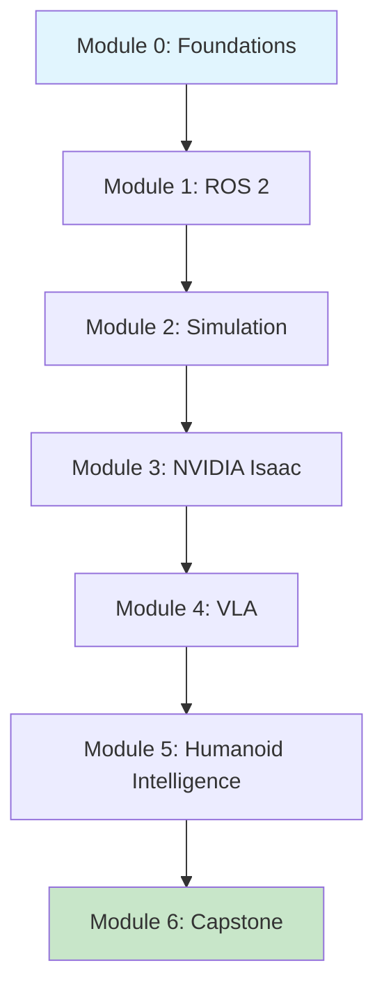

# Physical AI & Humanoid Robotics

**Embodied Intelligence in the Real World**

Welcome to this comprehensive guide on Physical AI and Humanoid Robotics. This book will take you from foundational concepts to building complete autonomous humanoid systems using industry-standard tools.

<!-- DIAGRAM: id="book-overview" type="architecture" format="mermaid"
     description="Overview of the book's learning journey from foundations to capstone" -->



## What You'll Learn

This book covers everything you need to build intelligent humanoid robots:

- **Physical AI Foundations**: Understanding embodied intelligence and how it differs from digital AI
- **ROS 2 Development**: The middleware that powers modern robotics
- **Simulation**: Testing algorithms safely in Gazebo and visualizing with Unity
- **Perception & Navigation**: Using NVIDIA Isaac for computer vision and autonomous navigation
- **Vision-Language-Action**: Connecting LLMs with robot control through VLA pipelines
- **Humanoid Motion**: Kinematics, locomotion, manipulation, and human-robot interaction
- **System Integration**: Building complete autonomous humanoid systems

## Simulation-First Approach

:::note Simulation-First
All examples in this book run in simulation. No physical hardware is required to complete the book. This approach allows you to:
- Learn safely without expensive equipment
- Iterate quickly on algorithms
- Experiment with different robot configurations
:::

## Who This Book Is For

This book is designed for:

- **Software developers** who want to transition into robotics
- **ML engineers** interested in embodied AI and physical intelligence
- **Robotics students** seeking practical, hands-on experience
- **Researchers** exploring humanoid robotics and VLA systems

### Prerequisites

- **Python programming** (intermediate level)
- **Basic linear algebra and calculus** concepts
- **Ubuntu 22.04 or Windows with WSL2** for development
- **NVIDIA GPU** recommended for Isaac modules (cloud alternatives provided)

## Book Structure

The book is organized into 7 modules with 24 chapters:

| Module | Focus | Chapters |
|--------|-------|----------|
| **Module 0** | Foundations of Physical AI | 1-3 |
| **Module 1** | ROS 2 Middleware | 4-7 |
| **Module 2** | Gazebo & Unity Simulation | 8-10 |
| **Module 3** | NVIDIA Isaac | 11-14 |
| **Module 4** | Vision-Language-Action | 15-18 |
| **Module 5** | Humanoid Intelligence | 19-22 |
| **Module 6** | Capstone Project | 23-24 |

## Technology Stack

This book uses industry-standard tools:

| Tool | Version | Purpose |
|------|---------|---------|
| ROS 2 | Humble/Iron | Robot middleware |
| Gazebo | Fortress/Harmonic | Physics simulation |
| NVIDIA Isaac Sim | 2023.1+ | Advanced simulation & ML |
| Unity | 2022.3 LTS | Visualization (not control) |
| Python | 3.10+ | Code examples |

## Getting Started

Ready to begin? Start with [Module 0: Foundations of Physical AI](./module-0-foundations) to understand the core concepts of Physical AI and embodied intelligence.

:::tip Recommended Learning Path
Follow the modules in order for the best learning experience. Each module builds on concepts from previous modules.
:::

## Code Examples

All code examples are available in the companion repository:

```bash
git clone https://github.com/ai-book/physical-ai-code-examples.git
cd physical-ai-code-examples
```

Each module has its own directory with runnable examples and Docker environments for reproducibility.

## Let's Begin!

Start your journey into Physical AI and Humanoid Robotics with [Chapter 1: Introduction to Physical AI & Embodied Intelligence](./module-0-foundations/ch01-intro-physical-ai).
