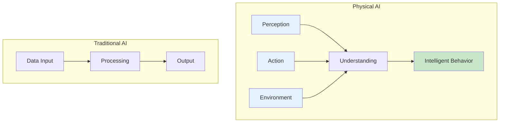
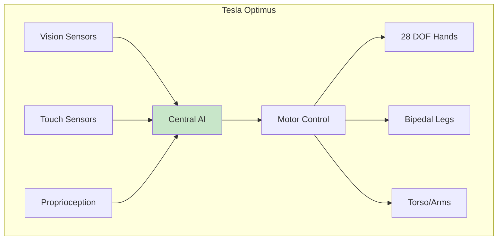

# Chapter 1: Introduction to Physical AI & Embodied Intelligence

<!-- DIAGRAM: id="ch01-physical-ai-ecosystem" type="architecture" format="mermaid"
     description="High-level overview of Physical AI ecosystem showing key components and relationships" -->

## Learning Objectives

By the end of this chapter, you will be able to:

1. **Define Physical AI** and explain how it differs from traditional software-based AI
2. **Explain the embodiment hypothesis** and why physical interaction matters for intelligence
3. **Identify at least 5 real-world applications** of Physical AI in manufacturing, healthcare, and service
4. **Describe the key components** of an embodied AI system
5. **Understand the unique challenges** of building intelligent physical systems

## Prerequisites

Before starting this chapter, ensure you have:

- Basic understanding of what artificial intelligence is
- Familiarity with the concept of robots
- No programming experience required for this chapter

## Introduction

Artificial intelligence has transformed industries from healthcare to finance, but most AI systems exist purely in the digital realm—analyzing data, generating text, and making predictions without ever touching the physical world. **Physical AI** represents a fundamental shift: intelligence that perceives, reasons, and acts in the real world.

:::note Simulation-First
All examples in this book run in simulation. You'll learn Physical AI concepts using virtual robots before (optionally) deploying to real hardware.
:::

When you watch a humanoid robot like Boston Dynamics' Atlas perform a backflip or Tesla's Optimus fold laundry, you're witnessing Physical AI in action. These systems must understand physics, predict consequences of actions, and adapt to unpredictable environments—challenges that pure software AI never faces.

## What is Physical AI?

**Physical AI** refers to artificial intelligence systems that:

1. **Perceive** the physical world through sensors (cameras, LiDAR, touch sensors)
2. **Reason** about physical properties (mass, friction, momentum)
3. **Act** through actuators (motors, grippers, legs)
4. **Learn** from physical interaction with the environment

Unlike a chatbot or image classifier, Physical AI systems must deal with:

| Challenge | Digital AI | Physical AI |
|-----------|-----------|-------------|
| **Environment** | Controlled, digital | Unpredictable, physical |
| **Time** | Can process at any speed | Must react in real-time |
| **Consequences** | Reversible, safe | Irreversible, potentially dangerous |
| **Uncertainty** | Precise inputs | Noisy, incomplete sensor data |
| **Physics** | Not a factor | Fundamental constraint |

### The Key Difference

A traditional AI might classify an image of a cup perfectly. A Physical AI must:
- Recognize the cup
- Estimate its weight, material, and center of mass
- Plan a grasp that won't slip or crush it
- Execute the grasp with precise motor control
- Adapt if the cup is heavier or more slippery than expected

This is the essence of Physical AI: **intelligence that must work within physical reality**.

## The Embodiment Hypothesis

<!-- DIAGRAM: id="ch01-embodiment-hypothesis" type="flow" format="mermaid"
     description="Illustration of the embodiment hypothesis showing how physical interaction shapes intelligence" -->

The **embodiment hypothesis** proposes that intelligence isn't just about computation—it's fundamentally shaped by having a body that interacts with the world.

### Key Principles

1. **Grounded Learning**: Understanding comes from physical interaction, not just observation
2. **Sensorimotor Intelligence**: Movement and sensing are intertwined with cognition
3. **Environmental Coupling**: The body-environment relationship shapes learning
4. **Emergent Behavior**: Complex intelligence emerges from simple body-world interactions

### Why This Matters for AI

Consider how humans learn about weight. A child doesn't learn "heavy" by reading a definition—they learn by lifting objects, struggling with some, easily handling others. This physical experience grounds the concept in a way that pure data never could.

Physical AI systems must similarly ground their understanding in physical interaction. A robot learning to manipulate objects must actually manipulate objects (in simulation or reality) to develop robust skills.

:::tip Embodiment in Practice
When training a humanoid robot to walk, we don't just show it videos of walking. We let it experience falling, recovering, and gradually improving—grounding its "understanding" of balance in physical experience.
:::

## History and Evolution of Physical AI

Physical AI has evolved through several distinct phases:

### 1950s-1970s: Symbolic Robotics
- Robots followed explicit rules
- Limited sensing and adaptation
- Example: Unimate industrial arm (1961)

### 1980s-1990s: Behavior-Based Robotics
- Rodney Brooks' subsumption architecture
- Reactive behaviors, less central planning
- Example: iRobot Roomba's ancestors

### 2000s-2010s: Learning-Based Approaches
- Machine learning for perception
- Reinforcement learning for control
- Example: DARPA Grand Challenge vehicles

### 2020s: The Physical AI Revolution
- Deep learning meets robotics at scale
- Simulation-to-real transfer
- Foundation models for robotics
- Example: Boston Dynamics Atlas, Tesla Optimus, Figure 01

## Real-World Applications

Physical AI is transforming multiple industries:

### Manufacturing

Physical AI enables:
- **Flexible automation**: Robots that adapt to different products without reprogramming
- **Human-robot collaboration**: Safe cobots working alongside people
- **Quality inspection**: AI-powered vision for defect detection

### Healthcare

Applications include:
- **Surgical robotics**: Precision beyond human capability
- **Rehabilitation**: Adaptive assistance for physical therapy
- **Eldercare**: Assistive humanoids for daily living support

### Service Industry

Emerging applications:
- **Hospitality**: Service robots in hotels and restaurants
- **Retail**: Inventory management and customer assistance
- **Home assistance**: Domestic robots for cleaning and organization

### Logistics and Warehousing

Physical AI powers:
- **Pick and place**: Warehouse robots handling diverse items
- **Autonomous delivery**: Last-mile delivery robots
- **Inventory tracking**: Mobile robots for stock management

## Humanoid Example: Tesla Optimus

<!-- DIAGRAM: id="ch01-optimus-architecture" type="architecture" format="mermaid"
     description="High-level architecture of Tesla Optimus showing key subsystems" -->

Tesla's Optimus (also known as Tesla Bot) exemplifies modern Physical AI:

### Key Specifications
- **Height**: 1.73m (5'8")
- **Weight**: 56.6 kg (125 lbs)
- **Degrees of Freedom**: 28 in hands, 12 in legs
- **Sensors**: Cameras, force/torque sensors, IMUs

### Physical AI in Action

When Optimus folds a shirt, it demonstrates:

1. **Visual Perception**: Identifying the shirt, its edges, and configuration
2. **Physics Understanding**: Predicting how fabric will behave when manipulated
3. **Motor Planning**: Generating precise hand movements
4. **Adaptive Control**: Adjusting to the actual behavior of the fabric
5. **Task Sequencing**: Breaking down "fold shirt" into executable steps

This single task requires integrating perception, reasoning, and action—the core of Physical AI.

:::info Why Humanoids?
Humanoid robots are designed to operate in human environments. Their form factor allows them to use human tools, navigate human spaces, and interact naturally with people.
:::

## The Role of Simulation

A critical enabler of modern Physical AI is simulation:

### Why Simulate?

| Benefit | Explanation |
|---------|-------------|
| **Safety** | Robots can fail and learn without damage |
| **Speed** | Run thousands of experiments in parallel |
| **Cost** | No physical hardware wear and tear |
| **Reproducibility** | Reset conditions for consistent testing |
| **Exploration** | Try dangerous or extreme scenarios |

### Simulation-to-Real Transfer

The challenge is making skills learned in simulation work in the real world. This book takes a **simulation-first approach**, teaching you to:

1. Develop algorithms in simulation (Gazebo, Isaac Sim)
2. Validate behavior in controlled conditions
3. Understand the "reality gap"
4. Apply transfer techniques for real deployment (optional)

## Hands-On Exercise

For this conceptual chapter, your exercise is observational:

1. Watch videos of Boston Dynamics Atlas, Tesla Optimus, and Agility Robotics Digit
2. For each robot, identify:
   - What sensors it appears to use
   - What physical tasks it can perform
   - How it handles unexpected situations

**Challenge**: Find an example where a robot fails and analyze why the failure occurred from a Physical AI perspective.

## Key Concepts

| Term | Definition |
|------|------------|
| **Physical AI** | AI systems that perceive, reason, and act in the physical world |
| **Embodied Intelligence** | Intelligence that emerges from having a body that interacts with the environment |
| **Embodiment Hypothesis** | The theory that physical embodiment is essential for certain types of intelligence |
| **Sensorimotor Intelligence** | Understanding that emerges from the coupling of sensing and movement |
| **Simulation-to-Real Transfer** | Techniques for applying skills learned in simulation to real robots |
| **Degrees of Freedom (DOF)** | The number of independent movements a robot can make |

## Chapter Summary

In this chapter, you learned:

1. **Physical AI is different from digital AI**: It must perceive, reason, and act in the physical world, dealing with uncertainty, real-time constraints, and irreversible consequences.

2. **The embodiment hypothesis matters**: Physical interaction shapes how intelligence develops and operates. Grounded experience is essential for robust physical skills.

3. **Physical AI has evolved significantly**: From simple industrial arms to sophisticated humanoids capable of complex manipulation and locomotion.

4. **Real-world applications are expanding**: Manufacturing, healthcare, service, and logistics are all being transformed by Physical AI.

5. **Simulation is critical**: Modern Physical AI development relies heavily on simulation for safe, fast, and cost-effective training.

## What's Next

In [Chapter 2: From Digital AI to Robots that Understand Physical Laws](./ch02-digital-to-physical), you'll dive deeper into what makes Physical AI technically different from digital AI. You'll learn about physics-informed machine learning, world models, and the challenges of bridging simulation and reality.

## Further Reading

- [What is Physical AI?](https://blogs.nvidia.com/blog/what-is-physical-ai/) - NVIDIA's introduction to Physical AI
- [Embodied AI](https://embodied-ai.org/) - Academic resources on embodied intelligence
- [Boston Dynamics](https://www.bostondynamics.com/) - See Atlas and Spot in action
- [Tesla Optimus](https://www.tesla.com/AI) - Tesla's humanoid robot program
