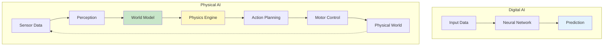
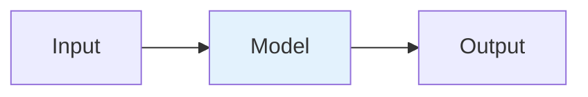
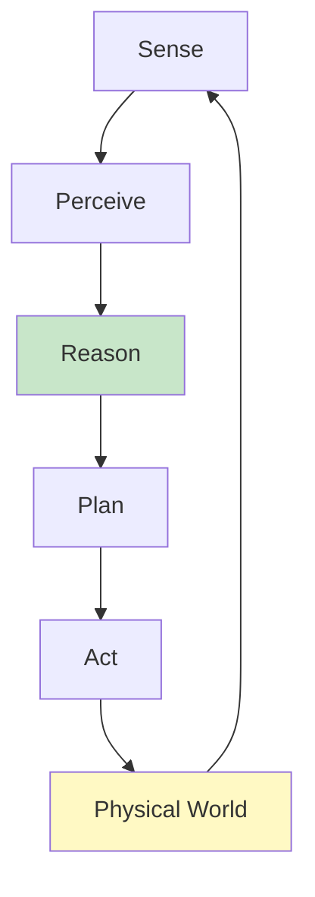
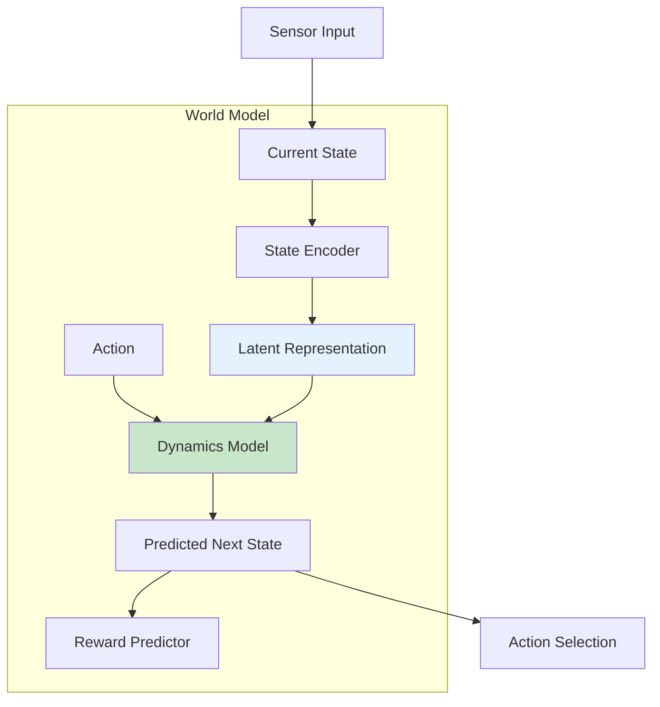
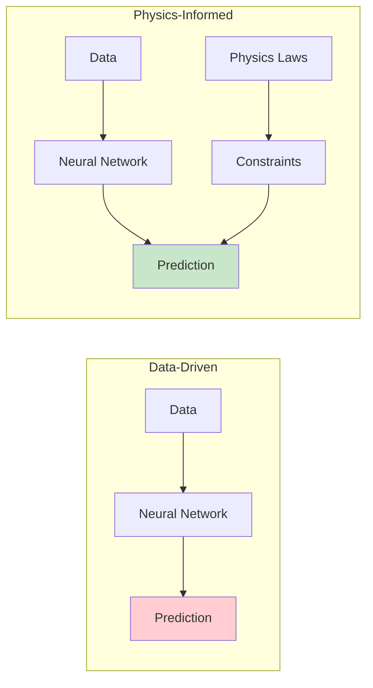
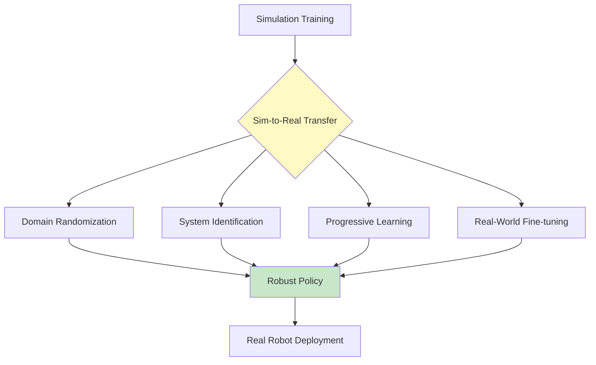
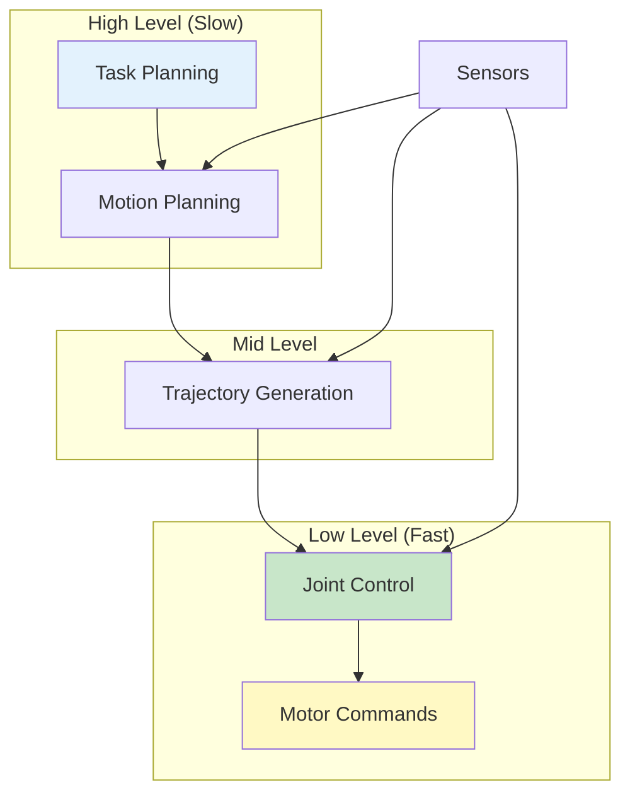
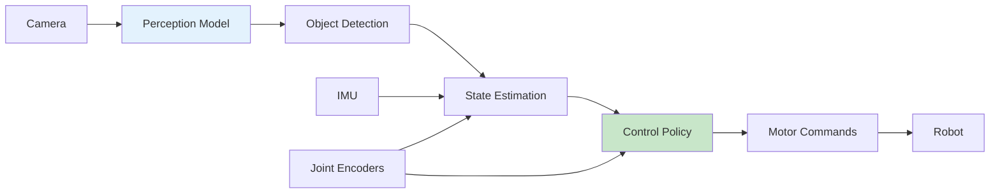

# Chapter 2: From Digital AI to Robots that Understand Physical Laws

<!-- DIAGRAM: id="ch02-digital-vs-physical" type="comparison" format="mermaid"
     description="Comparison of digital AI processing vs physical AI with physics understanding" -->



## Learning Objectives

By the end of this chapter, you will be able to:

1. **Explain the fundamental differences** between digital AI and physical AI systems
2. **Describe what a world model is** and why robots need internal representations of reality
3. **Understand physics-informed machine learning** and its role in robotics
4. **Identify the simulation-to-reality gap** and strategies to bridge it
5. **Explain why real-time constraints** change how AI systems must be designed

## Prerequisites

Before starting this chapter, ensure you have:

- Completed Chapter 1: Introduction to Physical AI
- Basic understanding of machine learning concepts
- Familiarity with the concept of neural networks

## Introduction

When ChatGPT generates text or Midjourney creates an image, these systems work entirely in the digital realm. They process tokens and pixels—mathematical representations with no physical existence. But what happens when AI must control a robot that interacts with the real world?

The transition from digital to physical AI isn't just about adding motors and sensors. It requires a fundamental rethinking of how AI systems perceive, reason, and act. A robot doesn't just need to recognize a ball—it needs to understand that the ball will roll if pushed, bounce if dropped, and break a window if thrown hard enough.

This chapter explores what makes physical AI fundamentally different and why robots must understand physical laws to operate effectively in our world.

## The Digital AI Paradigm

Traditional digital AI systems follow a straightforward paradigm:



### Characteristics of Digital AI

| Aspect | Digital AI Approach |
|--------|-------------------|
| **Input** | Clean, structured data (images, text, numbers) |
| **Processing** | Forward pass through neural network |
| **Output** | Classification, regression, or generation |
| **Feedback** | Optional, not real-time |
| **Consequences** | Reversible, low stakes |
| **Time** | Can take seconds to minutes |

### Example: Image Classification

A digital image classifier:
1. Receives a 224×224 pixel image
2. Processes it through convolutional layers
3. Outputs a probability distribution over classes
4. Is done—no further interaction required

The classifier doesn't need to know that cats land on their feet or that glass breaks when dropped. It only needs to recognize visual patterns.

## The Physical AI Paradigm

Physical AI systems operate in a continuous loop with the real world:



### Characteristics of Physical AI

| Aspect | Physical AI Approach |
|--------|---------------------|
| **Input** | Noisy, continuous sensor streams |
| **Processing** | Perception + Reasoning + Planning + Control |
| **Output** | Motor commands (torques, velocities) |
| **Feedback** | Continuous, mandatory |
| **Consequences** | Often irreversible, high stakes |
| **Time** | Milliseconds for control loops |

### Example: Picking Up an Object

A robot picking up a cup must:
1. **Perceive**: Identify the cup from camera images
2. **Estimate**: Determine cup's position, orientation, weight
3. **Plan**: Generate a collision-free path to the cup
4. **Grasp**: Choose grip points and required force
5. **Execute**: Send motor commands to arm joints
6. **Monitor**: Adjust grip if cup slips
7. **React**: Catch or stop if something goes wrong

Each step requires understanding physical properties—not just visual patterns.

## World Models: The Robot's Internal Reality

A **world model** is an internal representation of the environment that allows a robot to:
- Predict the consequences of actions
- Plan sequences of movements
- Anticipate changes in the environment

<!-- DIAGRAM: id="ch02-world-model" type="architecture" format="mermaid"
     description="Structure of a world model showing state representation and prediction" -->



### Why World Models Matter

Consider a humanoid robot trying to push a heavy box:

**Without a world model:**
- Robot pushes with default force
- Box doesn't move
- Robot continues pushing (wasting energy)
- Or pushes harder and tips over

**With a world model:**
- Robot estimates box weight from visual cues
- Predicts required force
- Plans body posture for stability
- Executes push with appropriate force
- Adjusts if prediction was wrong

### Types of World Models

| Type | Description | Use Case |
|------|-------------|----------|
| **Physics-based** | Explicit equations of motion | Precise manipulation |
| **Learned** | Neural network predictions | Complex environments |
| **Hybrid** | Combines physics + learning | Best of both worlds |

## Physics-Informed Machine Learning

Traditional machine learning treats data as abstract patterns. **Physics-informed machine learning** incorporates physical laws as constraints or priors.

### The Problem with Pure Data-Driven Learning

A neural network trained only on data might learn that:
- Objects sometimes float (if training data is incomplete)
- Friction doesn't exist (if not represented in data)
- Conservation of momentum is optional

These physically impossible predictions lead to robots that fail in the real world.

### Physics-Informed Approaches



### Key Techniques

1. **Physics-Informed Neural Networks (PINNs)**
   - Add physics equations as loss terms
   - Network learns to satisfy physical constraints

2. **Differentiable Physics**
   - Implement physics engines as differentiable operations
   - Backpropagate through physics simulation

3. **Structured Models**
   - Build network architecture to respect physical structure
   - Example: Lagrangian or Hamiltonian neural networks

### Example: Learning Object Dynamics

```python
# Conceptual example of physics-informed learning

# Pure data-driven prediction
def data_driven_predict(position, velocity):
    # Network might predict anything
    return neural_network(position, velocity)

# Physics-informed prediction
def physics_informed_predict(position, velocity, mass):
    # Network predicts forces, physics computes motion
    predicted_force = neural_network(position, velocity)

    # F = ma (Newton's second law)
    acceleration = predicted_force / mass

    # Kinematics (physics-based update)
    new_velocity = velocity + acceleration * dt
    new_position = position + new_velocity * dt

    return new_position, new_velocity
```

The physics-informed approach guarantees that predictions obey Newton's laws.

## The Simulation-to-Reality Gap

One of the biggest challenges in Physical AI is the **simulation-to-reality (sim-to-real) gap**: behaviors learned in simulation often fail in the real world.

### Sources of the Gap

| Source | Simulation | Reality |
|--------|-----------|---------|
| **Physics** | Approximations | True physics |
| **Sensors** | Perfect or simplified noise | Complex noise patterns |
| **Actuators** | Instant, precise | Delays, imprecision |
| **Environment** | Controlled | Unpredictable |
| **Contact** | Simplified models | Complex friction, deformation |

### Strategies to Bridge the Gap

<!-- DIAGRAM: id="ch02-sim2real" type="flow" format="mermaid"
     description="Strategies for bridging simulation-to-reality gap" -->



#### 1. Domain Randomization

Vary simulation parameters during training:
- Mass, friction, damping
- Sensor noise
- Visual appearance (lighting, textures)
- Control delays

The robot learns policies robust to these variations.

#### 2. System Identification

Measure real robot parameters and match simulation:
- Calibrate motor models
- Measure actual sensor noise
- Model real joint friction

Make simulation more realistic.

#### 3. Progressive Learning

Train in increasingly realistic simulations:
1. Simple physics, no noise
2. Add physics complexity
3. Add sensor noise
4. Add actuator delays
5. Match real-world conditions

#### 4. Real-World Fine-tuning

Use simulation-trained policy as starting point, then:
- Collect real-world data
- Fine-tune on real experience
- Iterate until performance is acceptable

:::tip Simulation-First in This Book
All examples in this book use simulation (Gazebo, Isaac Sim). You'll learn to develop robust policies in simulation before (optionally) deploying to real hardware.
:::

## Real-Time Constraints

Physical AI systems must respond in real-time. A robot can't pause to think while falling.

### Control Loop Frequencies

| System | Typical Frequency | Latency Budget |
|--------|------------------|----------------|
| **Balance Control** | 1000 Hz | 1 ms |
| **Joint Control** | 500 Hz | 2 ms |
| **Trajectory Tracking** | 100 Hz | 10 ms |
| **Motion Planning** | 10-50 Hz | 20-100 ms |
| **Perception** | 10-30 Hz | 33-100 ms |
| **High-Level Planning** | 1-10 Hz | 100 ms - 1 s |

### Hierarchical Control Architecture



Higher levels plan; lower levels react. This architecture allows:
- Fast response to disturbances (low-level)
- Complex reasoning about goals (high-level)
- Graceful degradation if high-level is slow

## Comparing AI for Perception vs. Control

Physical AI requires both perception (understanding the world) and control (acting in it). These have different characteristics:

| Aspect | Perception AI | Control AI |
|--------|--------------|------------|
| **Input** | Rich sensor data | State estimates |
| **Output** | Scene understanding | Motor commands |
| **Latency** | 10-100 ms acceptable | 1-10 ms required |
| **Training** | Large datasets | Simulation + reinforcement |
| **Errors** | Recoverable | May cause damage |
| **Model Size** | Can be large | Must be fast |

### The Integration Challenge

The hardest part of Physical AI is integrating perception and control:



- Perception must be fast enough for control
- Control must handle perception uncertainty
- Both must work together seamlessly

## Case Study: Why Self-Driving is Hard

Autonomous vehicles illustrate the digital-to-physical AI challenge perfectly.

### Digital AI Would Suggest

"Just train a neural network to map camera images to steering angles."

### Physical AI Reality

1. **Perception**: Identify lanes, vehicles, pedestrians, signs, signals
2. **Prediction**: Where will each agent be in 5 seconds?
3. **Planning**: What trajectory avoids collisions?
4. **Control**: How to execute that trajectory smoothly?
5. **Fail-safes**: What if perception fails? Prediction is wrong?

And all of this must happen:
- In real-time (10+ fps)
- Reliably (99.99%+ accuracy)
- In all conditions (rain, night, construction)
- With interpretability (for debugging and regulation)

This is why autonomous driving remains challenging despite massive investment.

## Hands-On Exercise

Explore the difference between digital and physical AI through analysis:

### Exercise 1: Identify the Gaps

For each scenario, identify what a digital AI system would miss:

1. **Robot waiter carrying a tray of drinks**
   - Digital: Can classify "tray with drinks"
   - Physical: Must consider...?

2. **Humanoid climbing stairs**
   - Digital: Can detect stairs
   - Physical: Must plan for...?

3. **Robot sorting recyclables**
   - Digital: Can classify materials
   - Physical: Must handle...?

### Exercise 2: World Model Requirements

Design a conceptual world model for a robot that:
- Picks up eggs without breaking them
- What state variables would you need?
- What predictions must the model make?
- How would it handle uncertainty?

## Key Concepts

| Term | Definition |
|------|------------|
| **World Model** | Internal representation allowing prediction of action consequences |
| **Physics-Informed ML** | Machine learning that incorporates physical laws as constraints |
| **Sim-to-Real Gap** | Performance difference between simulation and real-world deployment |
| **Domain Randomization** | Training with varied simulation parameters for robustness |
| **Real-Time Control** | Control loops that must respond within strict time limits |
| **Hierarchical Control** | Architecture with fast low-level and slow high-level controllers |
| **State Estimation** | Combining sensor data to estimate the true state of the world |

## Chapter Summary

In this chapter, you learned:

1. **Digital AI and Physical AI are fundamentally different**: Physical AI must perceive, predict, plan, and act in continuous loops with real-world consequences.

2. **World models are essential**: Robots need internal representations to predict the consequences of their actions and plan effectively.

3. **Physics-informed ML improves robustness**: Incorporating physical laws as constraints prevents physically impossible predictions.

4. **The sim-to-real gap is a major challenge**: Strategies like domain randomization and system identification help bridge it.

5. **Real-time constraints shape architecture**: Physical AI systems use hierarchical control to balance fast reactions with complex reasoning.

## What's Next

In [Chapter 3: Humanoid Robotics Landscape & Sensor Systems](./ch03-humanoid-landscape), you'll survey the current landscape of humanoid robots and understand the sensor systems that give them perception capabilities. You'll learn about the specific platforms we'll work with throughout this book.

## Further Reading

- [World Models](https://worldmodels.github.io/) - Ha & Schmidhuber's seminal work on learned world models
- [Physics-Informed Neural Networks](https://maziarraissi.github.io/PINNs/) - Original PINN research
- [Sim-to-Real Robot Learning](https://lilianweng.github.io/posts/2019-05-05-domain-randomization/) - Survey of transfer techniques
- [Real-Time Control Systems](https://www.ros.org/reps/rep-2003.html) - ROS 2 real-time design
