# Chapter 3: Humanoid Robotics Landscape & Sensor Systems

<!-- DIAGRAM: id="ch03-humanoid-landscape" type="architecture" format="mermaid"
     description="Overview of major humanoid robot platforms and their capabilities" -->

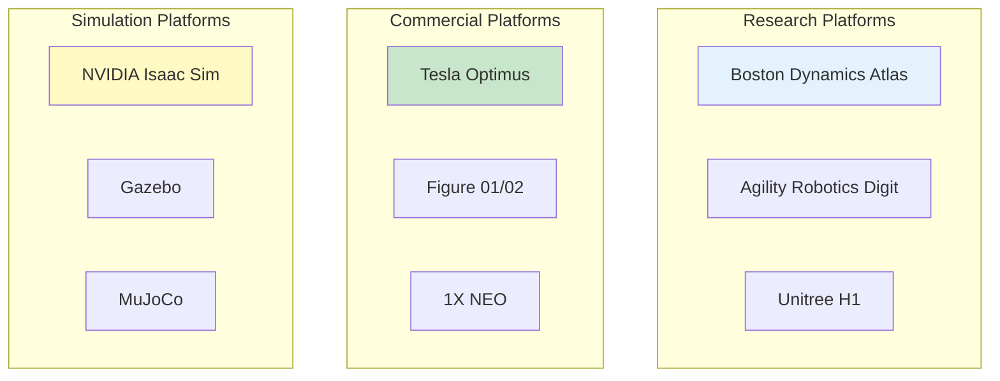

## Learning Objectives

By the end of this chapter, you will be able to:

1. **Identify major humanoid robot platforms** and their key capabilities
2. **Explain different sensor types** used in humanoid robots (vision, IMU, force/torque, proprioception)
3. **Understand sensor placement** and function on humanoid bodies
4. **Compare simulation platforms** for humanoid development
5. **Select appropriate sensors** for different physical AI tasks

## Prerequisites

Before starting this chapter, ensure you have:

- Completed Chapter 1 and Chapter 2
- Basic understanding of robotics concepts
- Familiarity with terms like degrees of freedom (DOF)

## Introduction

The humanoid robotics landscape has exploded in recent years. From Boston Dynamics' acrobatic Atlas to Tesla's utilitarian Optimus, humanoid robots are transitioning from research curiosities to potential commercial products. Understanding this landscape—the platforms, their capabilities, and especially their sensor systems—is essential for anyone building Physical AI systems.

This chapter surveys the major players in humanoid robotics and dives deep into the sensor systems that make humanoid perception possible. You'll learn what sensors humanoids use, where they're placed, and why—knowledge that will be essential throughout the rest of this book.

## The Humanoid Form Factor

### Why Humanoid?

Humanoid robots are designed to operate in human environments:

| Advantage | Explanation |
|-----------|-------------|
| **Human spaces** | Fit through doorways, climb stairs, use elevators |
| **Human tools** | Grip handles, push buttons, turn knobs |
| **Human interaction** | Natural communication, familiar form |
| **Versatility** | Single platform for diverse tasks |

### The Tradeoff

| Challenge | Explanation |
|-----------|-------------|
| **Complexity** | Many degrees of freedom to control |
| **Balance** | Bipedal stance is inherently unstable |
| **Cost** | Expensive actuators and sensors |
| **Power** | Limited battery life for mobile operation |

## Major Humanoid Platforms

### Boston Dynamics Atlas

<!-- DIAGRAM: id="ch03-atlas-specs" type="architecture" format="mermaid"
     description="Boston Dynamics Atlas key specifications and capabilities" -->

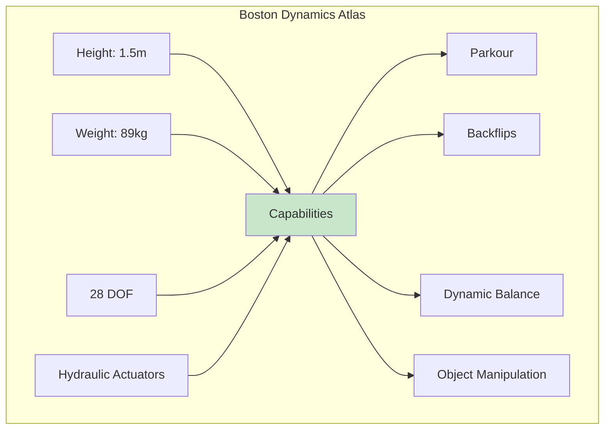

**Key Features:**
- Hydraulic actuation for high power density
- Advanced dynamic balance and locomotion
- Real-time perception and planning
- Demonstrates state-of-the-art agility

**Sensors:**
- Stereo vision cameras
- LiDAR
- IMU
- Joint encoders
- Force/torque sensors

### Tesla Optimus (Gen 2)

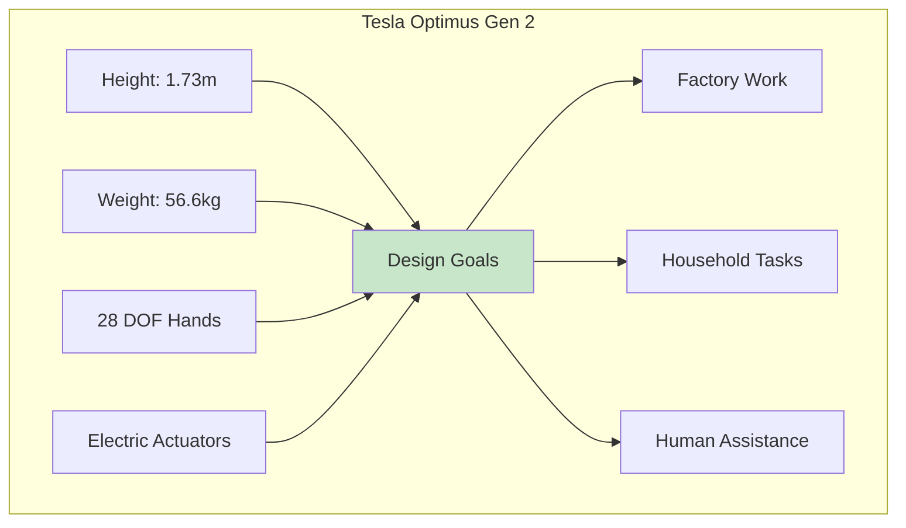

**Key Features:**
- Designed for manufacturing and household tasks
- All-electric actuation (lighter than hydraulic)
- Tesla's FSD AI adapted for robotics
- Focus on practical utility over acrobatics

**Sensors:**
- Cameras (Tesla's vision system)
- Force/torque sensors in hands
- IMU
- Joint encoders
- Tactile sensors in fingers

### Agility Robotics Digit

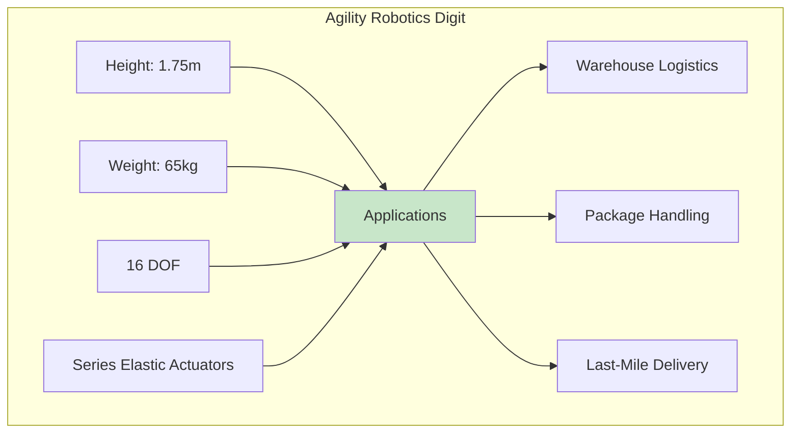

**Key Features:**
- Purpose-built for logistics
- Series elastic actuators for safe human interaction
- Already deployed in Amazon warehouses
- Focus on reliability over agility

**Sensors:**
- Stereo cameras
- LiDAR
- IMU
- Joint torque sensors

### Figure 01/02

**Key Features:**
- OpenAI partnership for language understanding
- Designed for general-purpose tasks
- Electric actuators
- Focus on AI-first approach

### Unitree H1

**Key Features:**
- More affordable research platform
- Open SDK for development
- Electric actuators
- Strong walking capabilities

### 1X NEO

**Key Features:**
- Designed for home assistance
- Soft, compliant design
- Safety-focused
- Consumer-oriented

## Comparison Table

| Platform | Height | Weight | DOF | Actuators | Primary Use |
|----------|--------|--------|-----|-----------|-------------|
| Atlas | 1.5m | 89kg | 28+ | Hydraulic | Research |
| Optimus | 1.73m | 56.6kg | 28+ | Electric | General |
| Digit | 1.75m | 65kg | 16 | Series Elastic | Logistics |
| Figure 01 | 1.7m | 60kg | 25+ | Electric | General |
| H1 | 1.8m | 47kg | 19 | Electric | Research |
| NEO | 1.65m | ~30kg | 20+ | Electric | Home |

## Sensor Systems in Humanoid Robots

Sensors are the robot's window to the world. Understanding sensor systems is crucial for Physical AI development.

### Sensor Categories

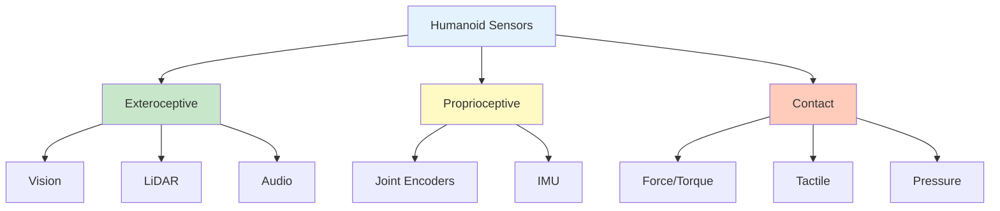

## Vision Sensors

Vision is the primary sensing modality for most humanoid robots.

### Camera Types

| Type | Description | Use Case |
|------|-------------|----------|
| **RGB** | Standard color cameras | Object recognition, scene understanding |
| **Stereo** | Two cameras for depth | 3D reconstruction, obstacle avoidance |
| **Depth (RGB-D)** | RGB + depth sensor | Manipulation, navigation |
| **Event** | Asynchronous pixel updates | High-speed motion tracking |

### Placement on Humanoids

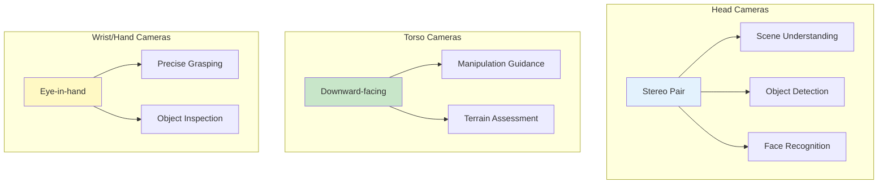

### Vision Processing Pipeline


## Inertial Measurement Units (IMU)

IMUs measure orientation and acceleration—essential for balance.

### IMU Components

| Component | Measures | Units |
|-----------|----------|-------|
| **Accelerometer** | Linear acceleration | m/s² |
| **Gyroscope** | Angular velocity | rad/s |
| **Magnetometer** | Magnetic field | Tesla |

### IMU Placement

- **Torso (pelvis)**: Primary IMU for body orientation
- **Head**: For gaze stabilization
- **Feet**: For ground contact detection

### IMU in Balance Control

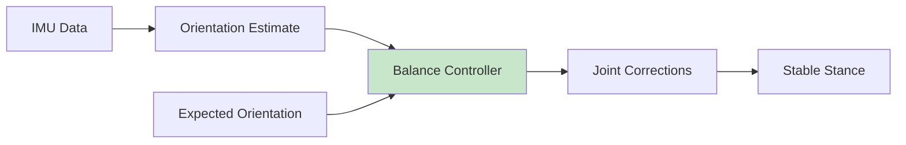

The IMU provides critical feedback for:
- Detecting falls before they happen
- Adjusting posture during walking
- Recovering from pushes or disturbances

## Force/Torque Sensors

Force/torque (F/T) sensors measure contact forces—essential for manipulation and locomotion.

### 6-Axis F/T Sensor

Measures three forces (Fx, Fy, Fz) and three torques (Tx, Ty, Tz):

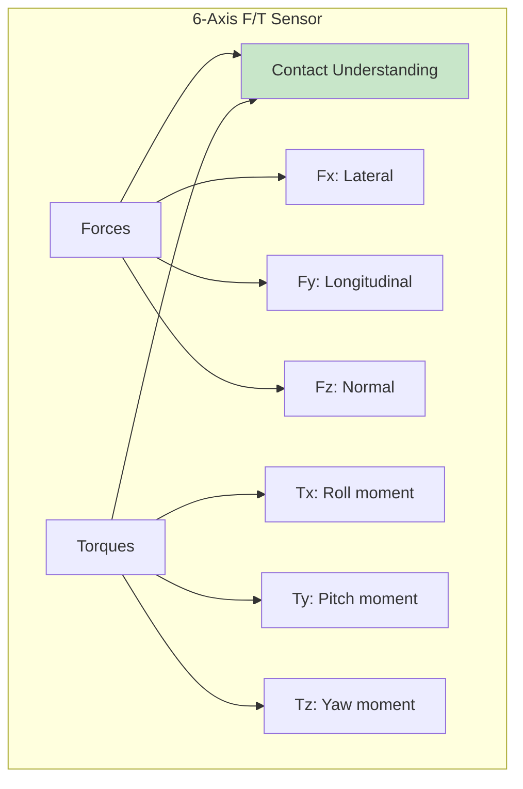

### Placement on Humanoids

| Location | Purpose |
|----------|---------|
| **Wrists** | Measure manipulation forces |
| **Ankles** | Detect ground reaction forces |
| **Fingers** | Grip force control |

### Applications

1. **Compliant Manipulation**: Adjust force based on object fragility
2. **Ground Contact Detection**: Know when foot is planted
3. **Push Recovery**: Detect and respond to external forces
4. **Impedance Control**: Make the robot feel "soft" to humans

## Joint Encoders and Proprioception

Proprioception is the robot's sense of its own body position.

### Encoder Types

| Type | Resolution | Use |
|------|------------|-----|
| **Incremental** | High | Velocity measurement |
| **Absolute** | Medium-High | Position measurement |
| **Magnetic** | Medium | Compact designs |

### What Encoders Measure

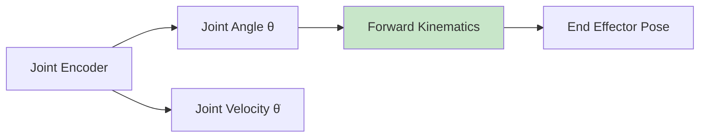

Every actuated joint has an encoder to measure:
- Current position (angle)
- Current velocity (from position derivative)
- Sometimes current (for torque estimation)

### Joint State Message (ROS 2)

In ROS 2, joint states are published as:

```python
# Example joint state structure
sensor_msgs/JointState:
    header:
        stamp: <timestamp>
        frame_id: "base_link"
    name: ["hip_pitch", "hip_roll", "knee", "ankle_pitch", "ankle_roll"]
    position: [0.1, 0.0, -0.3, 0.2, 0.0]  # radians
    velocity: [0.0, 0.0, 0.0, 0.0, 0.0]   # rad/s
    effort: [10.0, 5.0, 20.0, 8.0, 3.0]   # Nm (torque)
```

## Tactile Sensors

Tactile sensors provide detailed touch information—especially important for dexterous manipulation.

### Types of Tactile Sensors

| Type | Description | Resolution |
|------|-------------|------------|
| **Resistive** | Pressure changes resistance | Medium |
| **Capacitive** | Pressure changes capacitance | High |
| **Optical** | Light-based (e.g., GelSight) | Very high |
| **Piezoelectric** | Dynamic force sensing | High |

### Tactile Sensing Applications

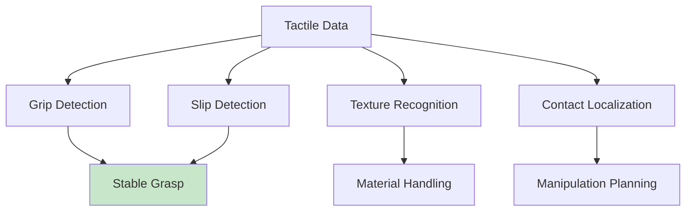

### GelSight: Vision-Based Tactile Sensing

GelSight sensors use a camera to image a deformable gel surface:
- High-resolution geometry
- Contact shape and texture
- Force distribution

This technology is increasingly used in humanoid hands for fine manipulation.

## LiDAR and Range Sensors

LiDAR provides precise 3D geometry of the environment.

### LiDAR on Humanoids

| Placement | Purpose |
|-----------|---------|
| **Head** | Scene mapping, obstacle detection |
| **Torso** | Wide-area navigation |
| **Legs** | Terrain scanning |

### LiDAR vs. Vision

| Aspect | LiDAR | Vision (Stereo) |
|--------|-------|----------------|
| **Accuracy** | Very high | Medium |
| **Range** | Long | Medium |
| **Lighting** | Independent | Dependent |
| **Cost** | High | Low |
| **Data density** | Sparse | Dense |
| **Semantics** | None | Rich (color, texture) |

Most humanoids use both LiDAR and vision, fusing their strengths.

## Sensor Fusion

No single sensor provides complete information. Sensor fusion combines multiple sources.

### Multi-Sensor Architecture

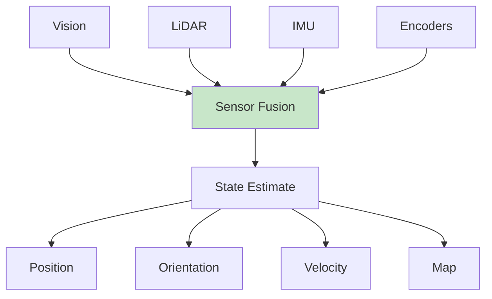

### Fusion Techniques

1. **Kalman Filter**: Optimal fusion for linear systems
2. **Extended Kalman Filter (EKF)**: Handles nonlinear systems
3. **Particle Filter**: Handles multi-modal distributions
4. **Factor Graph**: Modern approach for SLAM

### Example: Humanoid State Estimation

```python
# Conceptual sensor fusion for humanoid state
def estimate_state(imu_data, encoders, vision, lidar):
    # IMU provides high-rate orientation
    orientation = process_imu(imu_data)

    # Encoders provide joint positions
    joint_positions = read_encoders(encoders)

    # Vision provides object and scene info
    scene_understanding = process_vision(vision)

    # LiDAR provides precise geometry
    geometry = process_lidar(lidar)

    # Fuse all sources
    state = kalman_filter.update(
        orientation,
        joint_positions,
        scene_understanding,
        geometry
    )

    return state
```

## Simulation Platforms for Humanoid Development

Since we're taking a simulation-first approach, let's examine the major platforms.

### Gazebo (Classic/Ignition/Harmonic)

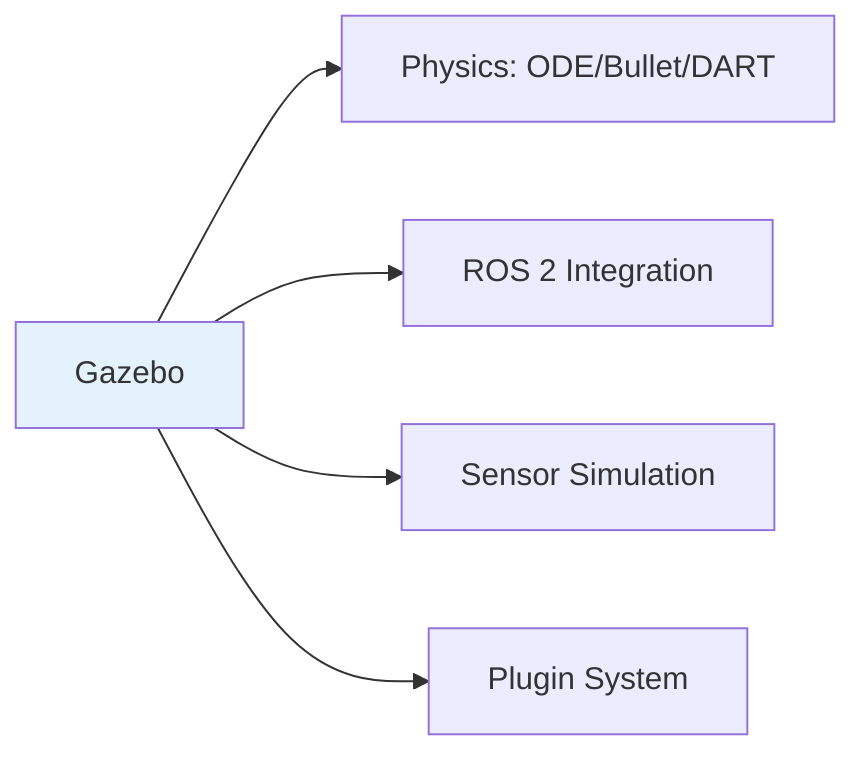

**Strengths:**
- Tight ROS 2 integration
- Open source
- Large community
- Good for control development

**Used in this book for:**
- ROS 2 integration examples
- Basic locomotion
- Manipulation tasks

### NVIDIA Isaac Sim

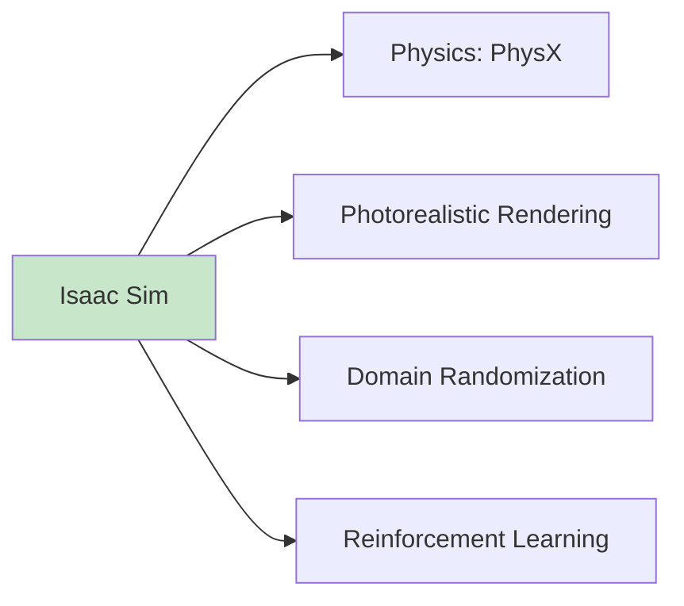

**Strengths:**
- Photorealistic rendering
- GPU-accelerated physics
- Built-in RL support
- Domain randomization

**Used in this book for:**
- Perception training
- Reinforcement learning
- Sim-to-real transfer

### MuJoCo

**Strengths:**
- Fast and accurate contact physics
- Standard for RL research
- Free (now open source)

### Comparison

| Feature | Gazebo | Isaac Sim | MuJoCo |
|---------|--------|-----------|--------|
| **ROS 2 Integration** | Excellent | Good | Limited |
| **Physics Accuracy** | Good | Excellent | Excellent |
| **Rendering** | Basic | Photorealistic | Basic |
| **RL Support** | Basic | Excellent | Excellent |
| **GPU Acceleration** | Limited | Full | Limited |
| **Cost** | Free | Free (non-commercial) | Free |

## Hands-On Exercise

### Exercise 1: Sensor Analysis

For each humanoid platform, research and document:
1. What sensors are visible in published images/videos?
2. Where are the sensors placed?
3. What tasks do those sensors enable?

### Exercise 2: Design a Sensor Suite

You're designing a humanoid for warehouse logistics. Design its sensor suite:

1. **List required sensors** for:
   - Navigation in aisles
   - Picking packages from shelves
   - Avoiding humans

2. **Justify each sensor choice**

3. **Identify sensor fusion requirements**

### Exercise 3: Sensor Trade-offs

Compare two approaches for a grasping task:
1. RGB-D camera + force/torque sensor
2. GelSight tactile sensor + wrist camera

What are the trade-offs? When would you choose each?

## Key Concepts

| Term | Definition |
|------|------------|
| **Exteroceptive Sensors** | Sensors that measure external environment (cameras, LiDAR) |
| **Proprioceptive Sensors** | Sensors that measure internal state (encoders, IMU) |
| **Force/Torque Sensor** | Measures contact forces and torques, typically 6-axis |
| **IMU** | Inertial Measurement Unit: accelerometer + gyroscope + magnetometer |
| **Tactile Sensor** | Measures touch and contact properties |
| **Sensor Fusion** | Combining multiple sensor modalities for robust state estimation |
| **Degrees of Freedom (DOF)** | Number of independent axes of motion |
| **Series Elastic Actuator** | Actuator with spring element for compliance and force sensing |

## Chapter Summary

In this chapter, you learned:

1. **Humanoid robots vary widely in design**: From research platforms like Atlas to commercial designs like Optimus, each optimizes for different use cases.

2. **Sensor systems are the foundation of perception**: Vision, IMU, force/torque, encoders, and tactile sensors each provide essential information.

3. **Sensor placement matters**: Where sensors are mounted determines what information they can provide.

4. **Sensor fusion is essential**: No single sensor provides complete information; combining multiple sources creates robust state estimates.

5. **Simulation platforms offer different strengths**: Gazebo excels at ROS 2 integration, Isaac Sim at perception and RL, MuJoCo at physics accuracy.

## What's Next

With the conceptual foundations complete, you're ready to start building. In [Module 1: ROS 2 Middleware](../module-1-ros2/), you'll set up your development environment and learn the communication framework that powers modern robotics.

## Further Reading

- [Boston Dynamics Atlas](https://www.bostondynamics.com/atlas) - Atlas technical information
- [Tesla AI Day](https://www.tesla.com/AI) - Optimus presentations
- [Agility Robotics](https://agilityrobotics.com/) - Digit platform
- [Gazebo Documentation](https://gazebosim.org/) - Official Gazebo docs
- [NVIDIA Isaac Sim](https://developer.nvidia.com/isaac-sim) - Isaac Sim documentation
- [MuJoCo Documentation](https://mujoco.readthedocs.io/) - MuJoCo reference
