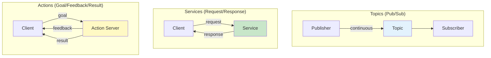
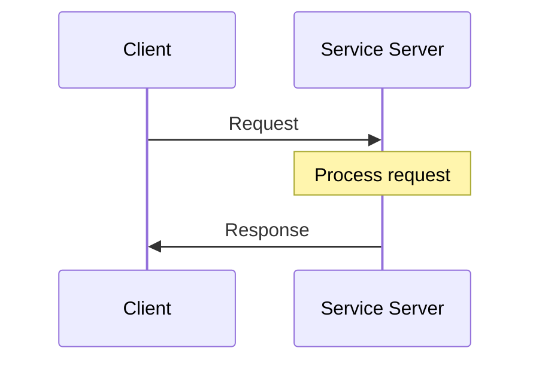
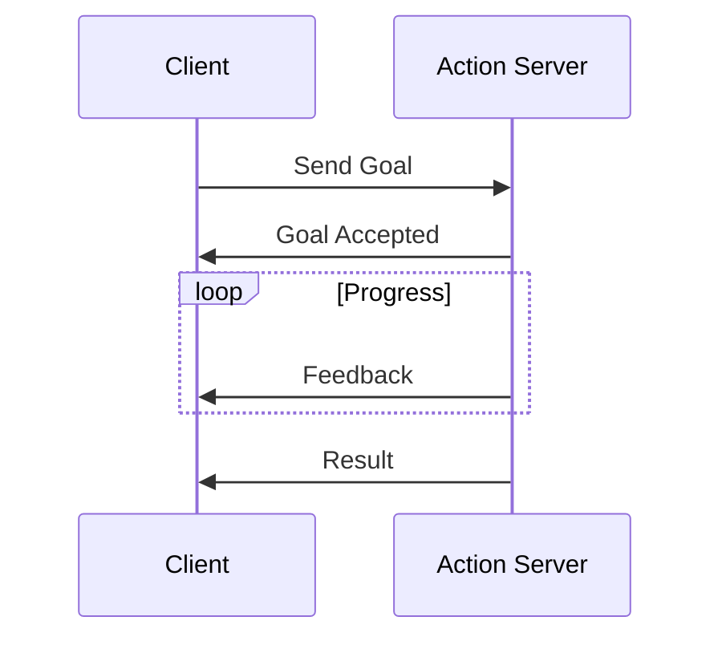
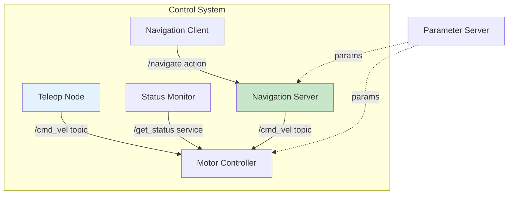

# Chapter 6: Services, Actions & Parameters

<!-- DIAGRAM: id="ch06-communication-patterns" type="comparison" format="mermaid"
     description="Comparison of ROS 2 communication patterns" -->



## Learning Objectives

By the end of this chapter, you will be able to:

1. **Implement ROS 2 services** for synchronous request-response communication
2. **Build action servers and clients** for long-running, preemptable tasks
3. **Use parameters** for runtime node configuration
4. **Choose the right communication pattern** for different use cases
5. **Create custom service and action definitions**

## Prerequisites

Before starting this chapter, ensure you have:

- Completed Chapters 4 and 5
- Understanding of ROS 2 nodes and topics
- Familiarity with callback patterns

## Introduction

Topics are great for continuous data streams, but not every communication fits that pattern. What if you need:

- A one-time query with a response?
- A long-running task with progress feedback?
- Runtime configuration of node behavior?

ROS 2 provides **services** for request-response, **actions** for long-running tasks, and **parameters** for configuration. This chapter covers all three.

## When to Use Each Pattern

| Pattern | Use Case | Example |
|---------|----------|---------|
| **Topic** | Continuous data stream | Sensor readings, state updates |
| **Service** | Quick request-response | Get current pose, trigger behavior |
| **Action** | Long-running task with feedback | Navigate to goal, pick up object |
| **Parameter** | Node configuration | Update threshold, change rate |

## Services: Request-Response Communication

Services provide synchronous communication: a client sends a request, waits, and receives a response.

### Service Architecture



### Service Definition

Services are defined in `.srv` files with request and response separated by `---`:

```
# Example: AddTwoInts.srv
int64 a
int64 b
---
int64 sum
```

### Standard Service Types

| Package | Service | Description |
|---------|---------|-------------|
| `std_srvs` | `Trigger` | No input, returns success/message |
| `std_srvs` | `SetBool` | Set a boolean value |
| `std_srvs` | `Empty` | No input, no output |

### Creating a Service Server

```python
#!/usr/bin/env python3
"""Service server that adds two integers."""

import rclpy
from rclpy.node import Node
from example_interfaces.srv import AddTwoInts


class AdditionServer(Node):
    def __init__(self):
        super().__init__('addition_server')

        # Create the service
        self.service = self.create_service(
            AddTwoInts,           # Service type
            'add_two_ints',       # Service name
            self.add_callback     # Callback function
        )

        self.get_logger().info('Addition service ready')

    def add_callback(self, request, response):
        """Handle service request."""
        response.sum = request.a + request.b
        self.get_logger().info(f'Request: {request.a} + {request.b} = {response.sum}')
        return response


def main(args=None):
    rclpy.init(args=args)
    node = AdditionServer()
    rclpy.spin(node)
    node.destroy_node()
    rclpy.shutdown()
```

### Creating a Service Client

```python
#!/usr/bin/env python3
"""Service client that calls the addition service."""

import rclpy
from rclpy.node import Node
from example_interfaces.srv import AddTwoInts


class AdditionClient(Node):
    def __init__(self):
        super().__init__('addition_client')

        # Create the client
        self.client = self.create_client(AddTwoInts, 'add_two_ints')

        # Wait for service to be available
        while not self.client.wait_for_service(timeout_sec=1.0):
            self.get_logger().info('Waiting for service...')

        self.get_logger().info('Service available')

    def send_request(self, a, b):
        """Send a request and wait for response."""
        request = AddTwoInts.Request()
        request.a = a
        request.b = b

        # Call service (blocking)
        future = self.client.call_async(request)
        rclpy.spin_until_future_complete(self, future)

        return future.result()


def main(args=None):
    rclpy.init(args=args)
    client = AdditionClient()

    # Send request
    result = client.send_request(3, 5)
    print(f'Result: {result.sum}')

    client.destroy_node()
    rclpy.shutdown()
```

### Async Service Calls (Non-blocking)

```python
def send_request_async(self, a, b):
    """Send request without blocking."""
    request = AddTwoInts.Request()
    request.a = a
    request.b = b

    future = self.client.call_async(request)
    future.add_done_callback(self.response_callback)

def response_callback(self, future):
    """Handle response when ready."""
    response = future.result()
    self.get_logger().info(f'Got result: {response.sum}')
```

### Using Services from Command Line

```bash
# List services
ros2 service list

# Show service type
ros2 service type /add_two_ints

# Call a service
ros2 service call /add_two_ints example_interfaces/srv/AddTwoInts "{a: 3, b: 5}"
```

## Creating Custom Services

### Step 1: Define Service

Create `custom_msgs/srv/GetRobotPose.srv`:

```
# Request: which robot
string robot_name
---
# Response: robot pose
float64 x
float64 y
float64 theta
bool success
string message
```

### Step 2: Update CMakeLists.txt

```cmake
rosidl_generate_interfaces(${PROJECT_NAME}
  "msg/RobotStatus.msg"
  "srv/GetRobotPose.srv"
  DEPENDENCIES std_msgs
)
```

### Step 3: Build and Use

```bash
colcon build --packages-select custom_msgs
source install/setup.bash
ros2 interface show custom_msgs/srv/GetRobotPose
```

## Actions: Long-Running Tasks

Actions handle tasks that:
- Take time to complete
- Need progress feedback
- Should be cancellable

### Action Architecture



### Action Definition

Actions are defined in `.action` files with goal, result, and feedback:

```
# NavigateToPose.action

# Goal
geometry_msgs/PoseStamped target_pose
---
# Result
bool success
float64 time_elapsed
---
# Feedback
float64 distance_remaining
float64 eta
```

### Standard Action Types

| Package | Action | Description |
|---------|--------|-------------|
| `nav2_msgs` | `NavigateToPose` | Navigate to a pose |
| `control_msgs` | `FollowJointTrajectory` | Execute joint trajectory |

### Creating an Action Server

```python
#!/usr/bin/env python3
"""Action server for a countdown timer."""

import time
import rclpy
from rclpy.node import Node
from rclpy.action import ActionServer, GoalResponse, CancelResponse
from rclpy.callback_groups import ReentrantCallbackGroup
from example_interfaces.action import Fibonacci


class CountdownActionServer(Node):
    def __init__(self):
        super().__init__('countdown_action_server')

        self._action_server = ActionServer(
            self,
            Fibonacci,  # Using Fibonacci as example
            'countdown',
            execute_callback=self.execute_callback,
            goal_callback=self.goal_callback,
            cancel_callback=self.cancel_callback,
            callback_group=ReentrantCallbackGroup()
        )

        self.get_logger().info('Countdown action server ready')

    def goal_callback(self, goal_request):
        """Accept or reject a goal."""
        self.get_logger().info(f'Received goal: count to {goal_request.order}')
        return GoalResponse.ACCEPT

    def cancel_callback(self, goal_handle):
        """Accept or reject a cancel request."""
        self.get_logger().info('Received cancel request')
        return CancelResponse.ACCEPT

    async def execute_callback(self, goal_handle):
        """Execute the countdown."""
        self.get_logger().info('Executing countdown...')

        feedback_msg = Fibonacci.Feedback()
        result = Fibonacci.Result()

        sequence = [0, 1]

        for i in range(1, goal_handle.request.order):
            # Check for cancellation
            if goal_handle.is_cancel_requested:
                goal_handle.canceled()
                self.get_logger().info('Goal canceled')
                result.sequence = sequence
                return result

            # Compute next Fibonacci number
            sequence.append(sequence[i] + sequence[i - 1])

            # Send feedback
            feedback_msg.partial_sequence = sequence
            goal_handle.publish_feedback(feedback_msg)
            self.get_logger().info(f'Feedback: {sequence}')

            # Simulate work
            time.sleep(1)

        goal_handle.succeed()
        result.sequence = sequence
        self.get_logger().info(f'Goal succeeded: {sequence}')
        return result


def main(args=None):
    rclpy.init(args=args)
    node = CountdownActionServer()
    rclpy.spin(node)
    node.destroy_node()
    rclpy.shutdown()
```

### Creating an Action Client

```python
#!/usr/bin/env python3
"""Action client for the countdown action."""

import rclpy
from rclpy.node import Node
from rclpy.action import ActionClient
from example_interfaces.action import Fibonacci


class CountdownActionClient(Node):
    def __init__(self):
        super().__init__('countdown_action_client')

        self._action_client = ActionClient(
            self,
            Fibonacci,
            'countdown'
        )

        self.get_logger().info('Waiting for action server...')
        self._action_client.wait_for_server()
        self.get_logger().info('Action server available')

    def send_goal(self, order):
        """Send a goal to the action server."""
        goal_msg = Fibonacci.Goal()
        goal_msg.order = order

        self.get_logger().info(f'Sending goal: {order}')

        send_goal_future = self._action_client.send_goal_async(
            goal_msg,
            feedback_callback=self.feedback_callback
        )
        send_goal_future.add_done_callback(self.goal_response_callback)

    def goal_response_callback(self, future):
        """Handle goal acceptance/rejection."""
        goal_handle = future.result()

        if not goal_handle.accepted:
            self.get_logger().info('Goal rejected')
            return

        self.get_logger().info('Goal accepted')

        # Get result
        result_future = goal_handle.get_result_async()
        result_future.add_done_callback(self.get_result_callback)

    def feedback_callback(self, feedback_msg):
        """Handle feedback from action server."""
        feedback = feedback_msg.feedback
        self.get_logger().info(f'Feedback: {feedback.partial_sequence}')

    def get_result_callback(self, future):
        """Handle final result."""
        result = future.result().result
        self.get_logger().info(f'Result: {result.sequence}')
        rclpy.shutdown()


def main(args=None):
    rclpy.init(args=args)
    client = CountdownActionClient()
    client.send_goal(10)
    rclpy.spin(client)
```

### Using Actions from Command Line

```bash
# List actions
ros2 action list

# Show action type
ros2 action type /countdown

# Send a goal
ros2 action send_goal /countdown example_interfaces/action/Fibonacci "{order: 5}"

# Send goal with feedback
ros2 action send_goal /countdown example_interfaces/action/Fibonacci "{order: 5}" --feedback
```

## Parameters: Runtime Configuration

Parameters allow configuring nodes without modifying code.

### Parameter Types

| Type | Python Type | Example |
|------|-------------|---------|
| `bool` | `bool` | `True` |
| `int` | `int` | `42` |
| `double` | `float` | `3.14` |
| `string` | `str` | `"hello"` |
| `byte_array` | `bytes` | `b'\x00\x01'` |
| `bool_array` | `List[bool]` | `[True, False]` |
| `int_array` | `List[int]` | `[1, 2, 3]` |
| `double_array` | `List[float]` | `[1.0, 2.0]` |
| `string_array` | `List[str]` | `["a", "b"]` |

### Declaring Parameters

```python
#!/usr/bin/env python3
"""Node with configurable parameters."""

import rclpy
from rclpy.node import Node
from rcl_interfaces.msg import ParameterDescriptor


class ConfigurableNode(Node):
    def __init__(self):
        super().__init__('configurable_node')

        # Declare parameters with defaults and descriptions
        self.declare_parameter('update_rate', 10.0,
            ParameterDescriptor(description='Update rate in Hz'))

        self.declare_parameter('robot_name', 'default_robot',
            ParameterDescriptor(description='Name of the robot'))

        self.declare_parameter('max_speed', 1.0,
            ParameterDescriptor(description='Maximum speed in m/s'))

        self.declare_parameter('enabled', True,
            ParameterDescriptor(description='Enable processing'))

        # Get parameter values
        rate = self.get_parameter('update_rate').value
        name = self.get_parameter('robot_name').value
        speed = self.get_parameter('max_speed').value
        enabled = self.get_parameter('enabled').value

        self.get_logger().info(
            f'Config: rate={rate}, name={name}, speed={speed}, enabled={enabled}'
        )

        # Create timer using parameter
        self.timer = self.create_timer(1.0 / rate, self.timer_callback)

    def timer_callback(self):
        # Access parameters at runtime
        if self.get_parameter('enabled').value:
            self.get_logger().info('Processing...')


def main(args=None):
    rclpy.init(args=args)
    node = ConfigurableNode()
    rclpy.spin(node)
    node.destroy_node()
    rclpy.shutdown()
```

### Setting Parameters at Launch

```bash
# Via command line
ros2 run my_package configurable_node --ros-args \
    -p update_rate:=20.0 \
    -p robot_name:=my_robot \
    -p max_speed:=2.5
```

### Dynamic Parameter Updates

```python
from rcl_interfaces.msg import SetParametersResult

class DynamicConfigNode(Node):
    def __init__(self):
        super().__init__('dynamic_config_node')

        self.declare_parameter('threshold', 0.5)

        # Register callback for parameter changes
        self.add_on_set_parameters_callback(self.parameter_callback)

    def parameter_callback(self, params):
        """Handle parameter updates."""
        for param in params:
            self.get_logger().info(f'Parameter {param.name} changed to {param.value}')

            if param.name == 'threshold':
                if param.value < 0 or param.value > 1:
                    return SetParametersResult(
                        successful=False,
                        reason='Threshold must be between 0 and 1'
                    )

        return SetParametersResult(successful=True)
```

### Using Parameters from Command Line

```bash
# List parameters for a node
ros2 param list /configurable_node

# Get parameter value
ros2 param get /configurable_node update_rate

# Set parameter value
ros2 param set /configurable_node update_rate 20.0

# Dump all parameters to file
ros2 param dump /configurable_node --output-dir .

# Load parameters from file
ros2 param load /configurable_node params.yaml
```

### Parameter Files (YAML)

```yaml
# params.yaml
configurable_node:
  ros__parameters:
    update_rate: 20.0
    robot_name: "humanoid_1"
    max_speed: 2.5
    enabled: true
```

Load with:
```bash
ros2 run my_package configurable_node --ros-args --params-file params.yaml
```

## Practical Example: Robot Control System

Let's build a complete system using all patterns:



### Motor Controller with Service

```python
#!/usr/bin/env python3
"""Motor controller with status service."""

import rclpy
from rclpy.node import Node
from geometry_msgs.msg import Twist
from std_srvs.srv import Trigger
from custom_msgs.srv import GetRobotPose


class MotorController(Node):
    def __init__(self):
        super().__init__('motor_controller')

        # Parameters
        self.declare_parameter('max_linear_speed', 1.0)
        self.declare_parameter('max_angular_speed', 2.0)

        # Subscriber for velocity commands
        self.cmd_sub = self.create_subscription(
            Twist, 'cmd_vel', self.cmd_callback, 10
        )

        # Service for getting current pose
        self.pose_service = self.create_service(
            GetRobotPose, 'get_robot_pose', self.get_pose_callback
        )

        # Service for emergency stop
        self.stop_service = self.create_service(
            Trigger, 'emergency_stop', self.emergency_stop_callback
        )

        # State
        self.current_x = 0.0
        self.current_y = 0.0
        self.current_theta = 0.0
        self.is_stopped = False

        self.get_logger().info('Motor controller ready')

    def cmd_callback(self, msg):
        """Handle velocity commands."""
        if self.is_stopped:
            self.get_logger().warn('Emergency stop active, ignoring command')
            return

        max_lin = self.get_parameter('max_linear_speed').value
        max_ang = self.get_parameter('max_angular_speed').value

        # Clamp velocities
        lin_x = max(-max_lin, min(max_lin, msg.linear.x))
        ang_z = max(-max_ang, min(max_ang, msg.angular.z))

        self.get_logger().info(f'Moving: linear={lin_x:.2f}, angular={ang_z:.2f}')

        # Update simulated position (simplified)
        self.current_x += lin_x * 0.1
        self.current_theta += ang_z * 0.1

    def get_pose_callback(self, request, response):
        """Return current robot pose."""
        response.x = self.current_x
        response.y = self.current_y
        response.theta = self.current_theta
        response.success = True
        response.message = 'Pose retrieved successfully'
        return response

    def emergency_stop_callback(self, request, response):
        """Handle emergency stop."""
        self.is_stopped = True
        response.success = True
        response.message = 'Emergency stop activated'
        self.get_logger().warn('EMERGENCY STOP ACTIVATED')
        return response


def main(args=None):
    rclpy.init(args=args)
    node = MotorController()
    rclpy.spin(node)
    node.destroy_node()
    rclpy.shutdown()
```

## Hands-On Exercise

### Exercise 1: Calculator Service

Create a service that performs arithmetic operations:

1. Define `Calculator.srv` with:
   - Request: two numbers and operation (add, subtract, multiply, divide)
   - Response: result and success flag

2. Implement server and client
3. Handle division by zero

### Exercise 2: Move Action

Create an action for moving a robot:

1. Define `MoveDistance.action` with:
   - Goal: distance to move
   - Feedback: distance traveled
   - Result: success and final distance

2. Implement action server with cancellation support
3. Test with action client

### Exercise 3: Configurable Publisher

Create a publisher node where:

1. Topic name is configurable via parameter
2. Publish rate is configurable
3. Message content includes a prefix parameter
4. All parameters can be changed at runtime

## Key Concepts

| Term | Definition |
|------|------------|
| **Service** | Synchronous request-response communication pattern |
| **Action** | Asynchronous goal-oriented communication with feedback |
| **Parameter** | Named value for node configuration |
| **Goal** | The desired outcome sent to an action server |
| **Feedback** | Progress updates during action execution |
| **Result** | Final outcome of an action |
| **Preemption** | Canceling a running action |

## Chapter Summary

In this chapter, you learned:

1. **Services for request-response**: When you need a quick, synchronous answer.

2. **Actions for long-running tasks**: With goals, feedback, and cancellation.

3. **Parameters for configuration**: Runtime-adjustable node settings.

4. **Choosing the right pattern**: Topics for streams, services for queries, actions for tasks.

5. **Custom definitions**: Creating your own service and action types.

## What's Next

In [Chapter 7: Launch Files & TF2 Coordinate Frames](./ch07-launch-tf2), you'll learn to orchestrate complex systems with launch files and manage coordinate transformations with TF2—essential skills for humanoid robotics.

## Further Reading

- [ROS 2 Services Tutorial](https://docs.ros.org/en/humble/Tutorials/Beginner-Client-Libraries/Writing-A-Simple-Py-Service-And-Client.html)
- [ROS 2 Actions Tutorial](https://docs.ros.org/en/humble/Tutorials/Intermediate/Writing-an-Action-Server-Client/Py.html)
- [ROS 2 Parameters](https://docs.ros.org/en/humble/Concepts/About-ROS-2-Parameters.html)
- [Action Design](https://design.ros2.org/articles/actions.html)
