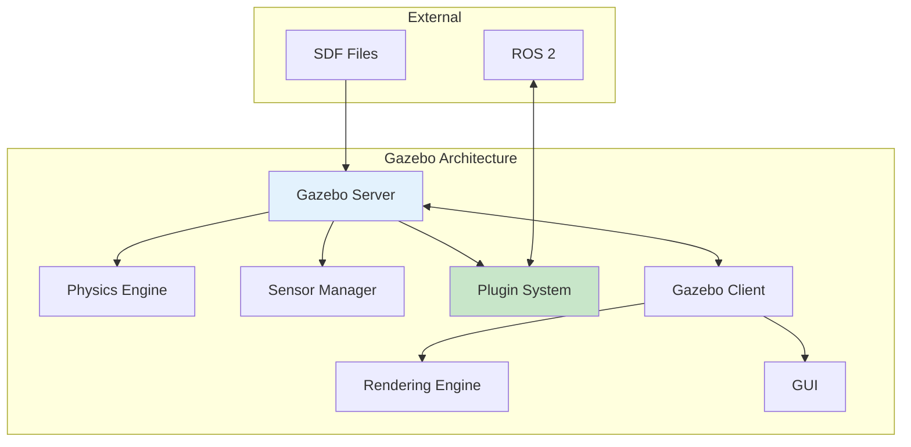
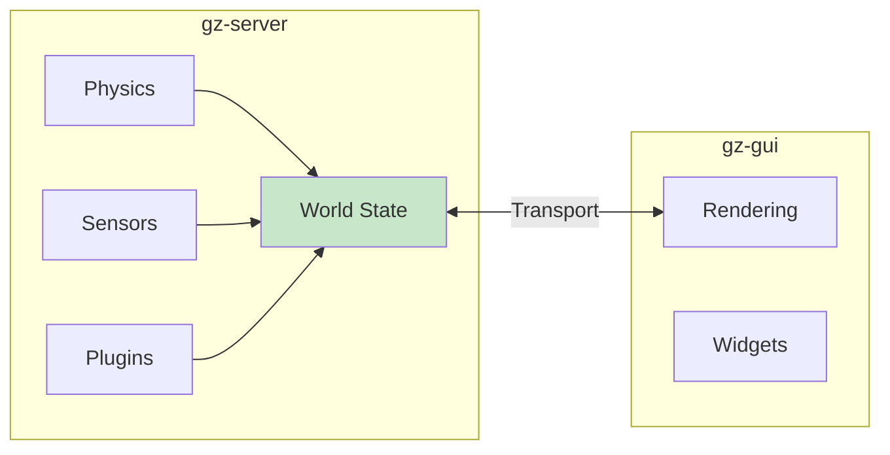

# Chapter 8: Gazebo Simulation Basics

<!-- DIAGRAM: id="ch08-gazebo-architecture" type="architecture" format="mermaid"
     description="Gazebo architecture showing key components" -->



## Learning Objectives

By the end of this chapter, you will be able to:

1. **Install and configure Gazebo** for ROS 2 development
2. **Understand Gazebo's architecture** and component interaction
3. **Create simulation worlds** with models and environments
4. **Write SDF files** to describe robots and environments
5. **Use Gazebo plugins** to extend simulation capabilities

## Prerequisites

Before starting this chapter, ensure you have:

- Completed Module 1: ROS 2 Middleware
- Ubuntu 22.04 with ROS 2 Humble installed
- Basic understanding of XML syntax
- Familiarity with 3D coordinate systems

## Introduction

Gazebo is the most widely used open-source robotics simulator. It provides:

- **Physics simulation**: Rigid body dynamics, collision detection
- **Sensor simulation**: Cameras, LiDAR, IMU, force/torque sensors
- **ROS 2 integration**: Seamless connection via ros_gz bridge
- **Plugin system**: Extensible for custom behaviors

This chapter introduces Gazebo fundamentals that you'll use throughout the book.

## Gazebo Versions

Gazebo has undergone significant evolution:

| Version | Name | Status | ROS 2 Support |
|---------|------|--------|---------------|
| Gazebo Classic | 11.x | Legacy | Humble (limited) |
| Ignition Fortress | 6.x | LTS | Humble |
| Gazebo Harmonic | 8.x | Current | Iron, Rolling |

We'll use **Gazebo Harmonic** (or Fortress for Humble compatibility).

:::note Naming History
"Ignition Gazebo" was renamed to just "Gazebo" in 2022. Older tutorials may use "Ignition" or "ign" commands—these are now "gz" commands.
:::

## Installation

### Install Gazebo Harmonic

```bash
# Add Gazebo repository
sudo wget https://packages.osrfoundation.org/gazebo.gpg -O /usr/share/keyrings/pkgs-osrf-archive-keyring.gpg
echo "deb [arch=$(dpkg --print-architecture) signed-by=/usr/share/keyrings/pkgs-osrf-archive-keyring.gpg] http://packages.osrfoundation.org/gazebo/ubuntu-stable $(lsb_release -cs) main" | sudo tee /etc/apt/sources.list.d/gazebo-stable.list > /dev/null

# Install Gazebo Harmonic
sudo apt update
sudo apt install gz-harmonic

# Install ROS 2 Gazebo packages
sudo apt install ros-humble-ros-gz
```

### Verify Installation

```bash
# Check Gazebo version
gz sim --version

# Launch empty world
gz sim empty.sdf
```

### Docker Alternative

```bash
cd docker
docker-compose up gazebo-sim
```

## Gazebo Architecture

### Server-Client Model



- **Server (gz-server)**: Runs physics, sensors, plugins
- **Client (gz-gui)**: Renders visualization, provides UI
- **Transport**: Message-passing between components

### Key Components

| Component | Description |
|-----------|-------------|
| **World** | Container for all simulation entities |
| **Model** | A robot, object, or structure |
| **Link** | A rigid body within a model |
| **Joint** | Connection between links |
| **Sensor** | Virtual sensor attached to a link |
| **Plugin** | Code that extends Gazebo behavior |

## Your First Simulation

### Launch an Empty World

```bash
gz sim empty.sdf
```

This opens Gazebo with an empty environment.

### GUI Controls

| Action | Control |
|--------|---------|
| **Orbit** | Left-click + drag |
| **Pan** | Middle-click + drag |
| **Zoom** | Scroll wheel |
| **Select** | Left-click on object |
| **Play/Pause** | Space bar or button |

### Adding Models

1. Click the "Insert" button (cube icon)
2. Browse available models
3. Click to place in world

Or from command line:

```bash
# Spawn a model
gz service -s /world/empty/create \
    --reqtype gz.msgs.EntityFactory \
    --reptype gz.msgs.Boolean \
    --timeout 1000 \
    --req 'sdf: "<sdf version=\"1.7\"><model name=\"box\"><link name=\"link\"><collision name=\"collision\"><geometry><box><size>1 1 1</size></box></geometry></collision><visual name=\"visual\"><geometry><box><size>1 1 1</size></box></geometry></visual></link></model></sdf>"'
```

## SDF: Simulation Description Format

SDF is the XML format for describing simulation worlds and models.

### World File Structure

```xml
<?xml version="1.0" ?>
<sdf version="1.8">
    <world name="my_world">
        <!-- Physics configuration -->
        <physics name="default_physics" type="ode">
            <max_step_size>0.001</max_step_size>
            <real_time_factor>1.0</real_time_factor>
        </physics>

        <!-- Lighting -->
        <light type="directional" name="sun">
            <cast_shadows>true</cast_shadows>
            <pose>0 0 10 0 0 0</pose>
            <diffuse>0.8 0.8 0.8 1</diffuse>
            <specular>0.2 0.2 0.2 1</specular>
            <direction>-0.5 0.1 -0.9</direction>
        </light>

        <!-- Ground plane -->
        <model name="ground_plane">
            <static>true</static>
            <link name="link">
                <collision name="collision">
                    <geometry>
                        <plane>
                            <normal>0 0 1</normal>
                        </plane>
                    </geometry>
                </collision>
                <visual name="visual">
                    <geometry>
                        <plane>
                            <normal>0 0 1</normal>
                            <size>100 100</size>
                        </plane>
                    </geometry>
                    <material>
                        <ambient>0.8 0.8 0.8 1</ambient>
                    </material>
                </visual>
            </link>
        </model>

        <!-- Include a model -->
        <include>
            <uri>model://my_robot</uri>
            <pose>0 0 0.5 0 0 0</pose>
        </include>
    </world>
</sdf>
```

### Model File Structure

```xml
<?xml version="1.0" ?>
<sdf version="1.8">
    <model name="simple_box">
        <!-- Model-level pose -->
        <pose>0 0 0.5 0 0 0</pose>

        <!-- Links -->
        <link name="base_link">
            <!-- Inertial properties -->
            <inertial>
                <mass>1.0</mass>
                <inertia>
                    <ixx>0.167</ixx>
                    <iyy>0.167</iyy>
                    <izz>0.167</izz>
                </inertia>
            </inertial>

            <!-- Collision geometry -->
            <collision name="collision">
                <geometry>
                    <box>
                        <size>1 1 1</size>
                    </box>
                </geometry>
            </collision>

            <!-- Visual geometry -->
            <visual name="visual">
                <geometry>
                    <box>
                        <size>1 1 1</size>
                    </box>
                </geometry>
                <material>
                    <ambient>0.2 0.2 0.8 1</ambient>
                    <diffuse>0.2 0.2 0.8 1</diffuse>
                </material>
            </visual>
        </link>
    </model>
</sdf>
```

### Common Geometries

```xml
<!-- Box -->
<geometry>
    <box><size>1 2 0.5</size></box>
</geometry>

<!-- Cylinder -->
<geometry>
    <cylinder>
        <radius>0.5</radius>
        <length>1.0</length>
    </cylinder>
</geometry>

<!-- Sphere -->
<geometry>
    <sphere><radius>0.5</radius></sphere>
</geometry>

<!-- Mesh -->
<geometry>
    <mesh>
        <uri>model://my_model/meshes/body.dae</uri>
        <scale>1 1 1</scale>
    </mesh>
</geometry>
```

## Creating a Custom World

Let's create a complete world with multiple objects.

### File: `my_world.sdf`

```xml
<?xml version="1.0" ?>
<sdf version="1.8">
    <world name="humanoid_test_world">
        <!-- Physics -->
        <physics name="1kHz" type="ode">
            <max_step_size>0.001</max_step_size>
            <real_time_factor>1.0</real_time_factor>
            <real_time_update_rate>1000</real_time_update_rate>
        </physics>

        <!-- Scene settings -->
        <scene>
            <ambient>0.4 0.4 0.4 1</ambient>
            <background>0.7 0.7 0.7 1</background>
            <shadows>true</shadows>
        </scene>

        <!-- Sun light -->
        <light type="directional" name="sun">
            <cast_shadows>true</cast_shadows>
            <pose>0 0 10 0 0 0</pose>
            <diffuse>1 1 1 1</diffuse>
            <specular>0.5 0.5 0.5 1</specular>
            <attenuation>
                <range>1000</range>
                <constant>0.9</constant>
                <linear>0.01</linear>
                <quadratic>0.001</quadratic>
            </attenuation>
            <direction>-0.5 0.1 -0.9</direction>
        </light>

        <!-- Ground plane -->
        <model name="ground_plane">
            <static>true</static>
            <link name="link">
                <collision name="collision">
                    <geometry>
                        <plane>
                            <normal>0 0 1</normal>
                            <size>50 50</size>
                        </plane>
                    </geometry>
                    <surface>
                        <friction>
                            <ode>
                                <mu>1.0</mu>
                                <mu2>1.0</mu2>
                            </ode>
                        </friction>
                    </surface>
                </collision>
                <visual name="visual">
                    <geometry>
                        <plane>
                            <normal>0 0 1</normal>
                            <size>50 50</size>
                        </plane>
                    </geometry>
                    <material>
                        <ambient>0.3 0.3 0.3 1</ambient>
                        <diffuse>0.7 0.7 0.7 1</diffuse>
                    </material>
                </visual>
            </link>
        </model>

        <!-- Table -->
        <model name="table">
            <static>true</static>
            <pose>2 0 0 0 0 0</pose>
            <link name="link">
                <!-- Table top -->
                <collision name="top_collision">
                    <pose>0 0 0.75 0 0 0</pose>
                    <geometry>
                        <box><size>1.2 0.8 0.05</size></box>
                    </geometry>
                </collision>
                <visual name="top_visual">
                    <pose>0 0 0.75 0 0 0</pose>
                    <geometry>
                        <box><size>1.2 0.8 0.05</size></box>
                    </geometry>
                    <material>
                        <ambient>0.5 0.3 0.1 1</ambient>
                    </material>
                </visual>
                <!-- Legs (simplified as one box) -->
                <collision name="legs_collision">
                    <pose>0 0 0.375 0 0 0</pose>
                    <geometry>
                        <box><size>1.0 0.6 0.75</size></box>
                    </geometry>
                </collision>
                <visual name="legs_visual">
                    <pose>0 0 0.375 0 0 0</pose>
                    <geometry>
                        <box><size>0.1 0.6 0.75</size></box>
                    </geometry>
                    <material>
                        <ambient>0.5 0.3 0.1 1</ambient>
                    </material>
                </visual>
            </link>
        </model>

        <!-- Red box on table -->
        <model name="red_box">
            <pose>2 0 0.85 0 0 0</pose>
            <link name="link">
                <inertial>
                    <mass>0.5</mass>
                    <inertia>
                        <ixx>0.0021</ixx>
                        <iyy>0.0021</iyy>
                        <izz>0.0021</izz>
                    </inertia>
                </inertial>
                <collision name="collision">
                    <geometry>
                        <box><size>0.1 0.1 0.1</size></box>
                    </geometry>
                </collision>
                <visual name="visual">
                    <geometry>
                        <box><size>0.1 0.1 0.1</size></box>
                    </geometry>
                    <material>
                        <ambient>0.8 0.1 0.1 1</ambient>
                        <diffuse>0.8 0.1 0.1 1</diffuse>
                    </material>
                </visual>
            </link>
        </model>

        <!-- Blue cylinder -->
        <model name="blue_cylinder">
            <pose>2.2 0.2 0.85 0 0 0</pose>
            <link name="link">
                <inertial>
                    <mass>0.3</mass>
                    <inertia>
                        <ixx>0.001</ixx>
                        <iyy>0.001</iyy>
                        <izz>0.0005</izz>
                    </inertia>
                </inertial>
                <collision name="collision">
                    <geometry>
                        <cylinder>
                            <radius>0.03</radius>
                            <length>0.15</length>
                        </cylinder>
                    </geometry>
                </collision>
                <visual name="visual">
                    <geometry>
                        <cylinder>
                            <radius>0.03</radius>
                            <length>0.15</length>
                        </cylinder>
                    </geometry>
                    <material>
                        <ambient>0.1 0.1 0.8 1</ambient>
                        <diffuse>0.1 0.1 0.8 1</diffuse>
                    </material>
                </visual>
            </link>
        </model>
    </world>
</sdf>
```

### Launch the World

```bash
gz sim my_world.sdf
```

## Physics Configuration

### Physics Engines

Gazebo supports multiple physics engines:

| Engine | Description | Best For |
|--------|-------------|----------|
| **ODE** | Open Dynamics Engine | General purpose |
| **Bullet** | Game physics engine | Fast simulation |
| **DART** | Accurate dynamics | Research |
| **TPE** | Trivial Physics Engine | Simple kinematics |

### Physics Parameters

```xml
<physics name="simulation_physics" type="ode">
    <!-- Time step (smaller = more accurate, slower) -->
    <max_step_size>0.001</max_step_size>

    <!-- Real-time factor (1.0 = real time) -->
    <real_time_factor>1.0</real_time_factor>

    <!-- Update rate -->
    <real_time_update_rate>1000</real_time_update_rate>

    <!-- ODE-specific settings -->
    <ode>
        <solver>
            <type>quick</type>
            <iters>50</iters>
            <sor>1.3</sor>
        </solver>
        <constraints>
            <cfm>0.0</cfm>
            <erp>0.2</erp>
        </constraints>
    </ode>
</physics>
```

### Surface Properties

```xml
<collision name="collision">
    <geometry>...</geometry>
    <surface>
        <friction>
            <ode>
                <mu>1.0</mu>       <!-- Friction coefficient -->
                <mu2>1.0</mu2>
            </ode>
        </friction>
        <bounce>
            <restitution_coefficient>0.5</restitution_coefficient>
            <threshold>0.01</threshold>
        </bounce>
        <contact>
            <ode>
                <soft_cfm>0.0</soft_cfm>
                <soft_erp>0.2</soft_erp>
                <kp>1e6</kp>
                <kd>1.0</kd>
            </ode>
        </contact>
    </surface>
</collision>
```

## Gazebo Plugins

Plugins extend Gazebo functionality. Common types:

| Type | Purpose | Example |
|------|---------|---------|
| **World** | Affect entire world | Physics settings |
| **Model** | Control a model | Differential drive |
| **Sensor** | Process sensor data | Camera publisher |
| **System** | Low-level access | Custom physics |

### Adding a Plugin to a Model

```xml
<model name="robot">
    <!-- Links, joints, etc. -->

    <!-- Differential drive plugin -->
    <plugin
        filename="gz-sim-diff-drive-system"
        name="gz::sim::systems::DiffDrive">
        <left_joint>left_wheel_joint</left_joint>
        <right_joint>right_wheel_joint</right_joint>
        <wheel_separation>0.5</wheel_separation>
        <wheel_radius>0.1</wheel_radius>
        <topic>cmd_vel</topic>
    </plugin>
</model>
```

### Common Gazebo Plugins

```xml
<!-- Joint state publisher -->
<plugin
    filename="gz-sim-joint-state-publisher-system"
    name="gz::sim::systems::JointStatePublisher">
</plugin>

<!-- Joint position controller -->
<plugin
    filename="gz-sim-joint-position-controller-system"
    name="gz::sim::systems::JointPositionController">
    <joint_name>arm_joint</joint_name>
    <p_gain>10.0</p_gain>
    <i_gain>0.1</i_gain>
    <d_gain>0.5</d_gain>
</plugin>

<!-- IMU sensor -->
<plugin
    filename="gz-sim-imu-system"
    name="gz::sim::systems::Imu">
</plugin>

<!-- Contact sensor -->
<plugin
    filename="gz-sim-contact-system"
    name="gz::sim::systems::Contact">
</plugin>
```

## Gazebo Command-Line Tools

```bash
# Launch simulation
gz sim world.sdf

# Launch headless (no GUI)
gz sim -s world.sdf

# List available worlds
gz sim --list

# Spawn model
gz service -s /world/default/create \
    --reqtype gz.msgs.EntityFactory \
    --reptype gz.msgs.Boolean \
    --timeout 1000 \
    --req 'sdf_filename: "/path/to/model.sdf", name: "my_model"'

# Pause/unpause simulation
gz service -s /world/default/control \
    --reqtype gz.msgs.WorldControl \
    --reptype gz.msgs.Boolean \
    --req 'pause: true'

# Step simulation
gz service -s /world/default/control \
    --reqtype gz.msgs.WorldControl \
    --reptype gz.msgs.Boolean \
    --req 'multi_step: 100'

# List topics
gz topic -l

# Echo a topic
gz topic -e -t /world/default/pose/info
```

## Model Directory Structure

Organize models for reuse:

```
my_models/
├── my_robot/
│   ├── model.config
│   ├── model.sdf
│   └── meshes/
│       ├── body.dae
│       └── wheel.dae
└── table/
    ├── model.config
    └── model.sdf
```

### model.config

```xml
<?xml version="1.0"?>
<model>
    <name>My Robot</name>
    <version>1.0</version>
    <sdf version="1.8">model.sdf</sdf>

    <author>
        <name>Your Name</name>
        <email>you@email.com</email>
    </author>

    <description>
        A simple robot model for testing.
    </description>
</model>
```

### Set Model Path

```bash
# Add to environment
export GZ_SIM_RESOURCE_PATH=$HOME/my_models:$GZ_SIM_RESOURCE_PATH

# Or in SDF
<include>
    <uri>model://my_robot</uri>
</include>
```

## Hands-On Exercise

### Exercise 1: Create a Room

Create an SDF world with:
1. Four walls (static boxes)
2. A floor with friction
3. A ceiling with a light
4. At least 3 manipulable objects

### Exercise 2: Physics Experimentation

1. Create a ramp with varying friction coefficients
2. Roll spheres down and observe behavior
3. Try different physics engines (ODE, Bullet)
4. Compare simulation speeds

### Exercise 3: Model Organization

1. Create a reusable model directory for a simple chair
2. Include proper model.config
3. Add it to your world using `<include>`
4. Spawn multiple instances at different poses

## Key Concepts

| Term | Definition |
|------|------------|
| **SDF** | Simulation Description Format, XML for describing simulations |
| **World** | Container for all simulation entities |
| **Model** | A robot, object, or structure in simulation |
| **Link** | A rigid body within a model |
| **Joint** | Connection between links allowing motion |
| **Plugin** | Code that extends Gazebo behavior |
| **Physics Engine** | Software that computes physical interactions |

## Chapter Summary

In this chapter, you learned:

1. **Gazebo architecture**: Server-client model with physics, sensors, and plugins.

2. **SDF format**: How to describe worlds and models in XML.

3. **World creation**: Building environments with ground, lights, and objects.

4. **Physics configuration**: Tuning engines, step sizes, and surface properties.

5. **Plugins**: Extending Gazebo with controllers and sensors.

## What's Next

In [Chapter 9: Simulating Your First Robot in Gazebo](./ch09-robot-simulation), you'll bring a robot to life. You'll load robot models, connect Gazebo to ROS 2, and control your first simulated humanoid.

## Further Reading

- [Gazebo Documentation](https://gazebosim.org/docs) - Official documentation
- [SDF Specification](http://sdformat.org/spec) - Complete SDF reference
- [Gazebo Tutorials](https://gazebosim.org/docs/harmonic/tutorials) - Step-by-step guides
- [ros_gz Bridge](https://github.com/gazebosim/ros_gz) - ROS 2 integration
