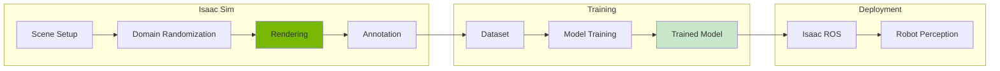
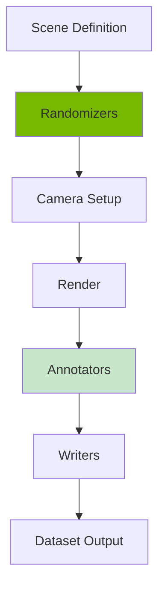
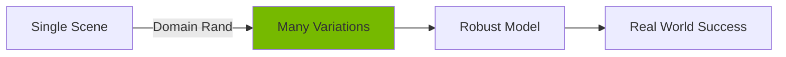

# Chapter 12: Perception with Isaac

<!-- DIAGRAM: id="ch12-perception-pipeline" type="architecture" format="mermaid"
     description="Synthetic data generation and perception training pipeline" -->



## Learning Objectives

By the end of this chapter, you will be able to:

1. **Generate synthetic training data** using Isaac Sim's rendering
2. **Apply domain randomization** for robust sim-to-real transfer
3. **Create annotated datasets** with automatic labeling
4. **Train object detection models** on synthetic data
5. **Deploy perception models** using Isaac ROS

## Prerequisites

Before starting this chapter, ensure you have:

- Completed Chapter 11: Isaac Sim Setup
- Working Isaac Sim installation
- Basic understanding of computer vision
- Familiarity with PyTorch

## Introduction

Training perception models traditionally requires collecting and labeling thousands of real images—expensive and time-consuming. Isaac Sim enables **synthetic data generation**: creating photorealistic, automatically labeled training data in simulation.

Key advantages:
- **Unlimited data**: Generate millions of images
- **Perfect labels**: Automatic, accurate annotations
- **Rare scenarios**: Create edge cases on demand
- **Domain randomization**: Built-in variety for robustness

## Replicator: Synthetic Data Generation

### What is Replicator?

**Omni.Replicator** is Isaac Sim's synthetic data generation framework:



### Basic Replicator Script

```python
import omni.replicator.core as rep
from omni.isaac.kit import SimulationApp

simulation_app = SimulationApp({"headless": True})

# Create scene
with rep.new_layer():
    # Ground plane
    ground = rep.create.plane(scale=10, visible=True)

    # Light
    light = rep.create.light(
        light_type="dome",
        intensity=1000,
        texture=rep.distribution.choice([
            "path/to/hdri1.hdr",
            "path/to/hdri2.hdr"
        ])
    )

    # Objects to detect
    objects = rep.create.from_usd(
        "path/to/object.usd",
        count=5
    )

    # Camera
    camera = rep.create.camera(
        position=(0, 5, 5),
        look_at=(0, 0, 0)
    )

# Define randomizers
with rep.trigger.on_frame(num_frames=1000):
    # Randomize object positions
    with objects:
        rep.modify.pose(
            position=rep.distribution.uniform((-2, 0, -2), (2, 0.5, 2)),
            rotation=rep.distribution.uniform((0, 0, 0), (0, 360, 0))
        )

    # Randomize camera
    with camera:
        rep.modify.pose(
            position=rep.distribution.uniform((3, 3, 3), (7, 7, 7)),
            look_at=(0, 0, 0)
        )

# Set up output
render_product = rep.create.render_product(camera, (640, 480))

# Add annotators
basic_writer = rep.WriterRegistry.get("BasicWriter")
basic_writer.initialize(
    output_dir="output/dataset",
    rgb=True,
    bounding_box_2d_tight=True,
    semantic_segmentation=True,
    instance_segmentation=True
)
basic_writer.attach([render_product])

# Run generation
rep.orchestrator.run()

simulation_app.close()
```

## Domain Randomization

### Why Domain Randomization?

Models trained on perfect synthetic data often fail in the real world due to the **reality gap**. Domain randomization adds variety to make models robust:



### Types of Randomization

| Type | What Changes | Purpose |
|------|--------------|---------|
| **Texture** | Object appearances | Handle material variety |
| **Lighting** | Light color, intensity | Handle illumination changes |
| **Camera** | Position, intrinsics | Handle viewpoint variety |
| **Distractor** | Background objects | Handle clutter |
| **Physics** | Object poses | Handle configuration variety |

### Implementing Randomizers

```python
import omni.replicator.core as rep

# Texture randomization
def randomize_textures():
    textures = [
        "path/to/texture1.png",
        "path/to/texture2.png",
        "path/to/texture3.png"
    ]

    with rep.get.prims(path_pattern="/World/Objects/*"):
        rep.modify.material(
            diffuse_texture=rep.distribution.choice(textures)
        )

# Lighting randomization
def randomize_lighting():
    lights = rep.get.prims(path_pattern="/World/Lights/*")

    with lights:
        rep.modify.attribute(
            "intensity",
            rep.distribution.uniform(500, 2000)
        )
        rep.modify.attribute(
            "color",
            rep.distribution.uniform((0.8, 0.8, 0.8), (1.0, 1.0, 1.0))
        )

# Camera randomization
def randomize_camera():
    camera = rep.get.prims(path_pattern="/World/Camera")

    with camera:
        rep.modify.pose(
            position=rep.distribution.uniform(
                (2, 2, 2),
                (5, 5, 5)
            ),
            look_at=rep.distribution.uniform(
                (-0.5, -0.5, 0),
                (0.5, 0.5, 0.5)
            )
        )

# Register randomizers
rep.randomizer.register(randomize_textures)
rep.randomizer.register(randomize_lighting)
rep.randomizer.register(randomize_camera)

# Apply on each frame
with rep.trigger.on_frame(num_frames=1000):
    rep.randomizer.randomize_textures()
    rep.randomizer.randomize_lighting()
    rep.randomizer.randomize_camera()
```

### Advanced Randomization: Distractors

```python
# Add random distractor objects
def add_distractors():
    distractor_assets = [
        "omniverse://localhost/NVIDIA/Assets/Objects/Box.usd",
        "omniverse://localhost/NVIDIA/Assets/Objects/Sphere.usd",
        "omniverse://localhost/NVIDIA/Assets/Objects/Cylinder.usd"
    ]

    distractors = rep.create.from_usd(
        rep.distribution.choice(distractor_assets),
        count=rep.distribution.uniform(5, 15)
    )

    with distractors:
        rep.modify.pose(
            position=rep.distribution.uniform((-3, 0, -3), (3, 0.5, 3)),
            rotation=rep.distribution.uniform((0, 0, 0), (360, 360, 360)),
            scale=rep.distribution.uniform(0.1, 0.5)
        )

        rep.modify.material(
            diffuse=rep.distribution.uniform((0, 0, 0), (1, 1, 1))
        )
```

## Annotation Types

### Available Annotators

| Annotator | Output | Use Case |
|-----------|--------|----------|
| `rgb` | Color image | Visual input |
| `depth` | Depth map | 3D understanding |
| `bounding_box_2d_tight` | 2D boxes | Object detection |
| `bounding_box_3d` | 3D boxes | 3D detection |
| `semantic_segmentation` | Class masks | Semantic understanding |
| `instance_segmentation` | Instance masks | Instance segmentation |
| `skeleton_2d` | 2D keypoints | Pose estimation |
| `normals` | Surface normals | Geometry understanding |

### Configuring Annotators

```python
import omni.replicator.core as rep

# Create render product
camera = rep.get.prims(path_pattern="/World/Camera")[0]
render_product = rep.create.render_product(camera, (1280, 720))

# RGB
rgb_annot = rep.AnnotatorRegistry.get_annotator("rgb")
rgb_annot.attach([render_product])

# Bounding boxes
bbox_annot = rep.AnnotatorRegistry.get_annotator("bounding_box_2d_tight")
bbox_annot.attach([render_product])

# Semantic segmentation
semantic_annot = rep.AnnotatorRegistry.get_annotator("semantic_segmentation")
semantic_annot.attach([render_product])

# Depth
depth_annot = rep.AnnotatorRegistry.get_annotator("distance_to_camera")
depth_annot.attach([render_product])

# Get data after render
rep.orchestrator.step()
rgb_data = rgb_annot.get_data()
bbox_data = bbox_annot.get_data()
semantic_data = semantic_annot.get_data()
depth_data = depth_annot.get_data()
```

### Semantic Labels

```python
import omni.replicator.core as rep
from omni.syntheticdata import helpers

# Define semantic classes
semantic_types = {
    "robot": {"class": "robot", "color": (255, 0, 0)},
    "object": {"class": "object", "color": (0, 255, 0)},
    "obstacle": {"class": "obstacle", "color": (0, 0, 255)},
}

# Apply to prims
for prim_path, label_info in [
    ("/World/Robot", semantic_types["robot"]),
    ("/World/Target", semantic_types["object"]),
]:
    helpers.add_semantics(
        prim_path,
        label_info["class"]
    )
```

## Output Writers

### Built-in Writers

```python
# Basic writer (images + JSON annotations)
basic_writer = rep.WriterRegistry.get("BasicWriter")
basic_writer.initialize(
    output_dir="output/basic",
    rgb=True,
    bounding_box_2d_tight=True,
    semantic_segmentation=True
)
basic_writer.attach([render_product])

# KITTI format writer
kitti_writer = rep.WriterRegistry.get("KittiWriter")
kitti_writer.initialize(
    output_dir="output/kitti"
)
kitti_writer.attach([render_product])

# COCO format writer
coco_writer = rep.WriterRegistry.get("CocoWriter")
coco_writer.initialize(
    output_dir="output/coco"
)
coco_writer.attach([render_product])
```

### Custom Writer

```python
import json
import numpy as np
from PIL import Image

class CustomWriter(rep.Writer):
    def __init__(self, output_dir):
        self.output_dir = output_dir
        self.frame_count = 0

    def write(self, data):
        # Save RGB
        rgb = data["rgb"]
        img = Image.fromarray(rgb)
        img.save(f"{self.output_dir}/rgb_{self.frame_count:06d}.png")

        # Save annotations
        annotations = {
            "frame": self.frame_count,
            "bboxes": data["bounding_box_2d_tight"]["data"].tolist(),
            "labels": data["bounding_box_2d_tight"]["info"]["idToLabels"]
        }

        with open(f"{self.output_dir}/ann_{self.frame_count:06d}.json", "w") as f:
            json.dump(annotations, f)

        self.frame_count += 1

# Register and use
rep.WriterRegistry.register(CustomWriter)
custom_writer = rep.WriterRegistry.get("CustomWriter")
custom_writer.initialize(output_dir="output/custom")
custom_writer.attach([render_product])
```

## Training Perception Models

### Dataset Preparation

```python
import torch
from torch.utils.data import Dataset, DataLoader
from PIL import Image
import json
import os

class SyntheticDataset(Dataset):
    def __init__(self, data_dir, transform=None):
        self.data_dir = data_dir
        self.transform = transform

        # Load all annotation files
        self.annotations = []
        for f in sorted(os.listdir(data_dir)):
            if f.startswith("ann_") and f.endswith(".json"):
                with open(os.path.join(data_dir, f)) as file:
                    self.annotations.append(json.load(file))

    def __len__(self):
        return len(self.annotations)

    def __getitem__(self, idx):
        ann = self.annotations[idx]

        # Load image
        img_path = os.path.join(
            self.data_dir,
            f"rgb_{ann['frame']:06d}.png"
        )
        image = Image.open(img_path).convert("RGB")

        # Get bounding boxes
        boxes = torch.tensor(ann['bboxes'], dtype=torch.float32)
        labels = torch.ones(len(boxes), dtype=torch.int64)

        if self.transform:
            image = self.transform(image)

        target = {
            "boxes": boxes,
            "labels": labels
        }

        return image, target
```

### Training Object Detection

```python
import torch
import torchvision
from torchvision.models.detection import fasterrcnn_resnet50_fpn
from torchvision import transforms

# Create model
model = fasterrcnn_resnet50_fpn(pretrained=True)

# Modify for custom classes
num_classes = 2  # background + object
in_features = model.roi_heads.box_predictor.cls_score.in_features
model.roi_heads.box_predictor = torchvision.models.detection.faster_rcnn.FastRCNNPredictor(
    in_features, num_classes
)

# Data transforms
transform = transforms.Compose([
    transforms.ToTensor(),
])

# Create dataset and dataloader
dataset = SyntheticDataset("output/dataset", transform=transform)
dataloader = DataLoader(dataset, batch_size=4, shuffle=True, collate_fn=lambda x: tuple(zip(*x)))

# Training loop
optimizer = torch.optim.SGD(model.parameters(), lr=0.005, momentum=0.9)
model.train()

for epoch in range(10):
    for images, targets in dataloader:
        images = list(image.cuda() for image in images)
        targets = [{k: v.cuda() for k, v in t.items()} for t in targets]

        loss_dict = model(images, targets)
        losses = sum(loss for loss in loss_dict.values())

        optimizer.zero_grad()
        losses.backward()
        optimizer.step()

    print(f"Epoch {epoch}: Loss = {losses.item():.4f}")

# Save model
torch.save(model.state_dict(), "object_detector.pth")
```

## Deploying with Isaac ROS

### Isaac ROS Perception

Isaac ROS provides optimized perception nodes:

```bash
# Install Isaac ROS packages
sudo apt install ros-humble-isaac-ros-dnn-inference
sudo apt install ros-humble-isaac-ros-detectnet
```

### Detection Pipeline

```python
# Launch file for Isaac ROS detection
from launch import LaunchDescription
from launch_ros.actions import Node

def generate_launch_description():
    return LaunchDescription([
        # Camera input
        Node(
            package='isaac_ros_image_proc',
            executable='image_format_converter_node',
            parameters=[{
                'encoding_desired': 'rgb8',
            }],
            remappings=[
                ('image_raw', '/camera/image_raw'),
                ('image', '/camera/image_rgb'),
            ]
        ),

        # DNN inference
        Node(
            package='isaac_ros_dnn_inference',
            executable='dnn_image_encoder_node',
            parameters=[{
                'network_image_width': 640,
                'network_image_height': 480,
            }],
            remappings=[
                ('encoded_tensor', '/tensor'),
                ('image', '/camera/image_rgb'),
            ]
        ),

        # TensorRT inference
        Node(
            package='isaac_ros_tensor_rt',
            executable='tensor_rt_node',
            parameters=[{
                'model_file_path': '/path/to/model.onnx',
                'engine_file_path': '/path/to/model.plan',
                'input_tensor_names': ['input'],
                'output_tensor_names': ['output'],
            }],
        ),

        # Detection decoder
        Node(
            package='isaac_ros_detectnet',
            executable='detectnet_decoder_node',
            parameters=[{
                'label_list': ['background', 'object'],
                'confidence_threshold': 0.5,
            }],
        ),
    ])
```

## Complete Perception Pipeline

### Scene Setup for Data Generation

```python
# complete_perception_pipeline.py
import omni.replicator.core as rep
from omni.isaac.kit import SimulationApp

simulation_app = SimulationApp({"headless": True})

from omni.isaac.core import World
from omni.isaac.core.utils.stage import add_reference_to_stage

# Create world
world = World()

# Add environment
add_reference_to_stage(
    "omniverse://localhost/NVIDIA/Assets/Scenes/warehouse.usd",
    "/World/Environment"
)

# Add objects to detect
objects = []
for i in range(10):
    obj = add_reference_to_stage(
        f"omniverse://localhost/NVIDIA/Assets/Objects/box_{i}.usd",
        f"/World/Objects/object_{i}"
    )
    objects.append(obj)

# Setup replicator
with rep.new_layer():
    # Camera
    camera = rep.create.camera(
        position=(5, 5, 5),
        look_at=(0, 0, 0)
    )

    # Randomizers
    with rep.trigger.on_frame(num_frames=10000):
        # Object randomization
        with rep.get.prims(path_pattern="/World/Objects/*"):
            rep.modify.pose(
                position=rep.distribution.uniform((-5, 0, -5), (5, 1, 5)),
                rotation=rep.distribution.uniform((0, 0, 0), (360, 360, 360))
            )
            rep.modify.material(
                diffuse=rep.distribution.uniform((0.2, 0.2, 0.2), (1, 1, 1))
            )

        # Camera randomization
        with camera:
            rep.modify.pose(
                position=rep.distribution.uniform((3, 3, 3), (8, 8, 8)),
                look_at=rep.distribution.uniform((-1, 0, -1), (1, 0.5, 1))
            )

    # Output
    render_product = rep.create.render_product(camera, (640, 480))

    writer = rep.WriterRegistry.get("BasicWriter")
    writer.initialize(
        output_dir="training_data",
        rgb=True,
        bounding_box_2d_tight=True,
        instance_segmentation=True
    )
    writer.attach([render_product])

# Generate data
rep.orchestrator.run()

simulation_app.close()
```

## Hands-On Exercise

### Exercise 1: Basic Data Generation

1. Create a scene with 5 different objects
2. Add randomization for positions and rotations
3. Generate 100 images with bounding box annotations
4. Visualize the generated data

### Exercise 2: Domain Randomization

1. Add texture randomization to objects
2. Add lighting randomization
3. Add camera pose randomization
4. Add distractor objects
5. Generate 1000 varied images

### Exercise 3: Train and Deploy

1. Generate 5000 training images
2. Train a simple object detector
3. Export to ONNX format
4. Deploy with Isaac ROS
5. Test on real camera (or new synthetic images)

## Key Concepts

| Term | Definition |
|------|------------|
| **Synthetic Data** | Training data generated in simulation |
| **Domain Randomization** | Varying simulation parameters for robustness |
| **Annotator** | Component that extracts labels from rendering |
| **Replicator** | Isaac Sim's synthetic data framework |
| **Sim-to-Real Transfer** | Applying simulation-trained models to reality |

## Chapter Summary

In this chapter, you learned:

1. **Synthetic data generation**: Using Replicator for automatic dataset creation.

2. **Domain randomization**: Adding variety for robust perception models.

3. **Annotation types**: RGB, depth, bounding boxes, segmentation, and more.

4. **Model training**: Using synthetic data to train detection models.

5. **Deployment**: Isaac ROS for real-time perception on robots.

## What's Next

In [Chapter 13: Navigation with Isaac ROS](./ch13-navigation), you'll use Isaac ROS to implement autonomous navigation, building on the perception skills learned here.

## Further Reading

- [Omni.Replicator Documentation](https://docs.omniverse.nvidia.com/replicator/latest/) - Official docs
- [Isaac ROS](https://nvidia-isaac-ros.github.io/) - Perception packages
- [Domain Randomization for Sim-to-Real](https://arxiv.org/abs/1703.06907) - Original paper
- [Synthetic Data for Deep Learning](https://developer.nvidia.com/blog/synthetic-data-deep-learning/) - NVIDIA blog
