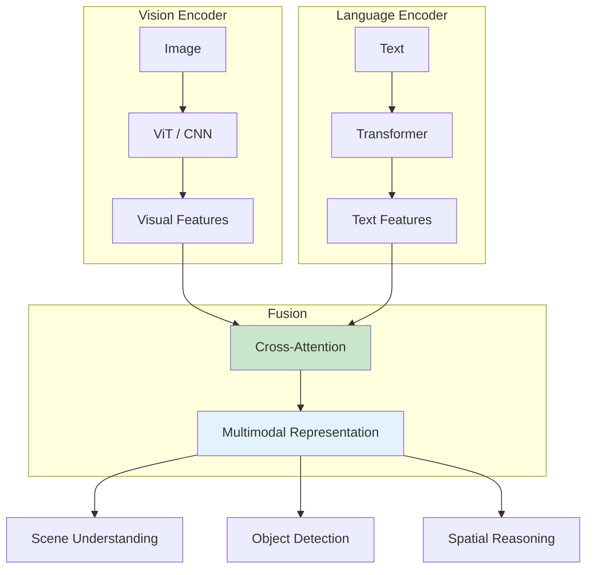
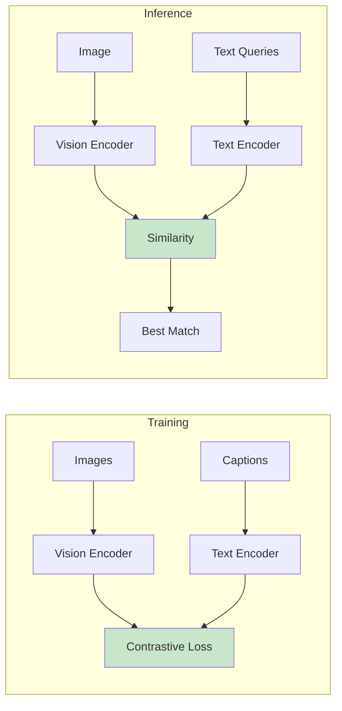
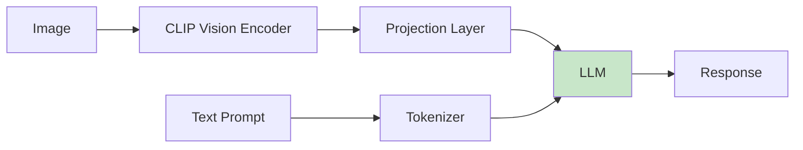
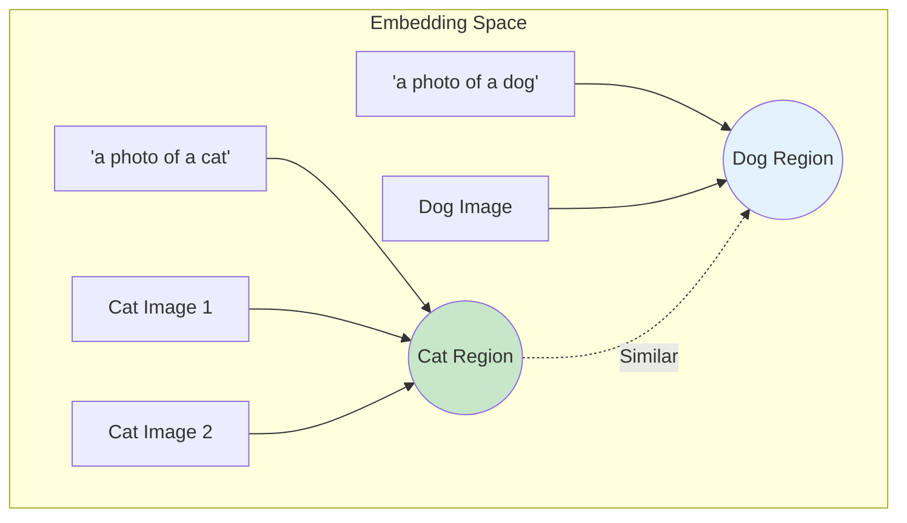

# Chapter 15: Vision-Language Models for Robotics

<!-- DIAGRAM: id="ch15-vlm-architecture" type="architecture" format="mermaid"
     description="Vision-Language Model architecture for robotics" -->



## Learning Objectives

By the end of this chapter, you will be able to:

1. **Explain VLM architectures** including CLIP, LLaVA, and GPT-4V
2. **Understand multimodal representations** and embedding spaces
3. **Apply VLMs for robot scene understanding**
4. **Implement zero-shot object detection** with vision-language models
5. **Connect VLM outputs to robot perception pipelines**

## Prerequisites

Before starting this chapter, ensure you have:

- Completed Modules 1-3
- Basic understanding of transformers and attention
- Familiarity with computer vision concepts
- Python and PyTorch experience

## Introduction

Vision-Language Models (VLMs) have revolutionized how machines understand the visual world through language. For robotics, this means:

- **Natural scene descriptions**: "There's a red cup on the table"
- **Spatial reasoning**: "The object is to the left of the robot"
- **Task grounding**: "Pick up the tool that's used for cutting"
- **Zero-shot recognition**: Identifying objects never seen during training

This chapter introduces VLM fundamentals and their application to robotics.

## VLM Architectures

### CLIP: Contrastive Language-Image Pre-training

CLIP learns aligned vision-language representations:



### Using CLIP for Robotics

```python
import torch
import clip
from PIL import Image

class CLIPPerception:
    def __init__(self, device='cuda'):
        self.device = device
        self.model, self.preprocess = clip.load("ViT-B/32", device=device)

    def encode_image(self, image_path):
        """Encode an image to CLIP embedding."""
        image = self.preprocess(Image.open(image_path)).unsqueeze(0).to(self.device)
        with torch.no_grad():
            image_features = self.model.encode_image(image)
        return image_features / image_features.norm(dim=-1, keepdim=True)

    def encode_text(self, texts):
        """Encode text descriptions to CLIP embeddings."""
        text_tokens = clip.tokenize(texts).to(self.device)
        with torch.no_grad():
            text_features = self.model.encode_text(text_tokens)
        return text_features / text_features.norm(dim=-1, keepdim=True)

    def find_object(self, image_path, object_descriptions):
        """Find which description best matches the image."""
        image_features = self.encode_image(image_path)
        text_features = self.encode_text(object_descriptions)

        similarity = (100.0 * image_features @ text_features.T).softmax(dim=-1)
        values, indices = similarity[0].topk(len(object_descriptions))

        results = []
        for value, index in zip(values, indices):
            results.append({
                'description': object_descriptions[index],
                'confidence': value.item()
            })

        return results

    def scene_understanding(self, image_path):
        """Understand the scene content."""
        queries = [
            "a kitchen with appliances",
            "an office with a desk",
            "a living room with furniture",
            "a warehouse with shelves",
            "an outdoor environment",
        ]
        return self.find_object(image_path, queries)


# Usage
perception = CLIPPerception()
results = perception.find_object(
    "scene.jpg",
    ["a red apple", "a green apple", "a banana", "an orange"]
)
print(f"Best match: {results[0]['description']} ({results[0]['confidence']:.2%})")
```

### LLaVA: Large Language and Vision Assistant

LLaVA combines a vision encoder with an LLM:



### Using LLaVA

```python
from transformers import LlavaNextProcessor, LlavaNextForConditionalGeneration
import torch
from PIL import Image

class LLaVAPerception:
    def __init__(self, model_name="llava-hf/llava-v1.6-mistral-7b-hf"):
        self.processor = LlavaNextProcessor.from_pretrained(model_name)
        self.model = LlavaNextForConditionalGeneration.from_pretrained(
            model_name,
            torch_dtype=torch.float16,
            device_map="auto"
        )

    def describe_scene(self, image_path, question="Describe this scene for a robot."):
        """Get detailed scene description."""
        image = Image.open(image_path)

        prompt = f"[INST] <image>\n{question} [/INST]"

        inputs = self.processor(prompt, image, return_tensors="pt").to(self.model.device)

        output = self.model.generate(
            **inputs,
            max_new_tokens=200,
            do_sample=False
        )

        return self.processor.decode(output[0], skip_special_tokens=True)

    def find_objects(self, image_path):
        """Identify objects suitable for robot manipulation."""
        question = """List all objects visible in this image that a robot could interact with.
        For each object, describe:
        1. What it is
        2. Its approximate location (left, center, right, near, far)
        3. Whether it appears graspable
        Format as a list."""

        return self.describe_scene(image_path, question)

    def spatial_reasoning(self, image_path, query):
        """Answer spatial reasoning questions."""
        question = f"Looking at this scene: {query}"
        return self.describe_scene(image_path, question)


# Usage
llava = LLaVAPerception()
description = llava.describe_scene("robot_workspace.jpg")
objects = llava.find_objects("robot_workspace.jpg")
spatial = llava.spatial_reasoning(
    "robot_workspace.jpg",
    "Is the red cup closer to the robot than the blue box?"
)
```

## Multimodal Embeddings

### Understanding Embedding Spaces



### Working with Embeddings

```python
import torch
import numpy as np
from sklearn.metrics.pairwise import cosine_similarity

class EmbeddingSpace:
    def __init__(self, vlm):
        self.vlm = vlm
        self.object_database = {}

    def add_object(self, name, image_path=None, description=None):
        """Add an object to the database."""
        embeddings = []

        if image_path:
            img_emb = self.vlm.encode_image(image_path)
            embeddings.append(img_emb)

        if description:
            txt_emb = self.vlm.encode_text([description])
            embeddings.append(txt_emb)

        # Average embeddings if multiple
        avg_embedding = torch.stack(embeddings).mean(dim=0)
        self.object_database[name] = avg_embedding

    def find_similar(self, query_embedding, top_k=5):
        """Find most similar objects in database."""
        similarities = {}

        for name, embedding in self.object_database.items():
            sim = cosine_similarity(
                query_embedding.cpu().numpy(),
                embedding.cpu().numpy()
            )[0][0]
            similarities[name] = sim

        sorted_items = sorted(similarities.items(), key=lambda x: x[1], reverse=True)
        return sorted_items[:top_k]

    def query_by_text(self, text_query):
        """Find objects matching text description."""
        query_emb = self.vlm.encode_text([text_query])
        return self.find_similar(query_emb)

    def query_by_image(self, image_path):
        """Find objects matching image."""
        query_emb = self.vlm.encode_image(image_path)
        return self.find_similar(query_emb)
```

## Zero-Shot Object Detection

### Open-Vocabulary Detection

Traditional object detectors only recognize trained classes. VLM-based detectors can find any object described in language.

```python
from transformers import OwlViTProcessor, OwlViTForObjectDetection
import torch
from PIL import Image

class OpenVocabDetector:
    def __init__(self):
        self.processor = OwlViTProcessor.from_pretrained("google/owlvit-base-patch32")
        self.model = OwlViTForObjectDetection.from_pretrained("google/owlvit-base-patch32")

    def detect(self, image_path, text_queries, threshold=0.1):
        """Detect objects matching text queries."""
        image = Image.open(image_path)

        inputs = self.processor(
            text=text_queries,
            images=image,
            return_tensors="pt"
        )

        with torch.no_grad():
            outputs = self.model(**inputs)

        # Process results
        target_sizes = torch.tensor([image.size[::-1]])
        results = self.processor.post_process_object_detection(
            outputs=outputs,
            target_sizes=target_sizes,
            threshold=threshold
        )[0]

        detections = []
        for score, label, box in zip(results["scores"], results["labels"], results["boxes"]):
            detections.append({
                'label': text_queries[label],
                'score': score.item(),
                'box': box.tolist()  # [x1, y1, x2, y2]
            })

        return detections

    def detect_for_robot(self, image_path, task_description):
        """Detect objects relevant to a robot task."""
        # Extract potential objects from task
        # (In practice, use an LLM for this)
        potential_objects = self._extract_objects(task_description)
        return self.detect(image_path, potential_objects)

    def _extract_objects(self, task):
        """Simple object extraction (replace with LLM in production)."""
        # This is a simplified example
        common_objects = [
            "cup", "mug", "bottle", "box", "tool",
            "pen", "book", "phone", "keyboard", "mouse"
        ]
        return common_objects


# Usage
detector = OpenVocabDetector()
detections = detector.detect(
    "workspace.jpg",
    ["a red cup", "a screwdriver", "a cardboard box", "a keyboard"]
)
for det in detections:
    print(f"Found {det['label']} at {det['box']} (confidence: {det['score']:.2%})")
```

### Grounding DINO: Phrase Grounding

```python
from groundingdino.util.inference import load_model, load_image, predict

class GroundingDINODetector:
    def __init__(self, config_path, weights_path):
        self.model = load_model(config_path, weights_path)

    def detect(self, image_path, text_prompt, box_threshold=0.35, text_threshold=0.25):
        """Detect and ground objects from text prompt."""
        image_source, image = load_image(image_path)

        boxes, logits, phrases = predict(
            model=self.model,
            image=image,
            caption=text_prompt,
            box_threshold=box_threshold,
            text_threshold=text_threshold
        )

        detections = []
        for box, logit, phrase in zip(boxes, logits, phrases):
            # Convert box to image coordinates
            h, w = image_source.shape[:2]
            box = box * torch.tensor([w, h, w, h])
            detections.append({
                'phrase': phrase,
                'confidence': logit.item(),
                'box': box.tolist()
            })

        return detections
```

## VLMs in Robot Perception Pipeline

### Complete Perception System

```python
import rclpy
from rclpy.node import Node
from sensor_msgs.msg import Image
from geometry_msgs.msg import Point
from cv_bridge import CvBridge
import cv2

class VLMPerceptionNode(Node):
    def __init__(self):
        super().__init__('vlm_perception')

        self.bridge = CvBridge()

        # Initialize VLMs
        self.clip_perception = CLIPPerception()
        self.object_detector = OpenVocabDetector()

        # ROS 2 interfaces
        self.image_sub = self.create_subscription(
            Image,
            '/camera/image_raw',
            self.image_callback,
            10
        )

        self.detection_pub = self.create_publisher(
            DetectionArray,  # Custom message
            '/vlm/detections',
            10
        )

        # Current task objects to look for
        self.target_objects = ["cup", "bottle", "tool"]

    def image_callback(self, msg):
        """Process incoming images with VLMs."""
        # Convert ROS image to CV2
        cv_image = self.bridge.imgmsg_to_cv2(msg, "bgr8")

        # Save temporarily for VLM processing
        temp_path = "/tmp/current_frame.jpg"
        cv2.imwrite(temp_path, cv_image)

        # Run detection
        detections = self.object_detector.detect(temp_path, self.target_objects)

        # Publish results
        detection_msg = self.create_detection_msg(detections)
        self.detection_pub.publish(detection_msg)

    def create_detection_msg(self, detections):
        """Convert detections to ROS message."""
        msg = DetectionArray()
        for det in detections:
            detection = Detection()
            detection.label = det['label']
            detection.confidence = det['score']
            detection.bbox = det['box']
            msg.detections.append(detection)
        return msg

    def set_target_objects(self, objects):
        """Update objects to detect."""
        self.target_objects = objects
        self.get_logger().info(f'Now looking for: {objects}')


def main(args=None):
    rclpy.init(args=args)
    node = VLMPerceptionNode()
    rclpy.spin(node)
    node.destroy_node()
    rclpy.shutdown()
```

### Scene Graph Generation

```python
class SceneGraphGenerator:
    def __init__(self, vlm, detector):
        self.vlm = vlm
        self.detector = detector

    def generate_scene_graph(self, image_path):
        """Generate a scene graph from image."""
        # Detect objects
        objects = self.detector.detect(
            image_path,
            ["table", "chair", "cup", "plate", "person", "robot"]
        )

        # Get spatial relationships using VLM
        relationships = []
        for i, obj1 in enumerate(objects):
            for j, obj2 in enumerate(objects):
                if i != j:
                    rel = self.get_relationship(image_path, obj1, obj2)
                    if rel:
                        relationships.append({
                            'subject': obj1['label'],
                            'predicate': rel,
                            'object': obj2['label']
                        })

        return {
            'objects': objects,
            'relationships': relationships
        }

    def get_relationship(self, image_path, obj1, obj2):
        """Determine spatial relationship between objects."""
        # Use VLM to determine relationship
        prompt = f"What is the spatial relationship between the {obj1['label']} and the {obj2['label']}? Answer with: on, next to, above, below, in front of, behind, or none."

        response = self.vlm.describe_scene(image_path, prompt)

        # Parse response for relationship
        relationships = ['on', 'next to', 'above', 'below', 'in front of', 'behind']
        for rel in relationships:
            if rel in response.lower():
                return rel
        return None
```

## Hands-On Exercise

### Exercise 1: Object Finding

Create a system that:
1. Takes a natural language query ("Find the red cup")
2. Uses CLIP to match against camera images
3. Outputs object location

### Exercise 2: Scene Description

Build a scene description pipeline:
1. Capture image from simulated robot camera
2. Use LLaVA to describe the scene
3. Extract object list and locations
4. Publish to ROS 2 topic

### Exercise 3: Semantic Workspace Map

Create a semantic map that:
1. Continuously detects objects in view
2. Associates objects with their 3D positions
3. Builds a queryable workspace representation
4. Answers questions like "Where did I last see the screwdriver?"

## Key Concepts

| Term | Definition |
|------|------------|
| **VLM** | Vision-Language Model that understands both images and text |
| **CLIP** | Contrastive model aligning image and text embeddings |
| **LLaVA** | Vision-language model combining CLIP with LLM |
| **Zero-shot Detection** | Finding objects using text descriptions without training |
| **Visual Grounding** | Localizing objects mentioned in text |
| **Scene Graph** | Graph representation of objects and their relationships |

## Chapter Summary

In this chapter, you learned:

1. **VLM architectures**: CLIP, LLaVA, and GPT-4V for robotics.

2. **Multimodal embeddings**: How images and text share representation space.

3. **Zero-shot detection**: Finding any object described in language.

4. **Scene understanding**: Using VLMs to understand robot environments.

5. **Integration**: Connecting VLMs to robot perception pipelines.

## What's Next

In [Chapter 16: LLM Integration for Task Planning](./ch16-llm-integration), you'll learn to use large language models for high-level robot task planning and reasoning.

## Further Reading

- [CLIP Paper](https://arxiv.org/abs/2103.00020) - Original CLIP research
- [LLaVA](https://llava-vl.github.io/) - LLaVA project page
- [OWL-ViT](https://arxiv.org/abs/2205.06230) - Open-vocabulary detection
- [Grounding DINO](https://arxiv.org/abs/2303.05499) - Phrase grounding
