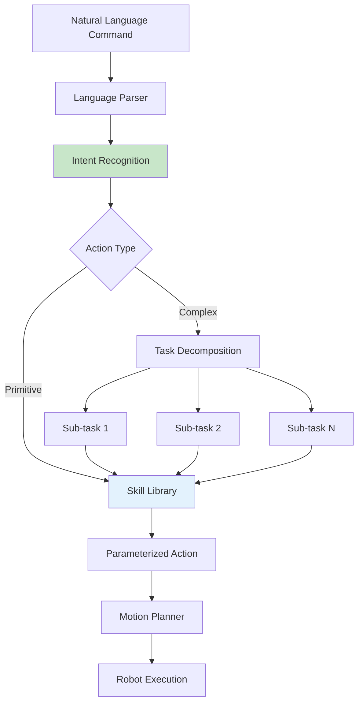

# Chapter 18: From Language Commands to Robot Actions

<!-- DIAGRAM: id="ch18-language-action" type="architecture" format="mermaid"
     description="Language to action translation pipeline" -->



## Learning Objectives

By the end of this chapter, you will be able to:

1. **Map natural language to action primitives** using structured parsing
2. **Build skill libraries** with parameterized robot behaviors
3. **Create language-conditioned policies** for flexible execution
4. **Handle ambiguity and clarification** in commands
5. **Implement complete language-to-action systems**

## Prerequisites

Before starting this chapter, ensure you have:

- Completed Chapters 15-17
- Understanding of VLA pipelines
- Experience with robot control systems
- Working simulation environment

## Introduction

The final step in a VLA system is translating understood language into executable robot actions. This involves:

- **Skill libraries**: Reusable, parameterized behaviors
- **Language grounding**: Connecting words to robot capabilities
- **Action composition**: Building complex behaviors from primitives
- **Error handling**: Managing ambiguity and failures

## Skill Libraries

### Defining Robot Skills

```python
from dataclasses import dataclass
from typing import List, Dict, Any, Optional
import numpy as np

@dataclass
class SkillParameter:
    name: str
    param_type: str  # 'position', 'object', 'direction', 'number'
    required: bool = True
    default: Any = None

@dataclass
class Skill:
    name: str
    description: str
    parameters: List[SkillParameter]
    preconditions: List[str]
    effects: List[str]

class SkillLibrary:
    def __init__(self):
        self.skills = {}
        self._register_default_skills()

    def _register_default_skills(self):
        """Register built-in robot skills."""

        # Navigation skills
        self.register(Skill(
            name="navigate_to",
            description="Move the robot base to a target position",
            parameters=[
                SkillParameter("target", "position"),
                SkillParameter("speed", "number", required=False, default=0.5)
            ],
            preconditions=["robot_base_free"],
            effects=["robot_at(target)"]
        ))

        # Manipulation skills
        self.register(Skill(
            name="pick",
            description="Pick up an object with the gripper",
            parameters=[
                SkillParameter("object", "object"),
                SkillParameter("grasp_type", "string", required=False, default="top")
            ],
            preconditions=["gripper_empty", "object_reachable(object)"],
            effects=["holding(object)", "not gripper_empty"]
        ))

        self.register(Skill(
            name="place",
            description="Place the held object at a location",
            parameters=[
                SkillParameter("target", "position"),
                SkillParameter("object", "object", required=False)
            ],
            preconditions=["not gripper_empty"],
            effects=["gripper_empty", "object_at(object, target)"]
        ))

        self.register(Skill(
            name="push",
            description="Push an object in a direction",
            parameters=[
                SkillParameter("object", "object"),
                SkillParameter("direction", "direction"),
                SkillParameter("distance", "number", required=False, default=0.1)
            ],
            preconditions=["object_reachable(object)"],
            effects=["object_moved(object, direction)"]
        ))

        # Gripper skills
        self.register(Skill(
            name="open_gripper",
            description="Open the robot gripper",
            parameters=[],
            preconditions=[],
            effects=["gripper_open"]
        ))

        self.register(Skill(
            name="close_gripper",
            description="Close the robot gripper",
            parameters=[],
            preconditions=["gripper_open"],
            effects=["gripper_closed"]
        ))

        # Observation skills
        self.register(Skill(
            name="look_at",
            description="Point camera at a target",
            parameters=[
                SkillParameter("target", "position")
            ],
            preconditions=[],
            effects=["observing(target)"]
        ))

    def register(self, skill: Skill):
        """Register a new skill."""
        self.skills[skill.name] = skill

    def get(self, name: str) -> Optional[Skill]:
        """Get skill by name."""
        return self.skills.get(name)

    def search(self, query: str) -> List[Skill]:
        """Search skills by description."""
        query_lower = query.lower()
        matches = []
        for skill in self.skills.values():
            if query_lower in skill.description.lower() or query_lower in skill.name:
                matches.append(skill)
        return matches

    def get_all(self) -> List[Skill]:
        """Get all registered skills."""
        return list(self.skills.values())
```

### Skill Executors

```python
class SkillExecutor:
    def __init__(self, robot_interface):
        self.robot = robot_interface
        self.library = SkillLibrary()

    def execute(self, skill_name: str, parameters: Dict[str, Any]) -> Dict:
        """Execute a skill with given parameters."""
        skill = self.library.get(skill_name)
        if not skill:
            return {"success": False, "error": f"Unknown skill: {skill_name}"}

        # Validate parameters
        validation = self._validate_parameters(skill, parameters)
        if not validation["valid"]:
            return {"success": False, "error": validation["error"]}

        # Check preconditions
        precond_check = self._check_preconditions(skill)
        if not precond_check["satisfied"]:
            return {"success": False, "error": f"Preconditions not met: {precond_check['failed']}"}

        # Execute skill-specific logic
        try:
            result = self._execute_skill(skill_name, parameters)
            return {"success": True, "result": result}
        except Exception as e:
            return {"success": False, "error": str(e)}

    def _validate_parameters(self, skill: Skill, params: Dict) -> Dict:
        """Validate parameters against skill definition."""
        for param in skill.parameters:
            if param.required and param.name not in params:
                return {"valid": False, "error": f"Missing required parameter: {param.name}"}
        return {"valid": True}

    def _check_preconditions(self, skill: Skill) -> Dict:
        """Check if skill preconditions are satisfied."""
        failed = []
        for precond in skill.preconditions:
            if not self._evaluate_precondition(precond):
                failed.append(precond)

        return {"satisfied": len(failed) == 0, "failed": failed}

    def _evaluate_precondition(self, precond: str) -> bool:
        """Evaluate a precondition against current state."""
        if precond == "gripper_empty":
            return not self.robot.is_holding()
        elif precond == "gripper_open":
            return self.robot.gripper_state() == "open"
        elif precond.startswith("object_reachable"):
            obj = precond.split("(")[1].rstrip(")")
            return self.robot.can_reach(obj)
        return True

    def _execute_skill(self, skill_name: str, params: Dict) -> Any:
        """Execute the actual skill behavior."""
        if skill_name == "navigate_to":
            return self.robot.navigate(params["target"], params.get("speed", 0.5))

        elif skill_name == "pick":
            obj = params["object"]
            grasp = params.get("grasp_type", "top")
            return self.robot.pick_object(obj, grasp)

        elif skill_name == "place":
            target = params["target"]
            return self.robot.place_object(target)

        elif skill_name == "push":
            return self.robot.push_object(
                params["object"],
                params["direction"],
                params.get("distance", 0.1)
            )

        elif skill_name == "open_gripper":
            return self.robot.open_gripper()

        elif skill_name == "close_gripper":
            return self.robot.close_gripper()

        elif skill_name == "look_at":
            return self.robot.look_at(params["target"])

        raise ValueError(f"No executor for skill: {skill_name}")
```

## Language to Skill Mapping

### Intent Recognition

```python
import openai
from typing import Tuple

class LanguageToSkillMapper:
    def __init__(self, skill_library: SkillLibrary):
        self.library = skill_library
        self.client = openai.OpenAI()

    def parse_command(self, command: str, world_state: Dict) -> Dict:
        """Parse natural language command into skill calls."""

        # Get available skills for context
        skills_desc = self._format_skills_for_prompt()

        prompt = f"""Parse this robot command into skill calls.

Available Skills:
{skills_desc}

Current World State:
{json.dumps(world_state, indent=2)}

Command: "{command}"

Output JSON with structure:
{{
    "intent": "brief description of intent",
    "skill_calls": [
        {{"skill": "skill_name", "parameters": {{}}}},
        ...
    ],
    "requires_clarification": false,
    "clarification_question": null
}}

If the command is ambiguous, set requires_clarification to true and provide a question."""

        response = self.client.chat.completions.create(
            model="gpt-4",
            messages=[{"role": "user", "content": prompt}],
            response_format={"type": "json_object"}
        )

        return json.loads(response.choices[0].message.content)

    def _format_skills_for_prompt(self) -> str:
        """Format skill library for LLM prompt."""
        lines = []
        for skill in self.library.get_all():
            params = ", ".join([f"{p.name}: {p.param_type}" for p in skill.parameters])
            lines.append(f"- {skill.name}({params}): {skill.description}")
        return "\n".join(lines)

    def resolve_references(self, skill_call: Dict, world_state: Dict) -> Dict:
        """Resolve object references in skill parameters."""
        resolved = skill_call.copy()

        for param_name, param_value in skill_call.get("parameters", {}).items():
            if isinstance(param_value, str):
                # Try to resolve object reference
                resolved_value = self._resolve_reference(param_value, world_state)
                resolved["parameters"][param_name] = resolved_value

        return resolved

    def _resolve_reference(self, reference: str, world_state: Dict) -> Any:
        """Resolve a natural language reference to actual object/position."""
        objects = world_state.get("objects", [])

        # Direct name match
        for obj in objects:
            if reference.lower() in obj["name"].lower():
                return obj

        # Color-based match
        colors = ["red", "blue", "green", "yellow", "orange", "purple", "white", "black"]
        for color in colors:
            if color in reference.lower():
                for obj in objects:
                    if color in obj.get("color", "").lower():
                        return obj

        # Location-based match
        if "table" in reference.lower():
            return world_state.get("table_position", [0, 0, 0.75])

        if "shelf" in reference.lower():
            return world_state.get("shelf_position", [1, 0, 1.0])

        return reference  # Return original if can't resolve
```

### Semantic Parsing

```python
class SemanticParser:
    def __init__(self):
        self.action_verbs = {
            "pick": ["pick", "grab", "grasp", "take", "get"],
            "place": ["place", "put", "set", "drop"],
            "push": ["push", "shove", "move"],
            "navigate": ["go", "move", "navigate", "drive"],
            "look": ["look", "see", "observe", "check"]
        }

    def extract_action(self, command: str) -> Tuple[str, float]:
        """Extract the primary action from command."""
        command_lower = command.lower()
        best_match = None
        best_score = 0

        for action, verbs in self.action_verbs.items():
            for verb in verbs:
                if verb in command_lower:
                    # Simple scoring based on position
                    position = command_lower.index(verb)
                    score = 1.0 / (position + 1)
                    if score > best_score:
                        best_score = score
                        best_match = action

        return best_match, best_score

    def extract_objects(self, command: str, available_objects: List[Dict]) -> List[Dict]:
        """Extract object references from command."""
        command_lower = command.lower()
        found_objects = []

        for obj in available_objects:
            obj_name = obj["name"].lower()

            # Check direct name match
            if obj_name in command_lower:
                found_objects.append(obj)
                continue

            # Check color match
            if "color" in obj:
                if obj["color"].lower() in command_lower:
                    found_objects.append(obj)
                    continue

            # Check type match
            if "type" in obj:
                if obj["type"].lower() in command_lower:
                    found_objects.append(obj)

        return found_objects

    def extract_location(self, command: str) -> Optional[str]:
        """Extract target location from command."""
        location_patterns = [
            (r"on (?:the )?(\w+)", "on"),
            (r"to (?:the )?(\w+)", "to"),
            (r"at (?:the )?(\w+)", "at"),
            (r"in (?:the )?(\w+)", "in"),
            (r"near (?:the )?(\w+)", "near"),
        ]

        import re
        for pattern, prep in location_patterns:
            match = re.search(pattern, command.lower())
            if match:
                return {"preposition": prep, "landmark": match.group(1)}

        return None
```

## Language-Conditioned Policies

### Conditional Skill Selection

```python
class LanguageConditionedPolicy:
    def __init__(self, skill_executor: SkillExecutor):
        self.executor = skill_executor
        self.mapper = LanguageToSkillMapper(skill_executor.library)
        self.parser = SemanticParser()

    def execute_command(self, command: str, world_state: Dict) -> Dict:
        """Execute a natural language command."""

        # Parse command
        parsed = self.mapper.parse_command(command, world_state)

        # Handle clarification needs
        if parsed.get("requires_clarification"):
            return {
                "status": "clarification_needed",
                "question": parsed["clarification_question"]
            }

        # Execute skill sequence
        results = []
        for skill_call in parsed["skill_calls"]:
            # Resolve references
            resolved = self.mapper.resolve_references(skill_call, world_state)

            # Execute
            result = self.executor.execute(
                resolved["skill"],
                resolved["parameters"]
            )

            results.append(result)

            # Stop on failure
            if not result["success"]:
                return {
                    "status": "failed",
                    "completed": len(results) - 1,
                    "total": len(parsed["skill_calls"]),
                    "error": result["error"]
                }

            # Update world state for next skill
            world_state = self._update_world_state(world_state, skill_call, result)

        return {
            "status": "success",
            "results": results
        }

    def _update_world_state(self, state: Dict, skill: Dict, result: Dict) -> Dict:
        """Update world state after skill execution."""
        new_state = state.copy()

        if skill["skill"] == "pick":
            new_state["holding"] = skill["parameters"]["object"]

        elif skill["skill"] == "place":
            new_state["holding"] = None
            # Update object position
            obj = new_state.get("holding_object")
            if obj:
                obj["position"] = skill["parameters"]["target"]

        return new_state
```

### Neural Language-Conditioned Policy

```python
import torch
import torch.nn as nn

class NeuralLanguagePolicy(nn.Module):
    def __init__(self, state_dim, action_dim, language_dim=512):
        super().__init__()

        # Language encoder
        self.language_encoder = nn.Sequential(
            nn.Linear(language_dim, 256),
            nn.ReLU(),
            nn.Linear(256, 128)
        )

        # State encoder
        self.state_encoder = nn.Sequential(
            nn.Linear(state_dim, 256),
            nn.ReLU(),
            nn.Linear(256, 128)
        )

        # FiLM conditioning
        self.film_gamma = nn.Linear(128, 128)
        self.film_beta = nn.Linear(128, 128)

        # Policy head
        self.policy = nn.Sequential(
            nn.Linear(128, 256),
            nn.ReLU(),
            nn.Linear(256, action_dim)
        )

    def forward(self, state, language_embedding):
        """Forward pass with language conditioning."""
        # Encode inputs
        lang_features = self.language_encoder(language_embedding)
        state_features = self.state_encoder(state)

        # FiLM conditioning
        gamma = self.film_gamma(lang_features)
        beta = self.film_beta(lang_features)
        conditioned = gamma * state_features + beta

        # Predict action
        action = self.policy(conditioned)
        return action

    def get_action(self, state, command, language_model):
        """Get action for state and command."""
        # Encode command
        with torch.no_grad():
            lang_emb = language_model.encode(command)

        # Forward pass
        action = self.forward(state, lang_emb)
        return action
```

## Handling Ambiguity

### Clarification System

```python
class ClarificationSystem:
    def __init__(self, llm_client):
        self.client = llm_client
        self.context = []

    def detect_ambiguity(self, command: str, world_state: Dict) -> Dict:
        """Detect if command is ambiguous."""
        prompt = f"""Analyze this robot command for ambiguity.

Command: "{command}"
Available objects: {[obj['name'] for obj in world_state.get('objects', [])]}

Check for:
1. Multiple matching objects (e.g., "the cup" when there are multiple cups)
2. Unclear target location
3. Missing required information
4. Conflicting instructions

Output JSON:
{{
    "is_ambiguous": true/false,
    "ambiguity_type": "type or null",
    "candidates": ["list of possible interpretations"],
    "clarification_question": "question to ask or null"
}}"""

        response = self.client.chat.completions.create(
            model="gpt-4",
            messages=[{"role": "user", "content": prompt}],
            response_format={"type": "json_object"}
        )

        return json.loads(response.choices[0].message.content)

    def ask_clarification(self, question: str) -> str:
        """Present clarification question (interface with user)."""
        # In practice, this would interface with UI/voice
        print(f"Robot: {question}")
        response = input("User: ")
        return response

    def resolve_with_context(self, original_command: str, clarification: str) -> str:
        """Combine original command with clarification."""
        prompt = f"""Combine these into a clear, unambiguous command:

Original: "{original_command}"
Clarification: "{clarification}"

Output the resolved command as a single string."""

        response = self.client.chat.completions.create(
            model="gpt-4",
            messages=[{"role": "user", "content": prompt}]
        )

        return response.choices[0].message.content.strip()


class AmbiguityAwarePolicy:
    def __init__(self, base_policy, clarification_system):
        self.policy = base_policy
        self.clarifier = clarification_system

    def execute(self, command: str, world_state: Dict) -> Dict:
        """Execute with ambiguity handling."""

        # Check for ambiguity
        ambiguity = self.clarifier.detect_ambiguity(command, world_state)

        if ambiguity["is_ambiguous"]:
            # Ask for clarification
            clarification = self.clarifier.ask_clarification(
                ambiguity["clarification_question"]
            )

            # Resolve command
            resolved_command = self.clarifier.resolve_with_context(
                command, clarification
            )

            # Re-execute with resolved command
            return self.policy.execute_command(resolved_command, world_state)

        return self.policy.execute_command(command, world_state)
```

## Complete Language-to-Action System

```python
class LanguageToActionSystem:
    def __init__(self, robot_interface):
        self.robot = robot_interface

        # Components
        self.skill_library = SkillLibrary()
        self.skill_executor = SkillExecutor(robot_interface)
        self.language_policy = LanguageConditionedPolicy(self.skill_executor)
        self.clarifier = ClarificationSystem(openai.OpenAI())

        # State
        self.conversation_history = []

    def process_command(self, command: str) -> Dict:
        """Process a natural language command end-to-end."""

        # Get current world state
        world_state = self.robot.get_world_state()

        # Add to conversation history
        self.conversation_history.append({
            "role": "user",
            "content": command
        })

        # Check for ambiguity
        ambiguity = self.clarifier.detect_ambiguity(command, world_state)

        if ambiguity["is_ambiguous"]:
            return {
                "status": "clarification_needed",
                "question": ambiguity["clarification_question"],
                "candidates": ambiguity["candidates"]
            }

        # Execute command
        result = self.language_policy.execute_command(command, world_state)

        # Add result to history
        self.conversation_history.append({
            "role": "assistant",
            "content": f"Executed: {result['status']}"
        })

        return result

    def provide_clarification(self, clarification: str) -> Dict:
        """Handle user clarification."""
        if not self.conversation_history:
            return {"status": "error", "message": "No pending clarification"}

        original = self.conversation_history[-1]["content"]
        resolved = self.clarifier.resolve_with_context(original, clarification)

        return self.process_command(resolved)

    def get_status(self) -> Dict:
        """Get current system status."""
        return {
            "robot_state": self.robot.get_state(),
            "world_state": self.robot.get_world_state(),
            "available_skills": [s.name for s in self.skill_library.get_all()],
            "conversation_length": len(self.conversation_history)
        }
```

### ROS 2 Integration

```python
#!/usr/bin/env python3
"""Complete language-to-action ROS 2 node."""

import rclpy
from rclpy.node import Node
from std_msgs.msg import String
from std_srvs.srv import Trigger

class LanguageActionNode(Node):
    def __init__(self):
        super().__init__('language_action')

        # Initialize system
        self.system = LanguageToActionSystem(self.create_robot_interface())

        # Subscribers
        self.command_sub = self.create_subscription(
            String, '/voice_command', self.command_callback, 10)
        self.clarification_sub = self.create_subscription(
            String, '/clarification', self.clarification_callback, 10)

        # Publishers
        self.response_pub = self.create_publisher(String, '/robot_response', 10)
        self.status_pub = self.create_publisher(String, '/execution_status', 10)

        self.get_logger().info('Language-to-Action system ready')

    def command_callback(self, msg):
        """Handle incoming voice commands."""
        command = msg.data
        self.get_logger().info(f'Received command: {command}')

        result = self.system.process_command(command)

        # Publish response
        response = String()
        if result["status"] == "clarification_needed":
            response.data = f"Please clarify: {result['question']}"
        elif result["status"] == "success":
            response.data = "Task completed successfully"
        else:
            response.data = f"Task failed: {result.get('error', 'Unknown error')}"

        self.response_pub.publish(response)

    def clarification_callback(self, msg):
        """Handle clarification responses."""
        clarification = msg.data
        result = self.system.provide_clarification(clarification)

        response = String()
        response.data = f"After clarification: {result['status']}"
        self.response_pub.publish(response)

    def create_robot_interface(self):
        """Create robot interface for this node."""
        # Implementation depends on your robot
        return SimulatedRobotInterface(self)


def main(args=None):
    rclpy.init(args=args)
    node = LanguageActionNode()
    rclpy.spin(node)
    node.destroy_node()
    rclpy.shutdown()
```

## Hands-On Exercise

### Exercise 1: Skill Library

1. Implement 5 additional skills (pour, stack, sort, etc.)
2. Add proper preconditions and effects
3. Test with various commands

### Exercise 2: Ambiguity Handling

1. Create test cases with ambiguous commands
2. Implement clarification dialogue
3. Test resolution accuracy

### Exercise 3: End-to-End System

1. Deploy complete system in Isaac Sim
2. Execute 10 different voice commands
3. Measure success rate and response time

## Key Concepts

| Term | Definition |
|------|------------|
| **Skill Library** | Collection of parameterized robot behaviors |
| **Language Grounding** | Connecting language to robot capabilities |
| **Semantic Parsing** | Extracting structured meaning from language |
| **FiLM Conditioning** | Neural conditioning with language features |
| **Clarification** | Resolving ambiguity through dialogue |

## Chapter Summary

In this chapter, you learned:

1. **Skill libraries**: Building reusable, parameterized robot behaviors.

2. **Language mapping**: Converting natural language to skill calls.

3. **Semantic parsing**: Extracting actions, objects, and locations.

4. **Language-conditioned policies**: Neural networks conditioned on commands.

5. **Ambiguity handling**: Detecting and resolving unclear commands.

## What's Next

Congratulations on completing Module 4! You now have the skills to build complete VLA systems.

In [Module 5: Humanoid Intelligence](../module-5-humanoid/), you'll apply everything learned to humanoid-specific challenges: locomotion, manipulation, and human-robot interaction.

## Further Reading

- [SayCan](https://say-can.github.io/) - Grounding language in robot affordances
- [Language Models as Zero-Shot Planners](https://arxiv.org/abs/2201.07207)
- [ProgPrompt](https://progprompt.github.io/) - Generating programs for robots
- [Code as Policies](https://code-as-policies.github.io/) - LLM code generation for control
