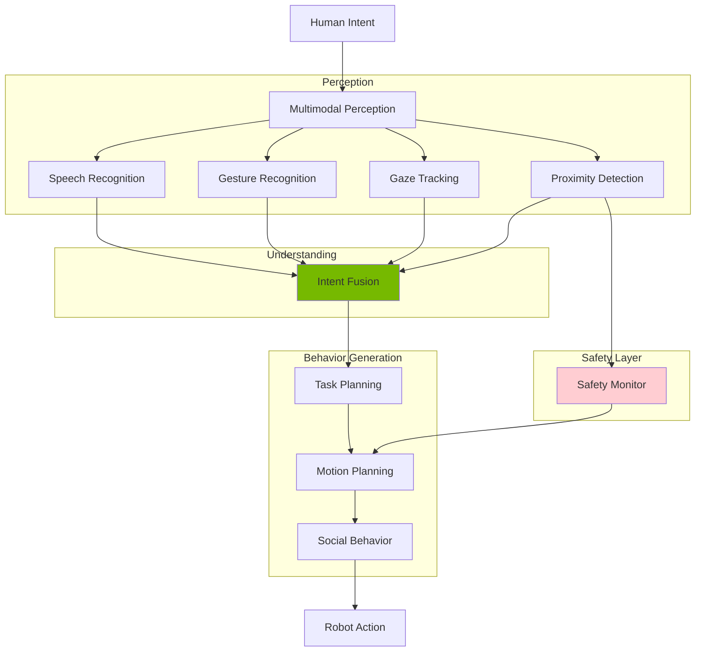

# Chapter 22: Natural Human-Robot Interaction Design

<!-- DIAGRAM: id="ch22-hri" type="architecture" format="mermaid"
     description="Human-robot interaction architecture" -->



## Learning Objectives

By the end of this chapter, you will be able to:

1. **Apply social robotics principles** to humanoid design
2. **Implement gesture and intent recognition** systems
3. **Design safe behaviors** for human proximity
4. **Create natural interaction flows** with multimodal feedback
5. **Evaluate HRI effectiveness** with user studies

## Prerequisites

Before starting this chapter, ensure you have:

- Completed Chapters 19-21
- Understanding of perception systems (Module 4)
- Familiarity with state machines
- Basic knowledge of human factors

## Introduction

Humanoid robots are designed to work alongside humans. Their human-like form creates expectations of human-like behavior. Poor interaction design leads to:

- **Uncanny valley effects**: Discomfort from almost-human behavior
- **Misunderstood intentions**: Confusion about robot goals
- **Safety incidents**: Collisions and injuries
- **Rejection**: Users refusing to work with the robot

This chapter covers the principles and practices of effective HRI.

## Social Robotics Principles

### Proxemics and Personal Space

```python
import numpy as np
from enum import Enum
from dataclasses import dataclass
from typing import List, Optional

class ProxemicZone(Enum):
    """Edward Hall's proxemic zones."""
    INTIMATE = "intimate"      # 0-0.45m
    PERSONAL = "personal"      # 0.45-1.2m
    SOCIAL = "social"          # 1.2-3.6m
    PUBLIC = "public"          # 3.6m+

@dataclass
class ProxemicConfig:
    """Configuration for proxemic behavior."""
    intimate_distance: float = 0.45
    personal_distance: float = 1.2
    social_distance: float = 3.6

    # Speed limits per zone (m/s)
    intimate_max_speed: float = 0.1
    personal_max_speed: float = 0.3
    social_max_speed: float = 0.5
    public_max_speed: float = 1.0

class ProxemicsManager:
    """Manage robot behavior based on human proximity."""

    def __init__(self, config: ProxemicConfig = None):
        self.config = config or ProxemicConfig()
        self.tracked_humans: List[dict] = []

    def update_humans(self, detections: List[dict]):
        """Update tracked human positions.

        Args:
            detections: List of {'id': int, 'position': np.ndarray}
        """
        self.tracked_humans = detections

    def get_zone(self, distance: float) -> ProxemicZone:
        """Determine proxemic zone from distance."""
        if distance < self.config.intimate_distance:
            return ProxemicZone.INTIMATE
        elif distance < self.config.personal_distance:
            return ProxemicZone.PERSONAL
        elif distance < self.config.social_distance:
            return ProxemicZone.SOCIAL
        else:
            return ProxemicZone.PUBLIC

    def get_closest_human(self, robot_position: np.ndarray) -> Optional[dict]:
        """Get closest human to robot."""
        if not self.tracked_humans:
            return None

        closest = None
        min_dist = float('inf')

        for human in self.tracked_humans:
            dist = np.linalg.norm(human['position'] - robot_position)
            if dist < min_dist:
                min_dist = dist
                closest = human

        if closest:
            closest['distance'] = min_dist
            closest['zone'] = self.get_zone(min_dist)

        return closest

    def get_max_speed(self, robot_position: np.ndarray) -> float:
        """Get maximum allowed speed based on nearest human."""
        closest = self.get_closest_human(robot_position)

        if closest is None:
            return self.config.public_max_speed

        zone = closest['zone']

        if zone == ProxemicZone.INTIMATE:
            return self.config.intimate_max_speed
        elif zone == ProxemicZone.PERSONAL:
            return self.config.personal_max_speed
        elif zone == ProxemicZone.SOCIAL:
            return self.config.social_max_speed
        else:
            return self.config.public_max_speed

    def get_approach_behavior(self, target_zone: ProxemicZone) -> dict:
        """Get behavior for approaching human to target zone."""
        behaviors = {
            ProxemicZone.INTIMATE: {
                'announce': True,
                'slow_approach': True,
                'maintain_gaze': True,
                'wait_for_permission': True
            },
            ProxemicZone.PERSONAL: {
                'announce': True,
                'slow_approach': True,
                'maintain_gaze': True,
                'wait_for_permission': False
            },
            ProxemicZone.SOCIAL: {
                'announce': False,
                'slow_approach': False,
                'maintain_gaze': False,
                'wait_for_permission': False
            }
        }
        return behaviors.get(target_zone, {})
```

### Gaze and Attention

```python
class GazeController:
    """Control robot gaze for natural interaction."""

    def __init__(self, head_controller):
        self.head = head_controller

        # Gaze targets
        self.current_target = None
        self.attention_queue = []

        # Timing parameters
        self.min_fixation_time = 0.5  # seconds
        self.max_fixation_time = 3.0
        self.saccade_speed = 2.0  # rad/s

    def look_at(self, target: np.ndarray, priority: int = 0):
        """Direct gaze to target position.

        Args:
            target: 3D world position to look at
            priority: Higher priority interrupts current gaze
        """
        self.attention_queue.append({
            'target': target,
            'priority': priority,
            'timestamp': time.time()
        })

        self._process_attention_queue()

    def _process_attention_queue(self):
        """Process attention queue by priority."""
        if not self.attention_queue:
            return

        # Sort by priority (descending)
        self.attention_queue.sort(key=lambda x: x['priority'], reverse=True)

        # Take highest priority
        next_target = self.attention_queue.pop(0)
        self.current_target = next_target['target']

        # Command head motion
        self._execute_gaze(self.current_target)

    def _execute_gaze(self, target: np.ndarray):
        """Execute gaze motion to target."""
        # Compute head angles for target
        head_angles = self._compute_head_angles(target)

        # Smooth trajectory
        self.head.move_to(head_angles, speed=self.saccade_speed)

    def _compute_head_angles(self, target: np.ndarray) -> np.ndarray:
        """Compute head pan/tilt for target position."""
        # Get vector from head to target
        head_pos = self.head.get_position()
        direction = target - head_pos
        direction = direction / np.linalg.norm(direction)

        # Pan angle (yaw)
        pan = np.arctan2(direction[1], direction[0])

        # Tilt angle (pitch)
        horizontal_dist = np.sqrt(direction[0]**2 + direction[1]**2)
        tilt = np.arctan2(direction[2], horizontal_dist)

        return np.array([pan, tilt])

    def mutual_gaze(self, human_position: np.ndarray, duration: float = 2.0):
        """Establish mutual gaze with human.

        Used during greetings, handoffs, and confirmations.
        """
        # Estimate eye position (above human position)
        eye_height = 0.15  # Approximate eye offset
        gaze_target = human_position + np.array([0, 0, eye_height])

        self.look_at(gaze_target, priority=5)

        # Hold gaze for duration
        # In practice, would use timer/callback

    def shared_attention(
        self,
        human_position: np.ndarray,
        object_position: np.ndarray
    ):
        """Establish shared attention on object.

        Look at object, then at human, then back to object.
        """
        # Look at object
        self.look_at(object_position, priority=3)
        # Schedule look at human
        # Schedule look back at object

    def idle_gaze_behavior(self):
        """Generate natural idle gaze behavior."""
        # Occasional saccades to points of interest
        # Blink simulation
        # Environmental scanning
        pass


class GestureGenerator:
    """Generate social gestures for humanoid."""

    def __init__(self, arm_controller, head_controller):
        self.arms = arm_controller
        self.head = head_controller

    def wave_greeting(self, target_position: np.ndarray):
        """Wave greeting gesture."""
        # Raise right hand
        wave_pose = np.array([0.5, -0.3, 0.5, 1.0, 0, 0, 0])  # Example

        # Look at target
        self.head.look_at(target_position)

        # Execute wave motion
        self.arms.move_right_to(wave_pose)

        # Wave back and forth
        for i in range(3):
            wave_pose[6] = 0.3 * np.sin(i * np.pi)
            self.arms.move_right_to(wave_pose)

    def point_at(self, target_position: np.ndarray):
        """Point at object or location."""
        # Compute pointing pose
        direction = target_position - self.arms.get_shoulder_position()
        direction = direction / np.linalg.norm(direction)

        # IK for extended arm in direction
        point_pose = self._compute_pointing_pose(direction)

        self.arms.move_right_to(point_pose)

        # Look at target
        self.head.look_at(target_position)

    def nod_yes(self, amplitude: float = 0.2, count: int = 2):
        """Nodding gesture for affirmation."""
        current = self.head.get_angles()

        for i in range(count):
            # Nod down
            self.head.move_to(current + np.array([0, amplitude]))
            # Nod up
            self.head.move_to(current - np.array([0, amplitude * 0.5]))

        # Return to neutral
        self.head.move_to(current)

    def shake_no(self, amplitude: float = 0.3, count: int = 2):
        """Head shake for negation."""
        current = self.head.get_angles()

        for i in range(count):
            # Turn left
            self.head.move_to(current + np.array([amplitude, 0]))
            # Turn right
            self.head.move_to(current - np.array([amplitude, 0]))

        self.head.move_to(current)

    def offer_handshake(self):
        """Offer hand for handshake."""
        handshake_pose = np.array([0.3, 0, 0.5, 0.8, 0, 0, 0])
        self.arms.move_right_to(handshake_pose)

    def _compute_pointing_pose(self, direction: np.ndarray) -> np.ndarray:
        """Compute arm pose for pointing in direction."""
        # Simplified - would use IK
        return np.zeros(7)
```

## Gesture Recognition

### Body Pose Recognition

```python
class GestureRecognizer:
    """Recognize human gestures from pose data."""

    def __init__(self):
        self.gesture_definitions = self._load_gesture_definitions()
        self.pose_history = []
        self.history_length = 30  # frames

    def _load_gesture_definitions(self) -> dict:
        """Load gesture templates."""
        return {
            'wave': {
                'type': 'dynamic',
                'keypoints': ['right_wrist', 'right_elbow'],
                'motion_pattern': 'oscillation',
                'duration_range': (0.5, 2.0)
            },
            'point': {
                'type': 'static',
                'condition': 'arm_extended',
                'keypoints': ['right_wrist', 'right_elbow', 'right_shoulder']
            },
            'stop': {
                'type': 'static',
                'condition': 'palm_forward',
                'keypoints': ['right_wrist', 'right_hand']
            },
            'come_here': {
                'type': 'dynamic',
                'motion_pattern': 'beckoning',
                'keypoints': ['right_hand', 'right_wrist']
            },
            'thumbs_up': {
                'type': 'static',
                'condition': 'thumb_extended_up',
                'keypoints': ['right_thumb', 'right_hand']
            }
        }

    def update(self, pose: dict) -> Optional[str]:
        """Update with new pose and check for gestures.

        Args:
            pose: Dictionary of keypoint positions

        Returns:
            Detected gesture name or None
        """
        self.pose_history.append(pose)
        if len(self.pose_history) > self.history_length:
            self.pose_history.pop(0)

        # Check each gesture definition
        for gesture_name, definition in self.gesture_definitions.items():
            if self._check_gesture(definition):
                return gesture_name

        return None

    def _check_gesture(self, definition: dict) -> bool:
        """Check if gesture matches definition."""
        if definition['type'] == 'static':
            return self._check_static_gesture(definition)
        else:
            return self._check_dynamic_gesture(definition)

    def _check_static_gesture(self, definition: dict) -> bool:
        """Check for static gesture in current pose."""
        if not self.pose_history:
            return False

        pose = self.pose_history[-1]
        condition = definition.get('condition', '')

        if condition == 'arm_extended':
            return self._is_arm_extended(pose, 'right')

        elif condition == 'palm_forward':
            return self._is_palm_forward(pose, 'right')

        elif condition == 'thumb_extended_up':
            return self._is_thumbs_up(pose, 'right')

        return False

    def _check_dynamic_gesture(self, definition: dict) -> bool:
        """Check for dynamic gesture in pose history."""
        if len(self.pose_history) < 10:
            return False

        pattern = definition.get('motion_pattern', '')
        keypoints = definition.get('keypoints', [])

        if pattern == 'oscillation':
            return self._detect_oscillation(keypoints)

        elif pattern == 'beckoning':
            return self._detect_beckoning(keypoints)

        return False

    def _is_arm_extended(self, pose: dict, side: str) -> bool:
        """Check if arm is extended (pointing)."""
        shoulder = pose.get(f'{side}_shoulder', np.zeros(3))
        elbow = pose.get(f'{side}_elbow', np.zeros(3))
        wrist = pose.get(f'{side}_wrist', np.zeros(3))

        # Check arm straightness
        upper_arm = elbow - shoulder
        forearm = wrist - elbow

        upper_len = np.linalg.norm(upper_arm)
        forearm_len = np.linalg.norm(forearm)

        if upper_len < 0.1 or forearm_len < 0.1:
            return False

        # Dot product for angle
        cos_angle = np.dot(upper_arm, forearm) / (upper_len * forearm_len)

        # Arm is extended if angle is close to 180 degrees
        return cos_angle > 0.8

    def _is_palm_forward(self, pose: dict, side: str) -> bool:
        """Check if palm is facing forward (stop gesture)."""
        # Would need hand orientation data
        # Simplified check based on wrist position
        wrist = pose.get(f'{side}_wrist', np.zeros(3))
        shoulder = pose.get(f'{side}_shoulder', np.zeros(3))

        # Hand should be raised and in front
        return wrist[2] > shoulder[2] and wrist[0] > shoulder[0]

    def _detect_oscillation(self, keypoints: List[str]) -> bool:
        """Detect oscillating motion (wave)."""
        if len(self.pose_history) < 15:
            return False

        # Get trajectory of first keypoint
        kp = keypoints[0]
        positions = [p.get(kp, np.zeros(3)) for p in self.pose_history[-15:]]

        # Check for oscillation in horizontal direction
        x_positions = [p[0] for p in positions]

        # Count zero crossings of derivative
        dx = np.diff(x_positions)
        sign_changes = np.sum(np.diff(np.sign(dx)) != 0)

        # Wave should have multiple direction changes
        return sign_changes >= 3

    def _detect_beckoning(self, keypoints: List[str]) -> bool:
        """Detect beckoning motion (come here)."""
        # Check for repeated inward motion
        return False  # Simplified

    def _is_thumbs_up(self, pose: dict, side: str) -> bool:
        """Check for thumbs up gesture."""
        # Would need detailed hand tracking
        return False


class IntentRecognizer:
    """Recognize human intent from multimodal signals."""

    def __init__(self):
        self.gesture_recognizer = GestureRecognizer()
        self.speech_intent = None
        self.gaze_target = None

    def update(
        self,
        pose: Optional[dict] = None,
        speech: Optional[str] = None,
        gaze: Optional[np.ndarray] = None
    ) -> dict:
        """Update with multimodal inputs and infer intent.

        Returns:
            Inferred intent with confidence
        """
        intent = {
            'action': None,
            'target': None,
            'confidence': 0.0
        }

        # Process gesture
        gesture = None
        if pose:
            gesture = self.gesture_recognizer.update(pose)

        # Process speech
        if speech:
            self.speech_intent = self._parse_speech_intent(speech)

        # Process gaze
        if gaze is not None:
            self.gaze_target = gaze

        # Fuse modalities
        intent = self._fuse_modalities(gesture, self.speech_intent, self.gaze_target)

        return intent

    def _parse_speech_intent(self, text: str) -> dict:
        """Parse speech to intent."""
        # Simple keyword matching - would use NLU in practice
        intents = {
            'come': {'action': 'approach', 'confidence': 0.8},
            'stop': {'action': 'stop', 'confidence': 0.9},
            'help': {'action': 'assist', 'confidence': 0.7},
            'give': {'action': 'handoff', 'confidence': 0.8},
            'take': {'action': 'receive', 'confidence': 0.8},
            'follow': {'action': 'follow', 'confidence': 0.8}
        }

        text_lower = text.lower()
        for keyword, intent in intents.items():
            if keyword in text_lower:
                return intent

        return {'action': None, 'confidence': 0.0}

    def _fuse_modalities(
        self,
        gesture: Optional[str],
        speech: Optional[dict],
        gaze: Optional[np.ndarray]
    ) -> dict:
        """Fuse multiple modalities into unified intent."""
        candidates = []

        # Gesture contributes
        if gesture:
            gesture_mapping = {
                'wave': {'action': 'greet', 'confidence': 0.7},
                'point': {'action': 'attend', 'confidence': 0.6},
                'stop': {'action': 'stop', 'confidence': 0.9},
                'come_here': {'action': 'approach', 'confidence': 0.8},
                'thumbs_up': {'action': 'confirm', 'confidence': 0.7}
            }
            if gesture in gesture_mapping:
                candidates.append(gesture_mapping[gesture])

        # Speech contributes
        if speech and speech.get('action'):
            candidates.append(speech)

        # Select highest confidence
        if not candidates:
            return {'action': None, 'target': gaze, 'confidence': 0.0}

        best = max(candidates, key=lambda x: x.get('confidence', 0))

        # Boost confidence if modalities agree
        if len(candidates) > 1:
            actions = [c.get('action') for c in candidates]
            if actions[0] == actions[1]:
                best['confidence'] = min(1.0, best['confidence'] * 1.3)

        # Add gaze as target
        best['target'] = gaze

        return best
```

## Safety Systems

### Human-Aware Motion Planning

```python
class SafetyController:
    """Safety controller for human-robot coexistence."""

    def __init__(self, proxemics: ProxemicsManager):
        self.proxemics = proxemics

        # Safety parameters
        self.emergency_stop_distance = 0.3  # meters
        self.slowdown_distance = 1.0
        self.max_force = 50.0  # Newtons
        self.max_power = 80.0  # Watts

    def check_motion_safety(
        self,
        planned_trajectory: np.ndarray,
        human_positions: List[np.ndarray]
    ) -> dict:
        """Check if planned trajectory is safe.

        Returns:
            Safety assessment with modified trajectory if needed
        """
        result = {
            'safe': True,
            'modified_trajectory': None,
            'warning': None
        }

        # Check each point in trajectory
        for i, robot_pos in enumerate(planned_trajectory):
            for human_pos in human_positions:
                dist = np.linalg.norm(robot_pos - human_pos)

                if dist < self.emergency_stop_distance:
                    result['safe'] = False
                    result['warning'] = 'emergency_stop_required'
                    return result

                elif dist < self.slowdown_distance:
                    # Modify trajectory to slow down
                    result['modified_trajectory'] = self._slow_down_trajectory(
                        planned_trajectory, i
                    )
                    result['warning'] = 'slowed_for_human'

        return result

    def _slow_down_trajectory(
        self,
        trajectory: np.ndarray,
        slow_start_idx: int
    ) -> np.ndarray:
        """Slow down trajectory from given index."""
        modified = trajectory.copy()

        # Reduce velocity by stretching time
        n_points = len(trajectory) - slow_start_idx

        if n_points < 2:
            return modified

        # Insert intermediate points
        slow_factor = 2.0
        new_n_points = int(n_points * slow_factor)

        slow_portion = trajectory[slow_start_idx:]
        interpolated = np.zeros((new_n_points, 3))

        for i in range(new_n_points):
            alpha = i / (new_n_points - 1)
            idx = alpha * (n_points - 1)
            idx_low = int(idx)
            idx_high = min(idx_low + 1, n_points - 1)
            frac = idx - idx_low
            interpolated[i] = (1 - frac) * slow_portion[idx_low] + frac * slow_portion[idx_high]

        modified = np.vstack([trajectory[:slow_start_idx], interpolated])

        return modified

    def apply_force_limits(
        self,
        commanded_force: np.ndarray,
        velocity: np.ndarray
    ) -> np.ndarray:
        """Apply force and power limits for safety."""
        force_magnitude = np.linalg.norm(commanded_force)

        # Force limit
        if force_magnitude > self.max_force:
            commanded_force = commanded_force * (self.max_force / force_magnitude)

        # Power limit
        power = np.abs(np.dot(commanded_force, velocity))
        if power > self.max_power:
            scale = self.max_power / power
            commanded_force = commanded_force * scale

        return commanded_force

    def collision_response(self, contact_force: float) -> str:
        """Determine response to detected collision."""
        if contact_force > self.max_force:
            return 'emergency_stop'
        elif contact_force > self.max_force * 0.5:
            return 'retreat'
        else:
            return 'compliant_motion'


class ComplianceController:
    """Impedance/compliance control for safe interaction."""

    def __init__(
        self,
        stiffness: np.ndarray = None,
        damping: np.ndarray = None
    ):
        # Default: low stiffness for safety
        self.K = stiffness if stiffness is not None else np.diag([100, 100, 100, 10, 10, 10])
        self.D = damping if damping is not None else np.diag([20, 20, 20, 2, 2, 2])

        # Adaptation parameters
        self.min_stiffness = 50
        self.max_stiffness = 500

    def compute_wrench(
        self,
        pose_error: np.ndarray,
        velocity: np.ndarray
    ) -> np.ndarray:
        """Compute compliant wrench from pose error.

        wrench = -K * pose_error - D * velocity
        """
        return -self.K @ pose_error - self.D @ velocity

    def adapt_stiffness(self, human_distance: float):
        """Adapt stiffness based on human proximity."""
        # Reduce stiffness when humans are close
        if human_distance < 0.5:
            scale = human_distance / 0.5
            self.K = np.diag([self.min_stiffness * scale] * 6)
        elif human_distance < 1.0:
            alpha = (human_distance - 0.5) / 0.5
            stiffness = self.min_stiffness + alpha * (self.max_stiffness - self.min_stiffness)
            self.K = np.diag([stiffness] * 6)
        else:
            self.K = np.diag([self.max_stiffness] * 6)
```

## Interaction Flows

### State Machine for Interaction

```python
from enum import Enum, auto
from typing import Callable

class InteractionState(Enum):
    IDLE = auto()
    DETECTING_HUMAN = auto()
    GREETING = auto()
    LISTENING = auto()
    PROCESSING = auto()
    EXECUTING = auto()
    HANDOFF = auto()
    FAREWELL = auto()

class InteractionStateMachine:
    """State machine for structured human-robot interaction."""

    def __init__(self, robot_controller):
        self.robot = robot_controller
        self.state = InteractionState.IDLE
        self.context = {}

        # State handlers
        self.handlers = {
            InteractionState.IDLE: self._handle_idle,
            InteractionState.DETECTING_HUMAN: self._handle_detecting,
            InteractionState.GREETING: self._handle_greeting,
            InteractionState.LISTENING: self._handle_listening,
            InteractionState.PROCESSING: self._handle_processing,
            InteractionState.EXECUTING: self._handle_executing,
            InteractionState.HANDOFF: self._handle_handoff,
            InteractionState.FAREWELL: self._handle_farewell
        }

    def update(self, perception_data: dict):
        """Update state machine with new perception data."""
        handler = self.handlers.get(self.state)
        if handler:
            next_state = handler(perception_data)
            if next_state != self.state:
                self._transition_to(next_state)

    def _transition_to(self, new_state: InteractionState):
        """Execute state transition."""
        print(f"Transitioning: {self.state.name} -> {new_state.name}")

        # Exit actions
        self._exit_state(self.state)

        # Update state
        self.state = new_state

        # Entry actions
        self._enter_state(new_state)

    def _enter_state(self, state: InteractionState):
        """Execute entry actions for state."""
        if state == InteractionState.GREETING:
            self.robot.gesture.wave_greeting(self.context.get('human_position'))
            self.robot.speak("Hello! How can I help you?")

        elif state == InteractionState.LISTENING:
            self.robot.start_speech_recognition()
            self.robot.gaze.mutual_gaze(self.context.get('human_position'))

        elif state == InteractionState.FAREWELL:
            self.robot.speak("Goodbye!")
            self.robot.gesture.wave_greeting(self.context.get('human_position'))

    def _exit_state(self, state: InteractionState):
        """Execute exit actions for state."""
        if state == InteractionState.LISTENING:
            self.robot.stop_speech_recognition()

    def _handle_idle(self, data: dict) -> InteractionState:
        """Handle idle state."""
        if data.get('human_detected'):
            self.context['human_position'] = data['human_position']
            return InteractionState.DETECTING_HUMAN
        return InteractionState.IDLE

    def _handle_detecting(self, data: dict) -> InteractionState:
        """Handle human detection."""
        if not data.get('human_detected'):
            return InteractionState.IDLE

        # Check if human is approaching
        distance = data.get('human_distance', float('inf'))

        if distance < 2.0:
            # Human in social distance, greet
            return InteractionState.GREETING

        return InteractionState.DETECTING_HUMAN

    def _handle_greeting(self, data: dict) -> InteractionState:
        """Handle greeting state."""
        # Wait for greeting animation to complete
        if self.robot.is_animation_complete():
            return InteractionState.LISTENING
        return InteractionState.GREETING

    def _handle_listening(self, data: dict) -> InteractionState:
        """Handle listening for commands."""
        if data.get('speech_detected'):
            self.context['command'] = data['speech_text']
            return InteractionState.PROCESSING

        if data.get('human_left'):
            return InteractionState.IDLE

        return InteractionState.LISTENING

    def _handle_processing(self, data: dict) -> InteractionState:
        """Handle command processing."""
        command = self.context.get('command', '')

        # Parse command
        if 'bring' in command.lower() or 'fetch' in command.lower():
            self.context['task'] = 'fetch'
            return InteractionState.EXECUTING

        elif 'goodbye' in command.lower() or 'bye' in command.lower():
            return InteractionState.FAREWELL

        else:
            self.robot.speak("I didn't understand. Could you repeat?")
            return InteractionState.LISTENING

    def _handle_executing(self, data: dict) -> InteractionState:
        """Handle task execution."""
        task = self.context.get('task')

        if task == 'fetch':
            if self.robot.is_task_complete():
                return InteractionState.HANDOFF

        return InteractionState.EXECUTING

    def _handle_handoff(self, data: dict) -> InteractionState:
        """Handle object handoff."""
        if self.robot.handoff_complete():
            return InteractionState.LISTENING
        return InteractionState.HANDOFF

    def _handle_farewell(self, data: dict) -> InteractionState:
        """Handle farewell."""
        if self.robot.is_animation_complete():
            return InteractionState.IDLE
        return InteractionState.FAREWELL
```

## ROS 2 Integration

### HRI Node

```python
#!/usr/bin/env python3
"""ROS 2 node for human-robot interaction."""

import rclpy
from rclpy.node import Node
from geometry_msgs.msg import PoseArray, Pose
from std_msgs.msg import String
from sensor_msgs.msg import JointState

import numpy as np

class HRINode(Node):
    def __init__(self):
        super().__init__('hri_controller')

        # Initialize components
        self.proxemics = ProxemicsManager()
        self.gesture_recognizer = GestureRecognizer()
        self.intent_recognizer = IntentRecognizer()
        self.safety = SafetyController(self.proxemics)

        # Subscribers
        self.human_sub = self.create_subscription(
            PoseArray, '/detected_humans', self.human_callback, 10)
        self.speech_sub = self.create_subscription(
            String, '/speech_text', self.speech_callback, 10)
        self.pose_sub = self.create_subscription(
            PoseArray, '/human_pose', self.pose_callback, 10)

        # Publishers
        self.gesture_pub = self.create_publisher(
            String, '/robot_gesture', 10)
        self.speech_pub = self.create_publisher(
            String, '/robot_speech', 10)
        self.safety_pub = self.create_publisher(
            String, '/safety_status', 10)

        # State machine
        self.state = InteractionState.IDLE

        # Control timer
        self.timer = self.create_timer(0.1, self.control_loop)

        self.get_logger().info('HRI node initialized')

    def human_callback(self, msg: PoseArray):
        """Update tracked humans."""
        humans = []
        for pose in msg.poses:
            humans.append({
                'position': np.array([
                    pose.position.x,
                    pose.position.y,
                    pose.position.z
                ])
            })
        self.proxemics.update_humans(humans)

    def speech_callback(self, msg: String):
        """Handle speech input."""
        intent = self.intent_recognizer.update(speech=msg.data)

        if intent['action']:
            self.get_logger().info(f"Detected intent: {intent['action']}")
            self._handle_intent(intent)

    def pose_callback(self, msg: PoseArray):
        """Handle human pose for gesture recognition."""
        # Convert to keypoint dict
        pose_dict = self._poses_to_keypoints(msg)

        gesture = self.gesture_recognizer.update(pose_dict)

        if gesture:
            self.get_logger().info(f"Detected gesture: {gesture}")
            self._handle_gesture(gesture)

    def control_loop(self):
        """Main control loop."""
        robot_pos = np.array([0, 0, 0])  # Would get from robot state

        # Check safety
        max_speed = self.proxemics.get_max_speed(robot_pos)

        # Publish safety status
        closest = self.proxemics.get_closest_human(robot_pos)
        if closest:
            status = String()
            status.data = f"Zone: {closest['zone'].value}, Max speed: {max_speed:.2f}"
            self.safety_pub.publish(status)

    def _handle_intent(self, intent: dict):
        """Handle recognized intent."""
        action = intent.get('action')

        if action == 'approach':
            self._execute_approach(intent.get('target'))
        elif action == 'stop':
            self._execute_stop()
        elif action == 'greet':
            self._execute_greeting()

    def _handle_gesture(self, gesture: str):
        """Handle recognized gesture."""
        if gesture == 'wave':
            # Respond with wave
            msg = String()
            msg.data = 'wave'
            self.gesture_pub.publish(msg)

        elif gesture == 'stop':
            self._execute_stop()

    def _execute_approach(self, target: np.ndarray):
        """Execute approach behavior."""
        behavior = self.proxemics.get_approach_behavior(ProxemicZone.PERSONAL)

        if behavior.get('announce'):
            msg = String()
            msg.data = "I'm approaching you now."
            self.speech_pub.publish(msg)

    def _execute_stop(self):
        """Execute stop behavior."""
        self.get_logger().warn('Emergency stop requested')

    def _execute_greeting(self):
        """Execute greeting behavior."""
        msg = String()
        msg.data = 'wave'
        self.gesture_pub.publish(msg)

        speech = String()
        speech.data = "Hello! How can I help you?"
        self.speech_pub.publish(speech)

    def _poses_to_keypoints(self, msg: PoseArray) -> dict:
        """Convert PoseArray to keypoint dictionary."""
        # Simplified - would map poses to body keypoints
        return {}

def main(args=None):
    rclpy.init(args=args)
    node = HRINode()
    rclpy.spin(node)
    node.destroy_node()
    rclpy.shutdown()

if __name__ == '__main__':
    main()
```

## Hands-On Exercise

### Exercise 1: Proxemics

1. Implement dynamic speed limiting based on proximity
2. Visualize proxemic zones in RViz
3. Test approach behavior with simulated human

### Exercise 2: Gesture Interaction

1. Implement wave detection
2. Add pointing gesture recognition
3. Create gesture-command mapping

### Exercise 3: Full Interaction

1. Build greeting interaction flow
2. Implement task request dialogue
3. Add handoff sequence

## Key Concepts

| Term | Definition |
|------|------------|
| **Proxemics** | Study of human spatial behavior and distance |
| **Mutual Gaze** | Eye contact between human and robot |
| **Shared Attention** | Joint focus on same object |
| **Compliance** | Yielding to external forces for safety |
| **Intent Recognition** | Inferring human goals from behavior |

## Chapter Summary

In this chapter, you learned:

1. **Social principles**: Proxemics, gaze, and gesture for natural interaction.

2. **Perception**: Gesture and intent recognition from multimodal input.

3. **Safety**: Force limiting, compliance, and human-aware planning.

4. **Interaction flows**: State machines for structured dialogue.

5. **Integration**: ROS 2 implementation of HRI systems.

## What's Next

Congratulations on completing Module 5! You now have comprehensive skills in humanoid intelligence.

In [Module 6: Capstone](../module-6-capstone/), you'll integrate everything learned into a complete autonomous humanoid system.

## Further Reading

- [Human-Robot Interaction (Goodrich & Schultz)](https://www.nowpublishers.com/article/Details/HCI-011) - HRI survey
- [Social Robotics](https://link.springer.com/book/10.1007/978-3-319-02675-6) - Social robot design
- [ISO 10218](https://www.iso.org/standard/51330.html) - Robot safety standards
- [Pepper Robot](https://www.aldebaran.com/en/pepper) - Social humanoid platform
