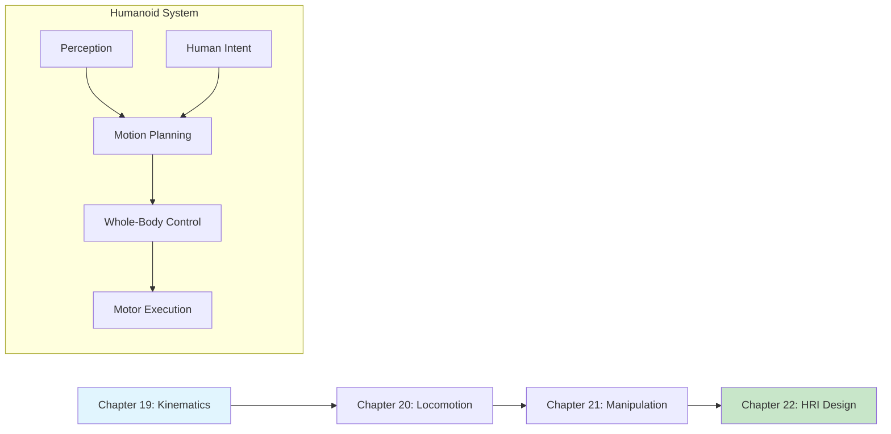

# Module 5: Humanoid Intelligence & Interaction

**Focus**: Humanoid-specific capabilities and human interaction

<!-- DIAGRAM: id="module-5-overview" type="architecture" format="mermaid"
     description="Humanoid intelligence architecture" -->



## Module Overview

Humanoid robots present unique challenges that differ fundamentally from wheeled or fixed-base robots. Their human-like morphology enables them to operate in environments designed for humans, but it also demands sophisticated control of balance, locomotion, and manipulation.

This module teaches you the core skills needed to program humanoid robots: from mathematical foundations of kinematics to natural human-robot interaction.

**Key Technologies Covered**: Inverse Kinematics, ZMP Control, Gait Generation, Grasp Planning, Social Robotics

:::note Simulation-First Approach
All examples in this module run in simulation (Gazebo/Isaac Sim). The skills transfer directly to physical humanoid platforms when available.
:::

## Why Humanoid-Specific Skills?

| Challenge | Wheeled Robots | Humanoid Robots |
|-----------|---------------|-----------------|
| **Balance** | Inherently stable | Active balance required |
| **Locomotion** | Continuous motion | Discrete foot placement |
| **Manipulation** | Often single arm | Dual-arm coordination |
| **Workspace** | Ground level | Full human reach |
| **Interaction** | Functional | Social and natural |

## Learning Path

This module teaches you to:

1. **Model humanoid kinematics** with forward/inverse transforms
2. **Generate stable gaits** using ZMP and pendulum models
3. **Plan grasps** for dexterous manipulation
4. **Design interactions** that feel natural to humans

## Chapters in This Module

### [Chapter 19: Humanoid Kinematics & Dynamics](./ch19-kinematics-dynamics)

Master the mathematical foundations of humanoid motion: kinematic chains, Jacobians, and dynamic equations.

**Learning Objectives**:
- Compute forward and inverse kinematics
- Derive and use Jacobian matrices
- Understand humanoid dynamics equations
- Implement IK solvers for humanoid arms

---

### [Chapter 20: Bipedal Locomotion & Balance Control](./ch20-bipedal-locomotion)

Learn to generate stable walking gaits and maintain balance during dynamic motion.

**Learning Objectives**:
- Understand ZMP and stability criteria
- Implement inverted pendulum models
- Generate walking gait patterns
- Design push recovery strategies

---

### [Chapter 21: Manipulation & Grasping with Humanoid Hands](./ch21-manipulation-grasping)

Master grasp planning and dexterous manipulation for humanoid hands.

**Learning Objectives**:
- Plan grasps for various object geometries
- Implement force-closure analysis
- Control dexterous multi-finger hands
- Coordinate dual-arm manipulation

---

### [Chapter 22: Natural Human-Robot Interaction Design](./ch22-hri-design)

Design interaction patterns that make humanoid robots intuitive and safe for humans.

**Learning Objectives**:
- Apply social robotics principles
- Implement gesture recognition
- Design safety-aware behaviors
- Create natural interaction flows

## Prerequisites

Before starting this module, you should have:

- Completed Modules 1-4
- Understanding of linear algebra (matrices, transforms)
- Familiarity with control systems basics
- Experience with ROS 2 and simulation

## Key Humanoid Platforms

| Platform | Organization | DOF | Key Features |
|----------|--------------|-----|--------------|
| **Atlas** | Boston Dynamics | 28 | Dynamic locomotion, hydraulic |
| **Optimus** | Tesla | 28 | Dexterous hands, FSD integration |
| **Digit** | Agility Robotics | 30 | Package delivery, electric |
| **H1** | Unitree | 19 | Open platform, affordable |
| **Figure 01** | Figure AI | 42 | Dexterous manipulation |

## Development Environment

This module uses:

| Tool | Version | Purpose |
|------|---------|---------|
| **ROS 2** | Humble | Control framework |
| **MoveIt 2** | Latest | Motion planning |
| **Gazebo** | Fortress+ | Physics simulation |
| **Isaac Sim** | 2023.1+ | Advanced simulation |
| **PyBullet** | Latest | Rapid prototyping |

## What You'll Build

By the end of this module, you will have:

1. Inverse kinematics solver for humanoid arms
2. Walking gait generator with ZMP control
3. Grasp planning system for manipulation
4. Social interaction behavior framework
5. Integrated humanoid control pipeline

## Module Timeline

| Chapter | Estimated Time | Difficulty |
|---------|---------------|------------|
| Chapter 19: Kinematics & Dynamics | 4 hours | Intermediate |
| Chapter 20: Bipedal Locomotion | 4 hours | Advanced |
| Chapter 21: Manipulation & Grasping | 4 hours | Advanced |
| Chapter 22: HRI Design | 3 hours | Intermediate |

**Total Module Time**: ~15 hours

## Code Repository

All code examples for this module are in:

```bash
code-examples/module-5-humanoid/
├── ch19_kinematics/
├── ch20_locomotion/
├── ch21_manipulation/
└── ch22_hri/
```

:::tip Mathematical Foundations
This module involves more mathematics than previous modules. We provide Python implementations of all formulas, but reviewing linear algebra basics will help.
:::
