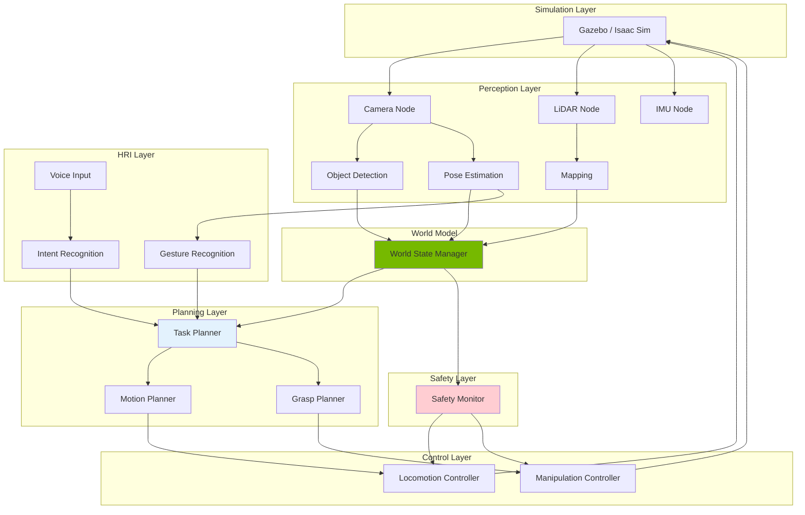

# Chapter 23: Capstone Architecture & System Design

<!-- DIAGRAM: id="ch23-system-arch" type="architecture" format="mermaid"
     description="Complete system architecture for autonomous humanoid" -->



## Learning Objectives

By the end of this chapter, you will be able to:

1. **Design modular system architecture** with clear interfaces
2. **Implement ROS 2 node graph** for autonomous operation
3. **Integrate perception, planning, and control** pipelines
4. **Build a complete launch system** for the humanoid
5. **Run the full system** in Gazebo and Isaac Sim

## Prerequisites

Before starting this chapter, ensure you have:

- Completed Modules 0-5
- Working ROS 2 Humble installation
- Gazebo Fortress or Harmonic installed
- Isaac Sim 2023.1+ (optional for advanced simulation)
- Docker for environment management

## Introduction

Building an autonomous humanoid requires integrating many subsystems that you've learned throughout this book. The challenge is not just making each component work, but making them work together reliably.

Key integration challenges:
- **Timing**: Coordinating different update rates
- **Data flow**: Managing information between nodes
- **Failure handling**: Graceful degradation
- **State consistency**: Keeping world model coherent

## System Architecture

### Architecture Principles

```python
"""
Autonomous Humanoid System Design Principles:

1. MODULARITY: Each capability is a separate node
2. ABSTRACTION: Clear interfaces between layers
3. REDUNDANCY: Multiple perception sources
4. SAFETY-FIRST: Safety layer can override all actions
5. SIMULATION-FIRST: Everything runs in sim without hardware
"""

# Layer definitions
LAYERS = {
    "simulation": {
        "purpose": "Physics and sensor simulation",
        "components": ["gazebo", "isaac_sim"],
        "update_rate": "1000 Hz (physics)"
    },
    "perception": {
        "purpose": "Sense and understand environment",
        "components": ["camera", "lidar", "imu", "object_detection"],
        "update_rate": "30-60 Hz"
    },
    "world_model": {
        "purpose": "Maintain consistent world state",
        "components": ["state_manager", "object_tracker", "map"],
        "update_rate": "30 Hz"
    },
    "planning": {
        "purpose": "Decide what to do and how",
        "components": ["task_planner", "motion_planner", "grasp_planner"],
        "update_rate": "10 Hz (task), 50 Hz (motion)"
    },
    "control": {
        "purpose": "Execute planned motions",
        "components": ["locomotion", "manipulation", "balance"],
        "update_rate": "200-1000 Hz"
    },
    "safety": {
        "purpose": "Ensure safe operation",
        "components": ["collision_monitor", "force_limiter", "watchdog"],
        "update_rate": "1000 Hz"
    },
    "hri": {
        "purpose": "Human interaction",
        "components": ["speech", "gesture", "intent"],
        "update_rate": "10-30 Hz"
    }
}
```

### ROS 2 Node Structure

```python
#!/usr/bin/env python3
"""System manager node - coordinates all subsystems."""

import rclpy
from rclpy.node import Node
from rclpy.executors import MultiThreadedExecutor
from rclpy.callback_groups import ReentrantCallbackGroup

from std_msgs.msg import String
from std_srvs.srv import Trigger
from geometry_msgs.msg import PoseStamped

from enum import Enum, auto

class SystemState(Enum):
    INITIALIZING = auto()
    IDLE = auto()
    NAVIGATING = auto()
    MANIPULATING = auto()
    INTERACTING = auto()
    ERROR = auto()
    EMERGENCY_STOP = auto()

class SystemManagerNode(Node):
    """Central coordinator for autonomous humanoid system."""

    def __init__(self):
        super().__init__('system_manager')

        # Callback groups for parallel execution
        self.timer_group = ReentrantCallbackGroup()
        self.service_group = ReentrantCallbackGroup()

        # System state
        self.state = SystemState.INITIALIZING
        self.subsystem_status = {}

        # Publishers
        self.state_pub = self.create_publisher(
            String, '/system/state', 10)
        self.command_pub = self.create_publisher(
            String, '/system/command', 10)

        # Subscribers
        self.create_subscription(
            String, '/perception/status', self.perception_status_cb, 10)
        self.create_subscription(
            String, '/planning/status', self.planning_status_cb, 10)
        self.create_subscription(
            String, '/control/status', self.control_status_cb, 10)
        self.create_subscription(
            String, '/safety/status', self.safety_status_cb, 10)
        self.create_subscription(
            String, '/hri/intent', self.intent_cb, 10)

        # Services
        self.create_service(
            Trigger, '/system/start', self.start_system_cb,
            callback_group=self.service_group)
        self.create_service(
            Trigger, '/system/stop', self.stop_system_cb,
            callback_group=self.service_group)

        # Main control loop
        self.create_timer(
            0.1, self.control_loop, callback_group=self.timer_group)

        # Health check
        self.create_timer(
            1.0, self.health_check, callback_group=self.timer_group)

        self.get_logger().info('System Manager initialized')

    def control_loop(self):
        """Main control loop - state machine execution."""
        if self.state == SystemState.INITIALIZING:
            if self._all_subsystems_ready():
                self._transition_to(SystemState.IDLE)

        elif self.state == SystemState.IDLE:
            # Wait for commands
            pass

        elif self.state == SystemState.NAVIGATING:
            # Monitor navigation progress
            if self._navigation_complete():
                self._transition_to(SystemState.IDLE)

        elif self.state == SystemState.MANIPULATING:
            # Monitor manipulation progress
            if self._manipulation_complete():
                self._transition_to(SystemState.IDLE)

        elif self.state == SystemState.ERROR:
            # Attempt recovery
            self._attempt_recovery()

        # Publish state
        msg = String()
        msg.data = self.state.name
        self.state_pub.publish(msg)

    def health_check(self):
        """Periodic health check of all subsystems."""
        for subsystem, status in self.subsystem_status.items():
            if status.get('last_update', 0) < self.get_clock().now().seconds_nanoseconds()[0] - 5:
                self.get_logger().warn(f'{subsystem} not responding')
                if subsystem == 'safety':
                    self._transition_to(SystemState.EMERGENCY_STOP)

    def intent_cb(self, msg: String):
        """Handle human intent commands."""
        intent = msg.data

        if self.state != SystemState.IDLE:
            self.get_logger().info(f'Ignoring intent {intent} - system busy')
            return

        if 'navigate' in intent:
            self._start_navigation()
        elif 'fetch' in intent:
            self._start_fetch_task()
        elif 'stop' in intent:
            self._transition_to(SystemState.IDLE)

    def _transition_to(self, new_state: SystemState):
        """Execute state transition."""
        self.get_logger().info(f'State: {self.state.name} -> {new_state.name}')
        self.state = new_state

    def _all_subsystems_ready(self) -> bool:
        """Check if all subsystems are ready."""
        required = ['perception', 'planning', 'control', 'safety']
        for sub in required:
            if sub not in self.subsystem_status:
                return False
            if self.subsystem_status[sub].get('status') != 'ready':
                return False
        return True

    def _start_navigation(self):
        """Start navigation task."""
        self._transition_to(SystemState.NAVIGATING)
        cmd = String()
        cmd.data = 'start_navigation'
        self.command_pub.publish(cmd)

    def _start_fetch_task(self):
        """Start fetch task."""
        self._transition_to(SystemState.MANIPULATING)
        cmd = String()
        cmd.data = 'start_fetch'
        self.command_pub.publish(cmd)

    # Status callbacks
    def perception_status_cb(self, msg):
        self.subsystem_status['perception'] = {'status': msg.data, 'last_update': self.get_clock().now().seconds_nanoseconds()[0]}

    def planning_status_cb(self, msg):
        self.subsystem_status['planning'] = {'status': msg.data, 'last_update': self.get_clock().now().seconds_nanoseconds()[0]}

    def control_status_cb(self, msg):
        self.subsystem_status['control'] = {'status': msg.data, 'last_update': self.get_clock().now().seconds_nanoseconds()[0]}

    def safety_status_cb(self, msg):
        self.subsystem_status['safety'] = {'status': msg.data, 'last_update': self.get_clock().now().seconds_nanoseconds()[0]}

    def start_system_cb(self, request, response):
        response.success = True
        response.message = 'System started'
        return response

    def stop_system_cb(self, request, response):
        self._transition_to(SystemState.IDLE)
        response.success = True
        response.message = 'System stopped'
        return response

    def _navigation_complete(self): return False
    def _manipulation_complete(self): return False
    def _attempt_recovery(self): pass
```

## Perception Pipeline

### Integrated Perception Node

```python
#!/usr/bin/env python3
"""Unified perception node for autonomous humanoid."""

import rclpy
from rclpy.node import Node
from sensor_msgs.msg import Image, PointCloud2, Imu
from geometry_msgs.msg import PoseArray, Pose
from std_msgs.msg import String
from vision_msgs.msg import Detection3DArray
from cv_bridge import CvBridge

import numpy as np
import cv2

class PerceptionNode(Node):
    """Integrated perception for humanoid robot."""

    def __init__(self):
        super().__init__('perception')

        self.bridge = CvBridge()

        # Perception state
        self.detected_objects = []
        self.detected_humans = []
        self.scene_understanding = {}

        # Subscribers
        self.create_subscription(
            Image, '/camera/color/image_raw', self.image_cb, 10)
        self.create_subscription(
            Image, '/camera/depth/image_raw', self.depth_cb, 10)
        self.create_subscription(
            PointCloud2, '/lidar/points', self.lidar_cb, 10)
        self.create_subscription(
            Imu, '/imu/data', self.imu_cb, 10)

        # Publishers
        self.objects_pub = self.create_publisher(
            Detection3DArray, '/perception/objects', 10)
        self.humans_pub = self.create_publisher(
            PoseArray, '/perception/humans', 10)
        self.status_pub = self.create_publisher(
            String, '/perception/status', 10)

        # Processing timer
        self.create_timer(0.033, self.process_perception)  # 30 Hz

        # Publish ready status
        self.create_timer(1.0, self.publish_status)

        self.get_logger().info('Perception node initialized')

    def image_cb(self, msg: Image):
        """Process RGB image."""
        try:
            cv_image = self.bridge.imgmsg_to_cv2(msg, 'bgr8')
            self._detect_objects(cv_image)
            self._detect_humans(cv_image)
        except Exception as e:
            self.get_logger().error(f'Image processing error: {e}')

    def depth_cb(self, msg: Image):
        """Process depth image."""
        try:
            depth = self.bridge.imgmsg_to_cv2(msg, 'passthrough')
            self._update_depth_info(depth)
        except Exception as e:
            self.get_logger().error(f'Depth processing error: {e}')

    def lidar_cb(self, msg: PointCloud2):
        """Process LiDAR point cloud."""
        # Extract obstacle information
        pass

    def imu_cb(self, msg: Imu):
        """Process IMU data."""
        self.scene_understanding['robot_orientation'] = [
            msg.orientation.x, msg.orientation.y,
            msg.orientation.z, msg.orientation.w
        ]

    def _detect_objects(self, image: np.ndarray):
        """Run object detection on image."""
        # Would use trained model (YOLO, Detectron, etc.)
        # Simplified for demonstration
        gray = cv2.cvtColor(image, cv2.COLOR_BGR2GRAY)
        # Object detection logic
        self.detected_objects = []

    def _detect_humans(self, image: np.ndarray):
        """Run human detection and pose estimation."""
        # Would use MediaPipe, OpenPose, etc.
        self.detected_humans = []

    def _update_depth_info(self, depth: np.ndarray):
        """Update depth information for detected objects."""
        for obj in self.detected_objects:
            if 'bbox' in obj:
                x, y, w, h = obj['bbox']
                cx, cy = x + w//2, y + h//2
                if 0 <= cx < depth.shape[1] and 0 <= cy < depth.shape[0]:
                    obj['depth'] = depth[cy, cx]

    def process_perception(self):
        """Periodic perception processing and publishing."""
        # Publish detected objects
        obj_msg = Detection3DArray()
        obj_msg.header.stamp = self.get_clock().now().to_msg()
        # Fill detection data
        self.objects_pub.publish(obj_msg)

        # Publish detected humans
        human_msg = PoseArray()
        human_msg.header.stamp = self.get_clock().now().to_msg()
        human_msg.header.frame_id = 'world'
        for human in self.detected_humans:
            pose = Pose()
            # Fill pose data
            human_msg.poses.append(pose)
        self.humans_pub.publish(human_msg)

    def publish_status(self):
        """Publish perception status."""
        msg = String()
        msg.data = 'ready'
        self.status_pub.publish(msg)
```

## Planning Pipeline

### Task Planner Node

```python
#!/usr/bin/env python3
"""Task planner using LLM for high-level planning."""

import rclpy
from rclpy.node import Node
from std_msgs.msg import String
from geometry_msgs.msg import PoseStamped
from vision_msgs.msg import Detection3DArray

import json
import openai

class TaskPlannerNode(Node):
    """LLM-based task planner for autonomous humanoid."""

    def __init__(self):
        super().__init__('task_planner')

        # LLM client
        self.llm_client = openai.OpenAI()

        # World state
        self.world_state = {
            'objects': [],
            'humans': [],
            'robot_location': 'unknown'
        }

        # Current task
        self.current_task = None
        self.task_steps = []
        self.current_step = 0

        # Subscribers
        self.create_subscription(
            Detection3DArray, '/perception/objects', self.objects_cb, 10)
        self.create_subscription(
            String, '/hri/intent', self.intent_cb, 10)
        self.create_subscription(
            String, '/system/command', self.command_cb, 10)

        # Publishers
        self.goal_pub = self.create_publisher(
            PoseStamped, '/planning/goal', 10)
        self.action_pub = self.create_publisher(
            String, '/planning/action', 10)
        self.status_pub = self.create_publisher(
            String, '/planning/status', 10)

        # Planning loop
        self.create_timer(0.1, self.planning_loop)

        # Status
        self.create_timer(1.0, self.publish_status)

        self.get_logger().info('Task planner initialized')

    def objects_cb(self, msg: Detection3DArray):
        """Update world state with detected objects."""
        self.world_state['objects'] = []
        for det in msg.detections:
            self.world_state['objects'].append({
                'id': det.id,
                'class': det.results[0].id if det.results else 'unknown',
                'position': [
                    det.bbox.center.position.x,
                    det.bbox.center.position.y,
                    det.bbox.center.position.z
                ]
            })

    def intent_cb(self, msg: String):
        """Handle human intent."""
        intent = msg.data
        self.get_logger().info(f'Received intent: {intent}')
        self._plan_task(intent)

    def command_cb(self, msg: String):
        """Handle system commands."""
        if msg.data == 'start_fetch':
            self._plan_task('fetch the nearest object')

    def _plan_task(self, task_description: str):
        """Generate task plan using LLM."""
        prompt = f"""You are a task planner for a humanoid robot.

Current world state:
{json.dumps(self.world_state, indent=2)}

Robot capabilities:
- navigate_to(location): Move to a location
- pick(object): Pick up an object
- place(location): Place held object
- look_at(target): Turn to look at target
- say(message): Speak a message

Task: {task_description}

Generate a step-by-step plan as JSON array:
[
  {{"action": "action_name", "params": {{}}, "description": "what this does"}}
]

Only use available actions. Be specific about parameters."""

        try:
            response = self.llm_client.chat.completions.create(
                model="gpt-4",
                messages=[{"role": "user", "content": prompt}],
                response_format={"type": "json_object"}
            )

            plan = json.loads(response.choices[0].message.content)
            self.task_steps = plan.get('steps', plan) if isinstance(plan, dict) else plan
            self.current_step = 0
            self.current_task = task_description

            self.get_logger().info(f'Generated {len(self.task_steps)} step plan')

        except Exception as e:
            self.get_logger().error(f'Planning failed: {e}')
            self.task_steps = []

    def planning_loop(self):
        """Execute current plan step by step."""
        if not self.task_steps or self.current_step >= len(self.task_steps):
            return

        step = self.task_steps[self.current_step]
        action = step.get('action', '')
        params = step.get('params', {})

        # Publish action for execution
        action_msg = String()
        action_msg.data = json.dumps({'action': action, 'params': params})
        self.action_pub.publish(action_msg)

        # For now, advance immediately (would wait for completion)
        self.current_step += 1

        if self.current_step >= len(self.task_steps):
            self.get_logger().info('Task complete')
            self.current_task = None

    def publish_status(self):
        """Publish planner status."""
        msg = String()
        msg.data = 'ready'
        self.status_pub.publish(msg)
```

## Control Integration

### Locomotion Controller

```python
#!/usr/bin/env python3
"""Locomotion controller for humanoid walking."""

import rclpy
from rclpy.node import Node
from geometry_msgs.msg import Twist, PoseStamped
from nav_msgs.msg import Path
from sensor_msgs.msg import JointState
from std_msgs.msg import String

import numpy as np

class LocomotionNode(Node):
    """Locomotion controller with safety integration."""

    def __init__(self):
        super().__init__('locomotion')

        # Controller parameters
        self.max_linear_speed = 0.5  # m/s
        self.max_angular_speed = 0.5  # rad/s

        # State
        self.current_pose = np.zeros(3)  # x, y, theta
        self.target_pose = None
        self.safety_speed_limit = self.max_linear_speed

        # Walking controller (from Module 5)
        # self.gait_generator = GaitGenerator()
        # self.balance_controller = BalanceController()

        # Subscribers
        self.create_subscription(
            PoseStamped, '/planning/goal', self.goal_cb, 10)
        self.create_subscription(
            String, '/safety/speed_limit', self.safety_cb, 10)
        self.create_subscription(
            Twist, '/cmd_vel', self.cmd_vel_cb, 10)

        # Publishers
        self.joint_cmd_pub = self.create_publisher(
            JointState, '/joint_commands', 10)
        self.path_pub = self.create_publisher(
            Path, '/locomotion/path', 10)
        self.status_pub = self.create_publisher(
            String, '/control/status', 10)

        # Control loop
        self.create_timer(0.01, self.control_loop)  # 100 Hz

        # Status
        self.create_timer(1.0, self.publish_status)

        self.get_logger().info('Locomotion controller initialized')

    def goal_cb(self, msg: PoseStamped):
        """Set navigation goal."""
        self.target_pose = np.array([
            msg.pose.position.x,
            msg.pose.position.y,
            0  # Would extract yaw from quaternion
        ])
        self.get_logger().info(f'New goal: {self.target_pose}')

    def safety_cb(self, msg: String):
        """Update safety speed limit."""
        try:
            self.safety_speed_limit = float(msg.data)
        except:
            pass

    def cmd_vel_cb(self, msg: Twist):
        """Direct velocity command (for teleop)."""
        # Apply safety limits
        linear = min(msg.linear.x, self.safety_speed_limit)
        angular = min(msg.angular.z, self.max_angular_speed)

        self._execute_velocity(linear, angular)

    def control_loop(self):
        """Main control loop."""
        if self.target_pose is None:
            return

        # Compute error
        error = self.target_pose[:2] - self.current_pose[:2]
        distance = np.linalg.norm(error)

        if distance < 0.05:  # Goal reached
            self.target_pose = None
            return

        # Simple proportional control
        direction = error / distance
        speed = min(0.5 * distance, self.safety_speed_limit)

        # Heading control
        target_heading = np.arctan2(error[1], error[0])
        heading_error = target_heading - self.current_pose[2]

        angular = 0.5 * heading_error
        angular = np.clip(angular, -self.max_angular_speed, self.max_angular_speed)

        self._execute_velocity(speed, angular)

    def _execute_velocity(self, linear: float, angular: float):
        """Execute velocity command through walking controller."""
        # Would interface with gait generator
        # Generate footsteps, CoM trajectory, joint commands

        # Publish joint commands
        joint_cmd = JointState()
        joint_cmd.header.stamp = self.get_clock().now().to_msg()
        # Fill joint commands
        self.joint_cmd_pub.publish(joint_cmd)

    def publish_status(self):
        """Publish controller status."""
        msg = String()
        msg.data = 'ready'
        self.status_pub.publish(msg)
```

### Manipulation Controller

```python
#!/usr/bin/env python3
"""Manipulation controller for humanoid arms and hands."""

import rclpy
from rclpy.node import Node
from geometry_msgs.msg import PoseStamped
from sensor_msgs.msg import JointState
from std_msgs.msg import String

import numpy as np
import json

class ManipulationNode(Node):
    """Manipulation controller with grasp planning."""

    def __init__(self):
        super().__init__('manipulation')

        # Arm configuration
        self.arm_joint_names = [
            'right_shoulder_pitch', 'right_shoulder_roll', 'right_shoulder_yaw',
            'right_elbow', 'right_wrist_roll', 'right_wrist_pitch', 'right_wrist_yaw'
        ]

        # State
        self.current_joints = {}
        self.target_pose = None
        self.is_grasping = False

        # IK solver (from Module 5)
        # self.ik_solver = InverseKinematics()
        # self.grasp_planner = GraspPlanner()

        # Subscribers
        self.create_subscription(
            String, '/planning/action', self.action_cb, 10)
        self.create_subscription(
            JointState, '/joint_states', self.joint_cb, 10)

        # Publishers
        self.arm_cmd_pub = self.create_publisher(
            JointState, '/arm_joint_commands', 10)
        self.hand_cmd_pub = self.create_publisher(
            JointState, '/hand_joint_commands', 10)
        self.status_pub = self.create_publisher(
            String, '/manipulation/status', 10)

        # Control loop
        self.create_timer(0.02, self.control_loop)  # 50 Hz

        self.get_logger().info('Manipulation controller initialized')

    def action_cb(self, msg: String):
        """Handle manipulation actions."""
        try:
            action_data = json.loads(msg.data)
            action = action_data.get('action', '')
            params = action_data.get('params', {})

            if action == 'pick':
                self._start_pick(params)
            elif action == 'place':
                self._start_place(params)

        except Exception as e:
            self.get_logger().error(f'Action error: {e}')

    def joint_cb(self, msg: JointState):
        """Update current joint state."""
        for name, pos in zip(msg.name, msg.position):
            self.current_joints[name] = pos

    def _start_pick(self, params: dict):
        """Start pick action."""
        object_pos = params.get('object', {}).get('position', [0, 0, 0])
        self.target_pose = np.array(object_pos)
        self.is_grasping = False

        self.get_logger().info(f'Starting pick at {object_pos}')

    def _start_place(self, params: dict):
        """Start place action."""
        location = params.get('location', [0, 0, 0])
        self.target_pose = np.array(location)

        self.get_logger().info(f'Starting place at {location}')

    def control_loop(self):
        """Manipulation control loop."""
        if self.target_pose is None:
            return

        # Get current arm joints
        current = np.array([
            self.current_joints.get(j, 0) for j in self.arm_joint_names
        ])

        # Solve IK for target pose
        # ik_result = self.ik_solver.solve(self.target_pose, current)

        # Simplified: move toward target
        # In practice, would use proper IK

        # Publish arm commands
        arm_cmd = JointState()
        arm_cmd.header.stamp = self.get_clock().now().to_msg()
        arm_cmd.name = self.arm_joint_names
        arm_cmd.position = current.tolist()  # Would be IK solution
        self.arm_cmd_pub.publish(arm_cmd)

    def publish_status(self):
        """Publish manipulation status."""
        msg = String()
        msg.data = 'ready'
        self.status_pub.publish(msg)
```

## Launch System

### Complete Launch File

```python
#!/usr/bin/env python3
"""Launch file for complete autonomous humanoid system."""

from launch import LaunchDescription
from launch.actions import DeclareLaunchArgument, IncludeLaunchDescription
from launch.launch_description_sources import PythonLaunchDescriptionSource
from launch.substitutions import LaunchConfiguration, PathJoinSubstitution
from launch_ros.actions import Node
from launch_ros.substitutions import FindPackageShare

def generate_launch_description():
    # Arguments
    use_sim = LaunchConfiguration('use_sim', default='true')
    world_file = LaunchConfiguration('world', default='home_environment.world')

    return LaunchDescription([
        # Declare arguments
        DeclareLaunchArgument('use_sim', default_value='true'),
        DeclareLaunchArgument('world', default_value='home_environment.world'),

        # Gazebo simulation
        IncludeLaunchDescription(
            PythonLaunchDescriptionSource([
                PathJoinSubstitution([
                    FindPackageShare('gazebo_ros'),
                    'launch', 'gazebo.launch.py'
                ])
            ]),
            launch_arguments={'world': world_file}.items()
        ),

        # Robot description
        IncludeLaunchDescription(
            PythonLaunchDescriptionSource([
                PathJoinSubstitution([
                    FindPackageShare('humanoid_description'),
                    'launch', 'robot_description.launch.py'
                ])
            ])
        ),

        # System manager
        Node(
            package='autonomous_humanoid',
            executable='system_manager',
            name='system_manager',
            output='screen'
        ),

        # Perception
        Node(
            package='autonomous_humanoid',
            executable='perception_node',
            name='perception',
            output='screen'
        ),

        # Task planner
        Node(
            package='autonomous_humanoid',
            executable='task_planner',
            name='task_planner',
            output='screen'
        ),

        # Locomotion controller
        Node(
            package='autonomous_humanoid',
            executable='locomotion_node',
            name='locomotion',
            output='screen'
        ),

        # Manipulation controller
        Node(
            package='autonomous_humanoid',
            executable='manipulation_node',
            name='manipulation',
            output='screen'
        ),

        # Safety monitor
        Node(
            package='autonomous_humanoid',
            executable='safety_monitor',
            name='safety',
            output='screen'
        ),

        # HRI
        Node(
            package='autonomous_humanoid',
            executable='hri_node',
            name='hri',
            output='screen'
        ),

        # RViz visualization
        Node(
            package='rviz2',
            executable='rviz2',
            name='rviz',
            arguments=['-d', PathJoinSubstitution([
                FindPackageShare('autonomous_humanoid'),
                'config', 'humanoid.rviz'
            ])]
        )
    ])
```

### Docker Environment

```dockerfile
# Dockerfile for autonomous humanoid development
FROM ros:humble-ros-base

# Install dependencies
RUN apt-get update && apt-get install -y \
    ros-humble-gazebo-ros-pkgs \
    ros-humble-navigation2 \
    ros-humble-nav2-bringup \
    ros-humble-moveit \
    ros-humble-cv-bridge \
    python3-pip \
    && rm -rf /var/lib/apt/lists/*

# Python dependencies
RUN pip3 install \
    numpy \
    scipy \
    opencv-python \
    openai \
    torch \
    transformers

# Create workspace
WORKDIR /ros2_ws
COPY . src/autonomous_humanoid/

# Build
RUN . /opt/ros/humble/setup.sh && \
    colcon build --symlink-install

# Setup entrypoint
COPY docker/entrypoint.sh /entrypoint.sh
RUN chmod +x /entrypoint.sh
ENTRYPOINT ["/entrypoint.sh"]
CMD ["ros2", "launch", "autonomous_humanoid", "full_system.launch.py"]
```

## Hands-On Exercise

### Exercise 1: System Integration

1. Set up the Docker environment
2. Launch the complete system in Gazebo
3. Verify all nodes are running with `ros2 node list`

### Exercise 2: Add New Capability

1. Add a "wave greeting" action
2. Integrate with HRI intent recognition
3. Test end-to-end voice command to gesture

### Exercise 3: System Testing

1. Create a test scenario (navigate to kitchen, fetch cup)
2. Run the complete sequence
3. Log and analyze system behavior

## Key Concepts

| Term | Definition |
|------|------------|
| **System Architecture** | Overall structure of integrated components |
| **Node Graph** | ROS 2 nodes and their connections |
| **Launch System** | Configuration for starting multiple nodes |
| **State Machine** | Control flow between system states |
| **Callback Groups** | ROS 2 mechanism for parallel execution |

## Chapter Summary

In this chapter, you learned:

1. **System architecture**: Designing layered, modular systems.

2. **ROS 2 integration**: Building node graphs for complex systems.

3. **Component integration**: Connecting perception, planning, and control.

4. **Launch configuration**: Setting up complete system deployment.

5. **Docker environments**: Reproducible development setups.

## What's Next

In [Chapter 24: Deployment, Evaluation & Future](./ch24-deployment-future), you'll evaluate system performance, explore optional hardware deployment, and look at emerging trends in Physical AI.

## Further Reading

- [ROS 2 Design Patterns](https://design.ros2.org/) - Official design documentation
- [System Engineering for Robotics](https://www.springer.com/gp/book/9783030625337) - Robotics system design
- [Robot Operating System (ROS) 2](https://www.ros.org/) - Official documentation
- [Docker for Robotics](https://roboticseabass.com/2021/04/21/docker-and-ros/) - Best practices
