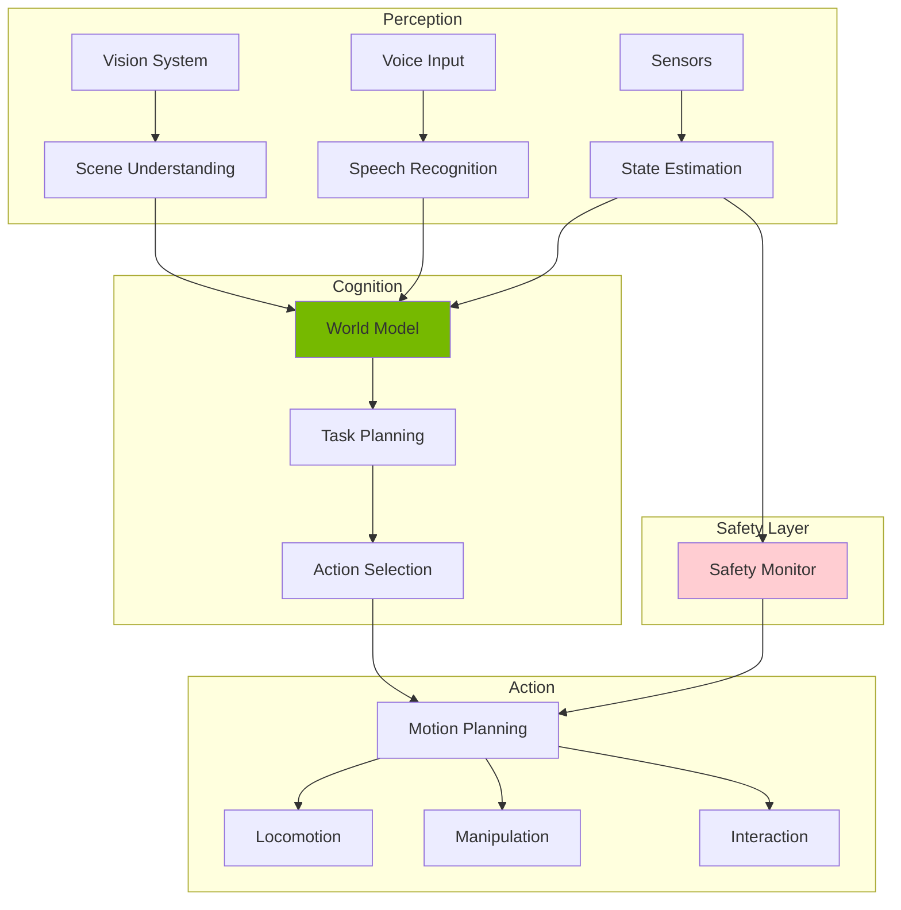

# Module 6: Capstone - The Autonomous Humanoid

**Focus**: System integration in simulation, evaluation, and optional edge deployment

<!-- DIAGRAM: id="module-6-overview" type="architecture" format="mermaid"
     description="Complete autonomous humanoid system architecture" -->



## Module Overview

This capstone module brings together everything you've learned to build a complete autonomous humanoid robot system. You'll design, implement, and evaluate an integrated system that:

- Perceives its environment through vision and sensors
- Reasons about tasks using language models
- Plans and executes locomotion and manipulation
- Interacts naturally with humans
- Operates safely in simulation

**This is a simulation-first capstone.** All development and evaluation happens in simulation (Gazebo + Isaac Sim). Hardware deployment to Jetson is an optional extension for those with access.

:::note Simulation-First
The complete system runs in simulation without requiring physical hardware. Jetson deployment is documented as an optional extension pathway.
:::

## Why a Capstone?

| Benefit | Description |
|---------|-------------|
| **Integration** | Connect modules that were learned separately |
| **Real Complexity** | Face system-level challenges |
| **Portfolio Piece** | Demonstrate comprehensive skills |
| **Research Platform** | Foundation for further exploration |

## Learning Path

This module teaches you to:

1. **Architect complete systems** with proper module boundaries
2. **Integrate perception, planning, and action** pipelines
3. **Evaluate system performance** with quantitative metrics
4. **Debug complex multi-component systems**
5. **Document and present** technical work

## Chapters in This Module

### [Chapter 23: Capstone Architecture & System Design](./ch23-capstone-architecture)

Design and implement the complete autonomous humanoid system architecture in simulation.

**Learning Objectives**:
- Design modular system architecture
- Integrate ROS 2 components
- Implement full perception-to-action pipeline
- Run complete system in Gazebo/Isaac Sim

---

### [Chapter 24: Deployment, Evaluation & Future of Physical AI](./ch24-deployment-future)

Evaluate system performance, explore optional hardware deployment, and look toward the future.

**Learning Objectives**:
- Define and measure performance metrics
- Conduct systematic testing in simulation
- Understand optional Jetson deployment pathway
- Explore emerging Physical AI trends

## Prerequisites

Before starting this module, you should have:

- **Completed Modules 0-5** (all prior content)
- Working simulation environment (Gazebo + Isaac Sim)
- Comfort with system integration
- Understanding of all component technologies

## Capstone System Components

| Component | Technology | Module Reference |
|-----------|------------|------------------|
| **Middleware** | ROS 2 Humble | Module 1 |
| **Simulation** | Gazebo + Isaac Sim | Modules 2-3 |
| **Perception** | Isaac ROS, VLMs | Modules 3-4 |
| **Planning** | LLM Task Planner | Module 4 |
| **Locomotion** | ZMP Controller | Module 5 |
| **Manipulation** | Grasp Planner | Module 5 |
| **HRI** | Intent Recognition | Module 5 |

## Development Environment

This capstone uses:

| Tool | Version | Purpose |
|------|---------|---------|
| **ROS 2** | Humble | System integration |
| **Gazebo** | Fortress+ | Physics simulation |
| **Isaac Sim** | 2023.1+ | Advanced simulation |
| **MoveIt 2** | Latest | Motion planning |
| **Nav2** | Latest | Navigation |
| **Docker** | 24.0+ | Environment management |

## What You'll Build

By the end of this module, you will have:

```
autonomous_humanoid/
├── launch/
│   └── full_system.launch.py
├── config/
│   ├── robot_params.yaml
│   └── safety_params.yaml
├── src/
│   ├── perception/
│   ├── planning/
│   ├── locomotion/
│   ├── manipulation/
│   ├── hri/
│   └── system_manager/
├── worlds/
│   └── home_environment.world
├── evaluation/
│   ├── metrics.py
│   └── test_scenarios.py
└── docker/
    └── Dockerfile
```

## Capstone Tasks

The capstone demonstrates the robot performing:

1. **Navigation**: Autonomous navigation in home environment
2. **Object Fetch**: Find, grasp, and deliver requested objects
3. **Human Interaction**: Respond to voice commands and gestures
4. **Safety Response**: React appropriately to humans and obstacles

## Module Timeline

| Chapter | Estimated Time | Difficulty |
|---------|---------------|------------|
| Chapter 23: System Architecture | 6 hours | Advanced |
| Chapter 24: Evaluation & Future | 4 hours | Advanced |

**Total Module Time**: ~10 hours (plus integration work)

## Code Repository

All code for this module is in:

```bash
code-examples/module-6-capstone/
├── autonomous_humanoid/
│   ├── perception_node.py
│   ├── planner_node.py
│   ├── locomotion_node.py
│   ├── manipulation_node.py
│   └── hri_node.py
├── launch/
├── config/
├── worlds/
└── evaluation/
```

## Success Criteria

Your capstone is complete when:

- [ ] System runs continuously in simulation without crashes
- [ ] Robot navigates to commanded locations
- [ ] Robot can fetch at least 3 different objects
- [ ] Robot responds to basic voice commands
- [ ] Safety stops engage when humans approach
- [ ] All metrics are documented

:::tip Start Simple
Begin with a minimal working system, then add capabilities incrementally. Don't try to build everything at once!
:::
