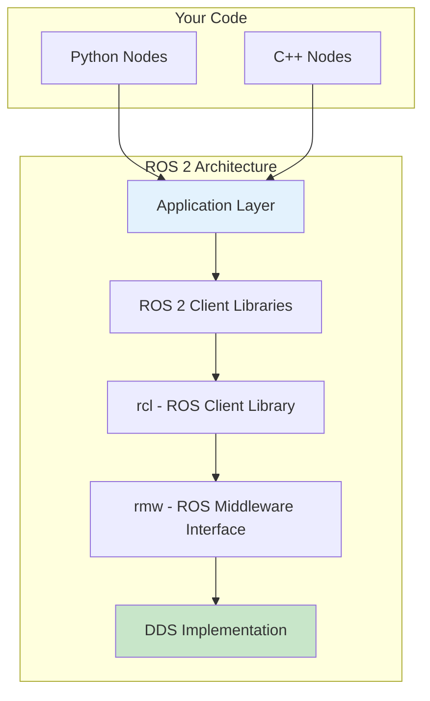
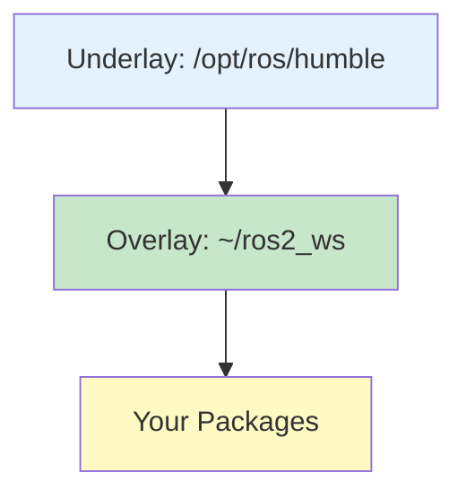
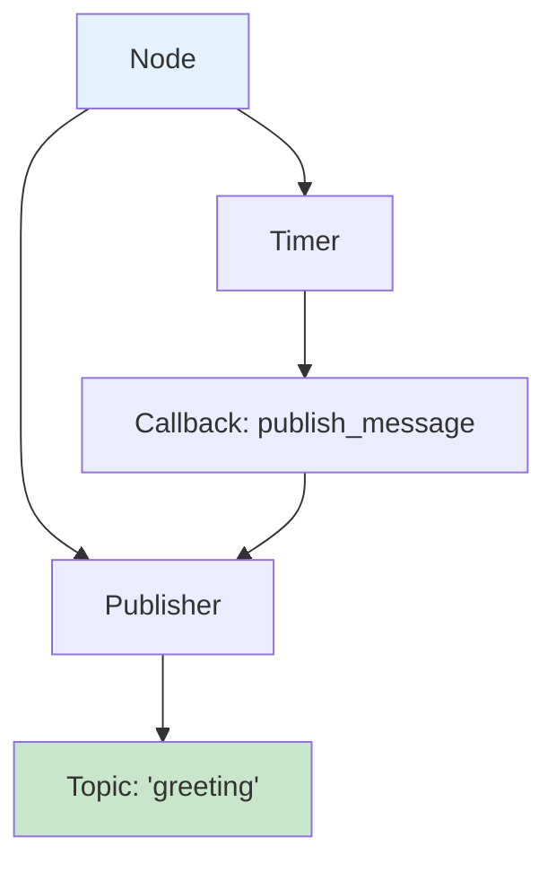
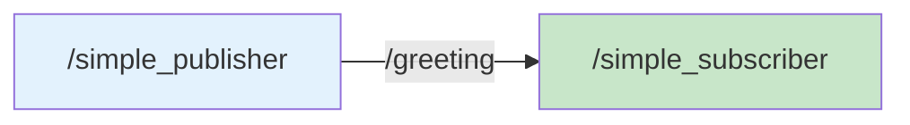

# Chapter 4: ROS 2 Installation, Workspaces & First Nodes

<!-- DIAGRAM: id="ch04-ros2-architecture" type="architecture" format="mermaid"
     description="High-level ROS 2 architecture showing key components" -->



## Learning Objectives

By the end of this chapter, you will be able to:

1. **Install ROS 2 Humble** on Ubuntu 22.04 or using Docker
2. **Create and configure a ROS 2 workspace** with proper structure
3. **Understand the colcon build system** and package structure
4. **Write your first ROS 2 nodes** in Python
5. **Use essential ROS 2 command-line tools** for debugging

## Prerequisites

Before starting this chapter, ensure you have:

- Ubuntu 22.04 LTS (native, WSL2, or VM) OR Docker installed
- Basic command-line familiarity
- Python 3.10+ installed
- Text editor or IDE (VS Code recommended)

## Introduction

ROS 2 is not an operating system—it's a middleware framework that provides:

- **Communication**: Publish-subscribe and request-response patterns
- **Tools**: Visualization, debugging, logging
- **Libraries**: Common robotics algorithms and data structures
- **Build System**: Standardized way to compile and package code

This chapter gets you from zero to your first working ROS 2 nodes.

## Installation Options

You have three options for setting up ROS 2:

| Option | Best For | Pros | Cons |
|--------|----------|------|------|
| **Native** | Primary development | Full performance, all tools | Requires Ubuntu 22.04 |
| **Docker** | Any OS | Portable, isolated | Slight complexity |
| **WSL2** | Windows users | Native-like on Windows | Some GUI limitations |

:::note Simulation-First
All examples in this book work in any of these environments since we're using simulation, not physical hardware.
:::

## Option 1: Native Installation (Ubuntu 22.04)

### Step 1: Set Up Locale

```bash
# Ensure UTF-8 locale
sudo apt update && sudo apt install locales
sudo locale-gen en_US en_US.UTF-8
sudo update-locale LC_ALL=en_US.UTF-8 LANG=en_US.UTF-8
export LANG=en_US.UTF-8
```

### Step 2: Add ROS 2 Repository

```bash
# Add the ROS 2 GPG key
sudo apt install software-properties-common
sudo add-apt-repository universe

sudo apt update && sudo apt install curl -y
sudo curl -sSL https://raw.githubusercontent.com/ros/rosdistro/master/ros.key -o /usr/share/keyrings/ros-archive-keyring.gpg

# Add the repository
echo "deb [arch=$(dpkg --print-architecture) signed-by=/usr/share/keyrings/ros-archive-keyring.gpg] http://packages.ros.org/ros2/ubuntu $(. /etc/os-release && echo $UBUNTU_CODENAME) main" | sudo tee /etc/apt/sources.list.d/ros2.list > /dev/null
```

### Step 3: Install ROS 2 Humble

```bash
# Update and install
sudo apt update
sudo apt upgrade

# Desktop install (recommended) - includes RViz, demos, tutorials
sudo apt install ros-humble-desktop

# Or minimal install (smaller)
# sudo apt install ros-humble-ros-base
```

### Step 4: Install Development Tools

```bash
# Install colcon build tool
sudo apt install python3-colcon-common-extensions

# Install rosdep for dependency management
sudo apt install python3-rosdep
sudo rosdep init
rosdep update
```

### Step 5: Source the Setup Script

```bash
# Add to your .bashrc for automatic sourcing
echo "source /opt/ros/humble/setup.bash" >> ~/.bashrc
source ~/.bashrc

# Verify installation
ros2 --help
```

## Option 2: Docker Installation

### Using the Book's Docker Environment

```bash
# Clone the repository
git clone https://github.com/ai-book/physical-ai-code-examples.git
cd physical-ai-code-examples/docker

# Build and run the ROS 2 container
docker-compose up -d ros2-humble

# Enter the container
docker exec -it ros2-dev bash
```

### Docker Compose Configuration

The `docker-compose.yml` provides a complete environment:

```yaml
services:
  ros2-humble:
    build:
      context: .
      dockerfile: Dockerfile.ros2
    image: physical-ai-book/ros2-humble:latest
    container_name: ros2-dev
    volumes:
      - ../code-examples:/workspace/code-examples
      - /tmp/.X11-unix:/tmp/.X11-unix:rw
    environment:
      - DISPLAY=${DISPLAY}
      - ROS_DOMAIN_ID=42
    network_mode: host
    stdin_open: true
    tty: true
```

## Option 3: WSL2 Installation (Windows)

### Step 1: Install WSL2 with Ubuntu 22.04

```powershell
# In PowerShell as Administrator
wsl --install -d Ubuntu-22.04
```

### Step 2: Follow Native Installation

Once in WSL2, follow the native installation steps above.

### Step 3: Set Up GUI Support (for RViz)

```bash
# Install X server support (Windows 11 has built-in support)
# For Windows 10, install VcXsrv or similar

# In WSL2
export DISPLAY=:0
```

## Verifying Your Installation

Test that ROS 2 is working correctly:

### Test 1: Check ROS 2 Version

```bash
ros2 --version
# Should output: ros2 0.x.x (humble version)
```

### Test 2: Run Demo Nodes

Open two terminals:

**Terminal 1 - Talker:**
```bash
source /opt/ros/humble/setup.bash
ros2 run demo_nodes_cpp talker
```

**Terminal 2 - Listener:**
```bash
source /opt/ros/humble/setup.bash
ros2 run demo_nodes_cpp listener
```

You should see messages being published and received.

### Test 3: Check Node Communication

```bash
# List running nodes
ros2 node list

# List active topics
ros2 topic list

# Echo messages on a topic
ros2 topic echo /chatter
```

## Understanding ROS 2 Workspaces

A **workspace** is a directory containing ROS 2 packages. The standard structure is:

```
my_ros2_ws/                 # Workspace root
├── src/                    # Source code
│   ├── package_1/
│   ├── package_2/
│   └── ...
├── build/                  # Build artifacts (auto-generated)
├── install/                # Installed packages (auto-generated)
└── log/                    # Build logs (auto-generated)
```

### Creating Your First Workspace

```bash
# Create workspace directory
mkdir -p ~/ros2_ws/src
cd ~/ros2_ws

# Build the empty workspace
colcon build

# Source the workspace
source install/setup.bash
```

### Workspace Overlay Concept



ROS 2 uses **overlay** workspaces:
1. **Underlay**: Base ROS 2 installation (`/opt/ros/humble`)
2. **Overlay**: Your workspace, which can override underlay packages

Always source in order: underlay first, then overlay.

## Creating Your First Package

### Package Structure

A ROS 2 Python package contains:

```
my_first_package/
├── package.xml              # Package metadata
├── setup.py                 # Python setup file
├── setup.cfg                # Setup configuration
├── resource/
│   └── my_first_package     # Package marker file
└── my_first_package/        # Python module
    ├── __init__.py
    └── my_node.py           # Your node code
```

### Create the Package

```bash
cd ~/ros2_ws/src

# Create a Python package
ros2 pkg create --build-type ament_python my_first_package

# Examine the created structure
tree my_first_package
```

### Understanding package.xml

```xml
<?xml version="1.0"?>
<?xml-model href="http://download.ros.org/schema/package_format3.xsd" schematypens="http://www.w3.org/2001/XMLSchema"?>
<package format="3">
  <name>my_first_package</name>
  <version>0.0.1</version>
  <description>My first ROS 2 package</description>
  <maintainer email="you@email.com">Your Name</maintainer>
  <license>Apache-2.0</license>

  <!-- Build dependencies -->
  <buildtool_depend>ament_python</buildtool_depend>

  <!-- Runtime dependencies -->
  <exec_depend>rclpy</exec_depend>
  <exec_depend>std_msgs</exec_depend>

  <export>
    <build_type>ament_python</build_type>
  </export>
</package>
```

### Understanding setup.py

```python
from setuptools import find_packages, setup

package_name = 'my_first_package'

setup(
    name=package_name,
    version='0.0.1',
    packages=find_packages(exclude=['test']),
    data_files=[
        ('share/ament_index/resource_index/packages',
            ['resource/' + package_name]),
        ('share/' + package_name, ['package.xml']),
    ],
    install_requires=['setuptools'],
    zip_safe=True,
    maintainer='Your Name',
    maintainer_email='you@email.com',
    description='My first ROS 2 package',
    license='Apache-2.0',
    tests_require=['pytest'],
    entry_points={
        'console_scripts': [
            # Node entry points go here
            'my_node = my_first_package.my_node:main',
        ],
    },
)
```

## Writing Your First Publisher Node

Create a node that publishes messages to a topic.

### Create the Publisher

Create `~/ros2_ws/src/my_first_package/my_first_package/publisher_node.py`:

```python
#!/usr/bin/env python3
"""
Simple ROS 2 publisher node.

This node publishes string messages to the 'greeting' topic
at a rate of 1 Hz.
"""

import rclpy
from rclpy.node import Node
from std_msgs.msg import String


class SimplePublisher(Node):
    """A simple ROS 2 publisher node."""

    def __init__(self):
        # Initialize the node with a name
        super().__init__('simple_publisher')

        # Create a publisher
        # - String: message type
        # - 'greeting': topic name
        # - 10: QoS queue size
        self.publisher = self.create_publisher(String, 'greeting', 10)

        # Create a timer that calls publish_message every second
        timer_period = 1.0  # seconds
        self.timer = self.create_timer(timer_period, self.publish_message)

        # Counter for messages
        self.count = 0

        self.get_logger().info('Publisher node started')

    def publish_message(self):
        """Publish a greeting message."""
        msg = String()
        msg.data = f'Hello, ROS 2! Message #{self.count}'

        self.publisher.publish(msg)
        self.get_logger().info(f'Published: "{msg.data}"')

        self.count += 1


def main(args=None):
    """Main entry point."""
    # Initialize ROS 2
    rclpy.init(args=args)

    # Create the node
    node = SimplePublisher()

    try:
        # Spin the node (process callbacks)
        rclpy.spin(node)
    except KeyboardInterrupt:
        pass
    finally:
        # Clean up
        node.destroy_node()
        rclpy.shutdown()


if __name__ == '__main__':
    main()
```

### Key Concepts Explained



| Concept | Description |
|---------|-------------|
| **Node** | A process that participates in the ROS 2 graph |
| **Publisher** | Sends messages to a topic |
| **Topic** | Named channel for message passing |
| **Timer** | Triggers callbacks at regular intervals |
| **QoS** | Quality of Service settings for reliability |

## Writing Your First Subscriber Node

Create a node that receives messages from a topic.

### Create the Subscriber

Create `~/ros2_ws/src/my_first_package/my_first_package/subscriber_node.py`:

```python
#!/usr/bin/env python3
"""
Simple ROS 2 subscriber node.

This node subscribes to the 'greeting' topic and logs
received messages.
"""

import rclpy
from rclpy.node import Node
from std_msgs.msg import String


class SimpleSubscriber(Node):
    """A simple ROS 2 subscriber node."""

    def __init__(self):
        # Initialize the node with a name
        super().__init__('simple_subscriber')

        # Create a subscription
        # - String: message type
        # - 'greeting': topic name
        # - callback: function to call when message received
        # - 10: QoS queue size
        self.subscription = self.create_subscription(
            String,
            'greeting',
            self.message_callback,
            10
        )

        self.get_logger().info('Subscriber node started')

    def message_callback(self, msg):
        """Handle received messages."""
        self.get_logger().info(f'Received: "{msg.data}"')


def main(args=None):
    """Main entry point."""
    # Initialize ROS 2
    rclpy.init(args=args)

    # Create the node
    node = SimpleSubscriber()

    try:
        # Spin the node (process callbacks)
        rclpy.spin(node)
    except KeyboardInterrupt:
        pass
    finally:
        # Clean up
        node.destroy_node()
        rclpy.shutdown()


if __name__ == '__main__':
    main()
```

## Register Nodes in setup.py

Update `setup.py` to include both nodes:

```python
entry_points={
    'console_scripts': [
        'publisher_node = my_first_package.publisher_node:main',
        'subscriber_node = my_first_package.subscriber_node:main',
    ],
},
```

## Build and Run

### Build the Package

```bash
cd ~/ros2_ws

# Build all packages
colcon build

# Or build specific package
colcon build --packages-select my_first_package

# Source the workspace
source install/setup.bash
```

### Run the Nodes

**Terminal 1 - Publisher:**
```bash
source ~/ros2_ws/install/setup.bash
ros2 run my_first_package publisher_node
```

**Terminal 2 - Subscriber:**
```bash
source ~/ros2_ws/install/setup.bash
ros2 run my_first_package subscriber_node
```

You should see the subscriber receiving messages from the publisher!

## Essential ROS 2 Command-Line Tools

### Node Inspection

```bash
# List all running nodes
ros2 node list

# Get info about a specific node
ros2 node info /simple_publisher
```

### Topic Inspection

```bash
# List all topics
ros2 topic list

# Show topic type
ros2 topic type /greeting

# Echo messages (see what's being published)
ros2 topic echo /greeting

# Show publishing rate
ros2 topic hz /greeting

# Publish a test message
ros2 topic pub /greeting std_msgs/msg/String "data: 'Test message'"
```

### Package Tools

```bash
# List all packages
ros2 pkg list

# Find package location
ros2 pkg prefix my_first_package

# List executables in a package
ros2 pkg executables my_first_package
```

### Interface Inspection

```bash
# List all message types
ros2 interface list

# Show message definition
ros2 interface show std_msgs/msg/String
```

## Visualizing the ROS 2 Graph

ROS 2 provides tools to visualize the computation graph.

### Using rqt_graph

```bash
# Install if not present
sudo apt install ros-humble-rqt-graph

# Run with both nodes active
rqt_graph
```

This shows a visual representation of nodes and their connections:



## Hands-On Exercise

### Exercise 1: Modify the Publisher

1. Change the publisher to send messages at 2 Hz instead of 1 Hz
2. Add a timestamp to each message
3. Rebuild and test

### Exercise 2: Create a Counter Node

Create a new node that:
1. Subscribes to the `greeting` topic
2. Counts the number of messages received
3. Publishes the count to a new topic called `message_count`

### Exercise 3: Explore CLI Tools

1. Use `ros2 topic hz` to measure actual publishing rate
2. Use `ros2 topic bw` to measure bandwidth
3. Use `ros2 node info` to see all publishers/subscribers for each node

## Troubleshooting

### Common Issues

| Problem | Solution |
|---------|----------|
| `ros2: command not found` | Source setup.bash: `source /opt/ros/humble/setup.bash` |
| Package not found after build | Source workspace: `source ~/ros2_ws/install/setup.bash` |
| Nodes can't communicate | Check ROS_DOMAIN_ID is same for all terminals |
| Build fails | Check dependencies in package.xml |

### Debugging Tips

```bash
# Check environment
printenv | grep ROS

# Verify DDS is working
ros2 daemon status

# Reset DDS daemon if issues
ros2 daemon stop
ros2 daemon start
```

## Key Concepts

| Term | Definition |
|------|------------|
| **ROS 2** | Robot Operating System 2, a middleware for robotics |
| **Node** | A process that performs computation in the ROS 2 graph |
| **Topic** | A named channel for asynchronous message passing |
| **Publisher** | An entity that sends messages to a topic |
| **Subscriber** | An entity that receives messages from a topic |
| **Workspace** | A directory containing ROS 2 packages |
| **Package** | A unit of ROS 2 code organization |
| **colcon** | The build tool for ROS 2 workspaces |

## Chapter Summary

In this chapter, you learned:

1. **ROS 2 installation**: Multiple options for setting up your development environment.

2. **Workspace structure**: How ROS 2 organizes code into workspaces and packages.

3. **Package creation**: Using `ros2 pkg create` to scaffold new packages.

4. **Node development**: Writing publisher and subscriber nodes in Python.

5. **CLI tools**: Using `ros2` commands to inspect and debug your system.

## What's Next

In [Chapter 5: Nodes, Topics, Publishers & Subscribers](./ch05-nodes-topics), you'll dive deeper into ROS 2 communication patterns. You'll learn about Quality of Service settings, custom message types, and building more complex multi-node systems.

## Further Reading

- [ROS 2 Humble Documentation](https://docs.ros.org/en/humble/) - Official documentation
- [ROS 2 Tutorials](https://docs.ros.org/en/humble/Tutorials.html) - Step-by-step tutorials
- [rclpy API Reference](https://docs.ros2.org/latest/api/rclpy/) - Python client library API
- [Colcon Documentation](https://colcon.readthedocs.io/) - Build tool documentation
