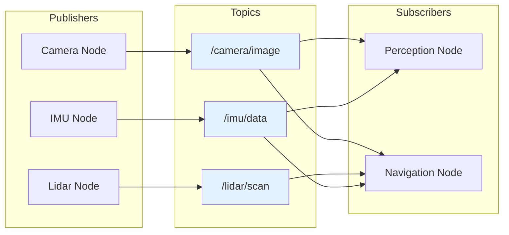
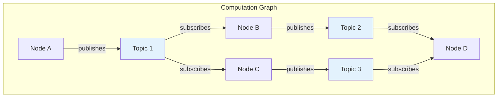
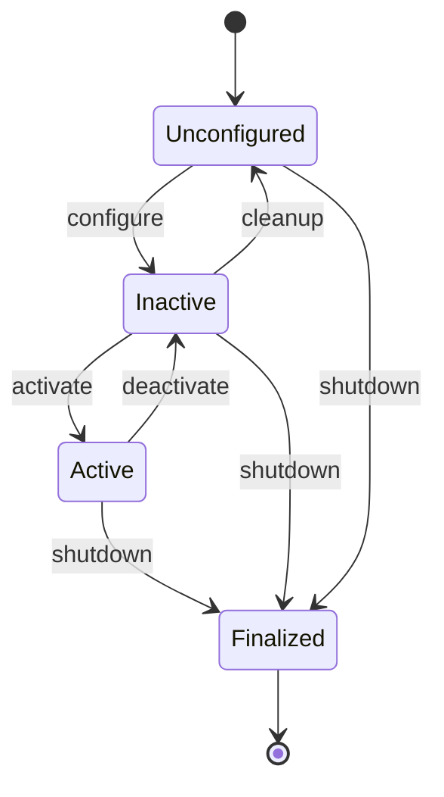
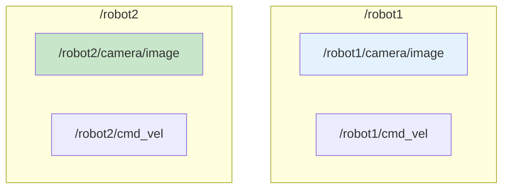
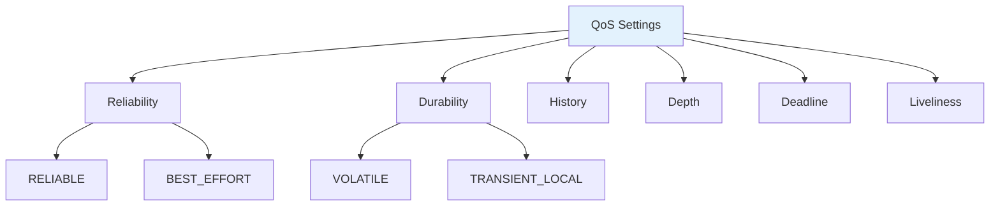
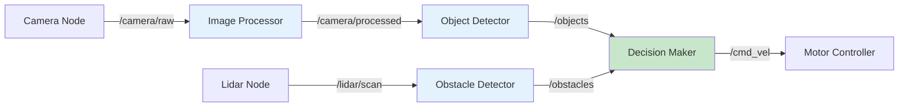

# Chapter 5: Nodes, Topics, Publishers & Subscribers

<!-- DIAGRAM: id="ch05-pubsub-pattern" type="architecture" format="mermaid"
     description="ROS 2 publish-subscribe communication pattern" -->



## Learning Objectives

By the end of this chapter, you will be able to:

1. **Explain the ROS 2 computation graph** and how nodes communicate
2. **Create custom message types** for domain-specific data
3. **Configure Quality of Service (QoS)** settings for reliable communication
4. **Build multi-node systems** with complex communication patterns
5. **Debug communication issues** using ROS 2 tools

## Prerequisites

Before starting this chapter, ensure you have:

- Completed Chapter 4 with a working ROS 2 installation
- Basic understanding of publisher/subscriber patterns
- Familiarity with Python classes

## Introduction

In Chapter 4, you created simple publisher and subscriber nodes. Now we'll explore the full power of ROS 2's publish-subscribe model. You'll learn to build complex multi-node systems, create custom message types, and configure communication for reliability and performance.

## The ROS 2 Computation Graph

The **computation graph** is the network of ROS 2 processes (nodes) and their connections (topics, services, actions).

### Graph Components



| Component | Description |
|-----------|-------------|
| **Node** | A process that performs computation |
| **Topic** | A named bus for message passing |
| **Publisher** | Sends messages to a topic |
| **Subscriber** | Receives messages from a topic |
| **Message** | Typed data structure passed between nodes |

### Decoupled Communication

The publish-subscribe pattern provides **loose coupling**:

- Publishers don't know who subscribes
- Subscribers don't know who publishes
- Nodes can be added/removed dynamically
- Many-to-many communication is natural

## Deep Dive: Node Lifecycle

### Node States



For managed (lifecycle) nodes, ROS 2 provides state transitions. For now, we'll use standard nodes that are always "active."

### Node Best Practices

```python
import rclpy
from rclpy.node import Node


class WellStructuredNode(Node):
    """Example of a well-structured ROS 2 node."""

    def __init__(self):
        super().__init__('well_structured_node')

        # Declare parameters first
        self.declare_parameter('update_rate', 10.0)
        self.declare_parameter('topic_name', 'output')

        # Get parameter values
        rate = self.get_parameter('update_rate').value
        topic = self.get_parameter('topic_name').value

        # Create publishers/subscribers
        self.publisher = self.create_publisher(String, topic, 10)

        # Create timers
        self.timer = self.create_timer(1.0 / rate, self.timer_callback)

        # Initialize state
        self.message_count = 0

        self.get_logger().info(f'Node initialized with rate={rate}, topic={topic}')

    def timer_callback(self):
        """Called at the configured rate."""
        # Node logic here
        pass
```

## Understanding Topics in Depth

### Topic Naming Conventions

```
/namespace/node_name/topic_name
```

Examples:
- `/robot/camera/image_raw` - Camera image
- `/robot/lidar/scan` - LiDAR scan
- `/robot/cmd_vel` - Velocity commands

### Topic Namespacing



Namespaces allow multiple robots to run without topic collisions:

```bash
# Run node in a namespace
ros2 run my_package my_node --ros-args -r __ns:=/robot1
```

### Topic Remapping

Change topic names at runtime:

```bash
# Remap 'input' to 'camera/image'
ros2 run my_package my_node --ros-args -r input:=camera/image
```

## Standard Message Types

ROS 2 provides many standard message types in `std_msgs`, `geometry_msgs`, `sensor_msgs`, etc.

### Common Message Types

| Package | Message | Description |
|---------|---------|-------------|
| `std_msgs` | `String`, `Int32`, `Float64` | Basic types |
| `geometry_msgs` | `Twist`, `Pose`, `Transform` | Geometric data |
| `sensor_msgs` | `Image`, `LaserScan`, `Imu` | Sensor data |
| `nav_msgs` | `Odometry`, `Path`, `OccupancyGrid` | Navigation |

### Example: Using geometry_msgs/Twist

```python
from geometry_msgs.msg import Twist

# Create a velocity command
cmd = Twist()
cmd.linear.x = 0.5   # m/s forward
cmd.linear.y = 0.0
cmd.linear.z = 0.0
cmd.angular.x = 0.0
cmd.angular.y = 0.0
cmd.angular.z = 0.1  # rad/s rotation

# Publish it
self.cmd_publisher.publish(cmd)
```

### Inspecting Message Definitions

```bash
# Show message structure
ros2 interface show geometry_msgs/msg/Twist

# Output:
# Vector3 linear
#   float64 x
#   float64 y
#   float64 z
# Vector3 angular
#   float64 x
#   float64 y
#   float64 z
```

## Creating Custom Messages

When standard messages don't fit your needs, create custom ones.

### Step 1: Create Message Package

```bash
cd ~/ros2_ws/src
ros2 pkg create --build-type ament_cmake custom_msgs
```

### Step 2: Define Message

Create `custom_msgs/msg/RobotStatus.msg`:

```
# Robot status message
std_msgs/Header header

# Robot identification
string robot_name
uint32 robot_id

# Status information
bool is_active
float64 battery_level      # 0.0 to 1.0
float64 temperature        # Celsius

# Position
float64 x
float64 y
float64 theta
```

### Step 3: Update CMakeLists.txt

```cmake
cmake_minimum_required(VERSION 3.8)
project(custom_msgs)

find_package(ament_cmake REQUIRED)
find_package(rosidl_default_generators REQUIRED)
find_package(std_msgs REQUIRED)

rosidl_generate_interfaces(${PROJECT_NAME}
  "msg/RobotStatus.msg"
  DEPENDENCIES std_msgs
)

ament_package()
```

### Step 4: Update package.xml

```xml
<buildtool_depend>rosidl_default_generators</buildtool_depend>
<exec_depend>rosidl_default_runtime</exec_depend>
<depend>std_msgs</depend>
<member_of_group>rosidl_interface_packages</member_of_group>
```

### Step 5: Build and Use

```bash
cd ~/ros2_ws
colcon build --packages-select custom_msgs
source install/setup.bash

# Verify
ros2 interface show custom_msgs/msg/RobotStatus
```

### Using Custom Messages

```python
from custom_msgs.msg import RobotStatus

# Create and populate
status = RobotStatus()
status.robot_name = "humanoid_1"
status.robot_id = 1
status.is_active = True
status.battery_level = 0.85
status.temperature = 42.5
status.x = 1.0
status.y = 2.0
status.theta = 0.5

# Publish
self.status_publisher.publish(status)
```

## Quality of Service (QoS)

QoS settings control communication reliability and behavior.

### QoS Profiles



### Key QoS Parameters

| Parameter | Options | Description |
|-----------|---------|-------------|
| **Reliability** | RELIABLE, BEST_EFFORT | Guarantee delivery or not |
| **Durability** | VOLATILE, TRANSIENT_LOCAL | Save messages for late subscribers |
| **History** | KEEP_LAST, KEEP_ALL | How many messages to store |
| **Depth** | Integer | Queue size for KEEP_LAST |

### Preset Profiles

```python
from rclpy.qos import QoSProfile, ReliabilityPolicy, DurabilityPolicy
from rclpy.qos import qos_profile_sensor_data, qos_profile_system_default

# Sensor data: best effort, small queue (fast, may drop)
self.create_subscription(Image, 'camera', callback, qos_profile_sensor_data)

# System default: reliable, moderate queue
self.create_subscription(String, 'commands', callback, qos_profile_system_default)
```

### Custom QoS Profile

```python
from rclpy.qos import QoSProfile, ReliabilityPolicy, HistoryPolicy, DurabilityPolicy

# Custom profile for critical messages
critical_qos = QoSProfile(
    reliability=ReliabilityPolicy.RELIABLE,
    durability=DurabilityPolicy.TRANSIENT_LOCAL,
    history=HistoryPolicy.KEEP_LAST,
    depth=10
)

self.publisher = self.create_publisher(
    EmergencyStop,
    'emergency_stop',
    critical_qos
)
```

### QoS Compatibility

Publishers and subscribers must have compatible QoS:

| Publisher | Subscriber | Result |
|-----------|------------|--------|
| RELIABLE | RELIABLE | Works |
| RELIABLE | BEST_EFFORT | Works |
| BEST_EFFORT | RELIABLE | **Fails** |
| BEST_EFFORT | BEST_EFFORT | Works |

```bash
# Check for QoS incompatibilities
ros2 doctor --report
```

## Building Multi-Node Systems

### Example: Sensor Processing Pipeline



### Sensor Node

```python
#!/usr/bin/env python3
"""Simulated sensor node publishing at high rate."""

import rclpy
from rclpy.node import Node
from sensor_msgs.msg import LaserScan
from rclpy.qos import qos_profile_sensor_data
import math
import random


class SimulatedLidar(Node):
    def __init__(self):
        super().__init__('simulated_lidar')

        self.publisher = self.create_publisher(
            LaserScan,
            'scan',
            qos_profile_sensor_data
        )

        # 10 Hz scan rate
        self.timer = self.create_timer(0.1, self.publish_scan)
        self.get_logger().info('Simulated LiDAR started')

    def publish_scan(self):
        scan = LaserScan()
        scan.header.stamp = self.get_clock().now().to_msg()
        scan.header.frame_id = 'lidar_link'

        scan.angle_min = -math.pi
        scan.angle_max = math.pi
        scan.angle_increment = math.pi / 180  # 1 degree
        scan.range_min = 0.1
        scan.range_max = 10.0

        # Simulate ranges with some noise
        num_readings = int((scan.angle_max - scan.angle_min) / scan.angle_increment)
        scan.ranges = [
            5.0 + random.uniform(-0.1, 0.1)
            for _ in range(num_readings)
        ]

        self.publisher.publish(scan)


def main(args=None):
    rclpy.init(args=args)
    node = SimulatedLidar()
    rclpy.spin(node)
    node.destroy_node()
    rclpy.shutdown()
```

### Processing Node

```python
#!/usr/bin/env python3
"""Node that processes sensor data and detects obstacles."""

import rclpy
from rclpy.node import Node
from sensor_msgs.msg import LaserScan
from std_msgs.msg import Float32MultiArray
from rclpy.qos import qos_profile_sensor_data


class ObstacleDetector(Node):
    def __init__(self):
        super().__init__('obstacle_detector')

        # Declare parameters
        self.declare_parameter('obstacle_threshold', 1.0)
        self.threshold = self.get_parameter('obstacle_threshold').value

        # Subscribe to laser scan
        self.subscription = self.create_subscription(
            LaserScan,
            'scan',
            self.scan_callback,
            qos_profile_sensor_data
        )

        # Publish detected obstacles
        self.publisher = self.create_publisher(
            Float32MultiArray,
            'obstacles',
            10
        )

        self.get_logger().info(f'Obstacle detector started (threshold={self.threshold}m)')

    def scan_callback(self, msg):
        """Process laser scan and detect close obstacles."""
        obstacles = []

        for i, range_val in enumerate(msg.ranges):
            if range_val < self.threshold:
                # Calculate angle of obstacle
                angle = msg.angle_min + i * msg.angle_increment
                obstacles.extend([angle, range_val])

        # Publish obstacles as [angle1, dist1, angle2, dist2, ...]
        output = Float32MultiArray()
        output.data = obstacles
        self.publisher.publish(output)

        if obstacles:
            self.get_logger().info(f'Detected {len(obstacles)//2} obstacles')


def main(args=None):
    rclpy.init(args=args)
    node = ObstacleDetector()
    rclpy.spin(node)
    node.destroy_node()
    rclpy.shutdown()
```

## Multiple Publishers and Subscribers

A single node can have many publishers and subscribers:

```python
class MultiIONode(Node):
    def __init__(self):
        super().__init__('multi_io_node')

        # Multiple subscribers
        self.camera_sub = self.create_subscription(
            Image, 'camera/image', self.camera_callback, 10)
        self.lidar_sub = self.create_subscription(
            LaserScan, 'lidar/scan', self.lidar_callback, 10)
        self.imu_sub = self.create_subscription(
            Imu, 'imu/data', self.imu_callback, 10)

        # Multiple publishers
        self.status_pub = self.create_publisher(String, 'status', 10)
        self.cmd_pub = self.create_publisher(Twist, 'cmd_vel', 10)
        self.debug_pub = self.create_publisher(String, 'debug', 10)

        # Store latest messages
        self.latest_image = None
        self.latest_scan = None
        self.latest_imu = None

    def camera_callback(self, msg):
        self.latest_image = msg
        self.process_all_sensors()

    def lidar_callback(self, msg):
        self.latest_scan = msg
        self.process_all_sensors()

    def imu_callback(self, msg):
        self.latest_imu = msg
        self.process_all_sensors()

    def process_all_sensors(self):
        """Process when all sensor data is available."""
        if all([self.latest_image, self.latest_scan, self.latest_imu]):
            # Sensor fusion logic here
            pass
```

## Debugging Communication

### Useful Commands

```bash
# List all topics with types
ros2 topic list -t

# Show topic info (publishers, subscribers, QoS)
ros2 topic info /scan -v

# Monitor message rate
ros2 topic hz /scan

# Monitor bandwidth
ros2 topic bw /scan

# Echo with filtering
ros2 topic echo /scan --field ranges

# Record topics for later playback
ros2 bag record /scan /camera/image
```

### Using rqt Tools

```bash
# Visual graph of nodes and topics
rqt_graph

# Plot numeric topics
rqt_plot /scan/ranges[0] /scan/ranges[180]

# Topic monitor
rqt_topic
```

## Hands-On Exercise

### Exercise 1: Robot Telemetry System

Build a multi-node system with:

1. **BatteryMonitor node**: Publishes battery level (simulated) to `/battery`
2. **TemperatureMonitor node**: Publishes temperature to `/temperature`
3. **TelemetryAggregator node**: Subscribes to both, publishes combined status to `/robot_status`

Use custom messages for the combined status.

### Exercise 2: QoS Experimentation

1. Create a publisher with RELIABLE QoS
2. Create a subscriber with BEST_EFFORT QoS
3. Verify they can communicate
4. Swap the settings and observe the failure
5. Fix by making them compatible

### Exercise 3: High-Frequency Publisher

1. Create a node that publishes at 100 Hz
2. Create a subscriber that logs every 10th message
3. Use `ros2 topic hz` to verify the rate
4. Experiment with different QoS queue sizes

## Key Concepts

| Term | Definition |
|------|------------|
| **Computation Graph** | Network of nodes and their connections |
| **Topic** | Named channel for publish-subscribe communication |
| **Message** | Typed data structure passed on topics |
| **QoS** | Quality of Service settings for communication |
| **Namespace** | Prefix for grouping related topics |
| **Remapping** | Changing topic names at runtime |
| **Sensor Fusion** | Combining data from multiple sensors |

## Chapter Summary

In this chapter, you learned:

1. **The computation graph**: How nodes, topics, and messages form a communication network.

2. **Standard and custom messages**: Using built-in message types and creating your own.

3. **Quality of Service**: Configuring reliability, durability, and other QoS settings.

4. **Multi-node systems**: Building complex systems with multiple publishers and subscribers.

5. **Debugging tools**: Using ROS 2 CLI and rqt tools to inspect communication.

## What's Next

In [Chapter 6: Services, Actions & Parameters](./ch06-services-actions), you'll learn request-response patterns with services and how to handle long-running tasks with actions. You'll also master runtime configuration with parameters.

## Further Reading

- [ROS 2 Concepts](https://docs.ros.org/en/humble/Concepts.html) - Official concept documentation
- [About QoS Settings](https://docs.ros.org/en/humble/Concepts/About-Quality-of-Service-Settings.html) - QoS deep dive
- [Creating Custom Messages](https://docs.ros.org/en/humble/Tutorials/Beginner-Client-Libraries/Custom-ROS2-Interfaces.html) - Message tutorial
- [ROS 2 Design](https://design.ros2.org/) - Architecture decisions
