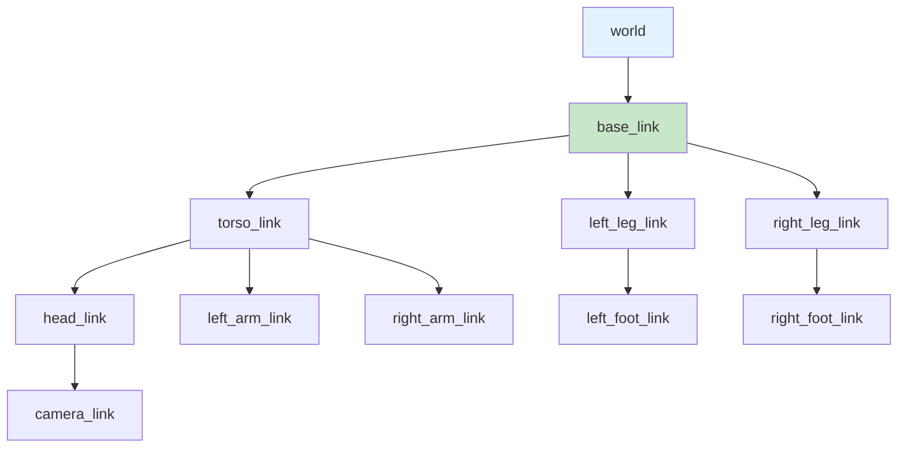
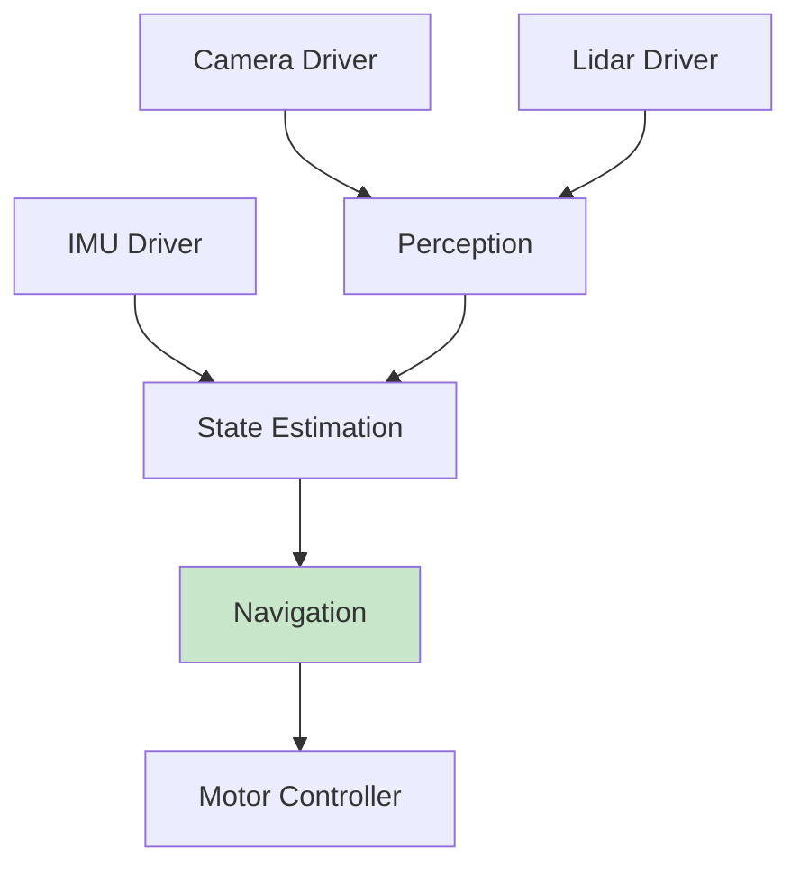
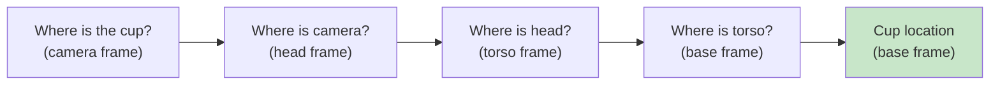

# Chapter 7: Launch Files & TF2 Coordinate Frames

<!-- DIAGRAM: id="ch07-tf-tree" type="architecture" format="mermaid"
     description="TF2 transform tree for a humanoid robot" -->



## Learning Objectives

By the end of this chapter, you will be able to:

1. **Write Python launch files** to start complex multi-node systems
2. **Configure nodes with launch arguments** and parameter files
3. **Understand coordinate frames** and why they matter in robotics
4. **Use TF2** to publish and query coordinate transforms
5. **Visualize robot state** in RViz2

## Prerequisites

Before starting this chapter, ensure you have:

- Completed Chapters 4-6
- Understanding of ROS 2 nodes, topics, and parameters
- Basic familiarity with 3D coordinate systems

## Introduction

Real robotic systems involve many nodes working together. Starting each node manually is tedious and error-prone. **Launch files** automate this, starting multiple nodes with proper configuration in a single command.

**TF2** (Transform Library 2) manages the geometric relationships between different parts of a robot and its environment. Without TF2, you couldn't answer questions like "Where is the camera relative to the gripper?"

This chapter covers both essential skills.

## Part 1: Launch Files

### Why Launch Files?

Consider a typical robot system:



Starting 7+ nodes manually with proper parameters is impractical. Launch files solve this.

### Launch File Location

Launch files go in the `launch/` directory of your package:

```
my_robot_pkg/
├── launch/
│   ├── robot.launch.py
│   └── simulation.launch.py
├── my_robot_pkg/
│   └── ...
├── package.xml
└── setup.py
```

### Basic Launch File Structure

```python
# launch/simple.launch.py
from launch import LaunchDescription
from launch_ros.actions import Node


def generate_launch_description():
    """Generate launch description."""
    return LaunchDescription([
        Node(
            package='demo_nodes_cpp',
            executable='talker',
            name='my_talker',
            output='screen'
        ),
        Node(
            package='demo_nodes_cpp',
            executable='listener',
            name='my_listener',
            output='screen'
        ),
    ])
```

### Registering Launch Files

Update `setup.py`:

```python
import os
from glob import glob
from setuptools import setup

package_name = 'my_robot_pkg'

setup(
    # ... other settings ...
    data_files=[
        # ... other data files ...
        (os.path.join('share', package_name, 'launch'),
         glob(os.path.join('launch', '*.launch.py'))),
    ],
)
```

### Running Launch Files

```bash
# Build and source
colcon build
source install/setup.bash

# Run launch file
ros2 launch my_robot_pkg simple.launch.py
```

## Launch File Components

### Nodes with Parameters

```python
from launch import LaunchDescription
from launch_ros.actions import Node


def generate_launch_description():
    return LaunchDescription([
        Node(
            package='my_package',
            executable='my_node',
            name='configured_node',
            output='screen',
            parameters=[{
                'update_rate': 20.0,
                'robot_name': 'humanoid_1',
                'enabled': True,
            }]
        ),
    ])
```

### Using Parameter Files

```python
import os
from ament_index_python.packages import get_package_share_directory
from launch import LaunchDescription
from launch_ros.actions import Node


def generate_launch_description():
    # Get path to parameter file
    config_dir = os.path.join(
        get_package_share_directory('my_robot_pkg'),
        'config'
    )
    params_file = os.path.join(config_dir, 'robot_params.yaml')

    return LaunchDescription([
        Node(
            package='my_package',
            executable='my_node',
            name='configured_node',
            output='screen',
            parameters=[params_file]
        ),
    ])
```

### Launch Arguments

```python
from launch import LaunchDescription
from launch.actions import DeclareLaunchArgument
from launch.substitutions import LaunchConfiguration
from launch_ros.actions import Node


def generate_launch_description():
    # Declare arguments
    robot_name_arg = DeclareLaunchArgument(
        'robot_name',
        default_value='default_robot',
        description='Name of the robot'
    )

    use_sim_arg = DeclareLaunchArgument(
        'use_sim',
        default_value='true',
        description='Use simulation time'
    )

    # Use arguments in nodes
    return LaunchDescription([
        robot_name_arg,
        use_sim_arg,

        Node(
            package='my_package',
            executable='my_node',
            name='my_node',
            parameters=[{
                'robot_name': LaunchConfiguration('robot_name'),
                'use_sim_time': LaunchConfiguration('use_sim'),
            }]
        ),
    ])
```

Run with arguments:
```bash
ros2 launch my_robot_pkg robot.launch.py robot_name:=humanoid_1 use_sim:=false
```

### Remapping Topics

```python
Node(
    package='my_package',
    executable='my_node',
    name='my_node',
    remappings=[
        ('input', 'camera/image_raw'),
        ('output', 'processed/image'),
    ]
)
```

### Including Other Launch Files

```python
from launch import LaunchDescription
from launch.actions import IncludeLaunchDescription
from launch.launch_description_sources import PythonLaunchDescriptionSource
from ament_index_python.packages import get_package_share_directory
import os


def generate_launch_description():
    # Include another launch file
    other_launch = IncludeLaunchDescription(
        PythonLaunchDescriptionSource([
            os.path.join(
                get_package_share_directory('other_package'),
                'launch',
                'other.launch.py'
            )
        ]),
        launch_arguments={
            'arg1': 'value1',
        }.items()
    )

    return LaunchDescription([
        other_launch,
        # ... additional nodes
    ])
```

### Conditional Launching

```python
from launch import LaunchDescription
from launch.actions import DeclareLaunchArgument
from launch.conditions import IfCondition, UnlessCondition
from launch.substitutions import LaunchConfiguration
from launch_ros.actions import Node


def generate_launch_description():
    use_rviz_arg = DeclareLaunchArgument('use_rviz', default_value='true')

    return LaunchDescription([
        use_rviz_arg,

        # Only launch if use_rviz is true
        Node(
            package='rviz2',
            executable='rviz2',
            name='rviz2',
            condition=IfCondition(LaunchConfiguration('use_rviz'))
        ),

        # Launch unless use_rviz is true
        Node(
            package='my_package',
            executable='headless_viz',
            name='headless_viz',
            condition=UnlessCondition(LaunchConfiguration('use_rviz'))
        ),
    ])
```

### Groups and Namespaces

```python
from launch import LaunchDescription
from launch_ros.actions import Node, PushRosNamespace
from launch.actions import GroupAction


def generate_launch_description():
    # Group nodes under a namespace
    robot1_group = GroupAction([
        PushRosNamespace('robot1'),
        Node(package='my_package', executable='driver', name='driver'),
        Node(package='my_package', executable='controller', name='controller'),
    ])

    robot2_group = GroupAction([
        PushRosNamespace('robot2'),
        Node(package='my_package', executable='driver', name='driver'),
        Node(package='my_package', executable='controller', name='controller'),
    ])

    return LaunchDescription([
        robot1_group,
        robot2_group,
    ])
```

### Complete Launch File Example

```python
#!/usr/bin/env python3
"""Complete launch file for a robot system."""

import os
from ament_index_python.packages import get_package_share_directory
from launch import LaunchDescription
from launch.actions import DeclareLaunchArgument, IncludeLaunchDescription
from launch.conditions import IfCondition
from launch.substitutions import LaunchConfiguration, PathJoinSubstitution
from launch_ros.actions import Node
from launch_ros.substitutions import FindPackageShare


def generate_launch_description():
    # Package directories
    pkg_share = get_package_share_directory('my_robot_pkg')

    # Declare launch arguments
    use_sim_time = DeclareLaunchArgument(
        'use_sim_time',
        default_value='true',
        description='Use simulation clock'
    )

    robot_name = DeclareLaunchArgument(
        'robot_name',
        default_value='humanoid',
        description='Robot name for namespacing'
    )

    rviz_config = DeclareLaunchArgument(
        'rviz_config',
        default_value=os.path.join(pkg_share, 'config', 'robot.rviz'),
        description='RViz configuration file'
    )

    # Nodes
    robot_state_publisher = Node(
        package='robot_state_publisher',
        executable='robot_state_publisher',
        name='robot_state_publisher',
        parameters=[{
            'use_sim_time': LaunchConfiguration('use_sim_time'),
            'robot_description': open(
                os.path.join(pkg_share, 'urdf', 'robot.urdf')
            ).read(),
        }]
    )

    joint_state_publisher = Node(
        package='joint_state_publisher',
        executable='joint_state_publisher',
        name='joint_state_publisher',
        parameters=[{
            'use_sim_time': LaunchConfiguration('use_sim_time'),
        }]
    )

    rviz = Node(
        package='rviz2',
        executable='rviz2',
        name='rviz2',
        arguments=['-d', LaunchConfiguration('rviz_config')],
        parameters=[{
            'use_sim_time': LaunchConfiguration('use_sim_time'),
        }]
    )

    return LaunchDescription([
        # Arguments
        use_sim_time,
        robot_name,
        rviz_config,

        # Nodes
        robot_state_publisher,
        joint_state_publisher,
        rviz,
    ])
```

## Part 2: TF2 Coordinate Frames

### Why Coordinate Frames?

A humanoid robot has many coordinate frames:



To grasp a cup seen by the camera, the robot must know the cup's position relative to the gripper—but the camera sees it in the camera frame.

TF2 handles these transformations.

### TF2 Concepts

| Concept | Description |
|---------|-------------|
| **Frame** | A coordinate system with origin and orientation |
| **Transform** | The relationship between two frames |
| **Parent/Child** | Transforms go from parent to child |
| **TF Tree** | Hierarchy of all frames (must be a tree, no loops) |

### Transform Message

```python
from geometry_msgs.msg import TransformStamped

transform = TransformStamped()
transform.header.stamp = self.get_clock().now().to_msg()
transform.header.frame_id = 'base_link'     # Parent frame
transform.child_frame_id = 'camera_link'     # Child frame

# Translation (meters)
transform.transform.translation.x = 0.5
transform.transform.translation.y = 0.0
transform.transform.translation.z = 1.2

# Rotation (quaternion)
transform.transform.rotation.x = 0.0
transform.transform.rotation.y = 0.0
transform.transform.rotation.z = 0.0
transform.transform.rotation.w = 1.0
```

### Publishing Transforms

#### Static Transforms (Don't Change)

```python
#!/usr/bin/env python3
"""Publish a static transform."""

import rclpy
from rclpy.node import Node
from tf2_ros import StaticTransformBroadcaster
from geometry_msgs.msg import TransformStamped
import tf_transformations


class StaticFramePublisher(Node):
    def __init__(self):
        super().__init__('static_frame_publisher')

        self.broadcaster = StaticTransformBroadcaster(self)

        # Create static transform
        transform = TransformStamped()
        transform.header.stamp = self.get_clock().now().to_msg()
        transform.header.frame_id = 'base_link'
        transform.child_frame_id = 'lidar_link'

        # Lidar is 0.5m above base, no rotation
        transform.transform.translation.x = 0.0
        transform.transform.translation.y = 0.0
        transform.transform.translation.z = 0.5
        transform.transform.rotation.w = 1.0

        # Publish (only once for static)
        self.broadcaster.sendTransform(transform)
        self.get_logger().info('Published static transform')


def main(args=None):
    rclpy.init(args=args)
    node = StaticFramePublisher()
    rclpy.spin(node)
    node.destroy_node()
    rclpy.shutdown()
```

#### Dynamic Transforms (Change Over Time)

```python
#!/usr/bin/env python3
"""Publish dynamic transforms for a rotating sensor."""

import rclpy
from rclpy.node import Node
from tf2_ros import TransformBroadcaster
from geometry_msgs.msg import TransformStamped
import math


class DynamicFramePublisher(Node):
    def __init__(self):
        super().__init__('dynamic_frame_publisher')

        self.broadcaster = TransformBroadcaster(self)
        self.timer = self.create_timer(0.1, self.broadcast_transform)
        self.angle = 0.0

    def broadcast_transform(self):
        transform = TransformStamped()
        transform.header.stamp = self.get_clock().now().to_msg()
        transform.header.frame_id = 'base_link'
        transform.child_frame_id = 'rotating_sensor'

        # Fixed position
        transform.transform.translation.x = 1.0
        transform.transform.translation.y = 0.0
        transform.transform.translation.z = 0.5

        # Rotating around Z axis
        transform.transform.rotation.x = 0.0
        transform.transform.rotation.y = 0.0
        transform.transform.rotation.z = math.sin(self.angle / 2)
        transform.transform.rotation.w = math.cos(self.angle / 2)

        self.broadcaster.sendTransform(transform)

        self.angle += 0.1
        if self.angle > 2 * math.pi:
            self.angle = 0.0


def main(args=None):
    rclpy.init(args=args)
    node = DynamicFramePublisher()
    rclpy.spin(node)
    node.destroy_node()
    rclpy.shutdown()
```

### Listening to Transforms

```python
#!/usr/bin/env python3
"""Listen for transforms and use them."""

import rclpy
from rclpy.node import Node
from tf2_ros import TransformListener, Buffer
from tf2_ros import LookupException, ConnectivityException, ExtrapolationException


class TransformListenerNode(Node):
    def __init__(self):
        super().__init__('transform_listener')

        # Create buffer and listener
        self.tf_buffer = Buffer()
        self.tf_listener = TransformListener(self.tf_buffer, self)

        # Timer to periodically look up transforms
        self.timer = self.create_timer(1.0, self.lookup_transform)

    def lookup_transform(self):
        try:
            # Look up transform from base_link to camera_link
            transform = self.tf_buffer.lookup_transform(
                'base_link',      # Target frame
                'camera_link',    # Source frame
                rclpy.time.Time() # Latest available
            )

            self.get_logger().info(
                f'Camera at: x={transform.transform.translation.x:.2f}, '
                f'y={transform.transform.translation.y:.2f}, '
                f'z={transform.transform.translation.z:.2f}'
            )

        except (LookupException, ConnectivityException, ExtrapolationException) as e:
            self.get_logger().warn(f'Could not get transform: {e}')


def main(args=None):
    rclpy.init(args=args)
    node = TransformListenerNode()
    rclpy.spin(node)
    node.destroy_node()
    rclpy.shutdown()
```

### Transforming Points Between Frames

```python
from geometry_msgs.msg import PointStamped
import tf2_geometry_msgs  # Required for do_transform_point


def transform_point(self, point_in_camera):
    """Transform a point from camera frame to base frame."""
    try:
        # Get the transform
        transform = self.tf_buffer.lookup_transform(
            'base_link',
            'camera_link',
            rclpy.time.Time()
        )

        # Create stamped point
        point_stamped = PointStamped()
        point_stamped.header.frame_id = 'camera_link'
        point_stamped.header.stamp = self.get_clock().now().to_msg()
        point_stamped.point = point_in_camera

        # Transform the point
        point_in_base = tf2_geometry_msgs.do_transform_point(
            point_stamped, transform
        )

        return point_in_base.point

    except Exception as e:
        self.get_logger().error(f'Transform failed: {e}')
        return None
```

### TF2 Command-Line Tools

```bash
# View the TF tree
ros2 run tf2_tools view_frames

# Echo a specific transform
ros2 run tf2_ros tf2_echo base_link camera_link

# Publish a static transform from command line
ros2 run tf2_ros static_transform_publisher \
    --x 0.5 --y 0 --z 1.0 \
    --roll 0 --pitch 0 --yaw 0 \
    --frame-id base_link --child-frame-id sensor_link
```

## Robot State Publisher and URDF

### URDF (Unified Robot Description Format)

URDF describes the robot's physical structure:

```xml
<?xml version="1.0"?>
<robot name="simple_robot">
    <!-- Base link -->
    <link name="base_link">
        <visual>
            <geometry>
                <box size="0.5 0.3 0.1"/>
            </geometry>
        </visual>
    </link>

    <!-- Camera link -->
    <link name="camera_link">
        <visual>
            <geometry>
                <box size="0.05 0.05 0.05"/>
            </geometry>
        </visual>
    </link>

    <!-- Joint connecting base to camera -->
    <joint name="camera_joint" type="fixed">
        <parent link="base_link"/>
        <child link="camera_link"/>
        <origin xyz="0.2 0 0.1" rpy="0 0 0"/>
    </joint>
</robot>
```

### Robot State Publisher

Publishes transforms from URDF and joint states:

```python
# In launch file
robot_description = open('robot.urdf').read()

Node(
    package='robot_state_publisher',
    executable='robot_state_publisher',
    parameters=[{
        'robot_description': robot_description,
        'use_sim_time': True,
    }]
)
```

### Joint State Publisher

For testing, publishes fake joint states:

```python
Node(
    package='joint_state_publisher_gui',
    executable='joint_state_publisher_gui',
    name='joint_state_publisher_gui'
)
```

## Visualizing in RViz2

RViz2 is the standard ROS 2 visualization tool.

### Starting RViz2

```bash
ros2 run rviz2 rviz2
```

### Essential RViz2 Displays

| Display | Purpose |
|---------|---------|
| **TF** | Show coordinate frames |
| **RobotModel** | Visualize robot from URDF |
| **LaserScan** | Show LiDAR data |
| **PointCloud2** | Show 3D point clouds |
| **Image** | Show camera images |
| **Marker** | Custom visualizations |
| **Path** | Show planned paths |

### Saving RViz Configuration

Save your RViz setup to a `.rviz` file and load it in launch files:

```python
Node(
    package='rviz2',
    executable='rviz2',
    arguments=['-d', '/path/to/config.rviz']
)
```

## Complete Example: Robot Visualization System

```python
#!/usr/bin/env python3
"""Launch file for robot visualization."""

import os
from ament_index_python.packages import get_package_share_directory
from launch import LaunchDescription
from launch.actions import DeclareLaunchArgument
from launch.substitutions import LaunchConfiguration, Command
from launch_ros.actions import Node


def generate_launch_description():
    pkg_share = get_package_share_directory('my_robot_pkg')

    # Get URDF file path
    urdf_file = os.path.join(pkg_share, 'urdf', 'robot.urdf')
    rviz_config = os.path.join(pkg_share, 'config', 'robot.rviz')

    # Read URDF
    with open(urdf_file, 'r') as f:
        robot_description = f.read()

    # Arguments
    use_sim_time = DeclareLaunchArgument(
        'use_sim_time', default_value='false'
    )

    # Robot state publisher
    robot_state_publisher = Node(
        package='robot_state_publisher',
        executable='robot_state_publisher',
        parameters=[{
            'robot_description': robot_description,
            'use_sim_time': LaunchConfiguration('use_sim_time'),
        }]
    )

    # Joint state publisher GUI (for testing)
    joint_state_publisher_gui = Node(
        package='joint_state_publisher_gui',
        executable='joint_state_publisher_gui',
    )

    # RViz2
    rviz2 = Node(
        package='rviz2',
        executable='rviz2',
        arguments=['-d', rviz_config],
    )

    # Static transform for world frame
    static_tf = Node(
        package='tf2_ros',
        executable='static_transform_publisher',
        arguments=['0', '0', '0', '0', '0', '0', 'world', 'base_link']
    )

    return LaunchDescription([
        use_sim_time,
        static_tf,
        robot_state_publisher,
        joint_state_publisher_gui,
        rviz2,
    ])
```

## Hands-On Exercise

### Exercise 1: Multi-Robot Launch

Create a launch file that:
1. Launches two instances of a robot node
2. Each in its own namespace (robot1, robot2)
3. Each with different parameter values
4. Includes RViz for visualization

### Exercise 2: TF Tree for Humanoid

Create a node that publishes a complete TF tree for a simple humanoid:
- world → base_link
- base_link → torso_link
- torso_link → head_link
- torso_link → left_arm_link, right_arm_link
- base_link → left_leg_link, right_leg_link

Visualize in RViz2.

### Exercise 3: Point Tracker

Create a system that:
1. Publishes a moving point in the camera frame
2. Transforms it to the base frame
3. Visualizes both in RViz using Marker messages

## Key Concepts

| Term | Definition |
|------|------------|
| **Launch File** | Python script that starts multiple nodes with configuration |
| **Launch Argument** | Command-line parameter for launch files |
| **TF2** | Transform library for coordinate frame management |
| **Frame** | A coordinate system with origin and orientation |
| **Transform** | The geometric relationship between two frames |
| **URDF** | XML format describing robot structure |
| **Robot State Publisher** | Node that publishes TF from URDF + joint states |
| **RViz2** | ROS 2 visualization tool |

## Chapter Summary

In this chapter, you learned:

1. **Launch files orchestrate complex systems**: Start multiple nodes with proper configuration in one command.

2. **Launch arguments enable flexibility**: Configure behavior at runtime without changing code.

3. **TF2 manages coordinate frames**: Essential for understanding spatial relationships in robotics.

4. **Transforms connect frames**: Convert positions between different reference frames.

5. **RViz2 visualizes robot state**: See TF trees, robot models, sensor data, and more.

## What's Next

Congratulations on completing Module 1! You now have a solid foundation in ROS 2.

In [Module 2: Gazebo & Unity Simulation](../module-2-simulation/), you'll use these skills to simulate humanoid robots in Gazebo, connecting everything you've learned to virtual robots.

## Further Reading

- [Launch File Documentation](https://docs.ros.org/en/humble/Tutorials/Intermediate/Launch/Launch-Main.html)
- [TF2 Tutorials](https://docs.ros.org/en/humble/Tutorials/Intermediate/Tf2/Tf2-Main.html)
- [URDF Tutorials](https://docs.ros.org/en/humble/Tutorials/Intermediate/URDF/URDF-Main.html)
- [RViz2 User Guide](https://docs.ros.org/en/humble/Tutorials/Intermediate/RViz/RViz-Main.html)
