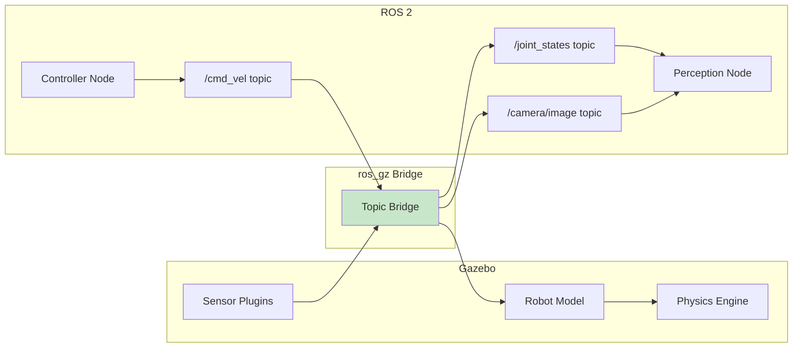
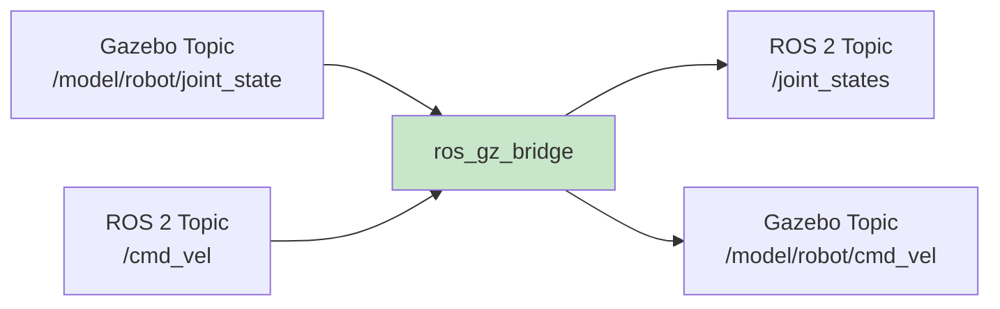

# Chapter 9: Simulating Your First Robot in Gazebo

<!-- DIAGRAM: id="ch09-ros-gz-bridge" type="architecture" format="mermaid"
     description="ROS 2 to Gazebo communication architecture" -->



## Learning Objectives

By the end of this chapter, you will be able to:

1. **Create robot descriptions** in URDF and convert to SDF
2. **Load and spawn robots** in Gazebo simulation
3. **Connect Gazebo to ROS 2** using the ros_gz bridge
4. **Simulate sensors** including cameras, IMU, and LiDAR
5. **Control robot joints** from ROS 2 nodes

## Prerequisites

Before starting this chapter, ensure you have:

- Completed Chapter 8: Gazebo Simulation Basics
- Working Gazebo installation
- ROS 2 Humble with ros_gz packages
- Understanding of URDF from Chapter 7

## Introduction

In Chapter 8, you learned Gazebo basics with static worlds. Now we'll bring a robot to life. You'll learn to describe robots, spawn them in Gazebo, connect to ROS 2, and control them—the core workflow for Physical AI development.

## Robot Description Formats

### URDF vs. SDF

| Feature | URDF | SDF |
|---------|------|-----|
| **Origin** | ROS ecosystem | Gazebo native |
| **Scope** | Robot only | Robot + world |
| **Physics** | Limited | Comprehensive |
| **Sensors** | Via Gazebo plugins | Native support |
| **Use** | ROS tools (RViz, MoveIt) | Simulation |

**Best practice**: Write URDF for ROS compatibility, convert to SDF for Gazebo.

### Simple Robot URDF

```xml
<?xml version="1.0"?>
<robot name="simple_arm">
    <!-- Base Link -->
    <link name="base_link">
        <visual>
            <geometry>
                <cylinder radius="0.1" length="0.05"/>
            </geometry>
            <material name="gray">
                <color rgba="0.5 0.5 0.5 1"/>
            </material>
        </visual>
        <collision>
            <geometry>
                <cylinder radius="0.1" length="0.05"/>
            </geometry>
        </collision>
        <inertial>
            <mass value="1.0"/>
            <inertia ixx="0.003" iyy="0.003" izz="0.005"
                     ixy="0" ixz="0" iyz="0"/>
        </inertial>
    </link>

    <!-- Arm Link -->
    <link name="arm_link">
        <visual>
            <origin xyz="0 0 0.25"/>
            <geometry>
                <box size="0.05 0.05 0.5"/>
            </geometry>
            <material name="blue">
                <color rgba="0.2 0.2 0.8 1"/>
            </material>
        </visual>
        <collision>
            <origin xyz="0 0 0.25"/>
            <geometry>
                <box size="0.05 0.05 0.5"/>
            </geometry>
        </collision>
        <inertial>
            <mass value="0.5"/>
            <origin xyz="0 0 0.25"/>
            <inertia ixx="0.01" iyy="0.01" izz="0.001"
                     ixy="0" ixz="0" iyz="0"/>
        </inertial>
    </link>

    <!-- Joint -->
    <joint name="arm_joint" type="revolute">
        <parent link="base_link"/>
        <child link="arm_link"/>
        <origin xyz="0 0 0.025"/>
        <axis xyz="0 1 0"/>
        <limit lower="-1.57" upper="1.57"
               effort="100" velocity="1.0"/>
    </joint>
</robot>
```

### Adding Gazebo Elements

Add Gazebo-specific elements to URDF:

```xml
<!-- Add after </robot> closing tag or use xacro -->
<gazebo reference="base_link">
    <material>Gazebo/Gray</material>
</gazebo>

<gazebo reference="arm_link">
    <material>Gazebo/Blue</material>
</gazebo>

<!-- Joint transmission for control -->
<transmission name="arm_transmission">
    <type>transmission_interface/SimpleTransmission</type>
    <joint name="arm_joint">
        <hardwareInterface>hardware_interface/PositionJointInterface</hardwareInterface>
    </joint>
    <actuator name="arm_motor">
        <hardwareInterface>hardware_interface/PositionJointInterface</hardwareInterface>
        <mechanicalReduction>1</mechanicalReduction>
    </actuator>
</transmission>
```

### Converting URDF to SDF

```bash
# Using gz tool
gz sdf -p robot.urdf > robot.sdf

# Or use xacro first
xacro robot.urdf.xacro > robot.urdf
gz sdf -p robot.urdf > robot.sdf
```

## Spawning Robots in Gazebo

### Method 1: Include in World File

```xml
<world name="robot_world">
    <!-- World elements... -->

    <!-- Include robot -->
    <include>
        <uri>model://simple_arm</uri>
        <pose>0 0 0.1 0 0 0</pose>
    </include>
</world>
```

### Method 2: Spawn via Service

```bash
# From command line
gz service -s /world/default/create \
    --reqtype gz.msgs.EntityFactory \
    --reptype gz.msgs.Boolean \
    --timeout 1000 \
    --req 'sdf_filename: "/path/to/robot.sdf", name: "my_robot", pose: {position: {z: 0.5}}'
```

### Method 3: Using ros_gz_sim

```bash
# ROS 2 spawn service
ros2 run ros_gz_sim create \
    -world default \
    -file /path/to/robot.sdf \
    -name my_robot \
    -x 0 -y 0 -z 0.5
```

## The ros_gz Bridge

The ros_gz bridge connects Gazebo topics to ROS 2 topics.

### Installing ros_gz

```bash
sudo apt install ros-humble-ros-gz
```

### Bridge Architecture



### Running the Bridge

```bash
# Bridge a single topic
ros2 run ros_gz_bridge parameter_bridge \
    /model/robot/joint_state@sensor_msgs/msg/JointState[gz.msgs.Model

# Bridge with bidirectional communication
ros2 run ros_gz_bridge parameter_bridge \
    /cmd_vel@geometry_msgs/msg/Twist]gz.msgs.Twist

# Using a configuration file (recommended)
ros2 run ros_gz_bridge parameter_bridge \
    --ros-args -p config_file:=bridge_config.yaml
```

### Bridge Configuration File

```yaml
# bridge_config.yaml
- ros_topic_name: "/joint_states"
  gz_topic_name: "/world/default/model/robot/joint_state"
  ros_type_name: "sensor_msgs/msg/JointState"
  gz_type_name: "gz.msgs.Model"
  direction: GZ_TO_ROS

- ros_topic_name: "/cmd_vel"
  gz_topic_name: "/model/robot/cmd_vel"
  ros_type_name: "geometry_msgs/msg/Twist"
  gz_type_name: "gz.msgs.Twist"
  direction: ROS_TO_GZ

- ros_topic_name: "/camera/image_raw"
  gz_topic_name: "/camera"
  ros_type_name: "sensor_msgs/msg/Image"
  gz_type_name: "gz.msgs.Image"
  direction: GZ_TO_ROS

- ros_topic_name: "/imu"
  gz_topic_name: "/imu"
  ros_type_name: "sensor_msgs/msg/Imu"
  gz_type_name: "gz.msgs.IMU"
  direction: GZ_TO_ROS
```

## Simulating Sensors

### Adding a Camera

```xml
<link name="camera_link">
    <pose>0.2 0 0.1 0 0 0</pose>
    <visual name="visual">
        <geometry>
            <box size="0.02 0.05 0.02"/>
        </geometry>
    </visual>
    <sensor name="camera" type="camera">
        <always_on>1</always_on>
        <update_rate>30</update_rate>
        <visualize>true</visualize>
        <topic>camera</topic>
        <camera>
            <horizontal_fov>1.047</horizontal_fov>
            <image>
                <width>640</width>
                <height>480</height>
                <format>R8G8B8</format>
            </image>
            <clip>
                <near>0.1</near>
                <far>100</far>
            </clip>
        </camera>
    </sensor>
</link>

<joint name="camera_joint" type="fixed">
    <parent>base_link</parent>
    <child>camera_link</child>
</joint>
```

### Adding an IMU

```xml
<link name="imu_link">
    <pose>0 0 0.05 0 0 0</pose>
    <sensor name="imu_sensor" type="imu">
        <always_on>1</always_on>
        <update_rate>100</update_rate>
        <visualize>true</visualize>
        <topic>imu</topic>
        <imu>
            <angular_velocity>
                <x>
                    <noise type="gaussian">
                        <mean>0.0</mean>
                        <stddev>0.01</stddev>
                    </noise>
                </x>
                <y>
                    <noise type="gaussian">
                        <mean>0.0</mean>
                        <stddev>0.01</stddev>
                    </noise>
                </y>
                <z>
                    <noise type="gaussian">
                        <mean>0.0</mean>
                        <stddev>0.01</stddev>
                    </noise>
                </z>
            </angular_velocity>
            <linear_acceleration>
                <x>
                    <noise type="gaussian">
                        <mean>0.0</mean>
                        <stddev>0.1</stddev>
                    </noise>
                </x>
                <y>
                    <noise type="gaussian">
                        <mean>0.0</mean>
                        <stddev>0.1</stddev>
                    </noise>
                </y>
                <z>
                    <noise type="gaussian">
                        <mean>0.0</mean>
                        <stddev>0.1</stddev>
                    </noise>
                </z>
            </linear_acceleration>
        </imu>
    </sensor>
</link>
```

### Adding a LiDAR

```xml
<link name="lidar_link">
    <pose>0 0 0.3 0 0 0</pose>
    <visual name="visual">
        <geometry>
            <cylinder radius="0.03" length="0.05"/>
        </geometry>
    </visual>
    <sensor name="lidar" type="gpu_lidar">
        <always_on>1</always_on>
        <update_rate>10</update_rate>
        <visualize>true</visualize>
        <topic>lidar</topic>
        <lidar>
            <scan>
                <horizontal>
                    <samples>640</samples>
                    <resolution>1</resolution>
                    <min_angle>-3.14159</min_angle>
                    <max_angle>3.14159</max_angle>
                </horizontal>
                <vertical>
                    <samples>1</samples>
                    <resolution>1</resolution>
                    <min_angle>0</min_angle>
                    <max_angle>0</max_angle>
                </vertical>
            </scan>
            <range>
                <min>0.1</min>
                <max>30.0</max>
                <resolution>0.01</resolution>
            </range>
        </lidar>
    </sensor>
</link>
```

### Adding Force/Torque Sensor

```xml
<joint name="wrist_joint" type="revolute">
    <parent>forearm_link</parent>
    <child>hand_link</child>
    <axis>
        <xyz>0 0 1</xyz>
    </axis>
    <sensor name="wrist_ft" type="force_torque">
        <always_on>true</always_on>
        <update_rate>100</update_rate>
        <visualize>true</visualize>
        <topic>wrist_ft</topic>
        <force_torque>
            <frame>child</frame>
            <measure_direction>child_to_parent</measure_direction>
        </force_torque>
    </sensor>
</joint>
```

## Controlling Robot Joints

### Joint Position Controller Plugin

Add to your model:

```xml
<plugin
    filename="gz-sim-joint-position-controller-system"
    name="gz::sim::systems::JointPositionController">
    <joint_name>arm_joint</joint_name>
    <topic>arm_joint_cmd</topic>
    <p_gain>100.0</p_gain>
    <i_gain>0.1</i_gain>
    <d_gain>10.0</d_gain>
</plugin>
```

### Joint State Publisher Plugin

```xml
<plugin
    filename="gz-sim-joint-state-publisher-system"
    name="gz::sim::systems::JointStatePublisher">
    <joint_name>arm_joint</joint_name>
    <joint_name>gripper_joint</joint_name>
</plugin>
```

### Controlling from ROS 2

```python
#!/usr/bin/env python3
"""Control robot joints in Gazebo from ROS 2."""

import rclpy
from rclpy.node import Node
from std_msgs.msg import Float64
import math


class JointController(Node):
    def __init__(self):
        super().__init__('joint_controller')

        # Publisher for joint command
        self.joint_pub = self.create_publisher(
            Float64,
            'arm_joint_cmd',
            10
        )

        # Timer for sinusoidal motion
        self.timer = self.create_timer(0.02, self.control_loop)  # 50 Hz
        self.time = 0.0

        self.get_logger().info('Joint controller started')

    def control_loop(self):
        """Send sinusoidal joint commands."""
        # Sinusoidal motion between -1 and 1 radian
        position = math.sin(self.time)

        msg = Float64()
        msg.data = position
        self.joint_pub.publish(msg)

        self.time += 0.02


def main(args=None):
    rclpy.init(args=args)
    node = JointController()
    rclpy.spin(node)
    node.destroy_node()
    rclpy.shutdown()
```

## Complete Launch File

```python
#!/usr/bin/env python3
"""Launch Gazebo with robot and ROS 2 bridge."""

import os
from ament_index_python.packages import get_package_share_directory
from launch import LaunchDescription
from launch.actions import DeclareLaunchArgument, IncludeLaunchDescription
from launch.launch_description_sources import PythonLaunchDescriptionSource
from launch.substitutions import LaunchConfiguration
from launch_ros.actions import Node


def generate_launch_description():
    pkg_share = get_package_share_directory('my_robot_pkg')

    # Paths
    world_file = os.path.join(pkg_share, 'worlds', 'robot_world.sdf')
    bridge_config = os.path.join(pkg_share, 'config', 'bridge_config.yaml')

    # Launch arguments
    use_sim_time = DeclareLaunchArgument(
        'use_sim_time',
        default_value='true'
    )

    # Gazebo
    gazebo = IncludeLaunchDescription(
        PythonLaunchDescriptionSource([
            os.path.join(
                get_package_share_directory('ros_gz_sim'),
                'launch', 'gz_sim.launch.py'
            )
        ]),
        launch_arguments={
            'gz_args': f'-r {world_file}'
        }.items()
    )

    # Spawn robot
    spawn_robot = Node(
        package='ros_gz_sim',
        executable='create',
        arguments=[
            '-world', 'robot_world',
            '-file', os.path.join(pkg_share, 'models', 'robot.sdf'),
            '-name', 'my_robot',
            '-x', '0', '-y', '0', '-z', '0.1'
        ],
        output='screen'
    )

    # ROS-Gazebo bridge
    bridge = Node(
        package='ros_gz_bridge',
        executable='parameter_bridge',
        parameters=[{'config_file': bridge_config}],
        output='screen'
    )

    # Robot state publisher
    robot_state_publisher = Node(
        package='robot_state_publisher',
        executable='robot_state_publisher',
        parameters=[{
            'robot_description': open(
                os.path.join(pkg_share, 'urdf', 'robot.urdf')
            ).read(),
            'use_sim_time': LaunchConfiguration('use_sim_time')
        }]
    )

    # RViz
    rviz = Node(
        package='rviz2',
        executable='rviz2',
        arguments=['-d', os.path.join(pkg_share, 'config', 'robot.rviz')],
        parameters=[{'use_sim_time': LaunchConfiguration('use_sim_time')}]
    )

    return LaunchDescription([
        use_sim_time,
        gazebo,
        spawn_robot,
        bridge,
        robot_state_publisher,
        rviz
    ])
```

## Working with Humanoid Models

### Available Humanoid Models

| Model | Source | Features |
|-------|--------|----------|
| **NAO** | Aldebaran | 25 DOF, small |
| **iCub** | IIT | 53 DOF, research |
| **WALK-MAN** | IIT | 33 DOF, disaster response |
| **Valkyrie** | NASA | 44 DOF, space exploration |

### Loading a Humanoid

```xml
<include>
    <uri>https://fuel.gazebosim.org/1.0/OpenRobotics/models/NAO</uri>
    <pose>0 0 0.4 0 0 0</pose>
</include>
```

### Humanoid-Specific Considerations

1. **Balance**: Humanoids need active balance control
2. **Many joints**: Consider joint grouping
3. **Contact**: Foot contact sensing is critical
4. **Real-time**: Control loops must be fast

## Debugging Simulation

### Common Issues and Solutions

| Issue | Cause | Solution |
|-------|-------|----------|
| Robot falls through floor | Missing collision | Add collision geometry |
| Unstable simulation | Time step too large | Reduce max_step_size |
| Robot explodes | Bad inertia values | Check inertia calculations |
| No sensor data | Wrong topic name | Check gz topic -l |
| Slow simulation | Complex meshes | Simplify collision geometry |

### Debugging Tools

```bash
# List all Gazebo topics
gz topic -l

# Echo sensor data
gz topic -e -t /camera

# Check simulation statistics
gz stats

# Visualize collision geometry
# In Gazebo GUI: View -> Collisions
```

## Hands-On Exercise

### Exercise 1: Two-Link Arm

1. Create a 2-DOF planar arm robot
2. Add joint position controllers for both joints
3. Bridge to ROS 2
4. Write a node that moves the arm in a circle

### Exercise 2: Mobile Robot with Sensors

1. Create a differential drive robot
2. Add camera, IMU, and LiDAR
3. Bridge all sensors to ROS 2
4. Visualize in RViz

### Exercise 3: Manipulation Task

1. Add a gripper to your arm
2. Place a box in the world
3. Write a node that picks up and moves the box
4. (Advanced) Add force sensing to detect grasp

## Key Concepts

| Term | Definition |
|------|------------|
| **URDF** | Unified Robot Description Format for ROS |
| **SDF** | Simulation Description Format for Gazebo |
| **ros_gz Bridge** | Connects Gazebo topics to ROS 2 |
| **Joint Controller** | Plugin that moves joints to commanded positions |
| **Sensor Plugin** | Simulates sensors and publishes data |
| **Spawn** | Creating a model instance in simulation |

## Chapter Summary

In this chapter, you learned:

1. **Robot description**: Creating URDF and SDF files for simulation.

2. **Spawning robots**: Multiple methods to add robots to Gazebo.

3. **The ros_gz bridge**: Connecting Gazebo to ROS 2 for data and commands.

4. **Sensor simulation**: Adding cameras, IMU, LiDAR, and force sensors.

5. **Joint control**: Using plugins and ROS 2 to control robot motion.

## What's Next

In [Chapter 10: Unity for Visualization](./ch10-unity-visualization), you'll learn to create beautiful visualizations of your robots using Unity, connected to ROS 2 for real-time data display.

## Further Reading

- [ros_gz Documentation](https://github.com/gazebosim/ros_gz) - Bridge documentation
- [Gazebo Sensor Plugins](https://gazebosim.org/api/sensors/7/index.html) - Sensor reference
- [URDF Tutorials](https://docs.ros.org/en/humble/Tutorials/Intermediate/URDF/URDF-Main.html) - ROS URDF docs
- [Fuel Models](https://app.gazebosim.org/fuel/models) - Pre-built models
