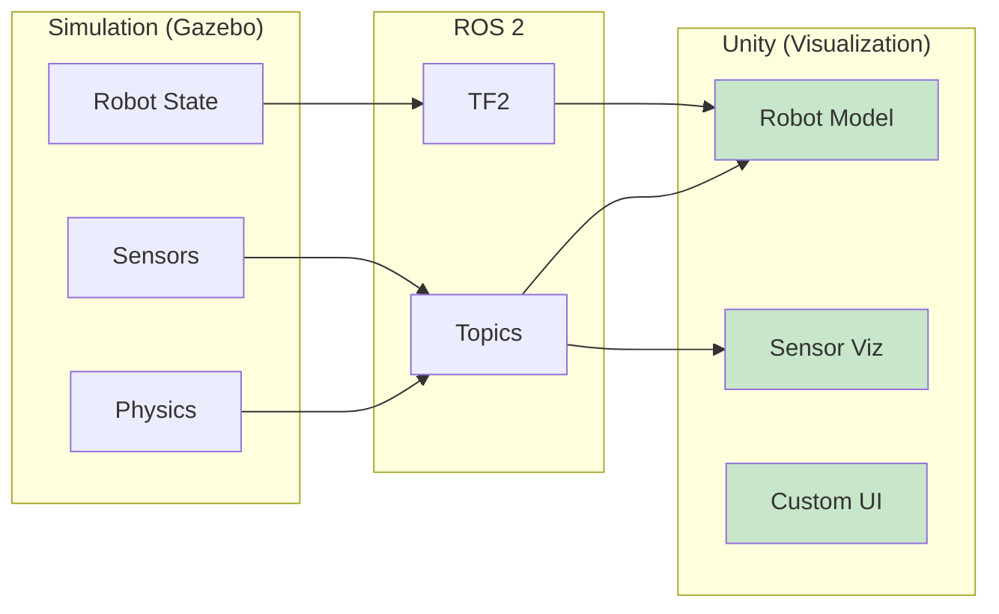
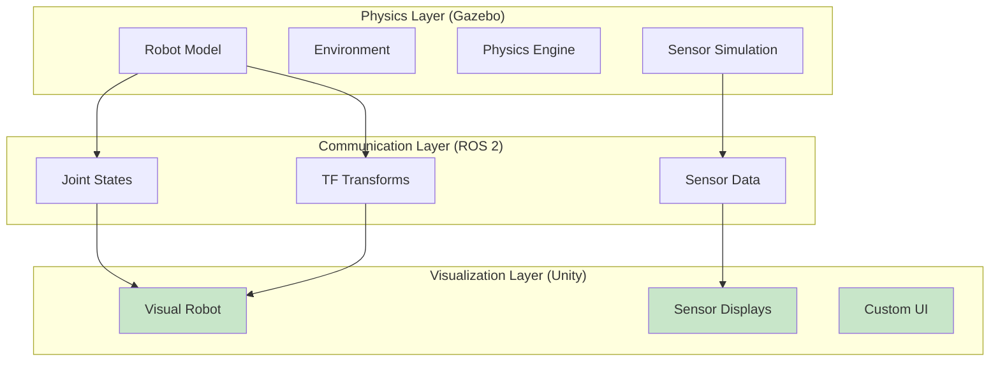

# Chapter 10: Unity for Visualization

<!-- DIAGRAM: id="ch10-unity-ros2" type="architecture" format="mermaid"
     description="Unity visualization connected to ROS 2 simulation" -->



## Learning Objectives

By the end of this chapter, you will be able to:

1. **Set up Unity with ROS 2 integration** using ROS-TCP-Connector
2. **Import and visualize robot models** from URDF
3. **Display real-time sensor data** including cameras, LiDAR, and IMU
4. **Create custom visualization interfaces** for robot monitoring
5. **Understand Unity's role** as visualization (not physics simulation)

## Prerequisites

Before starting this chapter, ensure you have:

- Completed Chapters 8 and 9
- Unity 2022.3 LTS installed
- Working Gazebo simulation with ROS 2 bridge
- Basic familiarity with Unity interface (optional but helpful)

## Introduction

While Gazebo excels at physics simulation, its visualization capabilities are basic. Unity, a powerful game engine, provides:

- **Photorealistic rendering**: Beautiful graphics and lighting
- **Flexible UI**: Custom interfaces and dashboards
- **Cross-platform**: Deploy to web, desktop, or VR/AR
- **Rich ecosystem**: Assets, plugins, and community

:::warning Visualization Only
Unity is for **visualization**, not physics simulation. Gazebo handles physics and sensor simulation; Unity displays results beautifully.
:::

## The Visualization Architecture



**Key principle**: Unity mirrors what Gazebo computes, creating a one-way data flow.

## Setting Up Unity

### Installing Unity

1. Download Unity Hub from [unity.com](https://unity.com)
2. Install Unity 2022.3 LTS
3. Include build support for your platform

### Creating a New Project

1. Open Unity Hub
2. Click "New Project"
3. Select "3D (URP)" template for best visuals
4. Name it "RobotVisualization"

### Installing ROS-TCP-Connector

1. Open Window → Package Manager
2. Click "+" → "Add package from git URL"
3. Enter: `https://github.com/Unity-Technologies/ROS-TCP-Connector.git?path=/com.unity.robotics.ros-tcp-connector`
4. Click "Add"

### Installing URDF Importer

1. In Package Manager, click "+" → "Add package from git URL"
2. Enter: `https://github.com/Unity-Technologies/URDF-Importer.git?path=/com.unity.robotics.urdf-importer`
3. Click "Add"

## ROS 2 Connection Setup

### ROS-TCP-Endpoint (ROS 2 Side)

Install the ROS 2 package:

```bash
# Clone the repository
cd ~/ros2_ws/src
git clone https://github.com/Unity-Technologies/ROS-TCP-Endpoint.git -b ROS2v0.7.0

# Build
cd ~/ros2_ws
colcon build --packages-select ros_tcp_endpoint
source install/setup.bash
```

### Running the Endpoint

```bash
ros2 run ros_tcp_endpoint default_server_endpoint --ros-args -p ROS_IP:=0.0.0.0
```

### Unity Configuration

1. Go to Robotics → ROS Settings
2. Set ROS IP Address to your ROS 2 machine IP
3. Set ROS Port to 10000 (default)
4. Select Protocol: ROS2

## Importing Robot Models

### URDF Import

1. Drag your URDF file into Unity's Assets folder
2. Select the URDF file
3. Right-click → Import Robot from URDF
4. Configure import settings:
   - Axis Type: Y-up (Unity standard)
   - Mesh Decomposer: VHACD (for complex meshes)

### Import Settings

```
URDF Import Settings:
├── Axis Type: Y Axis
├── Mesh Decomposer: VHACD
├── Collision Detection: Discrete
└── Convex Hull Generation: On
```

### Fixing Common Import Issues

| Issue | Solution |
|-------|----------|
| Wrong orientation | Check Axis Type setting |
| Missing textures | Copy texture files to Assets |
| Incorrect scale | URDF uses meters; verify scale |
| Mesh errors | Simplify mesh or adjust decomposer |

## Subscribing to ROS 2 Topics

### Joint State Subscriber

```csharp
// JointStateSubscriber.cs
using UnityEngine;
using Unity.Robotics.ROSTCPConnector;
using RosMessageTypes.Sensor;

public class JointStateSubscriber : MonoBehaviour
{
    public ArticulationBody[] joints;
    public string[] jointNames;

    void Start()
    {
        ROSConnection.GetOrCreateInstance().Subscribe<JointStateMsg>(
            "/joint_states",
            UpdateJoints
        );
    }

    void UpdateJoints(JointStateMsg msg)
    {
        for (int i = 0; i < msg.name.Length; i++)
        {
            // Find matching joint
            int jointIndex = System.Array.IndexOf(jointNames, msg.name[i]);
            if (jointIndex >= 0 && jointIndex < joints.Length)
            {
                // Update joint position
                var drive = joints[jointIndex].xDrive;
                drive.target = (float)msg.position[i] * Mathf.Rad2Deg;
                joints[jointIndex].xDrive = drive;
            }
        }
    }
}
```

### Camera Image Subscriber

```csharp
// CameraImageSubscriber.cs
using UnityEngine;
using UnityEngine.UI;
using Unity.Robotics.ROSTCPConnector;
using RosMessageTypes.Sensor;

public class CameraImageSubscriber : MonoBehaviour
{
    public RawImage displayImage;
    private Texture2D texture;

    void Start()
    {
        ROSConnection.GetOrCreateInstance().Subscribe<ImageMsg>(
            "/camera/image_raw",
            UpdateImage
        );
    }

    void UpdateImage(ImageMsg msg)
    {
        // Create or resize texture
        if (texture == null ||
            texture.width != (int)msg.width ||
            texture.height != (int)msg.height)
        {
            texture = new Texture2D(
                (int)msg.width,
                (int)msg.height,
                TextureFormat.RGB24,
                false
            );
        }

        // Load image data
        texture.LoadRawTextureData(msg.data);
        texture.Apply();

        // Update display
        displayImage.texture = texture;
    }
}
```

### LiDAR Point Cloud Subscriber

```csharp
// PointCloudSubscriber.cs
using UnityEngine;
using Unity.Robotics.ROSTCPConnector;
using RosMessageTypes.Sensor;

public class PointCloudSubscriber : MonoBehaviour
{
    public GameObject pointPrefab;
    public int maxPoints = 1000;
    public float pointScale = 0.02f;

    private GameObject[] points;
    private int pointIndex = 0;

    void Start()
    {
        // Pre-create point objects
        points = new GameObject[maxPoints];
        for (int i = 0; i < maxPoints; i++)
        {
            points[i] = Instantiate(pointPrefab, transform);
            points[i].transform.localScale = Vector3.one * pointScale;
            points[i].SetActive(false);
        }

        ROSConnection.GetOrCreateInstance().Subscribe<LaserScanMsg>(
            "/scan",
            UpdateScan
        );
    }

    void UpdateScan(LaserScanMsg msg)
    {
        // Deactivate all points
        foreach (var point in points)
            point.SetActive(false);

        pointIndex = 0;

        // Create points from scan
        float angle = msg.angle_min;
        foreach (float range in msg.ranges)
        {
            if (range > msg.range_min && range < msg.range_max)
            {
                if (pointIndex < maxPoints)
                {
                    float x = range * Mathf.Cos(angle);
                    float y = range * Mathf.Sin(angle);

                    points[pointIndex].transform.localPosition =
                        new Vector3(x, 0, y);
                    points[pointIndex].SetActive(true);
                    pointIndex++;
                }
            }
            angle += msg.angle_increment;
        }
    }
}
```

## TF Transform Visualization

### TF Subscriber

```csharp
// TFSubscriber.cs
using UnityEngine;
using Unity.Robotics.ROSTCPConnector;
using RosMessageTypes.Tf2;
using System.Collections.Generic;

public class TFSubscriber : MonoBehaviour
{
    public Dictionary<string, Transform> frameObjects =
        new Dictionary<string, Transform>();

    public GameObject framePrefab;

    void Start()
    {
        ROSConnection.GetOrCreateInstance().Subscribe<TFMessageMsg>(
            "/tf",
            UpdateTransforms
        );
    }

    void UpdateTransforms(TFMessageMsg msg)
    {
        foreach (var transform in msg.transforms)
        {
            string frameName = transform.child_frame_id;

            // Create frame object if needed
            if (!frameObjects.ContainsKey(frameName))
            {
                var obj = Instantiate(framePrefab, this.transform);
                obj.name = frameName;
                frameObjects[frameName] = obj.transform;
            }

            // Update position
            var pos = transform.transform.translation;
            frameObjects[frameName].localPosition =
                new Vector3((float)pos.x, (float)pos.z, (float)pos.y);

            // Update rotation (ROS to Unity conversion)
            var rot = transform.transform.rotation;
            frameObjects[frameName].localRotation = new Quaternion(
                (float)-rot.x,
                (float)-rot.z,
                (float)-rot.y,
                (float)rot.w
            );
        }
    }
}
```

## Creating Custom UI

### Robot Status Dashboard

```csharp
// RobotDashboard.cs
using UnityEngine;
using UnityEngine.UI;
using Unity.Robotics.ROSTCPConnector;
using RosMessageTypes.Std;
using RosMessageTypes.Geometry;

public class RobotDashboard : MonoBehaviour
{
    [Header("UI Elements")]
    public Text statusText;
    public Slider batterySlider;
    public Text velocityText;
    public Image connectionIndicator;

    [Header("Settings")]
    public Color connectedColor = Color.green;
    public Color disconnectedColor = Color.red;

    private float lastMessageTime;
    private bool isConnected = false;

    void Start()
    {
        // Subscribe to status topics
        var ros = ROSConnection.GetOrCreateInstance();

        ros.Subscribe<StringMsg>("/robot_status", msg => {
            statusText.text = msg.data;
            lastMessageTime = Time.time;
        });

        ros.Subscribe<Float32Msg>("/battery_level", msg => {
            batterySlider.value = msg.data;
        });

        ros.Subscribe<TwistMsg>("/cmd_vel", msg => {
            velocityText.text = $"Lin: {msg.linear.x:F2} m/s\n" +
                               $"Ang: {msg.angular.z:F2} rad/s";
        });
    }

    void Update()
    {
        // Check connection status
        isConnected = (Time.time - lastMessageTime) < 2.0f;
        connectionIndicator.color = isConnected ?
            connectedColor : disconnectedColor;
    }
}
```

### Creating the Dashboard UI

1. Create UI Canvas (GameObject → UI → Canvas)
2. Add Panel for background
3. Add Text, Slider, Image elements
4. Attach RobotDashboard script
5. Connect UI elements in Inspector

## Advanced Visualizations

### Path Visualization

```csharp
// PathVisualizer.cs
using UnityEngine;
using Unity.Robotics.ROSTCPConnector;
using RosMessageTypes.Nav;

public class PathVisualizer : MonoBehaviour
{
    public LineRenderer lineRenderer;
    public Color pathColor = Color.green;
    public float pathWidth = 0.05f;

    void Start()
    {
        lineRenderer.startWidth = pathWidth;
        lineRenderer.endWidth = pathWidth;
        lineRenderer.material.color = pathColor;

        ROSConnection.GetOrCreateInstance().Subscribe<PathMsg>(
            "/planned_path",
            UpdatePath
        );
    }

    void UpdatePath(PathMsg msg)
    {
        lineRenderer.positionCount = msg.poses.Length;

        for (int i = 0; i < msg.poses.Length; i++)
        {
            var pose = msg.poses[i].pose.position;
            lineRenderer.SetPosition(i, new Vector3(
                (float)pose.x,
                0.01f, // Slightly above ground
                (float)pose.y
            ));
        }
    }
}
```

### 3D Marker Visualization

```csharp
// MarkerVisualizer.cs
using UnityEngine;
using Unity.Robotics.ROSTCPConnector;
using RosMessageTypes.Visualization;
using System.Collections.Generic;

public class MarkerVisualizer : MonoBehaviour
{
    public Material defaultMaterial;
    private Dictionary<string, GameObject> markers =
        new Dictionary<string, GameObject>();

    void Start()
    {
        ROSConnection.GetOrCreateInstance().Subscribe<MarkerMsg>(
            "/visualization_marker",
            UpdateMarker
        );
    }

    void UpdateMarker(MarkerMsg msg)
    {
        string id = $"{msg.ns}_{msg.id}";

        switch (msg.action)
        {
            case MarkerMsg.ADD:
                CreateOrUpdateMarker(id, msg);
                break;
            case MarkerMsg.DELETE:
                DeleteMarker(id);
                break;
            case MarkerMsg.DELETEALL:
                DeleteAllMarkers();
                break;
        }
    }

    void CreateOrUpdateMarker(string id, MarkerMsg msg)
    {
        if (!markers.ContainsKey(id))
        {
            markers[id] = CreateMarkerObject(msg);
        }

        UpdateMarkerObject(markers[id], msg);
    }

    GameObject CreateMarkerObject(MarkerMsg msg)
    {
        GameObject obj;

        switch (msg.type)
        {
            case MarkerMsg.CUBE:
                obj = GameObject.CreatePrimitive(PrimitiveType.Cube);
                break;
            case MarkerMsg.SPHERE:
                obj = GameObject.CreatePrimitive(PrimitiveType.Sphere);
                break;
            case MarkerMsg.CYLINDER:
                obj = GameObject.CreatePrimitive(PrimitiveType.Cylinder);
                break;
            default:
                obj = new GameObject();
                break;
        }

        obj.transform.parent = transform;
        return obj;
    }

    void UpdateMarkerObject(GameObject obj, MarkerMsg msg)
    {
        // Position
        obj.transform.localPosition = new Vector3(
            (float)msg.pose.position.x,
            (float)msg.pose.position.z,
            (float)msg.pose.position.y
        );

        // Scale
        obj.transform.localScale = new Vector3(
            (float)msg.scale.x,
            (float)msg.scale.z,
            (float)msg.scale.y
        );

        // Color
        var renderer = obj.GetComponent<Renderer>();
        if (renderer != null)
        {
            renderer.material.color = new Color(
                msg.color.r,
                msg.color.g,
                msg.color.b,
                msg.color.a
            );
        }
    }

    void DeleteMarker(string id)
    {
        if (markers.ContainsKey(id))
        {
            Destroy(markers[id]);
            markers.Remove(id);
        }
    }

    void DeleteAllMarkers()
    {
        foreach (var marker in markers.Values)
        {
            Destroy(marker);
        }
        markers.Clear();
    }
}
```

## Complete Unity Scene Setup

### Recommended Hierarchy

```
Scene
├── Main Camera
├── Directional Light
├── Environment
│   ├── Ground Plane
│   └── Skybox
├── Robot
│   ├── URDF Model (imported)
│   ├── JointStateSubscriber
│   └── TFSubscriber
├── Visualizations
│   ├── PointCloud
│   ├── PathVisualizer
│   └── MarkerVisualizer
├── UI
│   ├── Canvas
│   │   ├── Dashboard
│   │   └── CameraView
│   └── RobotDashboard
└── ROSConnection
```

### Lighting Setup

For best visuals:

1. Use URP (Universal Render Pipeline)
2. Add HDRI skybox for environment lighting
3. Configure directional light for shadows
4. Use post-processing for effects

## Launch Integration

### Complete Launch File

```python
#!/usr/bin/env python3
"""Launch Gazebo, ROS 2 bridge, and Unity endpoint."""

from launch import LaunchDescription
from launch.actions import ExecuteProcess, IncludeLaunchDescription
from launch_ros.actions import Node


def generate_launch_description():
    # Gazebo simulation
    gazebo = IncludeLaunchDescription(
        PythonLaunchDescriptionSource([
            get_package_share_directory('ros_gz_sim'),
            '/launch/gz_sim.launch.py'
        ]),
        launch_arguments={'gz_args': '-r robot_world.sdf'}.items()
    )

    # ROS-Gazebo bridge
    gz_bridge = Node(
        package='ros_gz_bridge',
        executable='parameter_bridge',
        parameters=[{'config_file': 'bridge_config.yaml'}]
    )

    # Unity TCP endpoint
    unity_endpoint = Node(
        package='ros_tcp_endpoint',
        executable='default_server_endpoint',
        parameters=[{'ROS_IP': '0.0.0.0'}]
    )

    return LaunchDescription([
        gazebo,
        gz_bridge,
        unity_endpoint
    ])
```

## Performance Optimization

### Unity Performance Tips

| Issue | Solution |
|-------|----------|
| Slow framerate | Reduce point cloud density |
| Memory leaks | Pool and reuse GameObjects |
| Network lag | Batch message updates |
| Large textures | Compress camera images |

### Message Throttling

```csharp
// Throttle high-frequency messages
public class ThrottledSubscriber : MonoBehaviour
{
    public float updateInterval = 0.033f; // 30 Hz
    private float lastUpdate = 0;

    void ProcessMessage(SensorMsg msg)
    {
        if (Time.time - lastUpdate > updateInterval)
        {
            // Process message
            lastUpdate = Time.time;
        }
    }
}
```

## Hands-On Exercise

### Exercise 1: Basic Visualization

1. Import a simple robot URDF into Unity
2. Subscribe to /joint_states
3. Visualize the robot matching Gazebo simulation
4. Add a camera view from the robot's camera

### Exercise 2: Sensor Dashboard

Create a dashboard showing:
1. Robot camera feed
2. LiDAR scan visualization
3. IMU orientation (3D arrows or numbers)
4. Battery level and status

### Exercise 3: Interactive Control

1. Add UI buttons to send velocity commands
2. Create a virtual joystick
3. Publish to /cmd_vel topic
4. Control the Gazebo robot from Unity UI

## Key Concepts

| Term | Definition |
|------|------------|
| **ROS-TCP-Connector** | Unity package for ROS 2 communication |
| **URDF Importer** | Converts URDF to Unity format |
| **ArticulationBody** | Unity component for robot joints |
| **ROSConnection** | Singleton managing ROS 2 connection |
| **Visualization-only** | Unity displays but doesn't simulate physics |

## Chapter Summary

In this chapter, you learned:

1. **Unity's role**: Visualization layer, not physics simulation.

2. **ROS 2 integration**: Using ROS-TCP-Connector and Endpoint.

3. **URDF import**: Bringing robot models into Unity.

4. **Sensor visualization**: Displaying cameras, LiDAR, and IMU data.

5. **Custom UI**: Creating dashboards and interactive elements.

## What's Next

Congratulations on completing Module 2! You now have a complete simulation pipeline: Gazebo for physics, ROS 2 for communication, and Unity for visualization.

In [Module 3: NVIDIA Isaac](../module-3-isaac/), you'll explore GPU-accelerated simulation, photorealistic rendering, and machine learning integration with NVIDIA Isaac Sim.

## Further Reading

- [Unity Robotics Hub](https://github.com/Unity-Technologies/Unity-Robotics-Hub) - Official tutorials
- [ROS-TCP-Connector](https://github.com/Unity-Technologies/ROS-TCP-Connector) - Package documentation
- [URDF Importer](https://github.com/Unity-Technologies/URDF-Importer) - Import documentation
- [Unity URP](https://docs.unity3d.com/Packages/com.unity.render-pipelines.universal@14.0/manual/index.html) - Rendering pipeline
