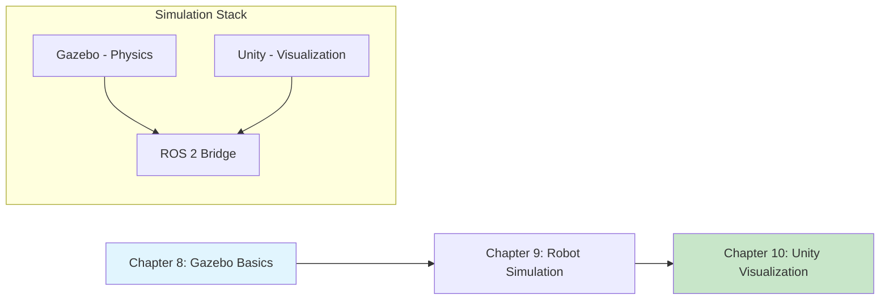

# Module 2: Gazebo & Unity Simulation

**Focus**: Physics simulation and visualization for humanoid robot development

<!-- DIAGRAM: id="module-2-overview" type="architecture" format="mermaid"
     description="Overview of Module 2 showing simulation tools and their roles" -->



## Module Overview

Simulation is the cornerstone of modern robotics development. It allows you to develop, test, and refine algorithms without risking expensive hardware or waiting for physical robots. In this module, you'll master Gazebo for physics simulation and learn to use Unity for enhanced visualization.

**Key Technologies Covered**: Gazebo Harmonic, ROS 2 integration, URDF/SDF, Unity visualization

:::note Simulation-First Approach
This book uses simulation throughout. All examples run in Gazebo—no physical robot required. This lets you experiment freely, fail safely, and iterate quickly.
:::

## Why Simulation?

| Benefit | Description |
|---------|-------------|
| **Safety** | Robots can fall, crash, and fail without damage |
| **Speed** | Run thousands of experiments in parallel |
| **Cost** | No hardware wear, no consumables |
| **Reproducibility** | Reset to exact conditions for testing |
| **Exploration** | Try scenarios impossible in reality |

## Learning Path

This module teaches you to:

1. **Set up and configure Gazebo** for humanoid simulation
2. **Create and control simulated robots** in realistic physics environments
3. **Visualize robots with Unity** for enhanced presentation

## Chapters in This Module

### [Chapter 8: Gazebo Simulation Basics](./ch08-gazebo-basics)

Get started with Gazebo, the open-source robotics simulator. Learn to create worlds, add models, and understand the simulation architecture.

**Learning Objectives**:
- Install and configure Gazebo Harmonic
- Create and populate simulation worlds
- Understand SDF (Simulation Description Format)
- Use Gazebo's built-in tools and plugins

---

### [Chapter 9: Simulating Your First Robot in Gazebo](./ch09-robot-simulation)

Bring a robot to life in simulation. Load robot models, connect to ROS 2, and control your first simulated humanoid.

**Learning Objectives**:
- Load and spawn robots in Gazebo
- Connect Gazebo to ROS 2 for control and sensing
- Simulate sensors (cameras, IMU, force/torque)
- Control robot joints from ROS 2 nodes

---

### [Chapter 10: Unity for Visualization](./ch10-unity-visualization)

Use Unity to create beautiful visualizations of robot behavior. Connect Unity to ROS 2 for real-time data display.

**Learning Objectives**:
- Set up Unity with ROS 2 integration
- Visualize robot state and sensor data
- Create custom visualization interfaces
- Understand Unity's role (visualization, not control)

## Prerequisites

Before starting this module, you should have:

- Completed Module 1: ROS 2 Middleware
- Working ROS 2 Humble installation
- Basic understanding of 3D coordinate systems
- Familiarity with URDF from Chapter 7

## Development Environment

This module uses:

| Tool | Version | Purpose |
|------|---------|---------|
| **Gazebo** | Harmonic (or Fortress) | Physics simulation |
| **ROS 2** | Humble | Robot communication |
| **Unity** | 2022.3 LTS | Visualization |
| **ros2_gz** | Latest | Gazebo-ROS 2 bridge |

### Docker Setup

```bash
cd docker
docker-compose up gazebo-sim
```

## What You'll Build

By the end of this module, you will have:

1. A working Gazebo simulation environment
2. Simulated humanoid robot responding to ROS 2 commands
3. Sensor simulation (cameras, LiDAR, IMU)
4. Unity visualization connected to your robot
5. Skills to develop and test robot algorithms safely

## Module Timeline

| Chapter | Estimated Time | Difficulty |
|---------|---------------|------------|
| Chapter 8: Gazebo Basics | 3 hours | Beginner |
| Chapter 9: Robot Simulation | 4 hours | Intermediate |
| Chapter 10: Unity Visualization | 3 hours | Intermediate |

**Total Module Time**: ~10 hours

## Gazebo vs. Isaac Sim

| Aspect | Gazebo | Isaac Sim |
|--------|--------|-----------|
| **Best For** | ROS 2 integration, general robotics | ML training, photorealism |
| **Physics** | ODE/Bullet/DART | PhysX 5 |
| **Rendering** | Basic | Photorealistic (RTX) |
| **Cost** | Free, open source | Free (non-commercial) |
| **GPU Required** | No | Yes (NVIDIA) |

We use Gazebo in this module for its excellent ROS 2 integration. Module 3 covers NVIDIA Isaac Sim for machine learning workflows.

## Code Repository

All code examples for this module are in:

```bash
code-examples/module-2-simulation/
├── ch08_gazebo_basics/
├── ch09_robot_simulation/
└── ch10_unity_viz/
```

:::tip Getting Started
Start with Chapter 8 to set up Gazebo. Each chapter builds on the previous one.
:::
