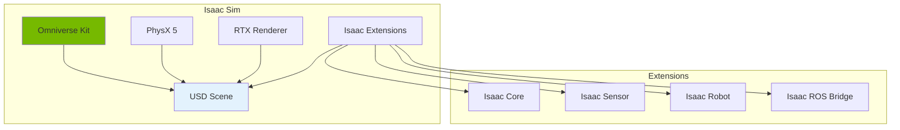
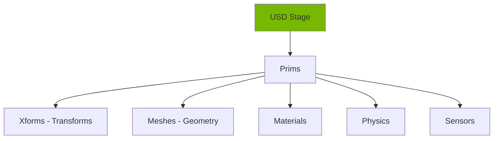

# Chapter 11: Isaac Sim Setup & Interface

<!-- DIAGRAM: id="ch11-isaac-architecture" type="architecture" format="mermaid"
     description="NVIDIA Isaac Sim architecture and components" -->



## Learning Objectives

By the end of this chapter, you will be able to:

1. **Install Isaac Sim** on local machine or access via cloud
2. **Understand Omniverse architecture** and USD scene format
3. **Navigate the Isaac Sim interface** confidently
4. **Load and manipulate robots** in simulation
5. **Connect Isaac Sim to ROS 2** for robot control

## Prerequisites

Before starting this chapter, ensure you have:

- Completed Module 2: Gazebo & Unity Simulation
- NVIDIA GPU with RTX capabilities (or cloud access)
- Ubuntu 22.04 LTS
- NVIDIA drivers 525+ installed
- Basic familiarity with 3D software interfaces

## Introduction

NVIDIA Isaac Sim represents the next generation of robotics simulation. Built on the Omniverse platform, it provides:

- **Photorealistic rendering** using RTX ray tracing
- **Accurate physics** with PhysX 5
- **GPU acceleration** for massive parallelism
- **ML integration** for training and inference
- **Domain randomization** for sim-to-real transfer

This chapter gets you up and running with Isaac Sim.

## System Requirements

### Local Installation

| Component | Minimum | Recommended |
|-----------|---------|-------------|
| **OS** | Ubuntu 20.04/22.04 | Ubuntu 22.04 |
| **GPU** | RTX 2070 | RTX 3080+ |
| **VRAM** | 8 GB | 16+ GB |
| **RAM** | 32 GB | 64 GB |
| **Storage** | 50 GB SSD | 100+ GB NVMe |
| **Driver** | 525.60+ | Latest |

### Check Your GPU

```bash
# Check NVIDIA driver
nvidia-smi

# Verify GPU capabilities
nvidia-smi --query-gpu=name,memory.total,driver_version --format=csv
```

## Installation Methods

### Method 1: Omniverse Launcher (Recommended)

1. **Download Omniverse Launcher**
   ```bash
   # Download from NVIDIA
   wget https://install.launcher.omniverse.nvidia.com/installers/omniverse-launcher-linux.AppImage

   # Make executable
   chmod +x omniverse-launcher-linux.AppImage

   # Run
   ./omniverse-launcher-linux.AppImage
   ```

2. **Install Isaac Sim via Launcher**
   - Open Omniverse Launcher
   - Go to Exchange tab
   - Search for "Isaac Sim"
   - Click Install
   - Wait for download (~15 GB)

3. **Launch Isaac Sim**
   - Go to Library tab
   - Click Launch on Isaac Sim

### Method 2: Container Installation

```bash
# Pull Isaac Sim container
docker pull nvcr.io/nvidia/isaac-sim:2023.1.1

# Run with GPU support
docker run --name isaac-sim --entrypoint bash -it --gpus all \
    -e "ACCEPT_EULA=Y" \
    -e "PRIVACY_CONSENT=Y" \
    -v ~/docker/isaac-sim/cache/kit:/isaac-sim/kit/cache:rw \
    -v ~/docker/isaac-sim/cache/ov:/root/.cache/ov:rw \
    -v ~/docker/isaac-sim/cache/pip:/root/.cache/pip:rw \
    -v ~/docker/isaac-sim/cache/glcache:/root/.cache/nvidia/GLCache:rw \
    -v ~/docker/isaac-sim/cache/computecache:/root/.nv/ComputeCache:rw \
    -v ~/docker/isaac-sim/logs:/root/.nvidia-omniverse/logs:rw \
    -v ~/docker/isaac-sim/data:/root/.local/share/ov/data:rw \
    -v ~/docker/isaac-sim/documents:/root/Documents:rw \
    nvcr.io/nvidia/isaac-sim:2023.1.1
```

### Method 3: Cloud Access (NGC)

For users without compatible hardware:

1. Sign up for [NVIDIA NGC](https://ngc.nvidia.com)
2. Access Isaac Sim via cloud workstation
3. Connect via browser or streaming client

## Omniverse Architecture

### Understanding USD

**Universal Scene Description (USD)** is the file format for Isaac Sim:



| Concept | Description |
|---------|-------------|
| **Stage** | The entire scene/world |
| **Prim** | Any object in the scene |
| **Xform** | Transform (position, rotation, scale) |
| **Layer** | Non-destructive scene composition |
| **Reference** | Include external USD files |

### Key Extensions

Isaac Sim functionality comes from extensions:

| Extension | Purpose |
|-----------|---------|
| `omni.isaac.core` | Core simulation control |
| `omni.isaac.robot` | Robot loading and control |
| `omni.isaac.sensor` | Sensor simulation |
| `omni.isaac.ros2_bridge` | ROS 2 integration |
| `omni.isaac.gym` | RL environment tools |
| `omni.replicator` | Synthetic data generation |

## Interface Tour

### Main Window Layout

```
┌─────────────────────────────────────────────────────────────┐
│  Menu Bar                                                    │
├─────────────┬─────────────────────────────┬─────────────────┤
│             │                             │                 │
│  Stage      │      Viewport               │   Property      │
│  (Scene     │      (3D View)              │   (Inspector)   │
│  Hierarchy) │                             │                 │
│             │                             │                 │
├─────────────┴─────────────────────────────┴─────────────────┤
│  Content Browser / Console / Timeline                        │
└─────────────────────────────────────────────────────────────┘
```

### Essential Panels

| Panel | Purpose |
|-------|---------|
| **Stage** | Scene hierarchy, select objects |
| **Viewport** | 3D visualization, camera control |
| **Property** | Edit selected object properties |
| **Content Browser** | Access assets and files |
| **Console** | Python scripting, logs |

### Viewport Navigation

| Action | Control |
|--------|---------|
| **Orbit** | Alt + Left Mouse |
| **Pan** | Alt + Middle Mouse |
| **Zoom** | Alt + Right Mouse / Scroll |
| **Focus** | F key (focus on selection) |
| **Frame All** | Home key |

## Loading Your First Robot

### Using the GUI

1. Go to **Isaac Utils → Workflows → URDF Importer**
2. Select your URDF file
3. Configure import settings:
   - Fix Base Link: Enable for fixed-base robots
   - Self Collision: Enable for accurate physics
4. Click **Import**

### Using Python Script

```python
# isaac_robot_loader.py
from omni.isaac.kit import SimulationApp

# Initialize simulation
simulation_app = SimulationApp({"headless": False})

from omni.isaac.core import World
from omni.isaac.core.robots import Robot
from omni.isaac.core.utils.stage import add_reference_to_stage
from omni.isaac.core.utils.nucleus import get_assets_root_path

# Create world
world = World(stage_units_in_meters=1.0)

# Get assets path
assets_root = get_assets_root_path()

# Add ground plane
world.scene.add_default_ground_plane()

# Add robot
robot_prim_path = "/World/Robot"
robot_usd = assets_root + "/Isaac/Robots/Humanoid/humanoid.usd"

add_reference_to_stage(usd_path=robot_usd, prim_path=robot_prim_path)

# Create robot controller
robot = world.scene.add(
    Robot(
        prim_path=robot_prim_path,
        name="humanoid",
        position=[0, 0, 1.0]
    )
)

# Reset world
world.reset()

# Run simulation
while simulation_app.is_running():
    world.step(render=True)

simulation_app.close()
```

### Running Python Scripts

```bash
# From Isaac Sim directory
./python.sh path/to/script.py

# Or with full path
~/.local/share/ov/pkg/isaac_sim-2023.1.1/python.sh script.py
```

## Core Simulation Concepts

### World and Physics

```python
from omni.isaac.core import World

# Create world with physics settings
world = World(
    stage_units_in_meters=1.0,
    physics_dt=1.0/60.0,          # Physics step: 60 Hz
    rendering_dt=1.0/60.0,        # Rendering: 60 Hz
    backend="numpy"               # numpy or torch
)

# Step simulation
world.step(render=True)  # With rendering
world.step(render=False) # Headless (faster)
```

### Physics Properties

```python
from pxr import UsdPhysics

# Access physics properties
stage = world.stage
prim = stage.GetPrimAtPath("/World/Robot/base_link")

# Add rigid body
rigid_body = UsdPhysics.RigidBodyAPI.Apply(prim)

# Add mass
mass_api = UsdPhysics.MassAPI.Apply(prim)
mass_api.CreateMassAttr().Set(10.0)  # 10 kg

# Add collision
collision = UsdPhysics.CollisionAPI.Apply(prim)
```

### Articulation (Robot) Control

```python
from omni.isaac.core.articulations import Articulation

# Get articulation
robot = Articulation(prim_path="/World/Robot")
robot.initialize()

# Get joint info
num_dof = robot.num_dof
joint_names = robot.dof_names
print(f"Robot has {num_dof} DOFs: {joint_names}")

# Set joint positions
target_positions = [0.0] * num_dof
robot.set_joint_positions(target_positions)

# Set joint velocities
target_velocities = [0.5] * num_dof
robot.set_joint_velocities(target_velocities)

# Apply joint efforts (torques)
efforts = [10.0] * num_dof
robot.set_joint_efforts(efforts)
```

## Connecting to ROS 2

### Enable ROS 2 Bridge

1. In Isaac Sim menu: **Isaac Utils → ROS 2 → Enable Extension**
2. Or via Python:

```python
from omni.isaac.core.utils.extensions import enable_extension
enable_extension("omni.isaac.ros2_bridge")
```

### Publishing Robot State

```python
from omni.isaac.ros2_bridge import ROS2Bridge
import omni.graph.core as og

# Create action graph for ROS 2 publishing
keys = og.Controller.Keys

og.Controller.edit(
    {"graph_path": "/ActionGraph", "evaluator_name": "execution"},
    {
        keys.CREATE_NODES: [
            ("OnPlaybackTick", "omni.graph.action.OnPlaybackTick"),
            ("ROS2Context", "omni.isaac.ros2_bridge.ROS2Context"),
            ("JointStatePublisher", "omni.isaac.ros2_bridge.ROS2PublishJointState"),
        ],
        keys.SET_VALUES: [
            ("ROS2Context.inputs:domain_id", 0),
            ("JointStatePublisher.inputs:topicName", "joint_states"),
            ("JointStatePublisher.inputs:targetPrim", "/World/Robot"),
        ],
        keys.CONNECT: [
            ("OnPlaybackTick.outputs:tick", "JointStatePublisher.inputs:execIn"),
            ("ROS2Context.outputs:context", "JointStatePublisher.inputs:context"),
        ],
    },
)
```

### Subscribing to Commands

```python
# Add joint command subscriber
og.Controller.edit(
    {"graph_path": "/ActionGraph"},
    {
        keys.CREATE_NODES: [
            ("JointCommandSubscriber", "omni.isaac.ros2_bridge.ROS2SubscribeJointState"),
            ("ArticulationController", "omni.isaac.core_nodes.IsaacArticulationController"),
        ],
        keys.SET_VALUES: [
            ("JointCommandSubscriber.inputs:topicName", "joint_commands"),
            ("ArticulationController.inputs:targetPrim", "/World/Robot"),
        ],
        keys.CONNECT: [
            ("OnPlaybackTick.outputs:tick", "JointCommandSubscriber.inputs:execIn"),
            ("JointCommandSubscriber.outputs:jointPositions", "ArticulationController.inputs:positionCommand"),
        ],
    },
)
```

## Saving and Loading Scenes

### Save Scene

```python
# Save current stage
stage = world.stage
stage.Export("my_scene.usd")

# Or via menu: File → Save As
```

### Load Scene

```python
from omni.isaac.core.utils.stage import open_stage

# Load existing scene
open_stage("my_scene.usd")

# Reinitialize world
world = World()
world.reset()
```

## Headless Mode

For training and batch processing:

```python
from omni.isaac.kit import SimulationApp

# Start headless
simulation_app = SimulationApp({"headless": True})

# ... simulation code ...

# Enable rendering for debugging
simulation_app.update()  # Process one frame with rendering

simulation_app.close()
```

### Command Line

```bash
# Run script headless
./python.sh script.py --headless

# With specific GPU
CUDA_VISIBLE_DEVICES=0 ./python.sh script.py --headless
```

## Hands-On Exercise

### Exercise 1: Load and Explore

1. Launch Isaac Sim
2. Load the Franka robot from assets
3. Explore the stage hierarchy
4. Identify joints and links
5. Manually pose the robot using the GUI

### Exercise 2: Python Control

Write a script that:
1. Loads a robot
2. Prints all joint names and limits
3. Moves each joint through its range
4. Saves the scene

### Exercise 3: ROS 2 Integration

1. Enable ROS 2 bridge
2. Publish joint states to `/joint_states`
3. Verify with `ros2 topic echo`
4. Subscribe to `/joint_commands`
5. Control robot from ROS 2 node

## Key Concepts

| Term | Definition |
|------|------------|
| **Omniverse** | NVIDIA's platform for 3D collaboration |
| **USD** | Universal Scene Description file format |
| **Stage** | The complete scene in Isaac Sim |
| **Prim** | Any object in the scene hierarchy |
| **Extension** | Plugin that adds functionality |
| **PhysX** | NVIDIA's physics simulation engine |
| **Action Graph** | Visual programming for behavior |

## Chapter Summary

In this chapter, you learned:

1. **Installation options**: Local, container, or cloud deployment.

2. **Omniverse architecture**: USD scenes, prims, and extensions.

3. **Interface navigation**: Panels, viewports, and controls.

4. **Robot loading**: GUI and Python methods for importing robots.

5. **ROS 2 integration**: Connecting Isaac Sim to ROS 2 ecosystem.

## What's Next

In [Chapter 12: Perception with Isaac](./ch12-perception), you'll use Isaac Sim's photorealistic rendering to generate synthetic training data for perception models.

## Further Reading

- [Isaac Sim Documentation](https://docs.omniverse.nvidia.com/isaacsim/latest/) - Official docs
- [Omniverse USD](https://docs.omniverse.nvidia.com/usd/latest/) - USD reference
- [Isaac ROS](https://nvidia-isaac-ros.github.io/) - ROS 2 integration
- [Omniverse Forums](https://forums.developer.nvidia.com/c/omniverse/) - Community support
