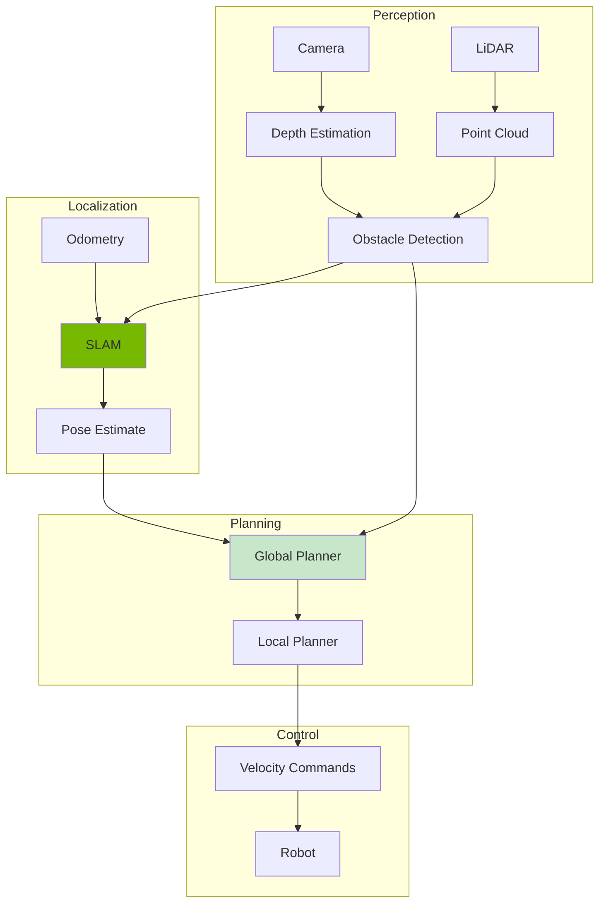
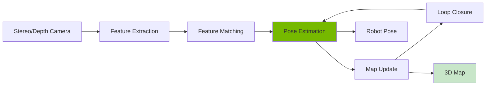
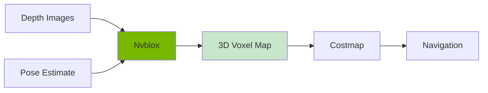

# Chapter 13: Navigation with Isaac ROS

<!-- DIAGRAM: id="ch13-navigation-stack" type="architecture" format="mermaid"
     description="Isaac ROS navigation stack architecture" -->



## Learning Objectives

By the end of this chapter, you will be able to:

1. **Set up Isaac ROS** for navigation in Isaac Sim
2. **Implement SLAM** for mapping and localization
3. **Configure Nav2** for autonomous navigation
4. **Create navigation behaviors** for humanoid robots
5. **Handle obstacles** using perception-based navigation

## Prerequisites

Before starting this chapter, ensure you have:

- Completed Chapters 11 and 12
- Working Isaac Sim with ROS 2 bridge
- Understanding of ROS 2 navigation concepts (Module 1)
- Familiarity with coordinate transforms (TF2)

## Introduction

Autonomous navigation is fundamental for mobile robots and humanoids. Isaac ROS provides GPU-accelerated navigation components that integrate with Nav2, the standard ROS 2 navigation stack.

Key Isaac ROS navigation packages:
- **Isaac ROS Visual SLAM**: GPU-accelerated visual SLAM
- **Isaac ROS Nvblox**: 3D reconstruction for obstacle avoidance
- **Isaac ROS Freespace Segmentation**: Traversable area detection
- **Isaac ROS Depth Estimation**: Stereo depth from cameras

## Isaac ROS Navigation Packages

### Installation

```bash
# Add Isaac ROS apt repository
sudo apt update && sudo apt install -y software-properties-common
sudo add-apt-repository --yes ppa:nvidia/isaac-ros

# Install navigation packages
sudo apt install ros-humble-isaac-ros-visual-slam
sudo apt install ros-humble-isaac-ros-nvblox
sudo apt install ros-humble-isaac-ros-freespace-segmentation
```

### Docker Alternative

```bash
# Pull Isaac ROS container
docker pull nvcr.io/nvidia/isaac/ros:humble-nav2_2023.0.0-aarch64

# Run with GPU
docker run -it --rm --gpus all \
    -v /dev:/dev \
    --network host \
    nvcr.io/nvidia/isaac/ros:humble-nav2_2023.0.0-aarch64
```

## Setting Up Simulation for Navigation

### World with Navigation Features

```python
# navigation_world.py
from omni.isaac.kit import SimulationApp
simulation_app = SimulationApp({"headless": False})

from omni.isaac.core import World
from omni.isaac.core.utils.stage import add_reference_to_stage
from omni.isaac.wheeled_robots.robots import WheeledRobot
from omni.isaac.sensor import Camera, Lidar

# Create world
world = World(stage_units_in_meters=1.0)
world.scene.add_default_ground_plane()

# Add warehouse environment
add_reference_to_stage(
    "omniverse://localhost/NVIDIA/Assets/Isaac/Environments/Simple_Warehouse/warehouse.usd",
    "/World/Environment"
)

# Add robot
robot = world.scene.add(
    WheeledRobot(
        prim_path="/World/Robot",
        name="navigation_robot",
        wheel_dof_names=["left_wheel_joint", "right_wheel_joint"],
        create_robot=True,
        usd_path="path/to/diff_drive_robot.usd",
        position=[0, 0, 0.1]
    )
)

# Add camera
camera = Camera(
    prim_path="/World/Robot/base_link/camera",
    frequency=30,
    resolution=(640, 480)
)

# Add LiDAR
lidar = world.scene.add(
    Lidar(
        prim_path="/World/Robot/base_link/lidar",
        name="lidar",
        frequency=10,
        rotation_frequency=10,
        high_lod=True,
        horizontal_fov=360,
        vertical_fov=30,
        min_range=0.1,
        max_range=30.0
    )
)

# Enable ROS 2 bridge
from omni.isaac.ros2_bridge import enable_ros2_bridge
enable_ros2_bridge()

# Run simulation
world.reset()
while simulation_app.is_running():
    world.step(render=True)

simulation_app.close()
```

### ROS 2 Bridge Configuration

```python
import omni.graph.core as og

# Create action graph for navigation
keys = og.Controller.Keys

og.Controller.edit(
    {"graph_path": "/NavActionGraph", "evaluator_name": "execution"},
    {
        keys.CREATE_NODES: [
            ("OnPlaybackTick", "omni.graph.action.OnPlaybackTick"),
            ("ROS2Context", "omni.isaac.ros2_bridge.ROS2Context"),

            # Odometry publisher
            ("OdometryPub", "omni.isaac.ros2_bridge.ROS2PublishOdometry"),

            # LaserScan publisher
            ("LaserScanPub", "omni.isaac.ros2_bridge.ROS2PublishLaserScan"),

            # TF publisher
            ("TFPub", "omni.isaac.ros2_bridge.ROS2PublishTransformTree"),

            # Velocity subscriber
            ("CmdVelSub", "omni.isaac.ros2_bridge.ROS2SubscribeTwist"),

            # Differential drive controller
            ("DiffDrive", "omni.isaac.wheeled_robots.DifferentialController"),
        ],
        keys.SET_VALUES: [
            ("OdometryPub.inputs:topicName", "odom"),
            ("LaserScanPub.inputs:topicName", "scan"),
            ("CmdVelSub.inputs:topicName", "cmd_vel"),
            ("DiffDrive.inputs:wheelDistance", 0.5),
            ("DiffDrive.inputs:wheelRadius", 0.1),
        ],
        keys.CONNECT: [
            ("OnPlaybackTick.outputs:tick", "OdometryPub.inputs:execIn"),
            ("OnPlaybackTick.outputs:tick", "LaserScanPub.inputs:execIn"),
            ("OnPlaybackTick.outputs:tick", "TFPub.inputs:execIn"),
            ("OnPlaybackTick.outputs:tick", "CmdVelSub.inputs:execIn"),
            ("CmdVelSub.outputs:linearVelocity", "DiffDrive.inputs:linearVelocity"),
            ("CmdVelSub.outputs:angularVelocity", "DiffDrive.inputs:angularVelocity"),
        ],
    },
)
```

## Visual SLAM with Isaac ROS

### Understanding Visual SLAM



### Isaac ROS Visual SLAM Launch

```python
# visual_slam.launch.py
from launch import LaunchDescription
from launch_ros.actions import Node
from launch.actions import DeclareLaunchArgument
from launch.substitutions import LaunchConfiguration

def generate_launch_description():
    use_sim_time = LaunchConfiguration('use_sim_time', default='true')

    return LaunchDescription([
        DeclareLaunchArgument(
            'use_sim_time',
            default_value='true'
        ),

        # Isaac ROS Visual SLAM
        Node(
            package='isaac_ros_visual_slam',
            executable='visual_slam_node',
            parameters=[{
                'use_sim_time': use_sim_time,
                'denoise_input_images': False,
                'rectified_images': True,
                'enable_slam_visualization': True,
                'enable_observations_view': True,
                'enable_landmarks_view': True,
                'map_frame': 'map',
                'odom_frame': 'odom',
                'base_frame': 'base_link',
            }],
            remappings=[
                ('stereo_camera/left/image', '/camera/left/image_raw'),
                ('stereo_camera/left/camera_info', '/camera/left/camera_info'),
                ('stereo_camera/right/image', '/camera/right/image_raw'),
                ('stereo_camera/right/camera_info', '/camera/right/camera_info'),
            ]
        ),

        # TF publisher for visual odometry
        Node(
            package='tf2_ros',
            executable='static_transform_publisher',
            arguments=['0', '0', '0', '0', '0', '0', 'base_link', 'camera_link']
        ),
    ])
```

### Running Visual SLAM

```bash
# Terminal 1: Isaac Sim with navigation world
./python.sh navigation_world.py

# Terminal 2: Visual SLAM
ros2 launch isaac_ros_visual_slam visual_slam.launch.py

# Terminal 3: Visualize in RViz
ros2 run rviz2 rviz2 -d navigation.rviz
```

## Nvblox for 3D Reconstruction

### What is Nvblox?

Nvblox creates a 3D voxel map for obstacle avoidance:



### Nvblox Configuration

```yaml
# nvblox_params.yaml
nvblox_node:
  ros__parameters:
    # Map parameters
    voxel_size: 0.05  # 5cm voxels
    esdf: true  # Euclidean signed distance field
    esdf_2d: true  # For 2D costmap

    # Integration parameters
    max_tsdf_update_hz: 10.0
    max_color_update_hz: 5.0
    max_mesh_update_hz: 5.0
    max_esdf_update_hz: 10.0

    # Frames
    global_frame: "map"

    # Sensor parameters
    max_integration_distance: 7.0
```

### Nvblox Launch

```python
# nvblox.launch.py
from launch import LaunchDescription
from launch_ros.actions import Node

def generate_launch_description():
    return LaunchDescription([
        Node(
            package='nvblox_ros',
            executable='nvblox_node',
            parameters=['nvblox_params.yaml'],
            remappings=[
                ('depth/image', '/camera/depth/image_raw'),
                ('depth/camera_info', '/camera/depth/camera_info'),
                ('color/image', '/camera/rgb/image_raw'),
                ('color/camera_info', '/camera/rgb/camera_info'),
            ]
        ),

        # Convert to costmap
        Node(
            package='nvblox_ros',
            executable='nvblox_costmap_node',
            parameters=[{
                'resolution': 0.05,
                'width': 200,
                'height': 200,
            }]
        ),
    ])
```

## Nav2 Integration

### Nav2 Configuration for Isaac ROS

```yaml
# nav2_params.yaml
bt_navigator:
  ros__parameters:
    use_sim_time: True
    global_frame: map
    robot_base_frame: base_link
    odom_topic: /odom
    default_nav_to_pose_bt_xml: navigate_to_pose_w_replanning.xml
    plugin_lib_names:
      - nav2_compute_path_to_pose_action_bt_node
      - nav2_follow_path_action_bt_node
      - nav2_back_up_action_bt_node
      - nav2_spin_action_bt_node
      - nav2_wait_action_bt_node
      - nav2_clear_costmap_service_bt_node

controller_server:
  ros__parameters:
    use_sim_time: True
    controller_frequency: 20.0
    controller_plugins: ["FollowPath"]
    FollowPath:
      plugin: "dwb_core::DWBLocalPlanner"
      min_vel_x: 0.0
      min_vel_y: 0.0
      max_vel_x: 0.5
      max_vel_y: 0.0
      max_vel_theta: 1.0
      min_speed_xy: 0.0
      max_speed_xy: 0.5
      min_speed_theta: 0.0

planner_server:
  ros__parameters:
    use_sim_time: True
    planner_plugins: ["GridBased"]
    GridBased:
      plugin: "nav2_navfn_planner/NavfnPlanner"
      tolerance: 0.5
      use_astar: false

local_costmap:
  local_costmap:
    ros__parameters:
      use_sim_time: True
      update_frequency: 5.0
      publish_frequency: 2.0
      global_frame: odom
      robot_base_frame: base_link
      rolling_window: true
      width: 3
      height: 3
      resolution: 0.05
      plugins: ["nvblox_layer", "inflation_layer"]
      nvblox_layer:
        plugin: "nvblox::NvbloxCostmapLayer"
      inflation_layer:
        plugin: "nav2_costmap_2d::InflationLayer"
        inflation_radius: 0.5

global_costmap:
  global_costmap:
    ros__parameters:
      use_sim_time: True
      update_frequency: 1.0
      publish_frequency: 1.0
      global_frame: map
      robot_base_frame: base_link
      resolution: 0.05
      plugins: ["static_layer", "nvblox_layer", "inflation_layer"]
      static_layer:
        plugin: "nav2_costmap_2d::StaticLayer"
        map_topic: /map
      nvblox_layer:
        plugin: "nvblox::NvbloxCostmapLayer"
      inflation_layer:
        plugin: "nav2_costmap_2d::InflationLayer"
        inflation_radius: 0.5
```

### Complete Navigation Launch

```python
# isaac_navigation.launch.py
import os
from launch import LaunchDescription
from launch.actions import IncludeLaunchDescription, DeclareLaunchArgument
from launch.launch_description_sources import PythonLaunchDescriptionSource
from launch.substitutions import LaunchConfiguration
from launch_ros.actions import Node
from ament_index_python.packages import get_package_share_directory

def generate_launch_description():
    pkg_share = get_package_share_directory('my_navigation_pkg')
    nav2_params = os.path.join(pkg_share, 'config', 'nav2_params.yaml')

    return LaunchDescription([
        DeclareLaunchArgument('use_sim_time', default_value='true'),

        # Visual SLAM
        IncludeLaunchDescription(
            PythonLaunchDescriptionSource([
                get_package_share_directory('isaac_ros_visual_slam'),
                '/launch/visual_slam.launch.py'
            ])
        ),

        # Nvblox
        IncludeLaunchDescription(
            PythonLaunchDescriptionSource([
                get_package_share_directory('nvblox_ros'),
                '/launch/nvblox.launch.py'
            ])
        ),

        # Nav2
        IncludeLaunchDescription(
            PythonLaunchDescriptionSource([
                get_package_share_directory('nav2_bringup'),
                '/launch/navigation_launch.py'
            ]),
            launch_arguments={
                'params_file': nav2_params,
                'use_sim_time': LaunchConfiguration('use_sim_time'),
            }.items()
        ),

        # RViz
        Node(
            package='rviz2',
            executable='rviz2',
            arguments=['-d', os.path.join(pkg_share, 'config', 'nav.rviz')],
        ),
    ])
```

## Navigation Behaviors

### Simple Navigation Node

```python
#!/usr/bin/env python3
"""Navigation behavior node for humanoid robot."""

import rclpy
from rclpy.node import Node
from rclpy.action import ActionClient
from nav2_msgs.action import NavigateToPose
from geometry_msgs.msg import PoseStamped
import math


class NavigationBehavior(Node):
    def __init__(self):
        super().__init__('navigation_behavior')

        # Nav2 action client
        self.nav_client = ActionClient(self, NavigateToPose, 'navigate_to_pose')

        self.get_logger().info('Waiting for Nav2...')
        self.nav_client.wait_for_server()
        self.get_logger().info('Nav2 ready!')

    def navigate_to(self, x, y, theta=0.0):
        """Navigate to a goal pose."""
        goal = NavigateToPose.Goal()

        goal.pose.header.frame_id = 'map'
        goal.pose.header.stamp = self.get_clock().now().to_msg()

        goal.pose.pose.position.x = x
        goal.pose.pose.position.y = y
        goal.pose.pose.orientation.z = math.sin(theta / 2)
        goal.pose.pose.orientation.w = math.cos(theta / 2)

        self.get_logger().info(f'Navigating to ({x}, {y}, {theta})')

        future = self.nav_client.send_goal_async(
            goal,
            feedback_callback=self.feedback_callback
        )
        future.add_done_callback(self.goal_response_callback)

    def goal_response_callback(self, future):
        goal_handle = future.result()
        if not goal_handle.accepted:
            self.get_logger().warn('Goal rejected')
            return

        self.get_logger().info('Goal accepted')
        result_future = goal_handle.get_result_async()
        result_future.add_done_callback(self.result_callback)

    def feedback_callback(self, feedback_msg):
        feedback = feedback_msg.feedback
        current = feedback.current_pose.pose.position
        self.get_logger().info(
            f'Current position: ({current.x:.2f}, {current.y:.2f})'
        )

    def result_callback(self, future):
        result = future.result().result
        self.get_logger().info('Navigation completed!')


def main(args=None):
    rclpy.init(args=args)
    node = NavigationBehavior()

    # Navigate to waypoints
    waypoints = [
        (2.0, 0.0, 0.0),
        (2.0, 2.0, 1.57),
        (0.0, 2.0, 3.14),
        (0.0, 0.0, 0.0),
    ]

    for x, y, theta in waypoints:
        node.navigate_to(x, y, theta)
        rclpy.spin_once(node, timeout_sec=30.0)

    node.destroy_node()
    rclpy.shutdown()


if __name__ == '__main__':
    main()
```

### Patrol Behavior

```python
#!/usr/bin/env python3
"""Patrol behavior: continuously navigate between waypoints."""

import rclpy
from rclpy.node import Node
from rclpy.action import ActionClient
from nav2_msgs.action import NavigateToPose
from action_msgs.msg import GoalStatus


class PatrolBehavior(Node):
    def __init__(self):
        super().__init__('patrol_behavior')

        self.nav_client = ActionClient(self, NavigateToPose, 'navigate_to_pose')
        self.nav_client.wait_for_server()

        # Patrol waypoints
        self.waypoints = [
            {'x': 2.0, 'y': 0.0, 'theta': 0.0},
            {'x': 2.0, 'y': 2.0, 'theta': 1.57},
            {'x': 0.0, 'y': 2.0, 'theta': 3.14},
            {'x': 0.0, 'y': 0.0, 'theta': -1.57},
        ]
        self.current_waypoint = 0

        # Start patrol
        self.navigate_to_waypoint()

    def navigate_to_waypoint(self):
        wp = self.waypoints[self.current_waypoint]

        goal = NavigateToPose.Goal()
        goal.pose.header.frame_id = 'map'
        goal.pose.header.stamp = self.get_clock().now().to_msg()
        goal.pose.pose.position.x = wp['x']
        goal.pose.pose.position.y = wp['y']

        import math
        goal.pose.pose.orientation.z = math.sin(wp['theta'] / 2)
        goal.pose.pose.orientation.w = math.cos(wp['theta'] / 2)

        self.get_logger().info(f'Navigating to waypoint {self.current_waypoint}')

        future = self.nav_client.send_goal_async(goal)
        future.add_done_callback(self.goal_response_callback)

    def goal_response_callback(self, future):
        goal_handle = future.result()
        if goal_handle.accepted:
            result_future = goal_handle.get_result_async()
            result_future.add_done_callback(self.result_callback)

    def result_callback(self, future):
        status = future.result().status

        if status == GoalStatus.STATUS_SUCCEEDED:
            self.get_logger().info(f'Reached waypoint {self.current_waypoint}')

            # Move to next waypoint
            self.current_waypoint = (self.current_waypoint + 1) % len(self.waypoints)
            self.navigate_to_waypoint()
        else:
            self.get_logger().warn('Navigation failed, retrying...')
            self.navigate_to_waypoint()


def main(args=None):
    rclpy.init(args=args)
    node = PatrolBehavior()
    rclpy.spin(node)
    node.destroy_node()
    rclpy.shutdown()
```

## Hands-On Exercise

### Exercise 1: Basic Navigation

1. Set up Isaac Sim with a warehouse environment
2. Add a differential drive robot with LiDAR
3. Configure ros2_bridge for navigation
4. Run Nav2 and navigate to a goal using RViz

### Exercise 2: Visual SLAM Mapping

1. Configure Isaac ROS Visual SLAM
2. Teleoperate the robot to map the environment
3. Save the generated map
4. Use the map for localization

### Exercise 3: Custom Patrol

Create a patrol behavior that:
1. Visits 5 waypoints in sequence
2. Waits 5 seconds at each waypoint
3. Logs arrival times
4. Handles navigation failures gracefully

## Key Concepts

| Term | Definition |
|------|------------|
| **Visual SLAM** | Simultaneous localization and mapping using cameras |
| **Nvblox** | GPU-accelerated 3D voxel reconstruction |
| **Costmap** | 2D grid representing navigation costs |
| **Nav2** | ROS 2 navigation stack |
| **Global Planner** | Plans path from start to goal |
| **Local Planner** | Executes path while avoiding obstacles |

## Chapter Summary

In this chapter, you learned:

1. **Isaac ROS navigation packages**: Visual SLAM, Nvblox, and Nav2 integration.

2. **Setting up navigation in simulation**: Configuring sensors and bridges.

3. **SLAM and mapping**: Using Isaac ROS Visual SLAM for localization.

4. **3D reconstruction**: Nvblox for obstacle-aware navigation.

5. **Navigation behaviors**: Creating autonomous navigation programs.

## What's Next

In [Chapter 14: Reinforcement Learning with Isaac Gym](./ch14-reinforcement-learning), you'll train control policies for humanoid locomotion using deep reinforcement learning.

## Further Reading

- [Isaac ROS Documentation](https://nvidia-isaac-ros.github.io/) - Official Isaac ROS docs
- [Nav2 Documentation](https://navigation.ros.org/) - ROS 2 navigation stack
- [Nvblox Paper](https://arxiv.org/abs/2205.00272) - Technical details
- [Visual SLAM Overview](https://www.slambook.org/) - SLAM fundamentals
