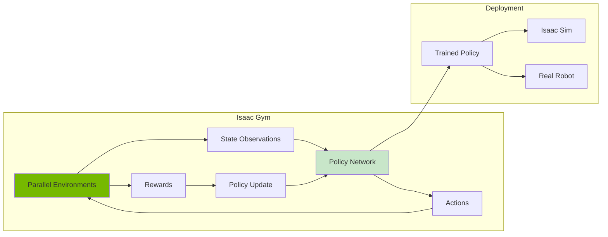
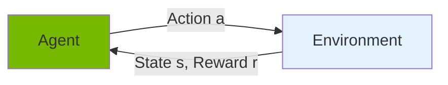
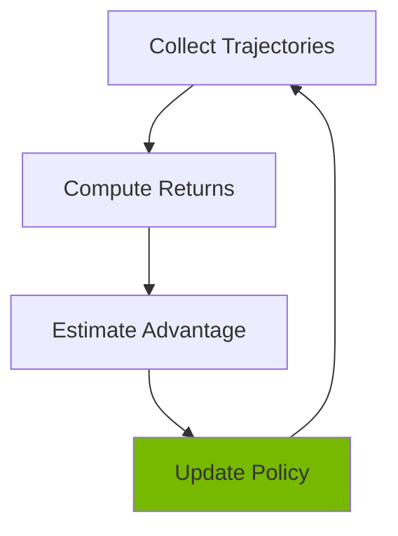

# Chapter 14: Reinforcement Learning with Isaac Gym

<!-- DIAGRAM: id="ch14-rl-pipeline" type="architecture" format="mermaid"
     description="Reinforcement learning pipeline for humanoid control" -->



## Learning Objectives

By the end of this chapter, you will be able to:

1. **Understand reinforcement learning** fundamentals for robotics
2. **Set up Isaac Gym** for parallel robot training
3. **Design reward functions** for locomotion and manipulation
4. **Train humanoid walking policies** using PPO
5. **Transfer learned policies** to Isaac Sim and beyond

## Prerequisites

Before starting this chapter, ensure you have:

- Completed Chapters 11-13
- NVIDIA GPU with 8+ GB VRAM
- Basic understanding of neural networks
- Familiarity with PyTorch

## Introduction

Reinforcement learning (RL) has revolutionized robot control. Instead of hand-coding behaviors, RL algorithms learn optimal policies through trial and error. **Isaac Gym** makes this practical by running thousands of parallel simulations on GPU.

Key advantages:
- **Massive parallelism**: 4,096+ environments simultaneously
- **Fast physics**: GPU-accelerated simulation
- **End-to-end training**: Sensors → Policy → Actions on GPU
- **Sim-to-real transfer**: Domain randomization built-in

## RL Fundamentals for Robotics

### The RL Framework



| Term | Robotics Context |
|------|-----------------|
| **State** | Robot joint positions, velocities, sensor data |
| **Action** | Joint torques or position commands |
| **Reward** | Task performance (speed, stability, energy) |
| **Policy** | Neural network mapping states to actions |

### Policy Gradient Methods

For continuous control, we use policy gradient algorithms:



**PPO (Proximal Policy Optimization)** is the most common choice:
- Stable training
- Sample efficient
- Works well for locomotion

## Isaac Gym Setup

### Installation

```bash
# Download Isaac Gym from NVIDIA
# https://developer.nvidia.com/isaac-gym

# Extract and install
cd isaacgym/python
pip install -e .

# Verify installation
python examples/joint_monkey.py
```

### Verify GPU Training

```python
import torch

# Check GPU availability
print(f"CUDA available: {torch.cuda.is_available()}")
print(f"GPU: {torch.cuda.get_device_name(0)}")

# Test Isaac Gym
from isaacgym import gymapi
gym = gymapi.acquire_gym()
print("Isaac Gym initialized successfully!")
```

## Creating an RL Environment

### Environment Structure

```python
# humanoid_env.py
import torch
from isaacgym import gymapi, gymtorch
from isaacgym.torch_utils import *

class HumanoidEnv:
    def __init__(self, num_envs=4096, device='cuda:0'):
        self.num_envs = num_envs
        self.device = device

        # Initialize gym
        self.gym = gymapi.acquire_gym()

        # Simulation parameters
        self.dt = 1.0 / 60.0
        self.max_episode_length = 1000

        # Create simulation
        self._create_sim()
        self._create_envs()

        # Initialize buffers
        self._init_buffers()

    def _create_sim(self):
        """Create physics simulation."""
        sim_params = gymapi.SimParams()
        sim_params.dt = self.dt
        sim_params.substeps = 2
        sim_params.up_axis = gymapi.UP_AXIS_Z
        sim_params.gravity = gymapi.Vec3(0, 0, -9.81)

        # PhysX parameters
        sim_params.physx.solver_type = 1
        sim_params.physx.num_position_iterations = 4
        sim_params.physx.num_velocity_iterations = 1
        sim_params.physx.contact_offset = 0.01
        sim_params.physx.rest_offset = 0.0

        # GPU simulation
        sim_params.physx.use_gpu = True
        sim_params.use_gpu_pipeline = True

        self.sim = self.gym.create_sim(
            0, 0, gymapi.SIM_PHYSX, sim_params
        )

    def _create_envs(self):
        """Create parallel environments."""
        # Load humanoid asset
        asset_options = gymapi.AssetOptions()
        asset_options.fix_base_link = False
        asset_options.angular_damping = 0.01
        asset_options.linear_damping = 0.01

        humanoid_asset = self.gym.load_asset(
            self.sim,
            "assets/humanoid",
            "humanoid.urdf",
            asset_options
        )

        # Get asset properties
        self.num_dof = self.gym.get_asset_dof_count(humanoid_asset)
        self.num_bodies = self.gym.get_asset_rigid_body_count(humanoid_asset)

        # Environment spacing
        spacing = 2.0
        env_lower = gymapi.Vec3(-spacing, -spacing, 0.0)
        env_upper = gymapi.Vec3(spacing, spacing, spacing)

        # Create environments
        self.envs = []
        self.actors = []

        for i in range(self.num_envs):
            env = self.gym.create_env(self.sim, env_lower, env_upper, int(np.sqrt(self.num_envs)))

            # Initial pose
            pose = gymapi.Transform()
            pose.p = gymapi.Vec3(0, 0, 1.0)  # 1m above ground
            pose.r = gymapi.Quat(0, 0, 0, 1)

            actor = self.gym.create_actor(env, humanoid_asset, pose, f"humanoid_{i}", i, 1)

            self.envs.append(env)
            self.actors.append(actor)

        # Add ground plane
        plane_params = gymapi.PlaneParams()
        plane_params.normal = gymapi.Vec3(0, 0, 1)
        self.gym.add_ground(self.sim, plane_params)

    def _init_buffers(self):
        """Initialize tensor buffers."""
        # Prepare tensor access
        self.gym.prepare_sim(self.sim)

        # State tensors
        self.root_states = gymtorch.wrap_tensor(
            self.gym.acquire_actor_root_state_tensor(self.sim)
        )
        self.dof_states = gymtorch.wrap_tensor(
            self.gym.acquire_dof_state_tensor(self.sim)
        )

        # Separate position and velocity
        self.dof_pos = self.dof_states[:, 0].view(self.num_envs, self.num_dof)
        self.dof_vel = self.dof_states[:, 1].view(self.num_envs, self.num_dof)

        # Root position and orientation
        self.root_pos = self.root_states[:, 0:3].view(self.num_envs, 3)
        self.root_rot = self.root_states[:, 3:7].view(self.num_envs, 4)
        self.root_vel = self.root_states[:, 7:10].view(self.num_envs, 3)

        # Action buffer
        self.actions = torch.zeros(
            self.num_envs, self.num_dof,
            dtype=torch.float32, device=self.device
        )

        # Episode tracking
        self.episode_length = torch.zeros(
            self.num_envs, dtype=torch.int32, device=self.device
        )
        self.reset_buf = torch.zeros(
            self.num_envs, dtype=torch.bool, device=self.device
        )

    def get_observations(self):
        """Compute observations for policy."""
        self.gym.refresh_actor_root_state_tensor(self.sim)
        self.gym.refresh_dof_state_tensor(self.sim)

        obs = torch.cat([
            self.root_pos,           # 3: position
            self.root_rot,           # 4: orientation quaternion
            self.root_vel,           # 3: linear velocity
            self.dof_pos,            # N: joint positions
            self.dof_vel,            # N: joint velocities
        ], dim=-1)

        return obs

    def compute_reward(self):
        """Compute reward for current state."""
        # Forward velocity reward
        forward_vel = self.root_vel[:, 0]  # X velocity
        vel_reward = forward_vel

        # Stability reward (upright torso)
        up_vec = quat_rotate(self.root_rot, torch.tensor([0, 0, 1], device=self.device))
        upright_reward = up_vec[:, 2]  # Z component of up vector

        # Energy penalty
        energy_penalty = -0.01 * torch.sum(self.actions ** 2, dim=-1)

        # Total reward
        reward = vel_reward + 0.5 * upright_reward + energy_penalty

        return reward

    def check_termination(self):
        """Check for episode termination."""
        # Terminate if fallen (torso too low)
        fallen = self.root_pos[:, 2] < 0.5

        # Terminate if episode too long
        timeout = self.episode_length >= self.max_episode_length

        self.reset_buf = fallen | timeout

    def reset_idx(self, env_ids):
        """Reset specific environments."""
        # Reset root state
        self.root_states[env_ids, 0:3] = torch.tensor([0, 0, 1.0], device=self.device)
        self.root_states[env_ids, 3:7] = torch.tensor([0, 0, 0, 1], device=self.device)
        self.root_states[env_ids, 7:13] = 0

        # Reset DOF state
        self.dof_pos[env_ids] = 0
        self.dof_vel[env_ids] = 0

        # Apply resets
        env_ids_int32 = env_ids.to(dtype=torch.int32)
        self.gym.set_actor_root_state_tensor_indexed(
            self.sim,
            gymtorch.unwrap_tensor(self.root_states),
            gymtorch.unwrap_tensor(env_ids_int32),
            len(env_ids)
        )
        self.gym.set_dof_state_tensor_indexed(
            self.sim,
            gymtorch.unwrap_tensor(self.dof_states),
            gymtorch.unwrap_tensor(env_ids_int32),
            len(env_ids)
        )

        self.episode_length[env_ids] = 0

    def step(self, actions):
        """Execute one simulation step."""
        # Apply actions as joint torques
        self.actions = actions.clone()
        self.gym.set_dof_actuation_force_tensor(
            self.sim, gymtorch.unwrap_tensor(self.actions)
        )

        # Step simulation
        self.gym.simulate(self.sim)
        self.gym.fetch_results(self.sim, True)

        # Update episode length
        self.episode_length += 1

        # Compute observations and rewards
        obs = self.get_observations()
        reward = self.compute_reward()

        # Check termination
        self.check_termination()

        # Reset terminated environments
        reset_env_ids = self.reset_buf.nonzero(as_tuple=False).squeeze(-1)
        if len(reset_env_ids) > 0:
            self.reset_idx(reset_env_ids)

        return obs, reward, self.reset_buf, {}

    def render(self):
        """Render visualization."""
        self.gym.step_graphics(self.sim)
        self.gym.draw_viewer(self.viewer, self.sim, True)
```

## Policy Network

### Actor-Critic Architecture

```python
# policy.py
import torch
import torch.nn as nn

class ActorCritic(nn.Module):
    def __init__(self, obs_dim, action_dim, hidden_dims=[256, 256, 128]):
        super().__init__()

        # Shared feature extractor
        layers = []
        in_dim = obs_dim
        for hidden_dim in hidden_dims:
            layers.extend([
                nn.Linear(in_dim, hidden_dim),
                nn.ELU(),
            ])
            in_dim = hidden_dim
        self.features = nn.Sequential(*layers)

        # Actor (policy) head
        self.actor_mean = nn.Linear(hidden_dims[-1], action_dim)
        self.actor_logstd = nn.Parameter(torch.zeros(action_dim))

        # Critic (value) head
        self.critic = nn.Linear(hidden_dims[-1], 1)

        # Initialize weights
        self.apply(self._init_weights)

    def _init_weights(self, module):
        if isinstance(module, nn.Linear):
            nn.init.orthogonal_(module.weight, gain=np.sqrt(2))
            nn.init.constant_(module.bias, 0)

    def forward(self, obs):
        features = self.features(obs)
        return features

    def get_action(self, obs, deterministic=False):
        features = self.forward(obs)

        action_mean = self.actor_mean(features)
        action_std = self.actor_logstd.exp()

        if deterministic:
            return action_mean
        else:
            dist = torch.distributions.Normal(action_mean, action_std)
            action = dist.sample()
            return action

    def evaluate(self, obs, action):
        features = self.forward(obs)

        # Actor
        action_mean = self.actor_mean(features)
        action_std = self.actor_logstd.exp()
        dist = torch.distributions.Normal(action_mean, action_std)

        action_log_prob = dist.log_prob(action).sum(dim=-1)
        entropy = dist.entropy().sum(dim=-1)

        # Critic
        value = self.critic(features).squeeze(-1)

        return action_log_prob, entropy, value
```

## PPO Training

### PPO Algorithm

```python
# ppo.py
import torch
import torch.nn as nn
import torch.optim as optim

class PPO:
    def __init__(
        self,
        env,
        policy,
        lr=3e-4,
        gamma=0.99,
        gae_lambda=0.95,
        clip_range=0.2,
        value_coef=0.5,
        entropy_coef=0.01,
        max_grad_norm=0.5,
        n_epochs=10,
        batch_size=4096,
    ):
        self.env = env
        self.policy = policy
        self.gamma = gamma
        self.gae_lambda = gae_lambda
        self.clip_range = clip_range
        self.value_coef = value_coef
        self.entropy_coef = entropy_coef
        self.max_grad_norm = max_grad_norm
        self.n_epochs = n_epochs
        self.batch_size = batch_size

        self.optimizer = optim.Adam(policy.parameters(), lr=lr)

    def compute_gae(self, rewards, values, dones):
        """Compute Generalized Advantage Estimation."""
        advantages = torch.zeros_like(rewards)
        last_gae = 0

        for t in reversed(range(len(rewards))):
            if t == len(rewards) - 1:
                next_value = 0
            else:
                next_value = values[t + 1]

            delta = rewards[t] + self.gamma * next_value * (1 - dones[t]) - values[t]
            advantages[t] = last_gae = delta + self.gamma * self.gae_lambda * (1 - dones[t]) * last_gae

        returns = advantages + values
        return advantages, returns

    def update(self, rollout_buffer):
        """Update policy using collected rollout."""
        obs = rollout_buffer['obs']
        actions = rollout_buffer['actions']
        old_log_probs = rollout_buffer['log_probs']
        advantages = rollout_buffer['advantages']
        returns = rollout_buffer['returns']

        # Normalize advantages
        advantages = (advantages - advantages.mean()) / (advantages.std() + 1e-8)

        # PPO update epochs
        for _ in range(self.n_epochs):
            # Random permutation for mini-batches
            indices = torch.randperm(len(obs))

            for start in range(0, len(obs), self.batch_size):
                end = start + self.batch_size
                batch_indices = indices[start:end]

                batch_obs = obs[batch_indices]
                batch_actions = actions[batch_indices]
                batch_old_log_probs = old_log_probs[batch_indices]
                batch_advantages = advantages[batch_indices]
                batch_returns = returns[batch_indices]

                # Evaluate current policy
                log_probs, entropy, values = self.policy.evaluate(
                    batch_obs, batch_actions
                )

                # Policy loss (clipped)
                ratio = torch.exp(log_probs - batch_old_log_probs)
                policy_loss_1 = batch_advantages * ratio
                policy_loss_2 = batch_advantages * torch.clamp(
                    ratio, 1 - self.clip_range, 1 + self.clip_range
                )
                policy_loss = -torch.min(policy_loss_1, policy_loss_2).mean()

                # Value loss
                value_loss = 0.5 * ((values - batch_returns) ** 2).mean()

                # Entropy bonus
                entropy_loss = -entropy.mean()

                # Total loss
                loss = (
                    policy_loss +
                    self.value_coef * value_loss +
                    self.entropy_coef * entropy_loss
                )

                # Optimize
                self.optimizer.zero_grad()
                loss.backward()
                nn.utils.clip_grad_norm_(self.policy.parameters(), self.max_grad_norm)
                self.optimizer.step()

        return {
            'policy_loss': policy_loss.item(),
            'value_loss': value_loss.item(),
            'entropy': -entropy_loss.item(),
        }
```

### Training Loop

```python
# train_humanoid.py
import torch
from humanoid_env import HumanoidEnv
from policy import ActorCritic
from ppo import PPO

def train():
    device = 'cuda:0'
    num_envs = 4096
    rollout_length = 24
    total_timesteps = 100_000_000

    # Create environment
    env = HumanoidEnv(num_envs=num_envs, device=device)

    # Get dimensions
    obs = env.get_observations()
    obs_dim = obs.shape[-1]
    action_dim = env.num_dof

    # Create policy
    policy = ActorCritic(obs_dim, action_dim).to(device)

    # Create PPO trainer
    ppo = PPO(env, policy)

    # Training loop
    obs = env.get_observations()
    timesteps = 0

    while timesteps < total_timesteps:
        # Collect rollout
        rollout = {
            'obs': [],
            'actions': [],
            'rewards': [],
            'dones': [],
            'log_probs': [],
            'values': [],
        }

        for _ in range(rollout_length):
            with torch.no_grad():
                action = policy.get_action(obs)
                _, _, value = policy.evaluate(obs, action)

            # Step environment
            next_obs, reward, done, _ = env.step(action)

            # Store transition
            rollout['obs'].append(obs)
            rollout['actions'].append(action)
            rollout['rewards'].append(reward)
            rollout['dones'].append(done.float())
            rollout['values'].append(value)

            obs = next_obs
            timesteps += num_envs

        # Convert to tensors
        for key in rollout:
            rollout[key] = torch.stack(rollout[key])

        # Compute advantages
        with torch.no_grad():
            _, _, last_value = policy.evaluate(obs, policy.get_action(obs))
            rollout['values'] = torch.cat([rollout['values'], last_value.unsqueeze(0)])

        advantages, returns = ppo.compute_gae(
            rollout['rewards'],
            rollout['values'][:-1],
            rollout['dones']
        )
        rollout['advantages'] = advantages.flatten()
        rollout['returns'] = returns.flatten()

        # Flatten rollout
        for key in ['obs', 'actions', 'log_probs']:
            rollout[key] = rollout[key].view(-1, rollout[key].shape[-1])

        # Update policy
        metrics = ppo.update(rollout)

        # Logging
        if timesteps % 100000 == 0:
            print(f"Timesteps: {timesteps}")
            print(f"  Policy Loss: {metrics['policy_loss']:.4f}")
            print(f"  Value Loss: {metrics['value_loss']:.4f}")
            print(f"  Entropy: {metrics['entropy']:.4f}")

    # Save trained policy
    torch.save(policy.state_dict(), "humanoid_policy.pth")

if __name__ == "__main__":
    train()
```

## Reward Function Design

### Locomotion Rewards

```python
def compute_locomotion_reward(self):
    """Comprehensive locomotion reward."""

    # Forward velocity (main objective)
    target_vel = 1.0  # m/s
    forward_vel = self.root_vel[:, 0]
    vel_reward = torch.exp(-2.0 * (forward_vel - target_vel) ** 2)

    # Upright posture
    up_vec = quat_rotate(self.root_rot, torch.tensor([0, 0, 1], device=self.device))
    upright_reward = torch.clamp(up_vec[:, 2], 0, 1)

    # Height maintenance
    target_height = 0.9  # m
    height_reward = torch.exp(-10.0 * (self.root_pos[:, 2] - target_height) ** 2)

    # Smooth actions (reduce jerk)
    action_rate = self.actions - self.prev_actions
    action_rate_penalty = -0.01 * torch.sum(action_rate ** 2, dim=-1)

    # Energy efficiency
    energy_penalty = -0.001 * torch.sum(self.actions ** 2, dim=-1)

    # Feet contact pattern (alternating)
    # ... (requires contact detection)

    # Total reward
    reward = (
        1.0 * vel_reward +
        0.5 * upright_reward +
        0.3 * height_reward +
        action_rate_penalty +
        energy_penalty
    )

    return reward
```

### Curriculum Learning

```python
class CurriculumEnv(HumanoidEnv):
    def __init__(self, *args, **kwargs):
        super().__init__(*args, **kwargs)
        self.difficulty = 0.0  # 0 to 1

    def update_curriculum(self, success_rate):
        """Adjust difficulty based on performance."""
        if success_rate > 0.8:
            self.difficulty = min(1.0, self.difficulty + 0.1)
        elif success_rate < 0.3:
            self.difficulty = max(0.0, self.difficulty - 0.1)

    def compute_reward(self):
        # Base reward
        reward = super().compute_reward()

        # Add curriculum-based challenges
        if self.difficulty > 0.3:
            # Add velocity target
            target_vel = 0.5 + self.difficulty * 1.0
            vel_bonus = -torch.abs(self.root_vel[:, 0] - target_vel)
            reward += vel_bonus

        if self.difficulty > 0.6:
            # Add terrain complexity (would require terrain generation)
            pass

        return reward
```

## Transferring to Isaac Sim

### Exporting Policy

```python
# Export to ONNX for deployment
import torch.onnx

def export_policy(policy, obs_dim, filename="policy.onnx"):
    policy.eval()
    dummy_input = torch.randn(1, obs_dim, device='cuda')

    torch.onnx.export(
        policy,
        dummy_input,
        filename,
        input_names=['observation'],
        output_names=['action'],
        dynamic_axes={
            'observation': {0: 'batch_size'},
            'action': {0: 'batch_size'}
        }
    )

export_policy(policy, obs_dim, "humanoid_policy.onnx")
```

### Loading in Isaac Sim

```python
# isaac_sim_deployment.py
from omni.isaac.kit import SimulationApp
simulation_app = SimulationApp({"headless": False})

import torch
from omni.isaac.core import World
from omni.isaac.core.articulations import Articulation

# Load trained policy
policy = ActorCritic(obs_dim, action_dim)
policy.load_state_dict(torch.load("humanoid_policy.pth"))
policy.eval()

# Create world and robot
world = World()
robot = Articulation(prim_path="/World/Humanoid")

# Control loop
while simulation_app.is_running():
    # Get observations
    joint_pos = robot.get_joint_positions()
    joint_vel = robot.get_joint_velocities()
    root_state = robot.get_world_pose()

    obs = torch.tensor([...])  # Construct observation

    # Get action from policy
    with torch.no_grad():
        action = policy.get_action(obs, deterministic=True)

    # Apply action
    robot.set_joint_efforts(action.numpy())

    world.step(render=True)

simulation_app.close()
```

## Hands-On Exercise

### Exercise 1: Standing Balance

Train a policy that keeps a humanoid standing:
1. Reward upright posture
2. Penalize movement
3. Apply random pushes as curriculum

### Exercise 2: Forward Walking

Train a walking policy:
1. Reward forward velocity
2. Reward upright posture
3. Add energy penalty
4. Track success rate over training

### Exercise 3: Obstacle Navigation

Combine RL locomotion with navigation:
1. Train walking policy
2. Deploy in Isaac Sim
3. Use Nav2 for high-level goals
4. RL policy for low-level control

## Key Concepts

| Term | Definition |
|------|------------|
| **Policy** | Neural network that maps observations to actions |
| **PPO** | Proximal Policy Optimization, stable RL algorithm |
| **GAE** | Generalized Advantage Estimation for variance reduction |
| **Curriculum Learning** | Gradually increasing task difficulty |
| **Domain Randomization** | Varying simulation parameters for robustness |
| **Sim-to-Real** | Transferring policies from simulation to reality |

## Chapter Summary

In this chapter, you learned:

1. **RL fundamentals**: States, actions, rewards, and policies for robotics.

2. **Isaac Gym**: Setting up massively parallel GPU-accelerated training.

3. **Environment design**: Creating observations, rewards, and termination conditions.

4. **PPO training**: Implementing and running policy gradient algorithms.

5. **Policy deployment**: Transferring trained policies to Isaac Sim.

## What's Next

Congratulations on completing Module 3! You now have the skills to use NVIDIA's advanced simulation and ML tools.

In [Module 4: Vision-Language-Action](../module-4-vla/), you'll explore cutting-edge VLA models that connect language understanding with robot action.

## Further Reading

- [Isaac Gym Documentation](https://developer.nvidia.com/isaac-gym) - Official docs
- [Legged Gym](https://github.com/leggedrobotics/legged_gym) - Locomotion training
- [PPO Paper](https://arxiv.org/abs/1707.06347) - Original PPO algorithm
- [Learning to Walk](https://arxiv.org/abs/1901.08652) - ETH Zurich locomotion
