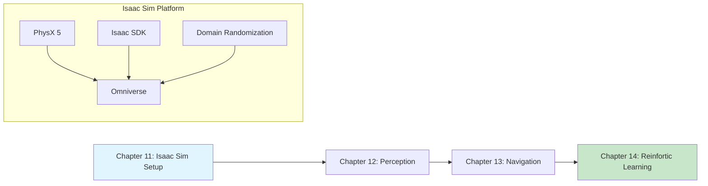

# Module 3: NVIDIA Isaac

**Focus**: GPU-accelerated simulation, perception, and machine learning for robotics

<!-- DIAGRAM: id="module-3-overview" type="architecture" format="mermaid"
     description="Overview of Module 3 showing Isaac Sim capabilities" -->



## Module Overview

NVIDIA Isaac Sim is a powerful robotics simulation platform built on Omniverse. It offers capabilities beyond traditional simulators:

- **Photorealistic rendering**: Ray-traced graphics for training vision models
- **GPU-accelerated physics**: Thousands of parallel simulations
- **Domain randomization**: Built-in tools for sim-to-real transfer
- **ML integration**: Native support for reinforcement learning

This module teaches you to leverage Isaac Sim for advanced Physical AI development.

**Key Technologies Covered**: Isaac Sim, Isaac ROS, PhysX, Domain Randomization, Isaac Gym

## Why Isaac Sim?

| Feature | Gazebo | Isaac Sim |
|---------|--------|-----------|
| **Physics** | CPU-based | GPU-accelerated (PhysX 5) |
| **Rendering** | Basic | Photorealistic (RTX) |
| **ML Training** | External | Native integration |
| **Parallel Sims** | Limited | Thousands |
| **Domain Rand.** | Manual | Built-in |

:::warning GPU Required
Isaac Sim requires an NVIDIA GPU (RTX 2070+ recommended). Cloud alternatives are provided for those without compatible hardware.
:::

## Learning Path

This module teaches you to:

1. **Set up Isaac Sim** and understand its architecture
2. **Train perception models** with synthetic data
3. **Implement navigation** using Isaac ROS
4. **Train RL policies** for humanoid control

## Chapters in This Module

### [Chapter 11: Isaac Sim Setup & Interface](./ch11-isaac-setup)

Get started with Isaac Sim, understand its architecture, and navigate the interface.

**Learning Objectives**:
- Install Isaac Sim on local machine or cloud
- Understand Omniverse architecture
- Navigate Isaac Sim interface
- Load and manipulate robots in simulation

---

### [Chapter 12: Perception with Isaac](./ch12-perception)

Use Isaac Sim's rendering and synthetic data generation for training perception models.

**Learning Objectives**:
- Generate synthetic training data
- Apply domain randomization
- Train object detection models
- Deploy perception pipelines

---

### [Chapter 13: Navigation with Isaac ROS](./ch13-navigation)

Implement autonomous navigation using Isaac ROS packages and Nav2.

**Learning Objectives**:
- Set up Isaac ROS for navigation
- Configure Nav2 with Isaac Sim
- Implement SLAM and localization
- Create navigation behaviors

---

### [Chapter 14: Reinforcement Learning with Isaac Gym](./ch14-reinforcement-learning)

Train control policies for humanoid robots using reinforcement learning.

**Learning Objectives**:
- Understand RL for robotics
- Set up Isaac Gym environments
- Train locomotion policies
- Transfer learned policies to simulation

## Prerequisites

Before starting this module, you should have:

- Completed Modules 1 and 2
- NVIDIA GPU with RTX capabilities (or cloud access)
- Understanding of machine learning basics
- Familiarity with Python and PyTorch

## Hardware Requirements

| Component | Minimum | Recommended |
|-----------|---------|-------------|
| **GPU** | RTX 2070 | RTX 3080 or higher |
| **VRAM** | 8 GB | 16+ GB |
| **RAM** | 32 GB | 64 GB |
| **Storage** | 50 GB SSD | 100+ GB NVMe |
| **OS** | Ubuntu 20.04/22.04 | Ubuntu 22.04 |

### Cloud Alternatives

If you don't have compatible hardware:

- **NVIDIA NGC**: Cloud-hosted Isaac Sim instances
- **AWS**: g4dn or g5 instances with GPU
- **Google Cloud**: A2 or G2 instances

## Development Environment

This module uses:

| Tool | Version | Purpose |
|------|---------|---------|
| **Isaac Sim** | 2023.1.1+ | Simulation platform |
| **Isaac ROS** | 2.0+ | ROS 2 integration |
| **Isaac Gym** | Preview 4 | RL training |
| **PyTorch** | 2.0+ | ML framework |

## What You'll Build

By the end of this module, you will have:

1. Working Isaac Sim development environment
2. Synthetic data generation pipeline for perception
3. Autonomous navigation system with Isaac ROS
4. RL-trained locomotion policy for humanoid
5. Skills to leverage GPU acceleration for Physical AI

## Module Timeline

| Chapter | Estimated Time | Difficulty |
|---------|---------------|------------|
| Chapter 11: Isaac Setup | 3 hours | Intermediate |
| Chapter 12: Perception | 4 hours | Intermediate |
| Chapter 13: Navigation | 4 hours | Intermediate |
| Chapter 14: RL | 5 hours | Advanced |

**Total Module Time**: ~16 hours

## Code Repository

All code examples for this module are in:

```bash
code-examples/module-3-isaac/
├── ch11_isaac_setup/
├── ch12_perception/
├── ch13_navigation/
└── ch14_rl/
```

:::tip Getting Started
Ensure you have Isaac Sim installed before starting. Chapter 11 covers installation in detail.
:::
