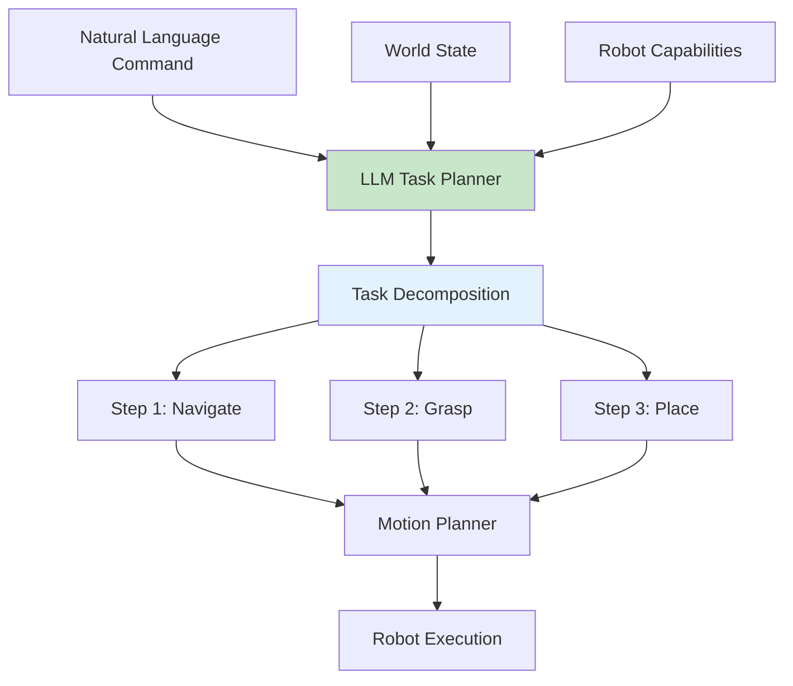

# Chapter 16: LLM Integration for Task Planning

<!-- DIAGRAM: id="ch16-llm-planning" type="architecture" format="mermaid"
     description="LLM-based task planning architecture for robotics" -->



## Learning Objectives

By the end of this chapter, you will be able to:

1. **Integrate LLM APIs** for robot task planning
2. **Design effective prompts** for robotic tasks
3. **Implement chain-of-thought reasoning** for complex tasks
4. **Create task decomposition pipelines** from natural language
5. **Handle errors and replanning** with LLM assistance

## Prerequisites

Before starting this chapter, ensure you have:

- Completed Chapter 15
- API access to OpenAI GPT-4 or similar LLM
- Understanding of prompt engineering basics
- Familiarity with Python async programming

## Introduction

Large Language Models excel at reasoning, planning, and understanding complex instructions. For robotics, this means:

- **Natural language commands**: "Clean up the table"
- **Task decomposition**: Breaking complex tasks into primitives
- **Error recovery**: "The grasp failed, try a different approach"
- **Common-sense reasoning**: Understanding implicit requirements

:::note Planning, Not Control
We use LLMs for high-level planning, not low-level motor control. LLMs decide *what* to do; traditional planners and controllers execute *how*.
:::

## LLM APIs for Robotics

### OpenAI Integration

```python
import openai
from typing import List, Dict, Any
import json

class RobotTaskPlanner:
    def __init__(self, model="gpt-4"):
        self.model = model
        self.client = openai.OpenAI()

    def plan_task(self, command: str, world_state: Dict, capabilities: List[str]) -> Dict:
        """Generate a task plan from natural language command."""

        system_prompt = """You are a robot task planner. Given a command, world state, and robot capabilities, generate a detailed plan.

Your response must be valid JSON with this structure:
{
    "reasoning": "Your step-by-step reasoning",
    "plan": [
        {"action": "action_name", "parameters": {...}, "preconditions": [...], "expected_outcome": "..."},
        ...
    ],
    "success_criteria": "How to verify task completion"
}

Available actions: navigate_to, pick_object, place_object, open_gripper, close_gripper, look_at, wait
"""

        user_prompt = f"""Command: {command}

World State:
{json.dumps(world_state, indent=2)}

Robot Capabilities:
{json.dumps(capabilities, indent=2)}

Generate a plan to accomplish this task."""

        response = self.client.chat.completions.create(
            model=self.model,
            messages=[
                {"role": "system", "content": system_prompt},
                {"role": "user", "content": user_prompt}
            ],
            response_format={"type": "json_object"}
        )

        return json.loads(response.choices[0].message.content)

    def replan_on_failure(self, original_command: str, plan: Dict,
                          failed_step: int, failure_reason: str) -> Dict:
        """Generate a new plan when execution fails."""

        system_prompt = """You are a robot task planner handling an execution failure.
Analyze what went wrong and generate a revised plan.
Your response must be valid JSON."""

        user_prompt = f"""Original command: {original_command}

Original plan:
{json.dumps(plan, indent=2)}

Failure at step {failed_step}: {failure_reason}

Generate a revised plan to recover and complete the task."""

        response = self.client.chat.completions.create(
            model=self.model,
            messages=[
                {"role": "system", "content": system_prompt},
                {"role": "user", "content": user_prompt}
            ],
            response_format={"type": "json_object"}
        )

        return json.loads(response.choices[0].message.content)


# Usage
planner = RobotTaskPlanner()

world_state = {
    "objects": [
        {"name": "red_cup", "location": [1.0, 0.5, 0.8], "graspable": True},
        {"name": "blue_plate", "location": [0.8, -0.3, 0.75], "graspable": True},
        {"name": "table", "location": [0.9, 0.0, 0.0], "graspable": False}
    ],
    "robot_position": [0.0, 0.0, 0.0],
    "gripper_state": "open"
}

capabilities = [
    "navigate_to: Move to a position",
    "pick_object: Grasp an object",
    "place_object: Place held object at location",
    "look_at: Point camera at location"
]

plan = planner.plan_task(
    "Put the red cup on the blue plate",
    world_state,
    capabilities
)
print(json.dumps(plan, indent=2))
```

### Local LLM with Ollama

```python
import ollama

class LocalTaskPlanner:
    def __init__(self, model="llama3"):
        self.model = model

    def plan_task(self, command: str, world_state: Dict) -> str:
        """Plan using local LLM."""

        prompt = f"""You are a robot assistant. Plan how to: {command}

Current state: {json.dumps(world_state)}

Provide a numbered list of steps."""

        response = ollama.generate(
            model=self.model,
            prompt=prompt
        )

        return response['response']
```

## Prompt Engineering for Robotics

### Effective Robot Prompts

```python
class RobotPromptTemplates:
    @staticmethod
    def task_planning_prompt(command, world_state, capabilities):
        return f"""# Robot Task Planning

## Task
{command}

## Current World State
{json.dumps(world_state, indent=2)}

## Available Actions
{chr(10).join(f'- {cap}' for cap in capabilities)}

## Instructions
1. Analyze the task requirements
2. Check preconditions in world state
3. Select appropriate actions
4. Order actions logically
5. Specify parameters for each action

## Output Format
Provide a JSON plan with:
- "steps": array of actions with parameters
- "reasoning": explanation of choices
- "risks": potential failure modes
"""

    @staticmethod
    def error_recovery_prompt(action, error, state):
        return f"""# Error Recovery

## Failed Action
{json.dumps(action, indent=2)}

## Error
{error}

## Current State
{json.dumps(state, indent=2)}

## Instructions
Suggest recovery strategies:
1. Diagnose the likely cause
2. Propose alternative approaches
3. Determine if task should be aborted

Respond with JSON: {{"diagnosis": "...", "recovery_options": [...], "recommended": "..."}}
"""

    @staticmethod
    def clarification_prompt(command, ambiguities):
        return f"""# Clarification Needed

## Original Command
{command}

## Ambiguities Detected
{chr(10).join(f'- {a}' for a in ambiguities)}

## Instructions
Generate clarifying questions to resolve ambiguities.
Format: JSON array of questions.
"""
```

### Few-Shot Prompting

```python
class FewShotPlanner:
    def __init__(self):
        self.examples = [
            {
                "command": "Pick up the red block",
                "state": {"objects": [{"name": "red_block", "pos": [1, 0, 0.1]}]},
                "plan": [
                    {"action": "navigate_to", "target": [0.8, 0, 0]},
                    {"action": "look_at", "target": [1, 0, 0.1]},
                    {"action": "pick_object", "object": "red_block"}
                ]
            },
            {
                "command": "Stack the green cube on the blue cube",
                "state": {
                    "objects": [
                        {"name": "green_cube", "pos": [0.5, 0.5, 0.1]},
                        {"name": "blue_cube", "pos": [1.0, 0, 0.1]}
                    ]
                },
                "plan": [
                    {"action": "navigate_to", "target": [0.3, 0.5, 0]},
                    {"action": "pick_object", "object": "green_cube"},
                    {"action": "navigate_to", "target": [0.8, 0, 0]},
                    {"action": "place_object", "target": [1.0, 0, 0.2]}
                ]
            }
        ]

    def create_few_shot_prompt(self, command, state):
        examples_text = ""
        for ex in self.examples:
            examples_text += f"""
Example:
Command: {ex['command']}
State: {json.dumps(ex['state'])}
Plan: {json.dumps(ex['plan'], indent=2)}
"""

        return f"""{examples_text}

Now plan for:
Command: {command}
State: {json.dumps(state)}
Plan:"""
```

## Chain-of-Thought Reasoning

### Implementing CoT for Robotics

```python
class ChainOfThoughtPlanner:
    def __init__(self, llm_client):
        self.client = llm_client

    def plan_with_reasoning(self, command: str, context: Dict) -> Dict:
        """Generate plan with explicit reasoning steps."""

        prompt = f"""Think step-by-step to plan this robot task.

Command: {command}
Context: {json.dumps(context)}

Let's reason through this:

Step 1: What is the goal?
Step 2: What objects are involved?
Step 3: What is the current state of these objects?
Step 4: What actions are needed?
Step 5: What order should actions be in?
Step 6: What could go wrong?

Now provide the final plan as JSON."""

        response = self.client.chat.completions.create(
            model="gpt-4",
            messages=[
                {"role": "user", "content": prompt}
            ]
        )

        return self.parse_response(response.choices[0].message.content)

    def verify_plan(self, plan: Dict, world_state: Dict) -> Dict:
        """Use CoT to verify plan feasibility."""

        prompt = f"""Verify this robot plan step-by-step.

Plan: {json.dumps(plan)}
World State: {json.dumps(world_state)}

For each step, check:
1. Are preconditions met?
2. Is the action physically possible?
3. What state changes result?

Identify any issues and suggest fixes."""

        response = self.client.chat.completions.create(
            model="gpt-4",
            messages=[{"role": "user", "content": prompt}]
        )

        return {"verification": response.choices[0].message.content}
```

## Task Decomposition

### Hierarchical Task Network Style

```python
class HierarchicalPlanner:
    def __init__(self, llm_client):
        self.client = llm_client
        self.primitive_actions = [
            "move_arm", "open_gripper", "close_gripper",
            "move_base", "rotate", "wait"
        ]

    def decompose_task(self, high_level_command: str) -> Dict:
        """Decompose high-level command into primitive actions."""

        prompt = f"""Decompose this task into primitive robot actions.

Task: {high_level_command}

Available primitives:
- move_arm(x, y, z): Move end effector to position
- open_gripper(): Open gripper
- close_gripper(): Close gripper
- move_base(x, y, theta): Move robot base
- rotate(angle): Rotate in place
- wait(seconds): Wait

Decompose hierarchically:
1. First break into subtasks
2. Then break subtasks into primitives

Output JSON with structure:
{{
    "subtasks": [
        {{
            "name": "subtask_name",
            "primitives": [
                {{"action": "...", "params": {{...}}}}
            ]
        }}
    ]
}}"""

        response = self.client.chat.completions.create(
            model="gpt-4",
            messages=[{"role": "user", "content": prompt}],
            response_format={"type": "json_object"}
        )

        return json.loads(response.choices[0].message.content)

    def expand_subtask(self, subtask: str, context: Dict) -> List[Dict]:
        """Further expand a subtask given context."""

        prompt = f"""Expand this subtask into detailed primitives.

Subtask: {subtask}
Context: {json.dumps(context)}

Primitives available: {self.primitive_actions}

Output as JSON array of primitive actions."""

        response = self.client.chat.completions.create(
            model="gpt-4",
            messages=[{"role": "user", "content": prompt}],
            response_format={"type": "json_object"}
        )

        return json.loads(response.choices[0].message.content)
```

### Example: Complex Task Decomposition

```python
# Example usage
planner = HierarchicalPlanner(openai.OpenAI())

result = planner.decompose_task(
    "Set the table with a plate and cup for one person"
)

# Result structure:
# {
#   "subtasks": [
#     {
#       "name": "get_plate",
#       "primitives": [
#         {"action": "move_base", "params": {"x": 2, "y": 0, "theta": 0}},
#         {"action": "move_arm", "params": {"x": 2.2, "y": 0.1, "z": 0.8}},
#         {"action": "close_gripper", "params": {}},
#         {"action": "move_arm", "params": {"x": 2.2, "y": 0.1, "z": 1.0}}
#       ]
#     },
#     {
#       "name": "place_plate_on_table",
#       "primitives": [...]
#     },
#     {
#       "name": "get_cup",
#       "primitives": [...]
#     },
#     {
#       "name": "place_cup_on_table",
#       "primitives": [...]
#     }
#   ]
# }
```

## Integrating with ROS 2

### LLM Planning Node

```python
#!/usr/bin/env python3
"""ROS 2 node for LLM-based task planning."""

import rclpy
from rclpy.node import Node
from std_msgs.msg import String
from geometry_msgs.msg import Pose
import json
import openai

class LLMPlannerNode(Node):
    def __init__(self):
        super().__init__('llm_planner')

        self.client = openai.OpenAI()

        # Subscribers
        self.command_sub = self.create_subscription(
            String, '/voice_command', self.command_callback, 10)
        self.state_sub = self.create_subscription(
            String, '/world_state', self.state_callback, 10)

        # Publishers
        self.plan_pub = self.create_publisher(String, '/task_plan', 10)
        self.action_pub = self.create_publisher(String, '/next_action', 10)

        # State
        self.current_world_state = {}
        self.current_plan = None
        self.current_step = 0

        self.get_logger().info('LLM Planner ready')

    def state_callback(self, msg):
        """Update world state."""
        self.current_world_state = json.loads(msg.data)

    def command_callback(self, msg):
        """Handle incoming command."""
        command = msg.data
        self.get_logger().info(f'Received command: {command}')

        # Generate plan
        plan = self.generate_plan(command)
        self.current_plan = plan
        self.current_step = 0

        # Publish plan
        plan_msg = String()
        plan_msg.data = json.dumps(plan)
        self.plan_pub.publish(plan_msg)

        # Start execution
        self.execute_next_step()

    def generate_plan(self, command):
        """Generate plan using LLM."""
        prompt = f"""Plan this robot task: {command}

World state: {json.dumps(self.current_world_state)}

Return JSON plan with steps."""

        response = self.client.chat.completions.create(
            model="gpt-4",
            messages=[{"role": "user", "content": prompt}],
            response_format={"type": "json_object"}
        )

        return json.loads(response.choices[0].message.content)

    def execute_next_step(self):
        """Publish next action to execute."""
        if self.current_plan and self.current_step < len(self.current_plan.get('steps', [])):
            action = self.current_plan['steps'][self.current_step]

            action_msg = String()
            action_msg.data = json.dumps(action)
            self.action_pub.publish(action_msg)

            self.current_step += 1
        else:
            self.get_logger().info('Plan complete')


def main(args=None):
    rclpy.init(args=args)
    node = LLMPlannerNode()
    rclpy.spin(node)
    node.destroy_node()
    rclpy.shutdown()
```

## Error Handling and Replanning

```python
class RobustPlanner:
    def __init__(self, llm_client):
        self.client = llm_client
        self.max_retries = 3

    def execute_with_recovery(self, plan, executor):
        """Execute plan with automatic error recovery."""
        retry_count = 0

        for i, step in enumerate(plan['steps']):
            success = False

            while not success and retry_count < self.max_retries:
                try:
                    result = executor.execute(step)

                    if result['success']:
                        success = True
                    else:
                        # Get recovery plan from LLM
                        recovery = self.get_recovery_plan(
                            step, result['error'], executor.get_state()
                        )

                        if recovery['action'] == 'retry_modified':
                            step = recovery['modified_step']
                        elif recovery['action'] == 'skip':
                            success = True  # Move on
                        elif recovery['action'] == 'abort':
                            return {'success': False, 'reason': recovery['reason']}

                        retry_count += 1

                except Exception as e:
                    recovery = self.get_recovery_plan(step, str(e), executor.get_state())
                    retry_count += 1

            if not success:
                return {'success': False, 'failed_at': i}

        return {'success': True}

    def get_recovery_plan(self, failed_step, error, current_state):
        """Ask LLM for recovery strategy."""
        prompt = f"""Robot action failed. Suggest recovery.

Failed action: {json.dumps(failed_step)}
Error: {error}
Current state: {json.dumps(current_state)}

Options:
1. retry_modified: Modify and retry the action
2. skip: Skip this action and continue
3. abort: Stop the entire task

Respond with JSON: {{"action": "...", "modified_step": {{...}}, "reason": "..."}}"""

        response = self.client.chat.completions.create(
            model="gpt-4",
            messages=[{"role": "user", "content": prompt}],
            response_format={"type": "json_object"}
        )

        return json.loads(response.choices[0].message.content)
```

## Hands-On Exercise

### Exercise 1: Basic Planning

1. Set up OpenAI API access
2. Create a task planner that handles "pick and place" commands
3. Test with various object configurations
4. Evaluate plan quality

### Exercise 2: Error Recovery

1. Create a planner with failure simulation
2. Implement recovery using LLM suggestions
3. Test with different failure modes
4. Track success rates

### Exercise 3: ROS 2 Integration

1. Create a complete ROS 2 planning node
2. Connect to simulated robot state
3. Execute plans step-by-step
4. Handle real-time replanning

## Key Concepts

| Term | Definition |
|------|------------|
| **Task Planning** | Breaking commands into executable actions |
| **Prompt Engineering** | Designing effective inputs for LLMs |
| **Chain-of-Thought** | Explicit reasoning steps for complex tasks |
| **Task Decomposition** | Hierarchical breakdown of complex tasks |
| **Replanning** | Generating new plans when execution fails |

## Chapter Summary

In this chapter, you learned:

1. **LLM integration**: Using OpenAI and local models for planning.

2. **Prompt engineering**: Designing effective prompts for robotics.

3. **Chain-of-thought**: Implementing explicit reasoning for complex tasks.

4. **Task decomposition**: Breaking high-level commands into primitives.

5. **Error recovery**: Using LLMs for replanning and failure handling.

## What's Next

In [Chapter 17: Building VLA Pipelines](./ch17-vla-pipelines), you'll combine VLMs and LLMs into complete Vision-Language-Action systems.

## Further Reading

- [SayCan](https://say-can.github.io/) - Google's LLM + robot skills
- [Code as Policies](https://code-as-policies.github.io/) - LLM code generation
- [LangChain](https://python.langchain.com/) - LLM orchestration framework
- [Inner Monologue](https://arxiv.org/abs/2207.05608) - Embodied reasoning
