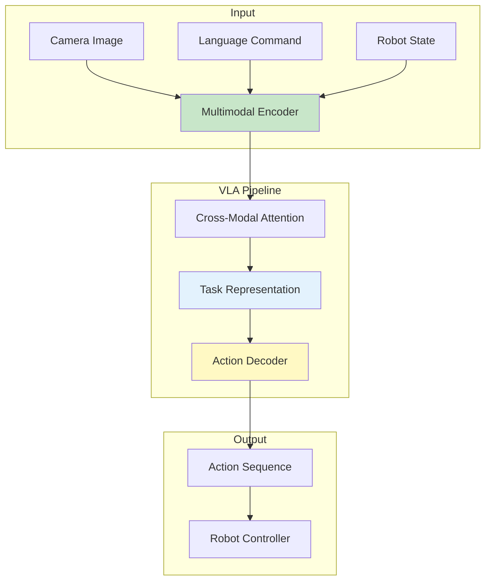
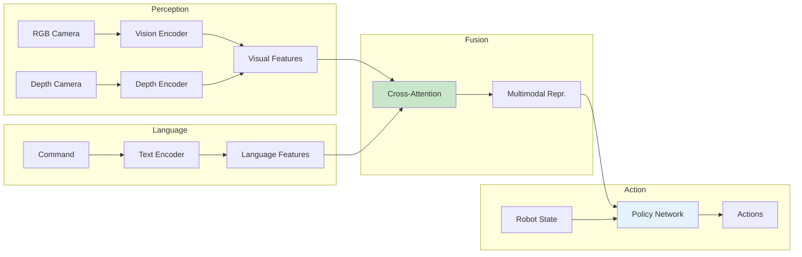

# Chapter 17: Building VLA Pipelines

<!-- DIAGRAM: id="ch17-vla-pipeline" type="architecture" format="mermaid"
     description="Complete VLA pipeline architecture" -->



## Learning Objectives

By the end of this chapter, you will be able to:

1. **Design end-to-end VLA architectures** combining vision, language, and action
2. **Implement visual grounding** for robotic manipulation
3. **Connect language understanding to action generation**
4. **Deploy VLA systems** in Isaac Sim simulation
5. **Evaluate VLA pipeline performance**

## Prerequisites

Before starting this chapter, ensure you have:

- Completed Chapters 15 and 16
- Understanding of VLMs and LLM integration
- Experience with PyTorch model development
- Working simulation environment (Isaac Sim or Gazebo)

## Introduction

A Vision-Language-Action (VLA) pipeline integrates:
- **Vision**: Understanding the visual scene
- **Language**: Interpreting natural language commands
- **Action**: Generating executable robot behaviors

This chapter shows how to build complete VLA systems that take a command like "Pick up the red cup and place it on the shelf" and execute it on a robot.

## VLA Architecture Overview

### Components of a VLA System



### Key Design Decisions

| Decision | Options | Trade-offs |
|----------|---------|------------|
| **Vision Encoder** | ResNet, ViT, CLIP | Accuracy vs. speed |
| **Language Encoder** | BERT, T5, GPT | Capability vs. size |
| **Fusion Method** | Concat, Cross-attention, FiLM | Expressiveness vs. complexity |
| **Action Space** | Continuous, Discrete, Hybrid | Precision vs. simplicity |

## Building the VLA Pipeline

### Step 1: Multimodal Encoder

```python
import torch
import torch.nn as nn
from transformers import CLIPModel, CLIPProcessor

class MultimodalEncoder(nn.Module):
    def __init__(self, hidden_dim=512):
        super().__init__()

        # Load CLIP for vision-language encoding
        self.clip = CLIPModel.from_pretrained("openai/clip-vit-base-patch32")
        self.processor = CLIPProcessor.from_pretrained("openai/clip-vit-base-patch32")

        # Freeze CLIP weights (optional)
        for param in self.clip.parameters():
            param.requires_grad = False

        # Projection layers
        self.vision_proj = nn.Linear(512, hidden_dim)
        self.text_proj = nn.Linear(512, hidden_dim)

        # Depth encoder (separate from CLIP)
        self.depth_encoder = nn.Sequential(
            nn.Conv2d(1, 32, 3, stride=2, padding=1),
            nn.ReLU(),
            nn.Conv2d(32, 64, 3, stride=2, padding=1),
            nn.ReLU(),
            nn.Conv2d(64, 128, 3, stride=2, padding=1),
            nn.ReLU(),
            nn.AdaptiveAvgPool2d((1, 1)),
            nn.Flatten(),
            nn.Linear(128, hidden_dim)
        )

    def forward(self, image, depth, text):
        """Encode multimodal inputs."""
        # Process with CLIP
        inputs = self.processor(
            text=text,
            images=image,
            return_tensors="pt",
            padding=True
        )

        outputs = self.clip(**inputs)

        # Get embeddings
        vision_emb = self.vision_proj(outputs.image_embeds)
        text_emb = self.text_proj(outputs.text_embeds)

        # Encode depth separately
        depth_emb = self.depth_encoder(depth)

        return vision_emb, depth_emb, text_emb


class CrossModalFusion(nn.Module):
    def __init__(self, hidden_dim=512, num_heads=8):
        super().__init__()

        # Cross-attention: language attends to vision
        self.cross_attention = nn.MultiheadAttention(
            hidden_dim, num_heads, batch_first=True
        )

        # Self-attention for refinement
        self.self_attention = nn.MultiheadAttention(
            hidden_dim, num_heads, batch_first=True
        )

        # Feed-forward
        self.ffn = nn.Sequential(
            nn.Linear(hidden_dim, hidden_dim * 4),
            nn.GELU(),
            nn.Linear(hidden_dim * 4, hidden_dim)
        )

        self.norm1 = nn.LayerNorm(hidden_dim)
        self.norm2 = nn.LayerNorm(hidden_dim)
        self.norm3 = nn.LayerNorm(hidden_dim)

    def forward(self, vision_emb, depth_emb, text_emb):
        """Fuse multimodal embeddings."""
        # Combine vision and depth
        visual = vision_emb + depth_emb

        # Stack for attention (batch, seq, dim)
        visual = visual.unsqueeze(1)
        text = text_emb.unsqueeze(1)

        # Cross-attention: text queries visual
        attended, _ = self.cross_attention(text, visual, visual)
        attended = self.norm1(text + attended)

        # Self-attention
        refined, _ = self.self_attention(attended, attended, attended)
        refined = self.norm2(attended + refined)

        # FFN
        output = self.norm3(refined + self.ffn(refined))

        return output.squeeze(1)
```

### Step 2: Action Decoder

```python
class ActionDecoder(nn.Module):
    def __init__(self, hidden_dim=512, robot_state_dim=14, action_dim=7):
        super().__init__()

        # Robot state encoder
        self.state_encoder = nn.Sequential(
            nn.Linear(robot_state_dim, hidden_dim // 2),
            nn.ReLU(),
            nn.Linear(hidden_dim // 2, hidden_dim)
        )

        # Action prediction head
        self.action_head = nn.Sequential(
            nn.Linear(hidden_dim * 2, hidden_dim),
            nn.ReLU(),
            nn.Linear(hidden_dim, hidden_dim // 2),
            nn.ReLU(),
            nn.Linear(hidden_dim // 2, action_dim)
        )

        # Gripper prediction (binary)
        self.gripper_head = nn.Sequential(
            nn.Linear(hidden_dim * 2, hidden_dim // 2),
            nn.ReLU(),
            nn.Linear(hidden_dim // 2, 1),
            nn.Sigmoid()
        )

    def forward(self, multimodal_repr, robot_state):
        """Decode actions from multimodal representation."""
        state_emb = self.state_encoder(robot_state)

        # Concatenate multimodal and state
        combined = torch.cat([multimodal_repr, state_emb], dim=-1)

        # Predict action
        action = self.action_head(combined)
        gripper = self.gripper_head(combined)

        return action, gripper
```

### Step 3: Complete VLA Model

```python
class VLAModel(nn.Module):
    def __init__(self, hidden_dim=512, robot_state_dim=14, action_dim=7):
        super().__init__()

        self.encoder = MultimodalEncoder(hidden_dim)
        self.fusion = CrossModalFusion(hidden_dim)
        self.decoder = ActionDecoder(hidden_dim, robot_state_dim, action_dim)

    def forward(self, image, depth, text, robot_state):
        """End-to-end VLA forward pass."""
        # Encode
        vision_emb, depth_emb, text_emb = self.encoder(image, depth, text)

        # Fuse
        multimodal = self.fusion(vision_emb, depth_emb, text_emb)

        # Decode
        action, gripper = self.decoder(multimodal, robot_state)

        return action, gripper

    def predict_action(self, image, depth, command, robot_state):
        """Inference interface."""
        self.eval()
        with torch.no_grad():
            action, gripper = self.forward(
                image.unsqueeze(0),
                depth.unsqueeze(0),
                [command],
                robot_state.unsqueeze(0)
            )
        return action.squeeze(0), gripper.squeeze(0)
```

## Visual Grounding for Manipulation

### Object-Centric VLA

```python
class ObjectCentricVLA(nn.Module):
    def __init__(self, hidden_dim=512):
        super().__init__()

        # Object detector (e.g., DETR)
        self.object_detector = DetrForObjectDetection.from_pretrained(
            "facebook/detr-resnet-50"
        )

        # Object encoder
        self.object_encoder = nn.Sequential(
            nn.Linear(256, hidden_dim),
            nn.ReLU()
        )

        # Language encoder
        self.text_encoder = nn.TransformerEncoder(
            nn.TransformerEncoderLayer(hidden_dim, 8),
            num_layers=2
        )

        # Grounding module
        self.grounding = nn.MultiheadAttention(hidden_dim, 8, batch_first=True)

        # Action decoder
        self.action_decoder = ActionDecoder(hidden_dim)

    def detect_objects(self, image):
        """Detect objects and their features."""
        outputs = self.object_detector(image)

        # Get object queries (features)
        object_features = outputs.last_hidden_state  # (batch, num_queries, dim)

        # Get bounding boxes
        boxes = outputs.pred_boxes  # (batch, num_queries, 4)

        return object_features, boxes

    def ground_language(self, text_features, object_features):
        """Ground language to specific objects."""
        # Cross-attention: text attends to objects
        grounded, attention_weights = self.grounding(
            text_features, object_features, object_features
        )

        # Attention weights indicate which objects are referenced
        return grounded, attention_weights

    def forward(self, image, command, robot_state):
        """Object-centric VLA forward pass."""
        # Detect objects
        object_features, boxes = self.detect_objects(image)
        object_emb = self.object_encoder(object_features)

        # Encode language
        text_tokens = self.tokenize(command)
        text_features = self.text_encoder(text_tokens)

        # Ground language to objects
        grounded, attention = self.ground_language(text_features, object_emb)

        # Identify target object
        target_idx = attention.argmax(dim=-1)
        target_box = boxes[torch.arange(len(boxes)), target_idx]

        # Decode action
        action, gripper = self.action_decoder(grounded.mean(dim=1), robot_state)

        return action, gripper, target_box
```

### Spatial Reasoning Module

```python
class SpatialReasoningModule(nn.Module):
    def __init__(self, hidden_dim=512):
        super().__init__()

        # Spatial relation embeddings
        self.relation_embeddings = nn.Embedding(10, hidden_dim)  # on, left_of, etc.

        # Spatial reasoning transformer
        self.spatial_transformer = nn.TransformerEncoder(
            nn.TransformerEncoderLayer(hidden_dim, 8),
            num_layers=3
        )

        # Relation classifier
        self.relation_classifier = nn.Linear(hidden_dim * 2, 10)

    def compute_spatial_features(self, obj1_box, obj2_box):
        """Compute spatial relationship features."""
        # Box format: [x, y, w, h]
        obj1_center = obj1_box[:, :2] + obj1_box[:, 2:] / 2
        obj2_center = obj2_box[:, :2] + obj2_box[:, 2:] / 2

        # Relative position
        relative_pos = obj2_center - obj1_center

        # Relative size
        relative_size = obj2_box[:, 2:] / (obj1_box[:, 2:] + 1e-6)

        # Distance
        distance = torch.norm(relative_pos, dim=-1, keepdim=True)

        return torch.cat([relative_pos, relative_size, distance], dim=-1)

    def predict_relations(self, object_features, boxes):
        """Predict spatial relations between objects."""
        num_objects = object_features.shape[1]
        relations = []

        for i in range(num_objects):
            for j in range(num_objects):
                if i != j:
                    # Compute spatial features
                    spatial = self.compute_spatial_features(boxes[:, i], boxes[:, j])

                    # Combine with object features
                    combined = torch.cat([
                        object_features[:, i],
                        object_features[:, j],
                        spatial
                    ], dim=-1)

                    # Predict relation
                    relation = self.relation_classifier(combined)
                    relations.append((i, j, relation))

        return relations
```

## Deploying VLA in Simulation

### Isaac Sim Integration

```python
from omni.isaac.kit import SimulationApp
simulation_app = SimulationApp({"headless": False})

import torch
from omni.isaac.core import World
from omni.isaac.core.robots import Robot
from omni.isaac.sensor import Camera

class VLAController:
    def __init__(self, model_path):
        # Load VLA model
        self.model = VLAModel()
        self.model.load_state_dict(torch.load(model_path))
        self.model.eval()
        self.model.cuda()

        # Isaac Sim setup
        self.world = World()
        self.robot = Robot(prim_path="/World/Robot")
        self.camera = Camera(prim_path="/World/Robot/camera")

    def get_observation(self):
        """Get current observation from simulation."""
        # Get camera image
        rgb = self.camera.get_rgb()
        depth = self.camera.get_depth()

        # Get robot state
        joint_positions = self.robot.get_joint_positions()
        joint_velocities = self.robot.get_joint_velocities()
        ee_pose = self.robot.get_ee_pose()

        robot_state = torch.tensor(
            list(joint_positions) + list(ee_pose),
            dtype=torch.float32
        )

        return rgb, depth, robot_state

    def execute_command(self, command):
        """Execute a natural language command."""
        print(f"Executing: {command}")

        for step in range(1000):  # Max steps
            # Get observation
            rgb, depth, robot_state = self.get_observation()

            # Convert to tensors
            rgb_tensor = torch.tensor(rgb).permute(2, 0, 1).float() / 255.0
            depth_tensor = torch.tensor(depth).unsqueeze(0).float()

            # Predict action
            action, gripper = self.model.predict_action(
                rgb_tensor.cuda(),
                depth_tensor.cuda(),
                command,
                robot_state.cuda()
            )

            # Apply action
            self.apply_action(action.cpu(), gripper.cpu())

            # Step simulation
            self.world.step(render=True)

            # Check if done (implement task-specific check)
            if self.is_task_complete(command):
                print("Task completed!")
                break

    def apply_action(self, action, gripper):
        """Apply predicted action to robot."""
        # Action: delta end-effector pose
        current_pose = self.robot.get_ee_pose()
        target_pose = current_pose + action.numpy()

        # Use IK to get joint positions
        joint_targets = self.robot.inverse_kinematics(target_pose)
        self.robot.set_joint_position_targets(joint_targets)

        # Control gripper
        if gripper > 0.5:
            self.robot.close_gripper()
        else:
            self.robot.open_gripper()

    def is_task_complete(self, command):
        """Check if task is complete (task-specific)."""
        # Implement based on task type
        return False


# Usage
controller = VLAController("vla_model.pth")
controller.execute_command("Pick up the red cup and place it on the shelf")
```

### ROS 2 VLA Node

```python
#!/usr/bin/env python3
"""ROS 2 node for VLA-based robot control."""

import rclpy
from rclpy.node import Node
from sensor_msgs.msg import Image, JointState
from geometry_msgs.msg import Twist
from std_msgs.msg import String
from cv_bridge import CvBridge
import torch

class VLANode(Node):
    def __init__(self):
        super().__init__('vla_controller')

        self.bridge = CvBridge()

        # Load model
        self.model = VLAModel()
        self.model.load_state_dict(torch.load("vla_model.pth"))
        self.model.eval()

        # Subscribers
        self.rgb_sub = self.create_subscription(
            Image, '/camera/rgb', self.rgb_callback, 10)
        self.depth_sub = self.create_subscription(
            Image, '/camera/depth', self.depth_callback, 10)
        self.joint_sub = self.create_subscription(
            JointState, '/joint_states', self.joint_callback, 10)
        self.command_sub = self.create_subscription(
            String, '/vla_command', self.command_callback, 10)

        # Publishers
        self.action_pub = self.create_publisher(
            JointState, '/joint_commands', 10)

        # State
        self.current_rgb = None
        self.current_depth = None
        self.current_joints = None
        self.current_command = None

        # Control loop
        self.timer = self.create_timer(0.1, self.control_loop)

        self.get_logger().info('VLA Controller ready')

    def rgb_callback(self, msg):
        self.current_rgb = self.bridge.imgmsg_to_cv2(msg, "rgb8")

    def depth_callback(self, msg):
        self.current_depth = self.bridge.imgmsg_to_cv2(msg, "32FC1")

    def joint_callback(self, msg):
        self.current_joints = list(msg.position)

    def command_callback(self, msg):
        self.current_command = msg.data
        self.get_logger().info(f'New command: {self.current_command}')

    def control_loop(self):
        """Main control loop."""
        if not all([self.current_rgb is not None,
                   self.current_depth is not None,
                   self.current_joints is not None,
                   self.current_command is not None]):
            return

        # Prepare inputs
        rgb = torch.tensor(self.current_rgb).permute(2, 0, 1).float() / 255.0
        depth = torch.tensor(self.current_depth).unsqueeze(0).float()
        state = torch.tensor(self.current_joints).float()

        # Predict action
        with torch.no_grad():
            action, gripper = self.model.predict_action(
                rgb, depth, self.current_command, state
            )

        # Publish action
        cmd = JointState()
        cmd.position = (state + action).tolist()
        self.action_pub.publish(cmd)


def main(args=None):
    rclpy.init(args=args)
    node = VLANode()
    rclpy.spin(node)
    node.destroy_node()
    rclpy.shutdown()
```

## Training VLA Models

### Dataset Format

```python
class VLADataset(torch.utils.data.Dataset):
    def __init__(self, data_path):
        self.episodes = self.load_episodes(data_path)

    def load_episodes(self, path):
        """Load demonstration episodes."""
        episodes = []
        for episode_file in Path(path).glob("*.hdf5"):
            with h5py.File(episode_file, 'r') as f:
                episodes.append({
                    'rgb': f['rgb'][:],
                    'depth': f['depth'][:],
                    'actions': f['actions'][:],
                    'robot_state': f['robot_state'][:],
                    'command': f.attrs['command']
                })
        return episodes

    def __len__(self):
        return sum(len(ep['rgb']) for ep in self.episodes)

    def __getitem__(self, idx):
        # Find episode and step
        for ep in self.episodes:
            if idx < len(ep['rgb']):
                return {
                    'rgb': torch.tensor(ep['rgb'][idx]).permute(2, 0, 1) / 255.0,
                    'depth': torch.tensor(ep['depth'][idx]).unsqueeze(0),
                    'action': torch.tensor(ep['actions'][idx]),
                    'robot_state': torch.tensor(ep['robot_state'][idx]),
                    'command': ep['command']
                }
            idx -= len(ep['rgb'])
```

### Training Loop

```python
def train_vla(model, dataset, epochs=100, lr=1e-4):
    optimizer = torch.optim.Adam(model.parameters(), lr=lr)
    dataloader = DataLoader(dataset, batch_size=32, shuffle=True)

    for epoch in range(epochs):
        total_loss = 0

        for batch in dataloader:
            optimizer.zero_grad()

            # Forward pass
            pred_action, pred_gripper = model(
                batch['rgb'].cuda(),
                batch['depth'].cuda(),
                batch['command'],
                batch['robot_state'].cuda()
            )

            # Loss
            action_loss = F.mse_loss(pred_action, batch['action'][:, :7].cuda())
            gripper_loss = F.binary_cross_entropy(
                pred_gripper.squeeze(),
                batch['action'][:, 7].cuda()
            )
            loss = action_loss + gripper_loss

            # Backward pass
            loss.backward()
            optimizer.step()

            total_loss += loss.item()

        print(f"Epoch {epoch}: Loss = {total_loss / len(dataloader):.4f}")

    return model
```

## Hands-On Exercise

### Exercise 1: Build Basic VLA

1. Implement the MultimodalEncoder
2. Implement CrossModalFusion
3. Implement ActionDecoder
4. Test with dummy inputs

### Exercise 2: Visual Grounding

1. Add object detection
2. Implement language-to-object grounding
3. Test with "Pick up the red cube" type commands

### Exercise 3: Full Deployment

1. Deploy VLA in Isaac Sim
2. Execute 5 different pick-and-place commands
3. Evaluate success rate

## Key Concepts

| Term | Definition |
|------|------------|
| **VLA Pipeline** | End-to-end system from vision+language to action |
| **Multimodal Fusion** | Combining vision and language representations |
| **Visual Grounding** | Connecting language to specific image regions |
| **Action Decoder** | Neural network predicting robot actions |
| **Cross-Attention** | Mechanism for relating different modalities |

## Chapter Summary

In this chapter, you learned:

1. **VLA architecture**: Components and design decisions.

2. **Multimodal encoding**: Combining vision, depth, and language.

3. **Cross-modal fusion**: Using attention for modality integration.

4. **Visual grounding**: Connecting language to objects.

5. **Deployment**: Running VLA in Isaac Sim and ROS 2.

## What's Next

In [Chapter 18: From Language Commands to Robot Actions](./ch18-language-to-action), you'll learn to translate natural language into executable robot primitives and handle complex, multi-step instructions.

## Further Reading

- [RT-2](https://robotics-transformer2.github.io/) - Vision-Language-Action model
- [PaLM-E](https://palm-e.github.io/) - Embodied multimodal LLM
- [OpenVLA](https://openvla.github.io/) - Open-source VLA
- [VIMA](https://vima.cs.stanford.edu/) - Multimodal prompting
