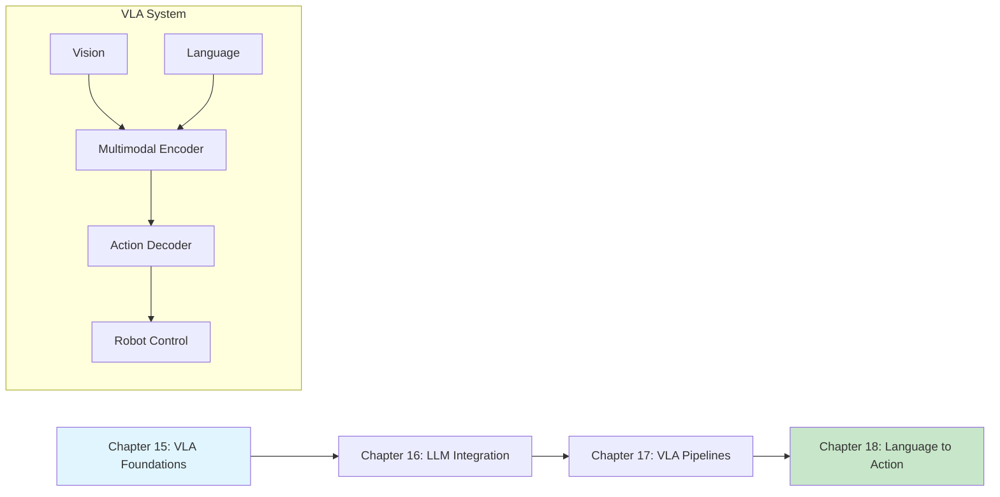

# Module 4: Vision-Language-Action

**Focus**: Connecting language understanding with robot perception and action

<!-- DIAGRAM: id="module-4-overview" type="architecture" format="mermaid"
     description="Vision-Language-Action pipeline architecture" -->



## Module Overview

Vision-Language-Action (VLA) models represent the frontier of Physical AI. By combining the reasoning capabilities of large language models with visual perception and robot action, VLA systems can understand natural language commands and execute complex physical tasks.

This module teaches you to build VLA pipelines that translate human intent into robot behavior.

**Key Technologies Covered**: VLMs, LLMs, RT-2, PALM-E, OpenVLA, Action Generation

:::note LLMs for Planning, Not Control
In this book, we use LLMs for high-level task planning and reasoning—not direct motor control. Low-level control comes from RL policies or traditional controllers.
:::

## Why VLA?

| Capability | Traditional Robotics | VLA Systems |
|------------|---------------------|-------------|
| **Task Specification** | Code or waypoints | Natural language |
| **Generalization** | Task-specific | Cross-task transfer |
| **Reasoning** | Hard-coded logic | Emergent from LLMs |
| **Adaptation** | Reprogramming | Few-shot learning |

## Learning Path

This module teaches you to:

1. **Understand VLA architectures** and their components
2. **Integrate LLMs** for task planning and reasoning
3. **Build VLA pipelines** connecting vision, language, and action
4. **Generate robot actions** from natural language commands

## Chapters in This Module

### [Chapter 15: Vision-Language Models for Robotics](./ch15-vla-foundations)

Understand the foundations of vision-language models and how they apply to robotics.

**Learning Objectives**:
- Explain VLM architectures (CLIP, LLaVA, GPT-4V)
- Understand multimodal representations
- Apply VLMs for scene understanding
- Connect VLMs to robot perception

---

### [Chapter 16: LLM Integration for Task Planning](./ch16-llm-integration)

Use large language models for high-level robot task planning and reasoning.

**Learning Objectives**:
- Integrate LLM APIs for robot planning
- Design prompts for robotic tasks
- Implement chain-of-thought reasoning
- Create task decomposition pipelines

---

### [Chapter 17: Building VLA Pipelines](./ch17-vla-pipelines)

Construct complete Vision-Language-Action pipelines connecting all components.

**Learning Objectives**:
- Design end-to-end VLA architectures
- Implement visual grounding for robotics
- Connect language to action spaces
- Deploy VLA systems in simulation

---

### [Chapter 18: From Language Commands to Robot Actions](./ch18-language-to-action)

Translate natural language instructions into executable robot actions.

**Learning Objectives**:
- Map language to action primitives
- Implement skill libraries
- Create language-conditioned policies
- Handle ambiguity and clarification

## Prerequisites

Before starting this module, you should have:

- Completed Modules 1-3
- Understanding of deep learning and transformers
- Familiarity with Python and PyTorch
- Basic NLP concepts (optional but helpful)

## Key VLA Systems

| System | Organization | Key Innovation |
|--------|--------------|----------------|
| **RT-2** | Google DeepMind | VLM → robot actions directly |
| **PaLM-E** | Google | Embodied multimodal LLM |
| **OpenVLA** | Stanford | Open-source VLA |
| **VIMA** | Stanford | Multimodal prompt learning |
| **Code-as-Policies** | Google | LLM generates code for control |

## Development Environment

This module uses:

| Tool | Version | Purpose |
|------|---------|---------|
| **PyTorch** | 2.0+ | Deep learning |
| **Transformers** | 4.30+ | Pre-trained models |
| **OpenAI API** | Latest | GPT-4V access |
| **LangChain** | 0.1+ | LLM orchestration |
| **Isaac Sim** | 2023.1+ | Simulation |

## What You'll Build

By the end of this module, you will have:

1. VLM-based scene understanding system
2. LLM task planner for robot commands
3. Complete VLA pipeline with visual grounding
4. Language-to-action translation system
5. Natural language robot interface

## Module Timeline

| Chapter | Estimated Time | Difficulty |
|---------|---------------|------------|
| Chapter 15: VLA Foundations | 3 hours | Intermediate |
| Chapter 16: LLM Integration | 4 hours | Intermediate |
| Chapter 17: VLA Pipelines | 4 hours | Advanced |
| Chapter 18: Language to Action | 4 hours | Advanced |

**Total Module Time**: ~15 hours

## Code Repository

All code examples for this module are in:

```bash
code-examples/module-4-vla/
├── ch15_vlm_foundations/
├── ch16_llm_planning/
├── ch17_vla_pipeline/
└── ch18_language_action/
```

:::tip API Keys Required
Some examples require API keys for OpenAI or other services. Free alternatives are provided where possible.
:::
