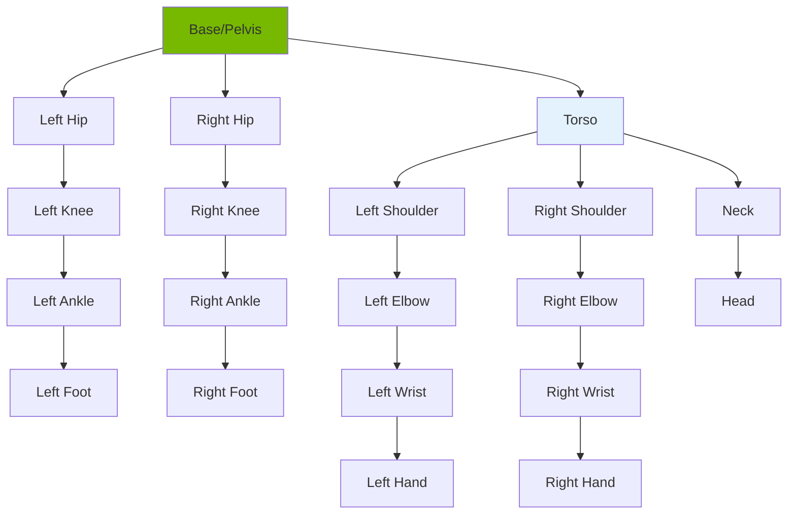

# Chapter 19: Humanoid Kinematics & Dynamics

<!-- DIAGRAM: id="ch19-kinematics" type="architecture" format="mermaid"
     description="Humanoid kinematic chain structure" -->



## Learning Objectives

By the end of this chapter, you will be able to:

1. **Compute forward kinematics** for humanoid kinematic chains
2. **Derive and use Jacobian matrices** for velocity control
3. **Solve inverse kinematics** for end-effector positioning
4. **Model humanoid dynamics** with equations of motion
5. **Implement IK solvers** in Python for humanoid arms

## Prerequisites

Before starting this chapter, ensure you have:

- Completed Modules 1-4
- Understanding of linear algebra (matrices, transformations)
- Familiarity with coordinate frames and rotations
- Basic calculus knowledge (derivatives, gradients)

## Introduction

Humanoid robots are complex kinematic systems with multiple interconnected chains branching from a central body. Unlike simple robotic arms, humanoids have:

- **Multiple end-effectors**: Two hands, two feet, head
- **Floating base**: Not fixed to the ground
- **Redundancy**: More joints than needed for most tasks
- **Coupling**: Arm motion affects whole-body balance

Understanding kinematics and dynamics is essential for motion planning, control, and simulation.

## Kinematic Foundations

### Coordinate Frames and Transforms

```python
import numpy as np
from scipy.spatial.transform import Rotation

class Transform:
    """Homogeneous transformation matrix."""

    def __init__(self, rotation=None, translation=None):
        self.matrix = np.eye(4)
        if rotation is not None:
            self.matrix[:3, :3] = rotation
        if translation is not None:
            self.matrix[:3, 3] = translation

    @classmethod
    def from_dh(cls, a, alpha, d, theta):
        """Create transform from Denavit-Hartenberg parameters."""
        ct, st = np.cos(theta), np.sin(theta)
        ca, sa = np.cos(alpha), np.sin(alpha)

        matrix = np.array([
            [ct, -st*ca,  st*sa, a*ct],
            [st,  ct*ca, -ct*sa, a*st],
            [0,   sa,     ca,    d   ],
            [0,   0,      0,     1   ]
        ])

        t = cls()
        t.matrix = matrix
        return t

    @classmethod
    def from_rpy(cls, roll, pitch, yaw, translation=None):
        """Create transform from roll-pitch-yaw angles."""
        rot = Rotation.from_euler('xyz', [roll, pitch, yaw])
        t = cls(rotation=rot.as_matrix(), translation=translation)
        return t

    def __matmul__(self, other):
        """Matrix multiplication."""
        result = Transform()
        result.matrix = self.matrix @ other.matrix
        return result

    @property
    def position(self):
        return self.matrix[:3, 3]

    @property
    def rotation(self):
        return self.matrix[:3, :3]

    def inverse(self):
        """Compute inverse transform."""
        result = Transform()
        R_inv = self.rotation.T
        result.matrix[:3, :3] = R_inv
        result.matrix[:3, 3] = -R_inv @ self.position
        return result
```

### Humanoid Kinematic Model

```python
from dataclasses import dataclass
from typing import List, Dict
from enum import Enum

class JointType(Enum):
    REVOLUTE = "revolute"
    PRISMATIC = "prismatic"
    FIXED = "fixed"

@dataclass
class Joint:
    name: str
    joint_type: JointType
    parent: str
    child: str
    axis: np.ndarray  # Rotation/translation axis
    origin: Transform  # Transform from parent to joint
    limits: tuple = (-np.pi, np.pi)

class HumanoidKinematics:
    """Kinematic model for humanoid robot."""

    def __init__(self):
        self.joints: Dict[str, Joint] = {}
        self.links: List[str] = []
        self._build_model()

    def _build_model(self):
        """Build kinematic chain for humanoid."""
        # Base link
        self.links.append("pelvis")

        # Right arm chain
        self._add_arm_chain("right")

        # Left arm chain
        self._add_arm_chain("left")

        # Right leg chain
        self._add_leg_chain("right")

        # Left leg chain
        self._add_leg_chain("left")

        # Torso and head
        self._add_torso_chain()

    def _add_arm_chain(self, side: str):
        """Add arm kinematic chain."""
        sign = 1 if side == "right" else -1
        prefix = f"{side}_"

        # Shoulder pitch
        self.joints[f"{prefix}shoulder_pitch"] = Joint(
            name=f"{prefix}shoulder_pitch",
            joint_type=JointType.REVOLUTE,
            parent="torso",
            child=f"{prefix}upper_arm",
            axis=np.array([0, 1, 0]),
            origin=Transform.from_rpy(0, 0, 0, [0, sign * 0.2, 0.3]),
            limits=(-2.0, 2.0)
        )

        # Shoulder roll
        self.joints[f"{prefix}shoulder_roll"] = Joint(
            name=f"{prefix}shoulder_roll",
            joint_type=JointType.REVOLUTE,
            parent=f"{prefix}upper_arm",
            child=f"{prefix}upper_arm_roll",
            axis=np.array([1, 0, 0]),
            origin=Transform(),
            limits=(-1.5, 1.5)
        )

        # Shoulder yaw
        self.joints[f"{prefix}shoulder_yaw"] = Joint(
            name=f"{prefix}shoulder_yaw",
            joint_type=JointType.REVOLUTE,
            parent=f"{prefix}upper_arm_roll",
            child=f"{prefix}lower_arm",
            axis=np.array([0, 0, 1]),
            origin=Transform.from_rpy(0, 0, 0, [0.3, 0, 0]),
            limits=(-1.5, 1.5)
        )

        # Elbow
        self.joints[f"{prefix}elbow"] = Joint(
            name=f"{prefix}elbow",
            joint_type=JointType.REVOLUTE,
            parent=f"{prefix}lower_arm",
            child=f"{prefix}forearm",
            axis=np.array([0, 1, 0]),
            origin=Transform(),
            limits=(0, 2.5)
        )

        # Wrist roll
        self.joints[f"{prefix}wrist_roll"] = Joint(
            name=f"{prefix}wrist_roll",
            joint_type=JointType.REVOLUTE,
            parent=f"{prefix}forearm",
            child=f"{prefix}wrist",
            axis=np.array([1, 0, 0]),
            origin=Transform.from_rpy(0, 0, 0, [0.25, 0, 0]),
            limits=(-1.5, 1.5)
        )

        # Wrist pitch
        self.joints[f"{prefix}wrist_pitch"] = Joint(
            name=f"{prefix}wrist_pitch",
            joint_type=JointType.REVOLUTE,
            parent=f"{prefix}wrist",
            child=f"{prefix}hand",
            axis=np.array([0, 1, 0]),
            origin=Transform(),
            limits=(-1.0, 1.0)
        )

        # Wrist yaw
        self.joints[f"{prefix}wrist_yaw"] = Joint(
            name=f"{prefix}wrist_yaw",
            joint_type=JointType.REVOLUTE,
            parent=f"{prefix}hand",
            child=f"{prefix}palm",
            axis=np.array([0, 0, 1]),
            origin=Transform(),
            limits=(-0.5, 0.5)
        )

    def _add_leg_chain(self, side: str):
        """Add leg kinematic chain."""
        sign = 1 if side == "right" else -1
        prefix = f"{side}_"

        # Hip yaw
        self.joints[f"{prefix}hip_yaw"] = Joint(
            name=f"{prefix}hip_yaw",
            joint_type=JointType.REVOLUTE,
            parent="pelvis",
            child=f"{prefix}hip_yaw_link",
            axis=np.array([0, 0, 1]),
            origin=Transform.from_rpy(0, 0, 0, [0, sign * 0.1, 0]),
            limits=(-0.5, 0.5)
        )

        # Hip roll
        self.joints[f"{prefix}hip_roll"] = Joint(
            name=f"{prefix}hip_roll",
            joint_type=JointType.REVOLUTE,
            parent=f"{prefix}hip_yaw_link",
            child=f"{prefix}hip_roll_link",
            axis=np.array([1, 0, 0]),
            origin=Transform(),
            limits=(-0.5, 0.5)
        )

        # Hip pitch
        self.joints[f"{prefix}hip_pitch"] = Joint(
            name=f"{prefix}hip_pitch",
            joint_type=JointType.REVOLUTE,
            parent=f"{prefix}hip_roll_link",
            child=f"{prefix}thigh",
            axis=np.array([0, 1, 0]),
            origin=Transform(),
            limits=(-1.5, 0.5)
        )

        # Knee
        self.joints[f"{prefix}knee"] = Joint(
            name=f"{prefix}knee",
            joint_type=JointType.REVOLUTE,
            parent=f"{prefix}thigh",
            child=f"{prefix}shank",
            axis=np.array([0, 1, 0]),
            origin=Transform.from_rpy(0, 0, 0, [0, 0, -0.4]),
            limits=(0, 2.5)
        )

        # Ankle pitch
        self.joints[f"{prefix}ankle_pitch"] = Joint(
            name=f"{prefix}ankle_pitch",
            joint_type=JointType.REVOLUTE,
            parent=f"{prefix}shank",
            child=f"{prefix}ankle_pitch_link",
            axis=np.array([0, 1, 0]),
            origin=Transform.from_rpy(0, 0, 0, [0, 0, -0.4]),
            limits=(-1.0, 1.0)
        )

        # Ankle roll
        self.joints[f"{prefix}ankle_roll"] = Joint(
            name=f"{prefix}ankle_roll",
            joint_type=JointType.REVOLUTE,
            parent=f"{prefix}ankle_pitch_link",
            child=f"{prefix}foot",
            axis=np.array([1, 0, 0]),
            origin=Transform(),
            limits=(-0.5, 0.5)
        )

    def _add_torso_chain(self):
        """Add torso and head chain."""
        # Torso
        self.joints["torso_yaw"] = Joint(
            name="torso_yaw",
            joint_type=JointType.REVOLUTE,
            parent="pelvis",
            child="torso",
            axis=np.array([0, 0, 1]),
            origin=Transform.from_rpy(0, 0, 0, [0, 0, 0.2]),
            limits=(-1.0, 1.0)
        )

        # Neck
        self.joints["neck_pitch"] = Joint(
            name="neck_pitch",
            joint_type=JointType.REVOLUTE,
            parent="torso",
            child="neck",
            axis=np.array([0, 1, 0]),
            origin=Transform.from_rpy(0, 0, 0, [0, 0, 0.3]),
            limits=(-0.5, 0.5)
        )

        # Head
        self.joints["head_yaw"] = Joint(
            name="head_yaw",
            joint_type=JointType.REVOLUTE,
            parent="neck",
            child="head",
            axis=np.array([0, 0, 1]),
            origin=Transform.from_rpy(0, 0, 0, [0, 0, 0.1]),
            limits=(-1.5, 1.5)
        )
```

## Forward Kinematics

### Computing End-Effector Pose

```python
def rotation_matrix(axis: np.ndarray, angle: float) -> np.ndarray:
    """Compute rotation matrix from axis-angle."""
    axis = axis / np.linalg.norm(axis)
    K = np.array([
        [0, -axis[2], axis[1]],
        [axis[2], 0, -axis[0]],
        [-axis[1], axis[0], 0]
    ])
    return np.eye(3) + np.sin(angle) * K + (1 - np.cos(angle)) * K @ K

class ForwardKinematics:
    """Forward kinematics solver for humanoid."""

    def __init__(self, model: HumanoidKinematics):
        self.model = model
        self.arm_joints = {
            "right": ["right_shoulder_pitch", "right_shoulder_roll",
                      "right_shoulder_yaw", "right_elbow",
                      "right_wrist_roll", "right_wrist_pitch", "right_wrist_yaw"],
            "left": ["left_shoulder_pitch", "left_shoulder_roll",
                     "left_shoulder_yaw", "left_elbow",
                     "left_wrist_roll", "left_wrist_pitch", "left_wrist_yaw"]
        }

    def compute_arm_fk(self, joint_angles: np.ndarray, side: str = "right") -> Transform:
        """Compute forward kinematics for arm."""
        joint_names = self.arm_joints[side]

        if len(joint_angles) != len(joint_names):
            raise ValueError(f"Expected {len(joint_names)} joint angles")

        # Start from torso
        T = Transform()

        for i, joint_name in enumerate(joint_names):
            joint = self.model.joints[joint_name]
            angle = joint_angles[i]

            # Apply joint origin transform
            T = T @ joint.origin

            # Apply joint rotation
            R = rotation_matrix(joint.axis, angle)
            joint_transform = Transform(rotation=R)
            T = T @ joint_transform

        # Add hand offset
        hand_offset = Transform.from_rpy(0, 0, 0, [0.1, 0, 0])
        T = T @ hand_offset

        return T

    def compute_leg_fk(self, joint_angles: np.ndarray, side: str = "right") -> Transform:
        """Compute forward kinematics for leg."""
        leg_joints = [
            f"{side}_hip_yaw", f"{side}_hip_roll", f"{side}_hip_pitch",
            f"{side}_knee", f"{side}_ankle_pitch", f"{side}_ankle_roll"
        ]

        T = Transform()

        for i, joint_name in enumerate(leg_joints):
            joint = self.model.joints[joint_name]
            angle = joint_angles[i]

            T = T @ joint.origin
            R = rotation_matrix(joint.axis, angle)
            joint_transform = Transform(rotation=R)
            T = T @ joint_transform

        return T

    def compute_all_links(self, joint_positions: Dict[str, float]) -> Dict[str, Transform]:
        """Compute transforms for all links."""
        link_transforms = {"pelvis": Transform()}

        # Process joints in order
        for joint_name, joint in self.model.joints.items():
            if joint.parent in link_transforms:
                parent_transform = link_transforms[joint.parent]

                # Get joint angle
                angle = joint_positions.get(joint_name, 0.0)

                # Compute child transform
                T = parent_transform @ joint.origin
                if joint.joint_type == JointType.REVOLUTE:
                    R = rotation_matrix(joint.axis, angle)
                    T = T @ Transform(rotation=R)

                link_transforms[joint.child] = T

        return link_transforms
```

## Jacobian Matrix

### Geometric Jacobian

```python
class JacobianSolver:
    """Compute Jacobian matrices for velocity control."""

    def __init__(self, model: HumanoidKinematics, fk: ForwardKinematics):
        self.model = model
        self.fk = fk

    def compute_arm_jacobian(self, joint_angles: np.ndarray, side: str = "right") -> np.ndarray:
        """Compute geometric Jacobian for arm.

        Returns 6xN Jacobian where:
        - Top 3 rows: linear velocity
        - Bottom 3 rows: angular velocity
        """
        joint_names = self.fk.arm_joints[side]
        n_joints = len(joint_names)

        # Get end-effector position
        T_ee = self.fk.compute_arm_fk(joint_angles, side)
        p_ee = T_ee.position

        J = np.zeros((6, n_joints))

        # Compute partial transforms
        T = Transform()
        for i, joint_name in enumerate(joint_names):
            joint = self.model.joints[joint_name]
            T = T @ joint.origin

            # Joint axis in world frame
            z_i = T.rotation @ joint.axis

            # Joint position in world frame
            p_i = T.position

            if joint.joint_type == JointType.REVOLUTE:
                # Linear velocity contribution: z_i x (p_ee - p_i)
                J[:3, i] = np.cross(z_i, p_ee - p_i)
                # Angular velocity contribution: z_i
                J[3:, i] = z_i
            else:  # Prismatic
                J[:3, i] = z_i
                J[3:, i] = 0

            # Apply joint rotation for next iteration
            R = rotation_matrix(joint.axis, joint_angles[i])
            T = T @ Transform(rotation=R)

        return J

    def compute_numerical_jacobian(self, joint_angles: np.ndarray, side: str = "right",
                                   epsilon: float = 1e-6) -> np.ndarray:
        """Compute Jacobian numerically for verification."""
        n_joints = len(joint_angles)
        J = np.zeros((6, n_joints))

        T_nominal = self.fk.compute_arm_fk(joint_angles, side)
        p_nominal = T_nominal.position
        rot_nominal = Rotation.from_matrix(T_nominal.rotation)

        for i in range(n_joints):
            angles_plus = joint_angles.copy()
            angles_plus[i] += epsilon

            T_plus = self.fk.compute_arm_fk(angles_plus, side)

            # Linear Jacobian
            J[:3, i] = (T_plus.position - p_nominal) / epsilon

            # Angular Jacobian (rotation difference)
            rot_plus = Rotation.from_matrix(T_plus.rotation)
            rot_diff = rot_plus * rot_nominal.inv()
            J[3:, i] = rot_diff.as_rotvec() / epsilon

        return J

    def compute_manipulability(self, jacobian: np.ndarray) -> float:
        """Compute Yoshikawa's manipulability measure."""
        return np.sqrt(np.linalg.det(jacobian @ jacobian.T))
```

## Inverse Kinematics

### Numerical IK Solver

```python
class InverseKinematics:
    """Inverse kinematics solver using numerical methods."""

    def __init__(self, model: HumanoidKinematics, fk: ForwardKinematics):
        self.model = model
        self.fk = fk
        self.jacobian_solver = JacobianSolver(model, fk)

    def solve_arm_ik(
        self,
        target_position: np.ndarray,
        target_orientation: np.ndarray = None,
        initial_angles: np.ndarray = None,
        side: str = "right",
        max_iterations: int = 100,
        position_tolerance: float = 1e-3,
        orientation_tolerance: float = 1e-2
    ) -> Dict:
        """Solve IK for arm using damped least squares."""

        joint_names = self.fk.arm_joints[side]
        n_joints = len(joint_names)

        # Initialize joint angles
        if initial_angles is None:
            q = np.zeros(n_joints)
        else:
            q = initial_angles.copy()

        # Damping factor for singularity avoidance
        lambda_damping = 0.01

        for iteration in range(max_iterations):
            # Compute current end-effector pose
            T_current = self.fk.compute_arm_fk(q, side)
            p_current = T_current.position

            # Position error
            position_error = target_position - p_current
            position_norm = np.linalg.norm(position_error)

            # Orientation error (if specified)
            if target_orientation is not None:
                R_current = Rotation.from_matrix(T_current.rotation)
                R_target = Rotation.from_matrix(target_orientation)
                R_error = R_target * R_current.inv()
                orientation_error = R_error.as_rotvec()
                orientation_norm = np.linalg.norm(orientation_error)

                # Combined error
                error = np.concatenate([position_error, orientation_error])
            else:
                orientation_norm = 0
                error = position_error

            # Check convergence
            if position_norm < position_tolerance:
                if target_orientation is None or orientation_norm < orientation_tolerance:
                    return {
                        "success": True,
                        "joint_angles": q,
                        "iterations": iteration,
                        "position_error": position_norm,
                        "orientation_error": orientation_norm
                    }

            # Compute Jacobian
            J = self.jacobian_solver.compute_arm_jacobian(q, side)

            # Use only position rows if no orientation target
            if target_orientation is None:
                J = J[:3, :]

            # Damped least squares (DLS) solution
            # dq = J^T (J J^T + lambda^2 I)^-1 error
            JJT = J @ J.T
            damped = JJT + lambda_damping**2 * np.eye(JJT.shape[0])
            dq = J.T @ np.linalg.solve(damped, error)

            # Apply joint limits
            q_new = q + dq
            for i, joint_name in enumerate(joint_names):
                joint = self.model.joints[joint_name]
                q_new[i] = np.clip(q_new[i], joint.limits[0], joint.limits[1])

            q = q_new

        return {
            "success": False,
            "joint_angles": q,
            "iterations": max_iterations,
            "position_error": position_norm,
            "orientation_error": orientation_norm if target_orientation is not None else 0
        }

    def solve_with_nullspace(
        self,
        target_position: np.ndarray,
        target_orientation: np.ndarray = None,
        initial_angles: np.ndarray = None,
        secondary_objective: str = "manipulability",
        side: str = "right"
    ) -> Dict:
        """Solve IK with nullspace optimization for redundant DOFs."""

        joint_names = self.fk.arm_joints[side]
        n_joints = len(joint_names)

        if initial_angles is None:
            q = np.zeros(n_joints)
        else:
            q = initial_angles.copy()

        lambda_damping = 0.01
        alpha_nullspace = 0.1  # Nullspace step size

        for iteration in range(100):
            T_current = self.fk.compute_arm_fk(q, side)
            p_current = T_current.position

            position_error = target_position - p_current

            if np.linalg.norm(position_error) < 1e-3:
                return {"success": True, "joint_angles": q, "iterations": iteration}

            J = self.jacobian_solver.compute_arm_jacobian(q, side)[:3, :]

            # Primary task solution
            JJT = J @ J.T
            damped = JJT + lambda_damping**2 * np.eye(3)
            dq_primary = J.T @ np.linalg.solve(damped, position_error)

            # Nullspace projection
            J_pinv = J.T @ np.linalg.inv(damped)
            N = np.eye(n_joints) - J_pinv @ J

            # Secondary objective gradient
            if secondary_objective == "manipulability":
                grad = self._manipulability_gradient(q, side)
            elif secondary_objective == "joint_limits":
                grad = self._joint_limits_gradient(q, side)
            else:
                grad = np.zeros(n_joints)

            dq_nullspace = alpha_nullspace * N @ grad

            # Combined update
            q = q + dq_primary + dq_nullspace

            # Apply joint limits
            for i, joint_name in enumerate(joint_names):
                joint = self.model.joints[joint_name]
                q[i] = np.clip(q[i], joint.limits[0], joint.limits[1])

        return {"success": False, "joint_angles": q, "iterations": 100}

    def _manipulability_gradient(self, q: np.ndarray, side: str) -> np.ndarray:
        """Gradient of manipulability for nullspace optimization."""
        epsilon = 1e-4
        n_joints = len(q)
        grad = np.zeros(n_joints)

        J = self.jacobian_solver.compute_arm_jacobian(q, side)[:3, :]
        m = np.sqrt(np.linalg.det(J @ J.T))

        for i in range(n_joints):
            q_plus = q.copy()
            q_plus[i] += epsilon
            J_plus = self.jacobian_solver.compute_arm_jacobian(q_plus, side)[:3, :]
            m_plus = np.sqrt(np.linalg.det(J_plus @ J_plus.T))
            grad[i] = (m_plus - m) / epsilon

        return grad

    def _joint_limits_gradient(self, q: np.ndarray, side: str) -> np.ndarray:
        """Gradient to avoid joint limits."""
        joint_names = self.fk.arm_joints[side]
        grad = np.zeros(len(q))

        for i, joint_name in enumerate(joint_names):
            joint = self.model.joints[joint_name]
            mid = (joint.limits[0] + joint.limits[1]) / 2
            grad[i] = -(q[i] - mid)  # Push toward center

        return grad
```

## Humanoid Dynamics

### Equations of Motion

```python
class HumanoidDynamics:
    """Dynamics model for humanoid robot."""

    def __init__(self, model: HumanoidKinematics):
        self.model = model
        self.gravity = np.array([0, 0, -9.81])

        # Link masses (kg) - simplified model
        self.link_masses = {
            "pelvis": 10.0,
            "torso": 15.0,
            "head": 4.0,
            "upper_arm": 2.0,
            "forearm": 1.5,
            "hand": 0.5,
            "thigh": 7.0,
            "shank": 4.0,
            "foot": 1.5
        }

        # Link inertias (kg*m^2) - simplified diagonal
        self.link_inertias = {name: np.eye(3) * mass * 0.01
                             for name, mass in self.link_masses.items()}

    def compute_mass_matrix(self, q: np.ndarray) -> np.ndarray:
        """Compute mass matrix M(q) using composite rigid body algorithm."""
        n = len(q)
        M = np.zeros((n, n))

        # Simplified computation - full implementation would use
        # Featherstone's algorithm or similar
        for i in range(n):
            for j in range(n):
                M[i, j] = self._mass_matrix_element(q, i, j)

        return M

    def _mass_matrix_element(self, q: np.ndarray, i: int, j: int) -> float:
        """Compute single element of mass matrix."""
        # Simplified - proper implementation needs full kinematic chain
        if i == j:
            return 1.0  # Diagonal dominance
        else:
            return 0.1 * np.exp(-abs(i - j))  # Coupling decreases with distance

    def compute_coriolis_matrix(self, q: np.ndarray, dq: np.ndarray) -> np.ndarray:
        """Compute Coriolis matrix C(q, dq)."""
        n = len(q)
        C = np.zeros((n, n))
        epsilon = 1e-6

        # Using Christoffel symbols
        for i in range(n):
            for j in range(n):
                for k in range(n):
                    c_ijk = self._christoffel_symbol(q, i, j, k, epsilon)
                    C[i, j] += c_ijk * dq[k]

        return C

    def _christoffel_symbol(self, q: np.ndarray, i: int, j: int, k: int, eps: float) -> float:
        """Compute Christoffel symbol of the first kind."""
        # c_ijk = 0.5 * (dM_ij/dq_k + dM_ik/dq_j - dM_jk/dq_i)

        def M_element(q_val, a, b):
            return self._mass_matrix_element(q_val, a, b)

        q_plus_k = q.copy(); q_plus_k[k] += eps
        q_minus_k = q.copy(); q_minus_k[k] -= eps
        dM_ij_dqk = (M_element(q_plus_k, i, j) - M_element(q_minus_k, i, j)) / (2 * eps)

        q_plus_j = q.copy(); q_plus_j[j] += eps
        q_minus_j = q.copy(); q_minus_j[j] -= eps
        dM_ik_dqj = (M_element(q_plus_j, i, k) - M_element(q_minus_j, i, k)) / (2 * eps)

        q_plus_i = q.copy(); q_plus_i[i] += eps
        q_minus_i = q.copy(); q_minus_i[i] -= eps
        dM_jk_dqi = (M_element(q_plus_i, j, k) - M_element(q_minus_i, j, k)) / (2 * eps)

        return 0.5 * (dM_ij_dqk + dM_ik_dqj - dM_jk_dqi)

    def compute_gravity_vector(self, q: np.ndarray) -> np.ndarray:
        """Compute gravity compensation vector G(q)."""
        n = len(q)
        G = np.zeros(n)

        # Simplified - proper implementation needs potential energy gradient
        for i in range(n):
            G[i] = 0.5 * 9.81  # Placeholder

        return G

    def inverse_dynamics(self, q: np.ndarray, dq: np.ndarray, ddq: np.ndarray) -> np.ndarray:
        """Compute required torques using inverse dynamics.

        tau = M(q) * ddq + C(q, dq) * dq + G(q)
        """
        M = self.compute_mass_matrix(q)
        C = self.compute_coriolis_matrix(q, dq)
        G = self.compute_gravity_vector(q)

        tau = M @ ddq + C @ dq + G
        return tau

    def forward_dynamics(self, q: np.ndarray, dq: np.ndarray, tau: np.ndarray) -> np.ndarray:
        """Compute accelerations from applied torques.

        ddq = M(q)^-1 * (tau - C(q, dq) * dq - G(q))
        """
        M = self.compute_mass_matrix(q)
        C = self.compute_coriolis_matrix(q, dq)
        G = self.compute_gravity_vector(q)

        ddq = np.linalg.solve(M, tau - C @ dq - G)
        return ddq
```

## ROS 2 Integration

### IK Service Node

```python
#!/usr/bin/env python3
"""ROS 2 node for humanoid IK service."""

import rclpy
from rclpy.node import Node
from geometry_msgs.msg import Pose, Point, Quaternion
from sensor_msgs.msg import JointState
from std_srvs.srv import Trigger

import numpy as np
from scipy.spatial.transform import Rotation

# Import our kinematics classes
# from humanoid_kinematics import HumanoidKinematics, ForwardKinematics, InverseKinematics

class HumanoidIKNode(Node):
    def __init__(self):
        super().__init__('humanoid_ik')

        # Initialize kinematics
        self.model = HumanoidKinematics()
        self.fk = ForwardKinematics(self.model)
        self.ik = InverseKinematics(self.model, self.fk)

        # Current joint state
        self.current_joints = {}

        # Subscribers
        self.joint_sub = self.create_subscription(
            JointState, '/joint_states', self.joint_callback, 10)

        # Publishers
        self.target_pub = self.create_publisher(
            JointState, '/joint_commands', 10)

        # Target pose subscriber
        self.target_sub = self.create_subscription(
            Pose, '/arm_target_pose', self.target_callback, 10)

        self.get_logger().info('Humanoid IK node initialized')

    def joint_callback(self, msg: JointState):
        """Update current joint positions."""
        for name, position in zip(msg.name, msg.position):
            self.current_joints[name] = position

    def target_callback(self, msg: Pose):
        """Solve IK for target pose."""
        # Extract target position
        target_pos = np.array([
            msg.position.x,
            msg.position.y,
            msg.position.z
        ])

        # Extract target orientation
        target_quat = [msg.orientation.x, msg.orientation.y,
                       msg.orientation.z, msg.orientation.w]
        target_rot = Rotation.from_quat(target_quat).as_matrix()

        # Get current arm joint angles as initial guess
        arm_joints = self.fk.arm_joints["right"]
        initial = np.array([self.current_joints.get(j, 0.0) for j in arm_joints])

        # Solve IK
        result = self.ik.solve_arm_ik(
            target_pos, target_rot, initial, side="right"
        )

        if result["success"]:
            # Publish joint commands
            cmd = JointState()
            cmd.header.stamp = self.get_clock().now().to_msg()
            cmd.name = arm_joints
            cmd.position = result["joint_angles"].tolist()
            self.target_pub.publish(cmd)

            self.get_logger().info(
                f'IK solved in {result["iterations"]} iterations, '
                f'error: {result["position_error"]:.4f}m'
            )
        else:
            self.get_logger().warn('IK failed to converge')

def main(args=None):
    rclpy.init(args=args)
    node = HumanoidIKNode()
    rclpy.spin(node)
    node.destroy_node()
    rclpy.shutdown()

if __name__ == '__main__':
    main()
```

## Hands-On Exercise

### Exercise 1: Forward Kinematics

1. Implement FK for the left arm
2. Visualize end-effector trajectory as joints move
3. Compare with numerical differentiation

### Exercise 2: Jacobian Analysis

1. Plot manipulability ellipsoid at different configurations
2. Identify singular configurations
3. Implement singularity avoidance

### Exercise 3: IK Solver

1. Extend IK to handle orientation
2. Implement elbow position constraint
3. Test on reaching tasks in simulation

## Key Concepts

| Term | Definition |
|------|------------|
| **Forward Kinematics** | Computing end-effector pose from joint angles |
| **Inverse Kinematics** | Computing joint angles for target pose |
| **Jacobian** | Matrix relating joint velocities to end-effector velocity |
| **Singularity** | Configuration where Jacobian loses rank |
| **Manipulability** | Measure of dexterity at a configuration |
| **Nullspace** | Joint motions that don't affect end-effector |

## Chapter Summary

In this chapter, you learned:

1. **Kinematic modeling**: Representing humanoid structure as kinematic chains.

2. **Forward kinematics**: Computing end-effector pose from joint angles.

3. **Jacobians**: Relating joint velocities to Cartesian velocities.

4. **Inverse kinematics**: Numerical methods for finding joint configurations.

5. **Dynamics**: Equations of motion for humanoid robots.

## What's Next

In [Chapter 20: Bipedal Locomotion](./ch20-bipedal-locomotion), you'll learn how to generate stable walking gaits using ZMP and inverted pendulum models.

## Further Reading

- [Introduction to Robotics (Craig)](https://www.pearson.com/us/higher-education/program/Craig-Introduction-to-Robotics-Mechanics-and-Control-4th-Edition/PGM91709.html) - Classic textbook
- [Modern Robotics (Lynch & Park)](http://hades.mech.northwestern.edu/index.php/Modern_Robotics) - Free online textbook
- [MoveIt 2 Documentation](https://moveit.ros.org/) - Motion planning framework
- [PyBullet IK](https://pybullet.org/) - Fast simulation and IK
