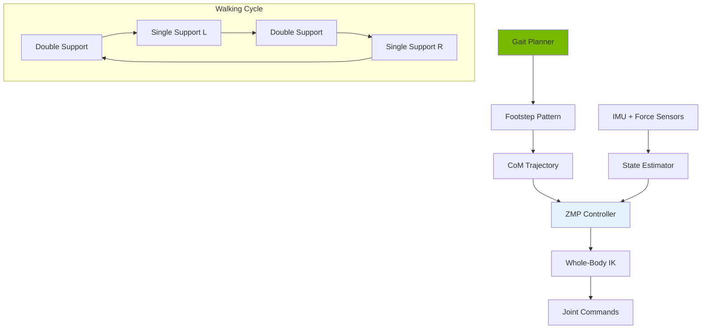

# Chapter 20: Bipedal Locomotion & Balance Control

<!-- DIAGRAM: id="ch20-locomotion" type="architecture" format="mermaid"
     description="Bipedal locomotion control architecture" -->



## Learning Objectives

By the end of this chapter, you will be able to:

1. **Understand ZMP stability criteria** for bipedal balance
2. **Model walking with inverted pendulum** dynamics
3. **Generate stable gait patterns** using preview control
4. **Implement push recovery strategies** for disturbance rejection
5. **Integrate locomotion with ROS 2** control systems

## Prerequisites

Before starting this chapter, ensure you have:

- Completed Chapter 19 (Kinematics & Dynamics)
- Understanding of control systems basics
- Familiarity with differential equations
- Working simulation environment

## Introduction

Bipedal locomotion is fundamentally different from wheeled or tracked motion. Unlike stable platforms, a walking humanoid is constantly falling and catching itself. This chapter covers the control techniques that make stable bipedal walking possible.

Key challenges:
- **Dynamic balance**: Managing the robot's center of mass
- **Discrete contacts**: Feet alternately touch the ground
- **Underactuation**: Cannot directly control CoM position
- **Disturbances**: External forces and uneven terrain

## Stability Concepts

### Center of Mass and Support Polygon

```python
import numpy as np
from typing import List, Tuple
from dataclasses import dataclass

@dataclass
class FootContact:
    """Represents a foot contact with the ground."""
    position: np.ndarray  # [x, y, z]
    orientation: float    # Yaw angle
    width: float = 0.10   # Foot width
    length: float = 0.20  # Foot length

    def get_vertices(self) -> np.ndarray:
        """Get foot polygon vertices in world frame."""
        # Local foot vertices
        local = np.array([
            [self.length/2, self.width/2],
            [self.length/2, -self.width/2],
            [-self.length/2, -self.width/2],
            [-self.length/2, self.width/2]
        ])

        # Rotation matrix
        c, s = np.cos(self.orientation), np.sin(self.orientation)
        R = np.array([[c, -s], [s, c]])

        # Transform to world frame
        world = (R @ local.T).T + self.position[:2]
        return world

class SupportPolygon:
    """Compute and analyze support polygon."""

    def __init__(self, contacts: List[FootContact]):
        self.contacts = contacts
        self.vertices = self._compute_convex_hull()

    def _compute_convex_hull(self) -> np.ndarray:
        """Compute convex hull of all foot vertices."""
        from scipy.spatial import ConvexHull

        all_vertices = []
        for contact in self.contacts:
            all_vertices.extend(contact.get_vertices())

        if len(all_vertices) < 3:
            return np.array(all_vertices)

        points = np.array(all_vertices)
        hull = ConvexHull(points)
        return points[hull.vertices]

    def contains(self, point: np.ndarray) -> bool:
        """Check if point is inside support polygon."""
        if len(self.vertices) < 3:
            return False

        # Ray casting algorithm
        n = len(self.vertices)
        inside = False

        j = n - 1
        for i in range(n):
            if ((self.vertices[i, 1] > point[1]) != (self.vertices[j, 1] > point[1])) and \
               (point[0] < (self.vertices[j, 0] - self.vertices[i, 0]) *
                (point[1] - self.vertices[i, 1]) / (self.vertices[j, 1] - self.vertices[i, 1])
                + self.vertices[i, 0]):
                inside = not inside
            j = i

        return inside

    def get_margin(self, point: np.ndarray) -> float:
        """Compute distance from point to polygon edge."""
        if len(self.vertices) < 3:
            return -np.inf

        min_dist = np.inf
        n = len(self.vertices)

        for i in range(n):
            # Edge from vertex i to i+1
            v1 = self.vertices[i]
            v2 = self.vertices[(i + 1) % n]

            # Project point onto edge
            edge = v2 - v1
            edge_len = np.linalg.norm(edge)
            edge_unit = edge / edge_len

            t = np.clip(np.dot(point - v1, edge_unit), 0, edge_len)
            closest = v1 + t * edge_unit

            dist = np.linalg.norm(point - closest)
            min_dist = min(min_dist, dist)

        # Negative if outside
        if not self.contains(point):
            min_dist = -min_dist

        return min_dist
```

### Zero Moment Point (ZMP)

```python
class ZMPCalculator:
    """Calculate Zero Moment Point for balance assessment."""

    def __init__(self, gravity: float = 9.81):
        self.g = gravity

    def compute_zmp(
        self,
        com_position: np.ndarray,
        com_velocity: np.ndarray,
        com_acceleration: np.ndarray,
        com_height: float
    ) -> np.ndarray:
        """Compute ZMP from CoM dynamics.

        ZMP_x = CoM_x - (CoM_z / g) * CoM_ddx
        ZMP_y = CoM_y - (CoM_z / g) * CoM_ddy
        """
        zmp = np.zeros(2)
        zmp[0] = com_position[0] - (com_height / self.g) * com_acceleration[0]
        zmp[1] = com_position[1] - (com_height / self.g) * com_acceleration[1]
        return zmp

    def compute_zmp_from_forces(
        self,
        contact_forces: List[Tuple[np.ndarray, np.ndarray]]  # [(position, force), ...]
    ) -> np.ndarray:
        """Compute ZMP from ground reaction forces.

        ZMP = sum(p_i * f_z_i) / sum(f_z_i)
        """
        total_force_z = 0
        weighted_position = np.zeros(2)

        for position, force in contact_forces:
            f_z = force[2]  # Vertical force
            total_force_z += f_z
            weighted_position += position[:2] * f_z

        if total_force_z > 1e-6:
            return weighted_position / total_force_z
        else:
            return np.zeros(2)

    def is_stable(
        self,
        zmp: np.ndarray,
        support_polygon: SupportPolygon,
        margin: float = 0.02
    ) -> bool:
        """Check if ZMP is within support polygon with margin."""
        actual_margin = support_polygon.get_margin(zmp)
        return actual_margin >= margin
```

## Inverted Pendulum Model

### Linear Inverted Pendulum Model (LIPM)

```python
class LinearInvertedPendulum:
    """Linear Inverted Pendulum Model for walking dynamics."""

    def __init__(self, com_height: float = 0.8, gravity: float = 9.81):
        self.z_c = com_height  # Constant CoM height
        self.g = gravity
        self.omega = np.sqrt(gravity / com_height)  # Natural frequency

    def compute_com_dynamics(
        self,
        com_pos: np.ndarray,
        com_vel: np.ndarray,
        zmp_ref: np.ndarray
    ) -> np.ndarray:
        """Compute CoM acceleration from ZMP.

        ddx = omega^2 * (x - p_x)
        ddy = omega^2 * (y - p_y)
        """
        ddx = self.omega**2 * (com_pos[0] - zmp_ref[0])
        ddy = self.omega**2 * (com_pos[1] - zmp_ref[1])
        return np.array([ddx, ddy])

    def simulate_step(
        self,
        com_pos: np.ndarray,
        com_vel: np.ndarray,
        zmp_ref: np.ndarray,
        dt: float
    ) -> Tuple[np.ndarray, np.ndarray]:
        """Simulate one time step of LIPM dynamics."""
        acc = self.compute_com_dynamics(com_pos, com_vel, zmp_ref)

        # Euler integration
        new_vel = com_vel + acc * dt
        new_pos = com_pos + com_vel * dt + 0.5 * acc * dt**2

        return new_pos, new_vel

    def compute_capture_point(
        self,
        com_pos: np.ndarray,
        com_vel: np.ndarray
    ) -> np.ndarray:
        """Compute capture point (instantaneous capture point).

        CP = CoM + CoM_vel / omega
        """
        return com_pos + com_vel / self.omega

    def compute_orbital_energy(
        self,
        com_pos: np.ndarray,
        com_vel: np.ndarray,
        zmp: np.ndarray
    ) -> float:
        """Compute orbital energy for stability analysis.

        E = 0.5 * v^2 - 0.5 * omega^2 * (x - p)^2
        """
        dx = com_pos - zmp
        return 0.5 * np.dot(com_vel, com_vel) - 0.5 * self.omega**2 * np.dot(dx, dx)
```

### 3D Inverted Pendulum

```python
class InvertedPendulum3D:
    """3D Inverted Pendulum Model with angular momentum."""

    def __init__(self, mass: float = 50.0, com_height: float = 0.8):
        self.mass = mass
        self.z_c = com_height
        self.g = 9.81
        self.omega = np.sqrt(self.g / self.z_c)

        # State: [x, y, dx, dy]
        self.state = np.zeros(4)

    def set_state(self, position: np.ndarray, velocity: np.ndarray):
        """Set pendulum state."""
        self.state[:2] = position
        self.state[2:] = velocity

    def dynamics(self, state: np.ndarray, zmp: np.ndarray) -> np.ndarray:
        """Compute state derivative."""
        dstate = np.zeros(4)
        dstate[:2] = state[2:]  # velocity
        dstate[2] = self.omega**2 * (state[0] - zmp[0])  # x acceleration
        dstate[3] = self.omega**2 * (state[1] - zmp[1])  # y acceleration
        return dstate

    def simulate(self, zmp_trajectory: np.ndarray, dt: float) -> np.ndarray:
        """Simulate pendulum with ZMP trajectory."""
        n_steps = len(zmp_trajectory)
        trajectory = np.zeros((n_steps, 4))
        trajectory[0] = self.state

        for i in range(n_steps - 1):
            # RK4 integration
            k1 = self.dynamics(trajectory[i], zmp_trajectory[i])
            k2 = self.dynamics(trajectory[i] + 0.5*dt*k1, zmp_trajectory[i])
            k3 = self.dynamics(trajectory[i] + 0.5*dt*k2, zmp_trajectory[i])
            k4 = self.dynamics(trajectory[i] + dt*k3, zmp_trajectory[i])

            trajectory[i+1] = trajectory[i] + (dt/6) * (k1 + 2*k2 + 2*k3 + k4)

        return trajectory
```

## Gait Generation

### Footstep Planning

```python
@dataclass
class Footstep:
    """Single footstep definition."""
    position: np.ndarray  # [x, y, z]
    orientation: float    # Yaw angle
    foot: str            # 'left' or 'right'
    duration: float      # Step duration
    double_support_time: float = 0.1

class FootstepPlanner:
    """Generate footstep patterns for walking."""

    def __init__(
        self,
        step_length: float = 0.3,
        step_width: float = 0.2,
        step_height: float = 0.05,
        step_duration: float = 0.6
    ):
        self.step_length = step_length
        self.step_width = step_width
        self.step_height = step_height
        self.step_duration = step_duration

    def plan_straight_walk(
        self,
        start_pos: np.ndarray,
        distance: float,
        start_foot: str = 'right'
    ) -> List[Footstep]:
        """Plan footsteps for straight walking."""
        footsteps = []
        n_steps = int(np.ceil(distance / self.step_length))

        current_foot = start_foot
        for i in range(n_steps):
            # Lateral offset based on foot
            lateral = self.step_width/2 if current_foot == 'right' else -self.step_width/2

            pos = np.array([
                start_pos[0] + (i + 1) * self.step_length,
                start_pos[1] + lateral,
                0.0
            ])

            footsteps.append(Footstep(
                position=pos,
                orientation=0.0,
                foot=current_foot,
                duration=self.step_duration
            ))

            # Alternate feet
            current_foot = 'left' if current_foot == 'right' else 'right'

        return footsteps

    def plan_turn(
        self,
        center: np.ndarray,
        radius: float,
        angle: float,
        start_foot: str = 'right'
    ) -> List[Footstep]:
        """Plan footsteps for turning."""
        footsteps = []

        # Number of steps based on arc length
        arc_length = abs(radius * angle)
        n_steps = max(3, int(arc_length / self.step_length))
        angle_per_step = angle / n_steps

        current_foot = start_foot
        current_angle = 0

        for i in range(n_steps):
            current_angle += angle_per_step

            # Foot position on arc
            if current_foot == 'right':
                r = radius + self.step_width/2
            else:
                r = radius - self.step_width/2

            pos = np.array([
                center[0] + r * np.sin(current_angle),
                center[1] + r * (1 - np.cos(current_angle)),
                0.0
            ])

            footsteps.append(Footstep(
                position=pos,
                orientation=current_angle,
                foot=current_foot,
                duration=self.step_duration
            ))

            current_foot = 'left' if current_foot == 'right' else 'right'

        return footsteps
```

### CoM Trajectory Generation

```python
class PreviewController:
    """Preview control for CoM trajectory generation."""

    def __init__(
        self,
        com_height: float = 0.8,
        preview_time: float = 1.5,
        dt: float = 0.01
    ):
        self.z_c = com_height
        self.g = 9.81
        self.omega = np.sqrt(self.g / self.z_c)
        self.dt = dt
        self.preview_steps = int(preview_time / dt)

        # Compute preview gains
        self._compute_gains()

    def _compute_gains(self):
        """Compute optimal preview control gains."""
        # State-space model: x = [x, dx, ddx]
        # dx/dt = A*x + B*u
        # y = C*x (ZMP output)

        A = np.array([
            [0, 1, 0],
            [0, 0, 1],
            [0, 0, 0]
        ])

        B = np.array([[0], [0], [1]])

        C = np.array([[1, 0, -self.z_c/self.g]])

        # Discretize
        self.Ad = np.eye(3) + A * self.dt
        self.Bd = B * self.dt
        self.Cd = C

        # Solve discrete Riccati equation for optimal gains
        Q = self.Cd.T @ self.Cd  # State weight
        R = np.array([[1e-6]])   # Control weight

        # Simplified gain computation
        self.K = np.array([[200, 50, 5]])  # State feedback

        # Preview gains (exponentially decaying)
        self.Gp = np.zeros(self.preview_steps)
        for i in range(self.preview_steps):
            self.Gp[i] = 1.0 * np.exp(-0.5 * i * self.dt)

    def generate_com_trajectory(
        self,
        zmp_trajectory: np.ndarray,
        initial_state: np.ndarray = None
    ) -> np.ndarray:
        """Generate CoM trajectory using preview control.

        Args:
            zmp_trajectory: Nx2 array of ZMP reference positions
            initial_state: [x, dx, ddx, y, dy, ddy]

        Returns:
            Nx3 array of CoM positions [x, y, z]
        """
        n = len(zmp_trajectory)

        if initial_state is None:
            state_x = np.array([zmp_trajectory[0, 0], 0, 0])
            state_y = np.array([zmp_trajectory[0, 1], 0, 0])
        else:
            state_x = initial_state[:3]
            state_y = initial_state[3:]

        com_trajectory = np.zeros((n, 3))

        for k in range(n):
            # Preview future ZMP
            preview_end = min(k + self.preview_steps, n)
            zmp_preview_x = zmp_trajectory[k:preview_end, 0]
            zmp_preview_y = zmp_trajectory[k:preview_end, 1]

            # Pad if needed
            if len(zmp_preview_x) < self.preview_steps:
                pad_len = self.preview_steps - len(zmp_preview_x)
                zmp_preview_x = np.pad(zmp_preview_x, (0, pad_len), mode='edge')
                zmp_preview_y = np.pad(zmp_preview_y, (0, pad_len), mode='edge')

            # Current ZMP from state
            zmp_x = self.Cd @ state_x
            zmp_y = self.Cd @ state_y

            # Tracking error
            error_x = zmp_trajectory[k, 0] - zmp_x
            error_y = zmp_trajectory[k, 1] - zmp_y

            # Preview term
            preview_x = np.dot(self.Gp, zmp_preview_x - zmp_trajectory[k, 0])
            preview_y = np.dot(self.Gp, zmp_preview_y - zmp_trajectory[k, 1])

            # Control input (CoM jerk)
            u_x = -self.K @ state_x + 100 * error_x + preview_x
            u_y = -self.K @ state_y + 100 * error_y + preview_y

            # Update state
            state_x = self.Ad @ state_x + self.Bd.flatten() * u_x
            state_y = self.Ad @ state_y + self.Bd.flatten() * u_y

            # Store CoM position
            com_trajectory[k, 0] = state_x[0]
            com_trajectory[k, 1] = state_y[0]
            com_trajectory[k, 2] = self.z_c

        return com_trajectory


class ZMPTrajectoryGenerator:
    """Generate ZMP trajectory from footsteps."""

    def __init__(self, dt: float = 0.01):
        self.dt = dt

    def generate(self, footsteps: List[Footstep]) -> np.ndarray:
        """Generate ZMP trajectory from footstep plan."""
        total_time = sum(f.duration + f.double_support_time for f in footsteps)
        n_samples = int(total_time / self.dt)

        zmp_trajectory = np.zeros((n_samples, 2))

        t = 0
        sample_idx = 0

        for i, footstep in enumerate(footsteps):
            # Double support phase - interpolate between feet
            ds_samples = int(footstep.double_support_time / self.dt)

            if i > 0:
                prev_pos = footsteps[i-1].position[:2]
            else:
                prev_pos = footstep.position[:2]

            for j in range(ds_samples):
                if sample_idx >= n_samples:
                    break
                alpha = j / max(ds_samples - 1, 1)
                zmp_trajectory[sample_idx] = (1 - alpha) * prev_pos + alpha * footstep.position[:2]
                sample_idx += 1

            # Single support phase - ZMP at support foot
            ss_samples = int(footstep.duration / self.dt)
            for j in range(ss_samples):
                if sample_idx >= n_samples:
                    break
                zmp_trajectory[sample_idx] = footstep.position[:2]
                sample_idx += 1

        return zmp_trajectory[:sample_idx]
```

## Balance Control

### Push Recovery

```python
class PushRecovery:
    """Push recovery strategies for balance maintenance."""

    def __init__(self, lipm: LinearInvertedPendulum, support: SupportPolygon):
        self.lipm = lipm
        self.support = support

    def ankle_strategy(
        self,
        com_pos: np.ndarray,
        com_vel: np.ndarray,
        max_zmp_shift: float = 0.05
    ) -> np.ndarray:
        """Ankle strategy: Shift ZMP within support polygon.

        For small disturbances, shift ZMP to counteract motion.
        """
        # Compute capture point
        cp = self.lipm.compute_capture_point(com_pos, com_vel)

        # Desired ZMP moves toward capture point
        zmp_desired = cp.copy()

        # Clip to support polygon with margin
        zmp_clipped = self._clip_to_support(zmp_desired, max_zmp_shift)

        return zmp_clipped

    def hip_strategy(
        self,
        com_pos: np.ndarray,
        com_vel: np.ndarray,
        angular_momentum_limit: float = 10.0
    ) -> Tuple[np.ndarray, float]:
        """Hip strategy: Use angular momentum to recover.

        For medium disturbances, rotate trunk to generate restoring moment.
        """
        # Compute required angular momentum change
        cp = self.lipm.compute_capture_point(com_pos, com_vel)

        # If capture point is outside support, use hip strategy
        margin = self.support.get_margin(cp)

        if margin < 0:
            # Angular momentum needed (simplified)
            required_L = -margin * self.lipm.mass * self.lipm.omega

            # Clip to limit
            L = np.clip(required_L, -angular_momentum_limit, angular_momentum_limit)

            # Convert to trunk angular velocity
            trunk_omega = L / (self.lipm.mass * 0.1)  # Simplified inertia

            return cp, trunk_omega
        else:
            return cp, 0.0

    def step_strategy(
        self,
        com_pos: np.ndarray,
        com_vel: np.ndarray,
        available_step_time: float = 0.3
    ) -> Tuple[bool, np.ndarray]:
        """Step strategy: Take a recovery step.

        For large disturbances, step to new location to catch fall.
        """
        cp = self.lipm.compute_capture_point(com_pos, com_vel)
        margin = self.support.get_margin(cp)

        if margin < -0.05:  # Significantly outside support
            # Compute step location based on capture point dynamics
            omega = self.lipm.omega
            t = available_step_time

            # Predicted capture point after step time
            # CP(t) = CP(0) * cosh(omega*t) + v/omega * sinh(omega*t)
            cp_future = cp * np.cosh(omega * t) + com_vel * np.sinh(omega * t) / omega

            return True, cp_future
        else:
            return False, np.zeros(2)

    def _clip_to_support(self, point: np.ndarray, max_shift: float) -> np.ndarray:
        """Clip point to be inside support polygon."""
        if self.support.contains(point):
            return point

        # Find closest point on polygon edge
        vertices = self.support.vertices
        n = len(vertices)
        min_dist = np.inf
        closest = point.copy()

        for i in range(n):
            v1 = vertices[i]
            v2 = vertices[(i + 1) % n]

            edge = v2 - v1
            edge_len = np.linalg.norm(edge)
            edge_unit = edge / edge_len

            t = np.clip(np.dot(point - v1, edge_unit), 0, edge_len)
            candidate = v1 + t * edge_unit

            dist = np.linalg.norm(point - candidate)
            if dist < min_dist:
                min_dist = dist
                closest = candidate

        return closest
```

### Whole-Body Balance Controller

```python
class WholeBodyBalanceController:
    """Whole-body control for maintaining balance."""

    def __init__(self, humanoid_model, lipm):
        self.model = humanoid_model
        self.lipm = lipm
        self.push_recovery = None

    def compute_control(
        self,
        current_state: Dict,
        desired_com: np.ndarray,
        desired_zmp: np.ndarray
    ) -> Dict[str, np.ndarray]:
        """Compute whole-body joint commands for balance.

        Args:
            current_state: Current robot state
            desired_com: Desired CoM position
            desired_zmp: Desired ZMP position

        Returns:
            Joint position/velocity commands
        """
        # Extract current state
        com_pos = current_state['com_position']
        com_vel = current_state['com_velocity']
        joint_pos = current_state['joint_positions']

        # CoM control
        com_error = desired_com - com_pos
        com_vel_cmd = 2.0 * com_error  # P control

        # ZMP control via ankle torques
        zmp_current = self._compute_current_zmp(current_state)
        zmp_error = desired_zmp - zmp_current

        ankle_torque = 50.0 * zmp_error  # Ankle stiffness

        # Solve IK for desired CoM
        joint_cmd = self._solve_com_ik(desired_com, joint_pos)

        # Add ankle adjustments
        joint_cmd['left_ankle_pitch'] += ankle_torque[0] * 0.01
        joint_cmd['right_ankle_pitch'] += ankle_torque[0] * 0.01
        joint_cmd['left_ankle_roll'] += ankle_torque[1] * 0.01
        joint_cmd['right_ankle_roll'] += ankle_torque[1] * 0.01

        return joint_cmd

    def _compute_current_zmp(self, state: Dict) -> np.ndarray:
        """Compute current ZMP from sensor data."""
        # Would use force/torque sensors in practice
        return state.get('zmp', np.zeros(2))

    def _solve_com_ik(self, target_com: np.ndarray, current_joints: Dict) -> Dict:
        """Solve IK to achieve target CoM position."""
        # Simplified - would use full whole-body IK
        return current_joints.copy()
```

## ROS 2 Integration

### Walking Controller Node

```python
#!/usr/bin/env python3
"""ROS 2 walking controller node."""

import rclpy
from rclpy.node import Node
from geometry_msgs.msg import Twist, PoseStamped
from sensor_msgs.msg import JointState, Imu
from nav_msgs.msg import Odometry
from std_msgs.msg import Float64MultiArray

import numpy as np

class WalkingControllerNode(Node):
    def __init__(self):
        super().__init__('walking_controller')

        # Parameters
        self.declare_parameter('com_height', 0.8)
        self.declare_parameter('step_length', 0.3)
        self.declare_parameter('step_duration', 0.6)

        com_height = self.get_parameter('com_height').value

        # Initialize components
        self.lipm = LinearInvertedPendulum(com_height)
        self.footstep_planner = FootstepPlanner(
            step_length=self.get_parameter('step_length').value,
            step_duration=self.get_parameter('step_duration').value
        )
        self.preview_controller = PreviewController(com_height)

        # State
        self.com_position = np.zeros(3)
        self.com_velocity = np.zeros(3)
        self.current_joints = {}

        # Subscribers
        self.cmd_vel_sub = self.create_subscription(
            Twist, '/cmd_vel', self.cmd_vel_callback, 10)
        self.imu_sub = self.create_subscription(
            Imu, '/imu', self.imu_callback, 10)
        self.joint_sub = self.create_subscription(
            JointState, '/joint_states', self.joint_callback, 10)

        # Publishers
        self.joint_cmd_pub = self.create_publisher(
            JointState, '/joint_commands', 10)
        self.com_pub = self.create_publisher(
            PoseStamped, '/com_trajectory', 10)

        # Control timer
        self.control_timer = self.create_timer(0.01, self.control_loop)

        # Walking state
        self.is_walking = False
        self.com_trajectory = None
        self.trajectory_index = 0

        self.get_logger().info('Walking controller initialized')

    def cmd_vel_callback(self, msg: Twist):
        """Handle velocity commands."""
        if msg.linear.x > 0.01 and not self.is_walking:
            # Start walking
            self.start_walking(msg.linear.x, msg.angular.z)
        elif msg.linear.x < 0.01:
            # Stop walking
            self.is_walking = False

    def start_walking(self, linear_vel: float, angular_vel: float):
        """Generate walking trajectory."""
        # Plan footsteps
        distance = linear_vel * 5.0  # 5 seconds of walking
        footsteps = self.footstep_planner.plan_straight_walk(
            self.com_position[:2], distance
        )

        # Generate ZMP trajectory
        zmp_gen = ZMPTrajectoryGenerator(dt=0.01)
        zmp_trajectory = zmp_gen.generate(footsteps)

        # Generate CoM trajectory
        self.com_trajectory = self.preview_controller.generate_com_trajectory(
            zmp_trajectory
        )

        self.trajectory_index = 0
        self.is_walking = True

        self.get_logger().info(f'Started walking: {len(footsteps)} steps')

    def imu_callback(self, msg: Imu):
        """Update orientation from IMU."""
        pass  # Would update orientation estimate

    def joint_callback(self, msg: JointState):
        """Update joint state."""
        for name, pos in zip(msg.name, msg.position):
            self.current_joints[name] = pos

    def control_loop(self):
        """Main control loop."""
        if not self.is_walking or self.com_trajectory is None:
            return

        if self.trajectory_index >= len(self.com_trajectory):
            self.is_walking = False
            return

        # Get desired CoM
        desired_com = self.com_trajectory[self.trajectory_index]

        # Publish CoM reference
        com_msg = PoseStamped()
        com_msg.header.stamp = self.get_clock().now().to_msg()
        com_msg.pose.position.x = desired_com[0]
        com_msg.pose.position.y = desired_com[1]
        com_msg.pose.position.z = desired_com[2]
        self.com_pub.publish(com_msg)

        # Would compute and publish joint commands here

        self.trajectory_index += 1

def main(args=None):
    rclpy.init(args=args)
    node = WalkingControllerNode()
    rclpy.spin(node)
    node.destroy_node()
    rclpy.shutdown()

if __name__ == '__main__':
    main()
```

## Hands-On Exercise

### Exercise 1: ZMP Analysis

1. Implement ZMP calculation from force sensors
2. Visualize support polygon and ZMP
3. Test stability detection during stance

### Exercise 2: Gait Generation

1. Generate footstep pattern for walking
2. Create CoM trajectory with preview control
3. Simulate LIPM and verify ZMP tracking

### Exercise 3: Push Recovery

1. Implement ankle and hip strategies
2. Test recovery from simulated pushes
3. Evaluate stability margins

## Key Concepts

| Term | Definition |
|------|------------|
| **ZMP** | Zero Moment Point - point where ground reaction forces produce no horizontal moment |
| **CoM** | Center of Mass - weighted average position of all body mass |
| **Support Polygon** | Convex hull of foot contact points |
| **LIPM** | Linear Inverted Pendulum Model - simplified walking dynamics |
| **Capture Point** | Location where robot must step to stop falling |
| **Preview Control** | Using future reference to improve tracking |

## Chapter Summary

In this chapter, you learned:

1. **Stability concepts**: ZMP, support polygon, and balance criteria.

2. **LIPM dynamics**: Simplified pendulum model for walking.

3. **Gait generation**: Footstep planning and CoM trajectory.

4. **Balance control**: Ankle, hip, and stepping strategies.

5. **ROS 2 integration**: Walking controller implementation.

## What's Next

In [Chapter 21: Manipulation & Grasping](./ch21-manipulation-grasping), you'll learn to plan grasps and control dexterous humanoid hands.

## Further Reading

- [Introduction to Humanoid Robotics (Kajita)](https://www.springer.com/gp/book/9783642545351) - Comprehensive textbook
- [Biped Walking Pattern Generation](https://ieeexplore.ieee.org/document/1641899) - Preview control paper
- [Capture Point](https://ieeexplore.ieee.org/document/4115602) - Push recovery theory
- [Boston Dynamics Atlas](https://www.bostondynamics.com/atlas) - State of the art
