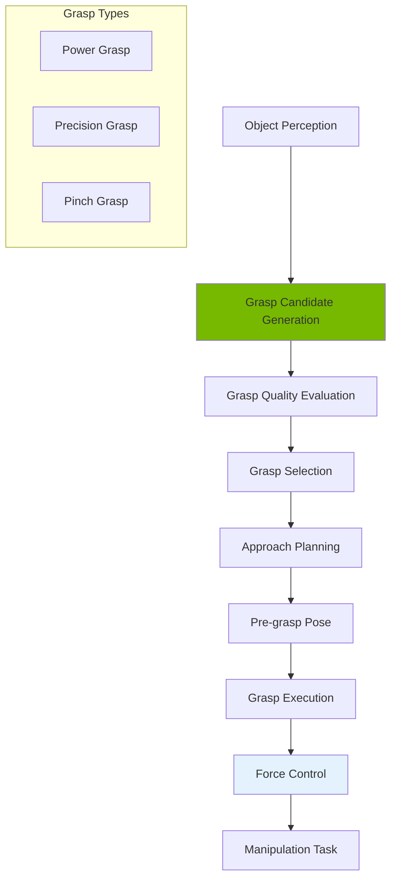

# Chapter 21: Manipulation & Grasping with Humanoid Hands

<!-- DIAGRAM: id="ch21-manipulation" type="architecture" format="mermaid"
     description="Grasp planning and manipulation pipeline" -->



## Learning Objectives

By the end of this chapter, you will be able to:

1. **Generate grasp candidates** for various object geometries
2. **Evaluate grasp quality** using force-closure analysis
3. **Plan dexterous manipulation** with multi-finger hands
4. **Implement force control** for secure grasping
5. **Coordinate dual-arm manipulation** tasks

## Prerequisites

Before starting this chapter, ensure you have:

- Completed Chapters 19-20
- Understanding of kinematics and dynamics
- Familiarity with contact mechanics
- Working simulation environment

## Introduction

Humanoid hands enable manipulation in environments designed for humans. Unlike parallel-jaw grippers, dexterous hands offer:

- **Versatility**: Multiple grasp types for different objects
- **In-hand manipulation**: Reorienting objects without release
- **Tool use**: Operating human tools and interfaces
- **Bimanual coordination**: Two-handed tasks

This chapter covers the theory and practice of humanoid manipulation.

## Grasp Fundamentals

### Contact Models

```python
import numpy as np
from dataclasses import dataclass
from typing import List, Optional
from enum import Enum

class ContactType(Enum):
    POINT = "point"           # Frictionless point contact
    POINT_FRICTION = "point_friction"  # Point with friction
    SOFT_FINGER = "soft_finger"        # Soft contact with torsion
    PATCH = "patch"           # Area contact

@dataclass
class Contact:
    """Represents a contact between finger and object."""
    position: np.ndarray      # Contact point in object frame
    normal: np.ndarray        # Contact normal (into object)
    contact_type: ContactType
    friction_coef: float = 0.5

    def get_wrench_basis(self) -> np.ndarray:
        """Get wrench basis for this contact.

        Returns matrix where columns are basis wrenches.
        """
        # Build local frame
        n = self.normal / np.linalg.norm(self.normal)
        t1 = self._perpendicular(n)
        t2 = np.cross(n, t1)

        if self.contact_type == ContactType.POINT:
            # Only normal force
            force = n.reshape(3, 1)
            torque = np.cross(self.position, n).reshape(3, 1)
            return np.vstack([force, torque])

        elif self.contact_type == ContactType.POINT_FRICTION:
            # Normal + tangential forces (friction cone approximated as pyramid)
            mu = self.friction_coef
            basis = []

            # Edges of friction pyramid
            directions = [
                n + mu * t1,
                n - mu * t1,
                n + mu * t2,
                n - mu * t2
            ]

            for d in directions:
                d = d / np.linalg.norm(d)
                force = d.reshape(3, 1)
                torque = np.cross(self.position, d).reshape(3, 1)
                basis.append(np.vstack([force, torque]))

            return np.hstack(basis)

        elif self.contact_type == ContactType.SOFT_FINGER:
            # Point friction + torsional moment
            mu = self.friction_coef
            basis = []

            # Friction cone edges
            for t in [t1, -t1, t2, -t2]:
                d = n + mu * t
                d = d / np.linalg.norm(d)
                force = d.reshape(3, 1)
                torque = np.cross(self.position, d).reshape(3, 1)
                basis.append(np.vstack([force, torque]))

            # Torsional moments
            for sign in [1, -1]:
                force = np.zeros((3, 1))
                torque = (sign * 0.1 * n).reshape(3, 1)
                basis.append(np.vstack([force, torque]))

            return np.hstack(basis)

        return np.zeros((6, 1))

    def _perpendicular(self, v: np.ndarray) -> np.ndarray:
        """Find vector perpendicular to v."""
        if abs(v[0]) < 0.9:
            perp = np.cross(v, np.array([1, 0, 0]))
        else:
            perp = np.cross(v, np.array([0, 1, 0]))
        return perp / np.linalg.norm(perp)


class GraspWrenchSpace:
    """Compute grasp wrench space from contacts."""

    def __init__(self, contacts: List[Contact]):
        self.contacts = contacts
        self.grasp_matrix = self._compute_grasp_matrix()

    def _compute_grasp_matrix(self) -> np.ndarray:
        """Compute grasp matrix G from all contacts."""
        basis_list = [c.get_wrench_basis() for c in self.contacts]
        return np.hstack(basis_list)

    def check_force_closure(self, epsilon: float = 1e-6) -> bool:
        """Check if grasp achieves force closure.

        Force closure: can resist any external wrench with internal forces.
        """
        G = self.grasp_matrix

        # Check if origin is in interior of convex hull of columns
        # Using the ray-shooting method

        # Simplified: check if G has full row rank and spans R^6
        if G.shape[1] < 6:
            return False

        rank = np.linalg.matrix_rank(G)
        if rank < 6:
            return False

        # Check if positive linear combination can produce any wrench
        # Solve: G @ alpha = 0, alpha > 0 (all positive)
        # Force closure iff no solution exists

        from scipy.optimize import linprog

        # Minimize sum(alpha) subject to G @ alpha = 0, alpha >= epsilon
        c = np.ones(G.shape[1])
        A_eq = G
        b_eq = np.zeros(6)

        result = linprog(c, A_eq=A_eq, b_eq=b_eq,
                        bounds=[(epsilon, None)] * G.shape[1],
                        method='highs')

        # If feasible, NOT force closure (can have internal forces with no wrench)
        # This is a simplified check - full analysis is more complex
        return not result.success

    def compute_quality_metric(self, metric: str = "volume") -> float:
        """Compute grasp quality metric."""
        G = self.grasp_matrix

        if metric == "volume":
            # Volume of grasp wrench space ellipsoid
            try:
                U, s, Vh = np.linalg.svd(G)
                return np.prod(s[:6]) if len(s) >= 6 else 0
            except:
                return 0

        elif metric == "min_singular":
            # Minimum singular value (worst-case resistance)
            try:
                s = np.linalg.svd(G, compute_uv=False)
                return s[-1] if len(s) > 0 else 0
            except:
                return 0

        elif metric == "isotropy":
            # Ratio of min/max singular values
            try:
                s = np.linalg.svd(G, compute_uv=False)
                return s[-1] / s[0] if s[0] > 1e-6 else 0
            except:
                return 0

        return 0
```

### Grasp Types

```python
class GraspType(Enum):
    POWER = "power"           # Full hand wrap
    PRECISION = "precision"   # Fingertip control
    PINCH = "pinch"          # Two-finger pinch
    LATERAL = "lateral"       # Key grasp
    HOOK = "hook"            # Finger hook
    SPHERICAL = "spherical"   # Ball grasp

@dataclass
class GraspPrimitive:
    """Predefined grasp primitive."""
    grasp_type: GraspType
    finger_positions: np.ndarray  # Joint angles per finger
    approach_direction: np.ndarray
    preshape_offset: float = 0.05  # Distance to open before grasp

    def get_preshape(self, scale: float = 1.5) -> np.ndarray:
        """Get pre-grasp finger configuration (opened)."""
        # Open fingers more than final grasp
        preshape = self.finger_positions.copy()

        # Extend fingers (reduce flexion)
        preshape = preshape * (1 / scale)

        return preshape

class GraspPrimitiveLibrary:
    """Library of grasp primitives for common objects."""

    def __init__(self):
        self.primitives = {}
        self._initialize_primitives()

    def _initialize_primitives(self):
        """Initialize standard grasp primitives."""

        # Power grasp - full hand wrap
        self.primitives[GraspType.POWER] = GraspPrimitive(
            grasp_type=GraspType.POWER,
            finger_positions=np.array([
                [0.8, 0.8, 0.8],  # Index: MCP, PIP, DIP
                [0.8, 0.8, 0.8],  # Middle
                [0.8, 0.8, 0.8],  # Ring
                [0.8, 0.8, 0.8],  # Pinky
                [0.5, 0.6]        # Thumb: CMC, MCP
            ]),
            approach_direction=np.array([0, 0, -1])
        )

        # Precision grasp - fingertips
        self.primitives[GraspType.PRECISION] = GraspPrimitive(
            grasp_type=GraspType.PRECISION,
            finger_positions=np.array([
                [0.3, 0.5, 0.3],
                [0.3, 0.5, 0.3],
                [0.0, 0.0, 0.0],
                [0.0, 0.0, 0.0],
                [0.4, 0.4]
            ]),
            approach_direction=np.array([0, 0, -1])
        )

        # Pinch grasp - thumb and index
        self.primitives[GraspType.PINCH] = GraspPrimitive(
            grasp_type=GraspType.PINCH,
            finger_positions=np.array([
                [0.4, 0.6, 0.4],
                [0.0, 0.0, 0.0],
                [0.0, 0.0, 0.0],
                [0.0, 0.0, 0.0],
                [0.5, 0.5]
            ]),
            approach_direction=np.array([1, 0, 0])
        )

        # Lateral (key) grasp
        self.primitives[GraspType.LATERAL] = GraspPrimitive(
            grasp_type=GraspType.LATERAL,
            finger_positions=np.array([
                [0.6, 0.7, 0.5],
                [0.6, 0.7, 0.5],
                [0.6, 0.7, 0.5],
                [0.6, 0.7, 0.5],
                [0.3, 0.2]
            ]),
            approach_direction=np.array([0, 1, 0])
        )

    def select_primitive(self, object_shape: str, object_size: float) -> GraspPrimitive:
        """Select appropriate grasp primitive for object."""
        if object_shape == "sphere":
            if object_size < 0.03:
                return self.primitives[GraspType.PINCH]
            elif object_size < 0.08:
                return self.primitives[GraspType.SPHERICAL] \
                    if GraspType.SPHERICAL in self.primitives \
                    else self.primitives[GraspType.PRECISION]
            else:
                return self.primitives[GraspType.POWER]

        elif object_shape == "cylinder":
            if object_size < 0.04:
                return self.primitives[GraspType.PINCH]
            else:
                return self.primitives[GraspType.POWER]

        elif object_shape == "box":
            return self.primitives[GraspType.POWER]

        elif object_shape == "thin":
            return self.primitives[GraspType.LATERAL]

        return self.primitives[GraspType.PRECISION]
```

## Grasp Planning

### Grasp Candidate Generation

```python
class GraspCandidateGenerator:
    """Generate grasp candidates for objects."""

    def __init__(self, hand_model):
        self.hand = hand_model
        self.primitive_library = GraspPrimitiveLibrary()

    def generate_candidates(
        self,
        object_mesh,
        object_pose: np.ndarray,
        n_candidates: int = 100
    ) -> List[Dict]:
        """Generate grasp candidates for object.

        Args:
            object_mesh: Object mesh or point cloud
            object_pose: 4x4 object pose matrix
            n_candidates: Number of candidates to generate

        Returns:
            List of grasp candidate dictionaries
        """
        candidates = []

        # Get object properties
        centroid = self._get_centroid(object_mesh)
        principal_axes = self._get_principal_axes(object_mesh)

        # Sample approach directions
        approach_dirs = self._sample_approach_directions(n_candidates)

        for i, approach in enumerate(approach_dirs):
            # Generate grasp pose
            grasp_pose = self._compute_grasp_pose(
                centroid, approach, object_pose
            )

            # Select grasp type based on object
            grasp_type = self._select_grasp_type(object_mesh, approach)

            # Check reachability
            if not self._check_reachability(grasp_pose):
                continue

            candidates.append({
                'id': i,
                'pose': grasp_pose,
                'approach_direction': approach,
                'grasp_type': grasp_type,
                'quality': 0.0  # Will be computed later
            })

        return candidates

    def _sample_approach_directions(self, n: int) -> np.ndarray:
        """Sample approach directions on hemisphere."""
        # Fibonacci sphere sampling
        directions = []
        phi = np.pi * (3 - np.sqrt(5))  # Golden angle

        for i in range(n):
            y = 1 - (i / (n - 1)) * 2  # y from 1 to -1
            radius = np.sqrt(1 - y * y)
            theta = phi * i

            x = np.cos(theta) * radius
            z = np.sin(theta) * radius

            # Only upper hemisphere (approaching from above)
            if y >= 0:
                directions.append(np.array([x, y, z]))

        return directions

    def _compute_grasp_pose(
        self,
        centroid: np.ndarray,
        approach: np.ndarray,
        object_pose: np.ndarray
    ) -> np.ndarray:
        """Compute 6DOF grasp pose from approach direction."""
        # Grasp position: offset from centroid along approach
        grasp_offset = 0.1  # 10cm approach distance
        position = centroid - grasp_offset * approach

        # Grasp orientation: Z along approach, X perpendicular
        z_axis = -approach  # Pointing toward object
        x_axis = np.cross(np.array([0, 0, 1]), z_axis)
        if np.linalg.norm(x_axis) < 0.1:
            x_axis = np.cross(np.array([0, 1, 0]), z_axis)
        x_axis = x_axis / np.linalg.norm(x_axis)
        y_axis = np.cross(z_axis, x_axis)

        # Build pose matrix
        pose = np.eye(4)
        pose[:3, 0] = x_axis
        pose[:3, 1] = y_axis
        pose[:3, 2] = z_axis
        pose[:3, 3] = position

        return pose

    def _get_centroid(self, mesh) -> np.ndarray:
        """Get object centroid."""
        # Would use mesh vertices in practice
        return np.array([0, 0, 0])

    def _get_principal_axes(self, mesh) -> np.ndarray:
        """Get object principal axes via PCA."""
        return np.eye(3)

    def _select_grasp_type(self, mesh, approach) -> GraspType:
        """Select grasp type based on object geometry."""
        return GraspType.POWER

    def _check_reachability(self, pose) -> bool:
        """Check if grasp pose is reachable."""
        return True


class GraspQualityEvaluator:
    """Evaluate quality of grasp candidates."""

    def __init__(self, friction_coef: float = 0.5):
        self.mu = friction_coef

    def evaluate(self, candidate: Dict, object_mesh) -> float:
        """Evaluate grasp candidate quality.

        Returns quality score in [0, 1].
        """
        # Simulate contacts
        contacts = self._simulate_contacts(candidate, object_mesh)

        if len(contacts) < 2:
            return 0.0

        # Build wrench space
        gws = GraspWrenchSpace(contacts)

        # Check force closure
        if not gws.check_force_closure():
            return 0.0

        # Compute quality metric
        volume = gws.compute_quality_metric("volume")
        isotropy = gws.compute_quality_metric("isotropy")

        # Combined score
        quality = 0.5 * min(1.0, volume / 1e-6) + 0.5 * isotropy

        return quality

    def _simulate_contacts(self, candidate: Dict, mesh) -> List[Contact]:
        """Simulate finger contacts with object."""
        contacts = []

        # Simplified: assume fingertip contacts
        # In practice, would do collision detection

        # 5-finger contacts for power grasp
        contact_positions = [
            np.array([0.02, 0.01, 0]),
            np.array([0.02, -0.01, 0]),
            np.array([-0.02, 0.01, 0]),
            np.array([-0.02, -0.01, 0]),
            np.array([0, 0, 0.03])  # Thumb
        ]

        for pos in contact_positions:
            # Normal points toward object center
            normal = -pos / (np.linalg.norm(pos) + 1e-6)

            contacts.append(Contact(
                position=pos,
                normal=normal,
                contact_type=ContactType.SOFT_FINGER,
                friction_coef=self.mu
            ))

        return contacts
```

## Dexterous Hand Control

### Multi-Finger Coordination

```python
class DexterousHandController:
    """Controller for dexterous multi-finger hand."""

    def __init__(self, hand_model):
        self.hand = hand_model
        self.n_fingers = 5
        self.n_joints_per_finger = 4  # Including spread

        # Finger names
        self.fingers = ['thumb', 'index', 'middle', 'ring', 'pinky']

    def execute_grasp(
        self,
        grasp_primitive: GraspPrimitive,
        target_force: float = 5.0
    ) -> Dict:
        """Execute grasp with force control.

        Args:
            grasp_primitive: Grasp to execute
            target_force: Target contact force (N)

        Returns:
            Grasp result with contact info
        """
        # Phase 1: Move to pre-grasp
        preshape = grasp_primitive.get_preshape()
        self._move_to_configuration(preshape)

        # Phase 2: Approach object
        self._approach(grasp_primitive.approach_direction,
                      grasp_primitive.preshape_offset)

        # Phase 3: Close fingers with force control
        contacts = self._close_with_force_control(
            grasp_primitive.finger_positions,
            target_force
        )

        # Phase 4: Verify grasp
        success = self._verify_grasp(contacts, target_force * 0.8)

        return {
            'success': success,
            'contacts': contacts,
            'finger_positions': self._get_finger_positions()
        }

    def _move_to_configuration(self, target: np.ndarray):
        """Move fingers to target configuration."""
        current = self._get_finger_positions()

        # Trajectory interpolation
        n_steps = 50
        for i in range(n_steps):
            alpha = (i + 1) / n_steps
            intermediate = (1 - alpha) * current + alpha * target
            self._set_finger_positions(intermediate)

    def _approach(self, direction: np.ndarray, distance: float):
        """Approach object along direction."""
        # Would move arm end-effector
        pass

    def _close_with_force_control(
        self,
        target_config: np.ndarray,
        target_force: float
    ) -> List[Dict]:
        """Close fingers until contact with force control."""
        contacts = []

        for i, finger in enumerate(self.fingers):
            contact = self._close_finger_force_controlled(
                finger, target_config[i], target_force
            )
            if contact:
                contacts.append(contact)

        return contacts

    def _close_finger_force_controlled(
        self,
        finger: str,
        target_joints: np.ndarray,
        target_force: float
    ) -> Optional[Dict]:
        """Close single finger with force feedback."""
        current = self._get_finger_joints(finger)

        # Force control parameters
        kp = 10.0
        ki = 0.1
        force_integral = 0.0

        for step in range(100):
            # Get current force
            force = self._get_fingertip_force(finger)

            if force > target_force * 0.9:
                # Contact achieved
                return {
                    'finger': finger,
                    'position': self._get_fingertip_position(finger),
                    'force': force
                }

            # Position control until contact
            force_error = target_force - force
            force_integral += force_error * 0.01

            # Blend position and force control
            if force < target_force * 0.5:
                # Mostly position control
                alpha = step / 100
                joint_cmd = (1 - alpha) * current + alpha * target_joints
            else:
                # Mostly force control
                joint_delta = kp * force_error + ki * force_integral
                joint_cmd = current + joint_delta * 0.01

            self._set_finger_joints(finger, joint_cmd)
            current = joint_cmd

        return None

    def _verify_grasp(self, contacts: List[Dict], min_force: float) -> bool:
        """Verify grasp is secure."""
        if len(contacts) < 3:
            return False

        total_force = sum(c['force'] for c in contacts)
        return total_force > min_force * len(contacts)

    # Abstract methods - would interface with actual hand
    def _get_finger_positions(self) -> np.ndarray:
        return np.zeros((5, 4))

    def _set_finger_positions(self, positions: np.ndarray):
        pass

    def _get_finger_joints(self, finger: str) -> np.ndarray:
        return np.zeros(4)

    def _set_finger_joints(self, finger: str, joints: np.ndarray):
        pass

    def _get_fingertip_force(self, finger: str) -> float:
        return 0.0

    def _get_fingertip_position(self, finger: str) -> np.ndarray:
        return np.zeros(3)
```

### In-Hand Manipulation

```python
class InHandManipulator:
    """In-hand manipulation controller."""

    def __init__(self, hand_controller: DexterousHandController):
        self.hand = hand_controller

    def rotate_object(
        self,
        axis: np.ndarray,
        angle: float,
        maintain_grasp: bool = True
    ) -> bool:
        """Rotate grasped object about axis.

        Uses finger gaiting for large rotations.
        """
        # Decompose into small rotations
        max_step = np.pi / 8  # 22.5 degrees per step
        n_steps = int(np.ceil(abs(angle) / max_step))
        step_angle = angle / n_steps

        for i in range(n_steps):
            success = self._rotate_step(axis, step_angle, maintain_grasp)
            if not success:
                return False

        return True

    def _rotate_step(
        self,
        axis: np.ndarray,
        angle: float,
        maintain_grasp: bool
    ) -> bool:
        """Execute single rotation step."""
        # Get current contact configuration
        contacts = self.hand._get_contact_state()

        if maintain_grasp:
            # Coordinated finger motion
            return self._coordinated_rotate(contacts, axis, angle)
        else:
            # Finger gaiting (regrasping)
            return self._finger_gaiting_rotate(contacts, axis, angle)

    def _coordinated_rotate(
        self,
        contacts: List[Dict],
        axis: np.ndarray,
        angle: float
    ) -> bool:
        """Rotate using coordinated finger motion."""
        # Compute finger Jacobians
        # Solve for joint velocities that produce object rotation
        # Execute trajectory

        # Simplified implementation
        rotation_matrix = self._axis_angle_to_matrix(axis, angle)

        for contact in contacts:
            new_pos = rotation_matrix @ contact['position']
            # IK to reach new position while maintaining contact
            # ...

        return True

    def _finger_gaiting_rotate(
        self,
        contacts: List[Dict],
        axis: np.ndarray,
        angle: float
    ) -> bool:
        """Rotate using finger gaiting."""
        # 1. Lift one finger
        # 2. Rotate with remaining fingers
        # 3. Place lifted finger at new position
        # 4. Repeat with other fingers

        return True

    def _axis_angle_to_matrix(self, axis: np.ndarray, angle: float) -> np.ndarray:
        """Convert axis-angle to rotation matrix."""
        from scipy.spatial.transform import Rotation
        return Rotation.from_rotvec(axis * angle).as_matrix()

    def translate_object(
        self,
        direction: np.ndarray,
        distance: float
    ) -> bool:
        """Translate object in hand."""
        # Compute finger motions for translation
        # Similar to rotation but with linear motion

        return True
```

## Dual-Arm Coordination

### Bimanual Manipulation

```python
class DualArmController:
    """Controller for coordinated dual-arm manipulation."""

    def __init__(self, left_arm, right_arm):
        self.left = left_arm
        self.right = right_arm

    def bimanual_grasp(
        self,
        object_pose: np.ndarray,
        grasp_width: float
    ) -> bool:
        """Execute bimanual grasp on large object.

        Args:
            object_pose: Object center pose
            grasp_width: Distance between hands

        Returns:
            Success status
        """
        # Compute hand poses
        left_offset = np.array([0, -grasp_width/2, 0])
        right_offset = np.array([0, grasp_width/2, 0])

        left_pose = object_pose.copy()
        left_pose[:3, 3] += object_pose[:3, :3] @ left_offset

        right_pose = object_pose.copy()
        right_pose[:3, 3] += object_pose[:3, :3] @ right_offset

        # Coordinate approach
        success = self._coordinated_move([
            (self.left, left_pose),
            (self.right, right_pose)
        ])

        if not success:
            return False

        # Close both hands
        self.left.close_hand()
        self.right.close_hand()

        return True

    def bimanual_carry(
        self,
        target_pose: np.ndarray,
        maintain_relative: bool = True
    ) -> bool:
        """Carry object with both hands to target.

        Args:
            target_pose: Target object pose
            maintain_relative: Keep hands at same relative position
        """
        if maintain_relative:
            # Compute trajectory maintaining hand-to-hand relationship
            trajectory = self._plan_rigid_motion(target_pose)
        else:
            # Allow hands to adjust during motion
            trajectory = self._plan_compliant_motion(target_pose)

        return self._execute_bimanual_trajectory(trajectory)

    def _coordinated_move(self, targets: List[tuple]) -> bool:
        """Move both arms in coordination."""
        # Plan synchronized trajectories
        trajectories = []

        for arm, target in targets:
            traj = arm.plan_to_pose(target)
            if traj is None:
                return False
            trajectories.append(traj)

        # Synchronize timing
        max_duration = max(len(t) for t in trajectories)
        synchronized = []

        for traj in trajectories:
            if len(traj) < max_duration:
                # Interpolate to match duration
                traj = self._resample_trajectory(traj, max_duration)
            synchronized.append(traj)

        # Execute synchronized
        for i in range(max_duration):
            for arm_idx, (arm, _) in enumerate(targets):
                arm.set_joint_positions(synchronized[arm_idx][i])
            # Wait for control cycle
            # time.sleep(0.01)

        return True

    def _plan_rigid_motion(self, target: np.ndarray) -> List[np.ndarray]:
        """Plan motion treating object as rigid between hands."""
        # Get current object pose (average of hand poses)
        current = self._get_object_pose()

        # Interpolate object pose
        n_steps = 100
        trajectory = []

        for i in range(n_steps):
            alpha = i / (n_steps - 1)
            pose = self._interpolate_pose(current, target, alpha)

            # Compute hand poses
            left_pose, right_pose = self._object_to_hand_poses(pose)
            trajectory.append((left_pose, right_pose))

        return trajectory

    def _get_object_pose(self) -> np.ndarray:
        """Estimate object pose from hand positions."""
        left_pose = self.left.get_end_effector_pose()
        right_pose = self.right.get_end_effector_pose()

        # Average position
        position = 0.5 * (left_pose[:3, 3] + right_pose[:3, 3])

        # Orientation from hand-to-hand vector
        hand_vec = right_pose[:3, 3] - left_pose[:3, 3]
        hand_vec = hand_vec / np.linalg.norm(hand_vec)

        pose = np.eye(4)
        pose[:3, 3] = position
        # Simplified orientation
        pose[:3, 1] = hand_vec

        return pose

    def _interpolate_pose(
        self,
        start: np.ndarray,
        end: np.ndarray,
        alpha: float
    ) -> np.ndarray:
        """Interpolate between poses."""
        from scipy.spatial.transform import Rotation, Slerp

        # Linear interpolation for position
        pos = (1 - alpha) * start[:3, 3] + alpha * end[:3, 3]

        # Slerp for orientation
        rots = Rotation.from_matrix([start[:3, :3], end[:3, :3]])
        slerp = Slerp([0, 1], rots)
        rot = slerp(alpha).as_matrix()

        pose = np.eye(4)
        pose[:3, :3] = rot
        pose[:3, 3] = pos

        return pose

    def _resample_trajectory(self, traj: List, new_length: int) -> List:
        """Resample trajectory to new length."""
        import numpy as np
        old_times = np.linspace(0, 1, len(traj))
        new_times = np.linspace(0, 1, new_length)

        resampled = []
        for t in new_times:
            idx = np.searchsorted(old_times, t)
            if idx == 0:
                resampled.append(traj[0])
            elif idx >= len(traj):
                resampled.append(traj[-1])
            else:
                alpha = (t - old_times[idx-1]) / (old_times[idx] - old_times[idx-1])
                interp = (1 - alpha) * traj[idx-1] + alpha * traj[idx]
                resampled.append(interp)

        return resampled
```

## ROS 2 Integration

### Manipulation Action Server

```python
#!/usr/bin/env python3
"""ROS 2 manipulation action server."""

import rclpy
from rclpy.node import Node
from rclpy.action import ActionServer
from geometry_msgs.msg import Pose, PoseArray
from sensor_msgs.msg import JointState

import numpy as np

class ManipulationNode(Node):
    def __init__(self):
        super().__init__('manipulation_server')

        # Initialize controllers
        self.grasp_generator = GraspCandidateGenerator(None)
        self.grasp_evaluator = GraspQualityEvaluator()
        self.hand_controller = DexterousHandController(None)

        # Subscribers
        self.object_sub = self.create_subscription(
            Pose, '/detected_object', self.object_callback, 10)

        # Publishers
        self.grasp_viz_pub = self.create_publisher(
            PoseArray, '/grasp_candidates', 10)
        self.hand_cmd_pub = self.create_publisher(
            JointState, '/hand_joint_commands', 10)

        # Service for grasp execution
        self.grasp_service = self.create_service(
            Trigger, '/execute_grasp', self.execute_grasp_callback)

        # State
        self.current_object_pose = None
        self.grasp_candidates = []

        self.get_logger().info('Manipulation server initialized')

    def object_callback(self, msg: Pose):
        """Handle detected object."""
        self.current_object_pose = self._pose_to_matrix(msg)

        # Generate grasp candidates
        self.grasp_candidates = self.grasp_generator.generate_candidates(
            None,  # Would use actual mesh
            self.current_object_pose
        )

        # Evaluate candidates
        for candidate in self.grasp_candidates:
            candidate['quality'] = self.grasp_evaluator.evaluate(
                candidate, None
            )

        # Sort by quality
        self.grasp_candidates.sort(key=lambda x: x['quality'], reverse=True)

        # Publish for visualization
        self._publish_grasp_candidates()

    def execute_grasp_callback(self, request, response):
        """Execute best grasp."""
        if not self.grasp_candidates:
            response.success = False
            response.message = "No grasp candidates available"
            return response

        # Get best candidate
        best = self.grasp_candidates[0]

        # Select grasp primitive
        primitive = self.hand_controller.primitive_library.select_primitive(
            "box", 0.05  # Would get from perception
        )

        # Execute grasp
        result = self.hand_controller.execute_grasp(primitive)

        response.success = result['success']
        response.message = f"Grasp executed with {len(result['contacts'])} contacts"

        return response

    def _pose_to_matrix(self, pose: Pose) -> np.ndarray:
        """Convert ROS Pose to 4x4 matrix."""
        from scipy.spatial.transform import Rotation

        matrix = np.eye(4)
        matrix[:3, 3] = [pose.position.x, pose.position.y, pose.position.z]

        quat = [pose.orientation.x, pose.orientation.y,
                pose.orientation.z, pose.orientation.w]
        matrix[:3, :3] = Rotation.from_quat(quat).as_matrix()

        return matrix

    def _publish_grasp_candidates(self):
        """Publish grasp candidates for visualization."""
        msg = PoseArray()
        msg.header.stamp = self.get_clock().now().to_msg()
        msg.header.frame_id = "world"

        for candidate in self.grasp_candidates[:10]:  # Top 10
            pose = Pose()
            pose.position.x = candidate['pose'][0, 3]
            pose.position.y = candidate['pose'][1, 3]
            pose.position.z = candidate['pose'][2, 3]
            msg.poses.append(pose)

        self.grasp_viz_pub.publish(msg)

def main(args=None):
    rclpy.init(args=args)
    node = ManipulationNode()
    rclpy.spin(node)
    node.destroy_node()
    rclpy.shutdown()

if __name__ == '__main__':
    main()
```

## Hands-On Exercise

### Exercise 1: Grasp Quality

1. Implement force-closure check
2. Compare quality metrics for different grasps
3. Visualize grasp wrench space

### Exercise 2: Dexterous Control

1. Implement finger force control
2. Execute precision and power grasps
3. Test on different object shapes

### Exercise 3: Bimanual Task

1. Plan bimanual grasp for large object
2. Implement coordinated carry motion
3. Transfer object between hands

## Key Concepts

| Term | Definition |
|------|------------|
| **Force Closure** | Grasp can resist any external wrench |
| **Grasp Wrench Space** | Set of wrenches a grasp can apply |
| **Contact Model** | Characterization of finger-object interaction |
| **Finger Gaiting** | Repositioning fingers during in-hand manipulation |
| **Bimanual** | Using two hands cooperatively |

## Chapter Summary

In this chapter, you learned:

1. **Contact mechanics**: Modeling finger-object contacts.

2. **Grasp quality**: Force closure and quality metrics.

3. **Grasp planning**: Generating and evaluating candidates.

4. **Dexterous control**: Multi-finger coordination with force feedback.

5. **Dual-arm manipulation**: Bimanual grasping and carrying.

## What's Next

In [Chapter 22: Human-Robot Interaction Design](./ch22-hri-design), you'll learn to design natural and safe interaction patterns for humanoid robots.

## Further Reading

- [A Mathematical Introduction to Robotic Manipulation](http://www.cds.caltech.edu/~murray/mlswiki/) - Classic textbook
- [GraspIt!](https://graspit-simulator.github.io/) - Grasp planning simulator
- [Dex-Net](https://berkeleyautomation.github.io/dex-net/) - Deep learning for grasping
- [Shadow Hand](https://www.shadowrobot.com/) - Dexterous hand hardware
