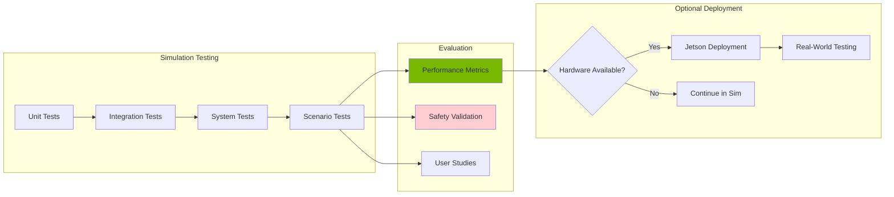

# Chapter 24: Deployment, Evaluation & Future of Physical AI

<!-- DIAGRAM: id="ch24-evaluation" type="architecture" format="mermaid"
     description="Evaluation and deployment pipeline" -->



## Learning Objectives

By the end of this chapter, you will be able to:

1. **Define and measure performance metrics** for autonomous humanoids
2. **Conduct systematic testing** in simulation environments
3. **Understand optional Jetson deployment** pathways
4. **Evaluate system safety and reliability**
5. **Explore emerging trends** in Physical AI

## Prerequisites

Before starting this chapter, ensure you have:

- Completed Chapter 23 (System Architecture)
- Working capstone system in simulation
- Understanding of testing methodologies
- Basic statistics for metrics analysis

## Introduction

Before any robot system can be considered complete, it must be thoroughly evaluated. This chapter covers:

- **Performance evaluation**: How well does the system perform tasks?
- **Safety validation**: Is it safe to operate around humans?
- **Deployment options**: From simulation to optional hardware
- **Future directions**: Where is Physical AI heading?

:::note Simulation-First Evaluation
All evaluation in this chapter is designed to work in simulation. Hardware deployment is presented as an optional extension for those with access to Jetson or similar platforms.
:::

## Performance Metrics

### Task Performance Metrics

```python
import numpy as np
from dataclasses import dataclass
from typing import List, Dict
import time
import json

@dataclass
class TaskMetrics:
    """Metrics for a single task execution."""
    task_name: str
    success: bool
    duration: float  # seconds
    distance_traveled: float  # meters
    energy_consumed: float  # arbitrary units
    errors: List[str]
    timestamp: float

class PerformanceEvaluator:
    """Evaluate autonomous humanoid performance."""

    def __init__(self):
        self.task_history: List[TaskMetrics] = []
        self.current_task_start = None

    def start_task(self, task_name: str):
        """Start timing a task."""
        self.current_task_start = {
            'name': task_name,
            'start_time': time.time(),
            'errors': []
        }

    def log_error(self, error: str):
        """Log an error during task execution."""
        if self.current_task_start:
            self.current_task_start['errors'].append(error)

    def end_task(self, success: bool, distance: float = 0, energy: float = 0):
        """End task and record metrics."""
        if not self.current_task_start:
            return

        duration = time.time() - self.current_task_start['start_time']

        metrics = TaskMetrics(
            task_name=self.current_task_start['name'],
            success=success,
            duration=duration,
            distance_traveled=distance,
            energy_consumed=energy,
            errors=self.current_task_start['errors'],
            timestamp=time.time()
        )

        self.task_history.append(metrics)
        self.current_task_start = None

        return metrics

    def compute_statistics(self) -> Dict:
        """Compute overall performance statistics."""
        if not self.task_history:
            return {}

        successes = [t for t in self.task_history if t.success]
        failures = [t for t in self.task_history if not t.success]

        success_rate = len(successes) / len(self.task_history)

        durations = [t.duration for t in successes]
        avg_duration = np.mean(durations) if durations else 0
        std_duration = np.std(durations) if durations else 0

        distances = [t.distance_traveled for t in self.task_history]
        avg_distance = np.mean(distances)

        energies = [t.energy_consumed for t in self.task_history]
        avg_energy = np.mean(energies)

        # Task-specific breakdown
        task_breakdown = {}
        task_names = set(t.task_name for t in self.task_history)
        for task in task_names:
            task_metrics = [t for t in self.task_history if t.task_name == task]
            task_successes = [t for t in task_metrics if t.success]
            task_breakdown[task] = {
                'count': len(task_metrics),
                'success_rate': len(task_successes) / len(task_metrics),
                'avg_duration': np.mean([t.duration for t in task_successes]) if task_successes else 0
            }

        return {
            'total_tasks': len(self.task_history),
            'success_rate': success_rate,
            'avg_duration': avg_duration,
            'std_duration': std_duration,
            'avg_distance': avg_distance,
            'avg_energy': avg_energy,
            'task_breakdown': task_breakdown
        }

    def generate_report(self) -> str:
        """Generate human-readable performance report."""
        stats = self.compute_statistics()

        report = """
# Autonomous Humanoid Performance Report

## Summary
- Total Tasks: {total_tasks}
- Success Rate: {success_rate:.1%}
- Average Duration: {avg_duration:.2f}s (+/- {std_duration:.2f}s)
- Average Distance: {avg_distance:.2f}m
- Average Energy: {avg_energy:.2f} units

## Task Breakdown
""".format(**stats)

        for task, metrics in stats.get('task_breakdown', {}).items():
            report += f"\n### {task}\n"
            report += f"- Attempts: {metrics['count']}\n"
            report += f"- Success Rate: {metrics['success_rate']:.1%}\n"
            report += f"- Average Duration: {metrics['avg_duration']:.2f}s\n"

        return report
```

### Navigation Metrics

```python
class NavigationEvaluator:
    """Evaluate navigation performance."""

    def __init__(self):
        self.paths = []

    def record_path(
        self,
        planned_path: np.ndarray,
        actual_path: np.ndarray,
        goal: np.ndarray
    ):
        """Record a navigation execution."""
        self.paths.append({
            'planned': planned_path,
            'actual': actual_path,
            'goal': goal,
            'goal_reached': np.linalg.norm(actual_path[-1] - goal) < 0.1
        })

    def compute_metrics(self) -> Dict:
        """Compute navigation metrics."""
        metrics = {
            'path_efficiency': [],
            'goal_accuracy': [],
            'cross_track_error': [],
            'smoothness': []
        }

        for path_data in self.paths:
            planned = path_data['planned']
            actual = path_data['actual']
            goal = path_data['goal']

            # Path efficiency (actual / planned length)
            planned_length = self._path_length(planned)
            actual_length = self._path_length(actual)
            efficiency = planned_length / actual_length if actual_length > 0 else 0
            metrics['path_efficiency'].append(efficiency)

            # Goal accuracy
            goal_error = np.linalg.norm(actual[-1] - goal)
            metrics['goal_accuracy'].append(goal_error)

            # Cross-track error (average deviation from planned)
            cte = self._compute_cross_track_error(planned, actual)
            metrics['cross_track_error'].append(cte)

            # Path smoothness (inverse of total rotation)
            smoothness = self._compute_smoothness(actual)
            metrics['smoothness'].append(smoothness)

        return {
            'avg_path_efficiency': np.mean(metrics['path_efficiency']),
            'avg_goal_accuracy': np.mean(metrics['goal_accuracy']),
            'avg_cross_track_error': np.mean(metrics['cross_track_error']),
            'avg_smoothness': np.mean(metrics['smoothness']),
            'goal_success_rate': np.mean([p['goal_reached'] for p in self.paths])
        }

    def _path_length(self, path: np.ndarray) -> float:
        """Compute total path length."""
        if len(path) < 2:
            return 0
        return np.sum(np.linalg.norm(np.diff(path, axis=0), axis=1))

    def _compute_cross_track_error(
        self,
        planned: np.ndarray,
        actual: np.ndarray
    ) -> float:
        """Compute average cross-track error."""
        errors = []
        for point in actual:
            # Find closest point on planned path
            distances = np.linalg.norm(planned - point, axis=1)
            min_dist = np.min(distances)
            errors.append(min_dist)
        return np.mean(errors)

    def _compute_smoothness(self, path: np.ndarray) -> float:
        """Compute path smoothness (lower is smoother)."""
        if len(path) < 3:
            return 1.0

        # Compute heading changes
        diffs = np.diff(path, axis=0)
        headings = np.arctan2(diffs[:, 1], diffs[:, 0])
        heading_changes = np.abs(np.diff(headings))

        # Normalize to [0, 1]
        total_rotation = np.sum(heading_changes)
        max_rotation = np.pi * len(heading_changes)

        return 1.0 - (total_rotation / max_rotation)
```

### Manipulation Metrics

```python
class ManipulationEvaluator:
    """Evaluate manipulation performance."""

    def __init__(self):
        self.grasps = []

    def record_grasp(
        self,
        object_id: str,
        grasp_success: bool,
        grasp_time: float,
        force_applied: float,
        slip_detected: bool
    ):
        """Record a grasp attempt."""
        self.grasps.append({
            'object_id': object_id,
            'success': grasp_success,
            'time': grasp_time,
            'force': force_applied,
            'slip': slip_detected
        })

    def compute_metrics(self) -> Dict:
        """Compute manipulation metrics."""
        if not self.grasps:
            return {}

        successes = [g for g in self.grasps if g['success']]

        return {
            'grasp_success_rate': len(successes) / len(self.grasps),
            'avg_grasp_time': np.mean([g['time'] for g in self.grasps]),
            'avg_force': np.mean([g['force'] for g in self.grasps]),
            'slip_rate': np.mean([g['slip'] for g in self.grasps]),
            'total_attempts': len(self.grasps)
        }
```

## Testing Framework

### Scenario-Based Testing

```python
from dataclasses import dataclass
from typing import Callable, List
import yaml

@dataclass
class TestScenario:
    """Definition of a test scenario."""
    name: str
    description: str
    setup: Callable  # Function to set up scenario
    actions: List[dict]  # Actions to perform
    success_criteria: dict  # Criteria for success
    timeout: float = 300.0  # seconds

class ScenarioRunner:
    """Run test scenarios for system evaluation."""

    def __init__(self, system_interface):
        self.system = system_interface
        self.results = []

    def load_scenarios(self, scenario_file: str) -> List[TestScenario]:
        """Load scenarios from YAML file."""
        with open(scenario_file, 'r') as f:
            data = yaml.safe_load(f)

        scenarios = []
        for s in data.get('scenarios', []):
            scenarios.append(TestScenario(
                name=s['name'],
                description=s.get('description', ''),
                setup=self._create_setup_function(s.get('setup', {})),
                actions=s.get('actions', []),
                success_criteria=s.get('success_criteria', {}),
                timeout=s.get('timeout', 300.0)
            ))

        return scenarios

    def run_scenario(self, scenario: TestScenario) -> Dict:
        """Run a single test scenario."""
        print(f"\n{'='*50}")
        print(f"Running scenario: {scenario.name}")
        print(f"{'='*50}")

        result = {
            'name': scenario.name,
            'success': False,
            'duration': 0,
            'actions_completed': 0,
            'errors': []
        }

        try:
            # Setup
            scenario.setup()
            self.system.reset()

            start_time = time.time()

            # Execute actions
            for i, action in enumerate(scenario.actions):
                if time.time() - start_time > scenario.timeout:
                    result['errors'].append('Timeout')
                    break

                action_result = self._execute_action(action)

                if not action_result['success']:
                    result['errors'].append(f"Action {i} failed: {action_result.get('error', 'Unknown')}")
                    break

                result['actions_completed'] = i + 1

            # Check success criteria
            result['duration'] = time.time() - start_time
            result['success'] = self._check_criteria(scenario.success_criteria)

        except Exception as e:
            result['errors'].append(str(e))

        self.results.append(result)
        return result

    def run_all(self, scenarios: List[TestScenario]) -> Dict:
        """Run all scenarios and return summary."""
        for scenario in scenarios:
            self.run_scenario(scenario)

        # Summary
        successes = [r for r in self.results if r['success']]
        return {
            'total': len(self.results),
            'passed': len(successes),
            'failed': len(self.results) - len(successes),
            'pass_rate': len(successes) / len(self.results) if self.results else 0,
            'results': self.results
        }

    def _execute_action(self, action: dict) -> Dict:
        """Execute a single action."""
        action_type = action.get('type', '')

        if action_type == 'navigate':
            return self.system.navigate_to(action.get('target'))

        elif action_type == 'pick':
            return self.system.pick_object(action.get('object'))

        elif action_type == 'place':
            return self.system.place_object(action.get('location'))

        elif action_type == 'wait':
            time.sleep(action.get('duration', 1.0))
            return {'success': True}

        elif action_type == 'speak':
            return self.system.speak(action.get('message'))

        return {'success': False, 'error': f'Unknown action: {action_type}'}

    def _check_criteria(self, criteria: dict) -> bool:
        """Check if success criteria are met."""
        for key, expected in criteria.items():
            actual = self.system.get_state(key)
            if actual != expected:
                return False
        return True

    def _create_setup_function(self, setup_config: dict) -> Callable:
        """Create setup function from config."""
        def setup():
            # Place objects
            for obj in setup_config.get('objects', []):
                self.system.spawn_object(obj['type'], obj['position'])
            # Set robot position
            if 'robot_position' in setup_config:
                self.system.set_robot_position(setup_config['robot_position'])
        return setup
```

### Example Scenario File

```yaml
# scenarios/fetch_test.yaml
scenarios:
  - name: "Basic Fetch"
    description: "Navigate to object and bring it back"
    setup:
      robot_position: [0, 0, 0]
      objects:
        - type: "cup"
          position: [2.0, 1.0, 0.8]
    actions:
      - type: navigate
        target: [1.5, 1.0, 0]
      - type: pick
        object: "cup"
      - type: navigate
        target: [0, 0, 0]
      - type: place
        location: [0.5, 0, 0.8]
    success_criteria:
      object_delivered: true
    timeout: 120

  - name: "Multi-Object Fetch"
    description: "Fetch multiple objects in sequence"
    setup:
      robot_position: [0, 0, 0]
      objects:
        - type: "cup"
          position: [2.0, 1.0, 0.8]
        - type: "bottle"
          position: [2.0, -1.0, 0.8]
    actions:
      - type: navigate
        target: [1.5, 1.0, 0]
      - type: pick
        object: "cup"
      - type: navigate
        target: [0, 0, 0]
      - type: place
        location: [0.5, 0.3, 0.8]
      - type: navigate
        target: [1.5, -1.0, 0]
      - type: pick
        object: "bottle"
      - type: navigate
        target: [0, 0, 0]
      - type: place
        location: [0.5, -0.3, 0.8]
    success_criteria:
      all_objects_delivered: true
    timeout: 240
```

## Safety Validation

### Safety Metrics

```python
class SafetyEvaluator:
    """Evaluate safety performance of the humanoid system."""

    def __init__(self):
        self.incidents = []
        self.near_misses = []
        self.emergency_stops = []

    def log_incident(
        self,
        incident_type: str,
        severity: str,
        description: str,
        location: np.ndarray
    ):
        """Log a safety incident."""
        self.incidents.append({
            'type': incident_type,
            'severity': severity,
            'description': description,
            'location': location.tolist(),
            'timestamp': time.time()
        })

    def log_near_miss(
        self,
        object_type: str,
        min_distance: float,
        location: np.ndarray
    ):
        """Log a near-miss event."""
        self.near_misses.append({
            'object': object_type,
            'distance': min_distance,
            'location': location.tolist(),
            'timestamp': time.time()
        })

    def log_emergency_stop(self, reason: str):
        """Log an emergency stop."""
        self.emergency_stops.append({
            'reason': reason,
            'timestamp': time.time()
        })

    def compute_safety_metrics(self, total_runtime: float) -> Dict:
        """Compute safety metrics."""
        return {
            'incident_count': len(self.incidents),
            'incidents_per_hour': len(self.incidents) / (total_runtime / 3600) if total_runtime > 0 else 0,
            'near_miss_count': len(self.near_misses),
            'avg_min_distance': np.mean([nm['distance'] for nm in self.near_misses]) if self.near_misses else float('inf'),
            'emergency_stop_count': len(self.emergency_stops),
            'severity_breakdown': self._severity_breakdown()
        }

    def _severity_breakdown(self) -> Dict:
        """Break down incidents by severity."""
        breakdown = {'low': 0, 'medium': 0, 'high': 0, 'critical': 0}
        for incident in self.incidents:
            severity = incident.get('severity', 'low')
            if severity in breakdown:
                breakdown[severity] += 1
        return breakdown

    def validate_safety_requirements(self, requirements: Dict) -> Dict:
        """Validate against safety requirements."""
        metrics = self.compute_safety_metrics(requirements.get('runtime', 3600))

        validations = {}

        # Check incident rate
        max_incidents = requirements.get('max_incidents_per_hour', 0.1)
        validations['incident_rate'] = {
            'requirement': f'<= {max_incidents} per hour',
            'actual': metrics['incidents_per_hour'],
            'passed': metrics['incidents_per_hour'] <= max_incidents
        }

        # Check minimum distance
        min_safe_distance = requirements.get('min_safe_distance', 0.3)
        validations['safe_distance'] = {
            'requirement': f'>= {min_safe_distance}m',
            'actual': metrics['avg_min_distance'],
            'passed': metrics['avg_min_distance'] >= min_safe_distance
        }

        # Check critical incidents
        validations['critical_incidents'] = {
            'requirement': '0 critical incidents',
            'actual': metrics['severity_breakdown']['critical'],
            'passed': metrics['severity_breakdown']['critical'] == 0
        }

        validations['all_passed'] = all(v['passed'] for v in validations.values())

        return validations
```

## Optional: Jetson Deployment

:::note Hardware Optional
This section describes deployment to NVIDIA Jetson for those with access to hardware. The capstone is complete without hardware deployment.
:::

### Jetson Deployment Overview

```python
"""
Jetson Deployment Guide (Optional)

Requirements:
- NVIDIA Jetson AGX Orin or Orin Nano
- JetPack 5.0+ installed
- ROS 2 Humble (ARM64 build)
- Isaac ROS packages

Deployment Architecture:
┌──────────────────────────────────────┐
│           Jetson Orin                │
├──────────────────────────────────────┤
│  ┌──────────┐  ┌──────────────────┐  │
│  │ Perception│  │ Planning/Control │  │
│  │  (GPU)   │  │     (CPU)        │  │
│  └──────────┘  └──────────────────┘  │
│  ┌──────────────────────────────────┐│
│  │       ROS 2 Middleware           ││
│  └──────────────────────────────────┘│
├──────────────────────────────────────┤
│  USB/Serial: Motor Controllers       │
│  USB/Ethernet: Cameras, LiDAR       │
└──────────────────────────────────────┘
"""

class JetsonDeploymentConfig:
    """Configuration for Jetson deployment."""

    # Hardware requirements
    REQUIRED_MEMORY_GB = 8  # Minimum RAM
    REQUIRED_STORAGE_GB = 64  # Minimum storage
    REQUIRED_CUDA_VERSION = "11.4"

    # Performance profiles
    POWER_MODES = {
        'MAX_PERFORMANCE': {'power': 50, 'gpu_freq': 1300, 'cpu_freq': 2200},
        'BALANCED': {'power': 30, 'gpu_freq': 900, 'cpu_freq': 1500},
        'POWER_SAVE': {'power': 15, 'gpu_freq': 600, 'cpu_freq': 1000}
    }

    # Node allocation
    GPU_NODES = ['perception', 'object_detection', 'pose_estimation']
    CPU_NODES = ['planning', 'locomotion', 'manipulation', 'system_manager']

    @staticmethod
    def check_system_requirements() -> Dict:
        """Check if system meets deployment requirements."""
        # Would check actual hardware
        return {
            'memory_ok': True,
            'storage_ok': True,
            'cuda_ok': True,
            'all_requirements_met': True
        }
```

### Sim-to-Real Transfer

```python
class SimToRealTransfer:
    """Handle simulation to real deployment transfer."""

    def __init__(self):
        self.calibration_data = {}

    def calibrate_sensors(self, sensor_data: Dict):
        """Calibrate sensors using real data."""
        # Camera intrinsics
        if 'camera' in sensor_data:
            self.calibration_data['camera'] = self._calibrate_camera(
                sensor_data['camera']
            )

        # IMU bias
        if 'imu' in sensor_data:
            self.calibration_data['imu'] = self._calibrate_imu(
                sensor_data['imu']
            )

    def adapt_controller_gains(
        self,
        sim_gains: Dict,
        real_response: np.ndarray
    ) -> Dict:
        """Adapt controller gains for real hardware."""
        # Would use system identification
        adapted_gains = sim_gains.copy()

        # Typically need to reduce gains for real hardware
        adaptation_factor = 0.8

        for key in adapted_gains:
            if 'kp' in key or 'kd' in key:
                adapted_gains[key] *= adaptation_factor

        return adapted_gains

    def domain_randomization_report(self) -> str:
        """Report on domain randomization used in training."""
        return """
## Domain Randomization Applied

### Physics Parameters
- Mass: +/- 10%
- Friction: 0.3 - 0.8
- Joint damping: +/- 20%

### Visual Parameters
- Lighting: 0.5 - 2.0x intensity
- Texture randomization: enabled
- Background variation: enabled

### Sensor Noise
- Camera: Gaussian noise sigma=0.01
- IMU: Bias drift, noise
- Joint encoders: +/- 0.001 rad

### Recommendations for Real Deployment
1. Start with 50% of simulation gains
2. Gradually increase based on response
3. Monitor for oscillations
4. Re-calibrate sensors weekly
"""

    def _calibrate_camera(self, data): return {}
    def _calibrate_imu(self, data): return {}
```

## Future of Physical AI

### Emerging Trends

```python
"""
Future Directions in Physical AI

1. FOUNDATION MODELS FOR ROBOTICS
   - Large-scale pre-trained models for manipulation
   - Cross-embodiment transfer learning
   - Examples: RT-2, PaLM-E, OpenVLA

2. SIMULATION ADVANCES
   - Real-time photorealistic simulation
   - Improved physics fidelity
   - Massive parallelization (millions of envs)

3. HARDWARE EVOLUTION
   - More capable humanoid platforms
   - Better actuators (electric, hydraulic hybrids)
   - Improved sensing (tactile, proprioceptive)

4. SAFETY & CERTIFICATION
   - Formal verification methods
   - Safety certification frameworks
   - Human-robot collaboration standards

5. APPLICATIONS
   - Home assistance
   - Healthcare support
   - Manufacturing flexibility
   - Disaster response
"""

class FutureCapabilities:
    """Showcase of emerging capabilities."""

    FOUNDATION_MODELS = {
        'RT-2': {
            'description': 'Vision-Language-Action model from Google',
            'capability': 'Zero-shot task generalization',
            'reference': 'https://robotics-transformer2.github.io/'
        },
        'PaLM-E': {
            'description': 'Embodied multimodal language model',
            'capability': 'Grounded reasoning about physical world',
            'reference': 'https://palm-e.github.io/'
        },
        'OpenVLA': {
            'description': 'Open-source VLA model',
            'capability': 'Democratized robot learning',
            'reference': 'https://openvla.github.io/'
        }
    }

    EMERGING_PLATFORMS = {
        'Figure 01': {'dof': 42, 'focus': 'General purpose'},
        'Optimus Gen 2': {'dof': 28, 'focus': 'Manufacturing'},
        '1X Neo': {'dof': 30, 'focus': 'Home assistance'},
        'Unitree H1': {'dof': 19, 'focus': 'Research platform'}
    }
```

## Hands-On Exercise

### Exercise 1: Performance Evaluation

1. Run the fetch scenario 10 times
2. Compute success rate and average duration
3. Identify failure modes

### Exercise 2: Safety Validation

1. Define safety requirements for your system
2. Run safety validation tests
3. Document any safety gaps

### Exercise 3: Future Planning

1. Identify one emerging capability to add
2. Create a plan to integrate it
3. Estimate required resources

## Key Concepts

| Term | Definition |
|------|------------|
| **Success Rate** | Percentage of tasks completed successfully |
| **Cross-Track Error** | Deviation from planned path |
| **Sim-to-Real Gap** | Difference between simulation and reality |
| **Domain Randomization** | Varying simulation parameters for robustness |
| **Foundation Model** | Large pre-trained model for transfer |

## Chapter Summary

In this chapter, you learned:

1. **Performance metrics**: Measuring task success, navigation, and manipulation.

2. **Testing framework**: Systematic scenario-based evaluation.

3. **Safety validation**: Ensuring safe operation around humans.

4. **Optional deployment**: Jetson deployment pathway.

5. **Future directions**: Where Physical AI is heading.

## Congratulations!

You have completed "Physical AI & Humanoid Robotics: Embodied Intelligence in the Real World"!

### What You've Learned

Throughout this book, you've gained skills in:

- **Foundations**: Physical AI concepts and humanoid platforms
- **ROS 2**: Building robot software systems
- **Simulation**: Gazebo and Isaac Sim for development
- **Perception**: Vision, navigation, and SLAM
- **VLA**: Connecting language to robot action
- **Humanoid Control**: Locomotion, manipulation, and HRI
- **System Integration**: Building complete autonomous systems

### Next Steps

1. **Extend your capstone** with new capabilities
2. **Contribute to open-source** robotics projects
3. **Stay current** with emerging research
4. **Build your portfolio** with real projects
5. **Join the community** (ROS Discourse, robotics forums)

### Resources for Continued Learning

- [ROS 2 Documentation](https://docs.ros.org/en/humble/)
- [NVIDIA Isaac](https://developer.nvidia.com/isaac)
- [arXiv Robotics](https://arxiv.org/list/cs.RO/recent)
- [IEEE Robotics and Automation](https://www.ieee-ras.org/)
- [Robotics Stack Exchange](https://robotics.stackexchange.com/)

**Thank you for learning with us. The future of Physical AI is in your hands!**

## Further Reading

- [A Survey of Foundation Models for Robotics](https://arxiv.org/abs/2312.08782)
- [Sim-to-Real Transfer Survey](https://arxiv.org/abs/2009.13303)
- [Robot Safety Standards (ISO)](https://www.iso.org/committee/54138.html)
- [Physical Intelligence Company](https://physicalintelligence.company/)
