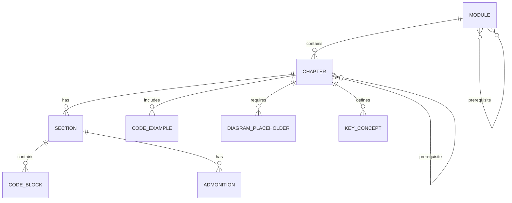

# Data Model: Physical AI Book Structure

**Feature**: 002-book-structure
**Date**: 2025-12-22
**Status**: Complete

## Content Entities

### Module

A thematic grouping of related chapters representing a major topic area.

| Field | Type | Required | Description |
|-------|------|----------|-------------|
| id | string | Yes | Module identifier (e.g., "module-0-foundations") |
| number | integer | Yes | Module number (0-6) |
| title | string | Yes | Module display title |
| focus | string | Yes | One-line focus description |
| chapters | Chapter[] | Yes | Ordered list of chapters in this module |
| prerequisites | string[] | No | Prior modules required |

**Example**:
```yaml
id: module-1-ros2
number: 1
title: "The Robotic Nervous System (ROS 2)"
focus: "Middleware and robot control infrastructure"
chapters: [ch04, ch05, ch06, ch07]
prerequisites: [module-0-foundations]
```

### Chapter

A single learning unit with structured educational content.

| Field | Type | Required | Description |
|-------|------|----------|-------------|
| id | string | Yes | Chapter identifier (e.g., "ch01-intro-physical-ai") |
| number | integer | Yes | Chapter number (1-24) |
| title | string | Yes | Chapter display title |
| module_id | string | Yes | Parent module reference |
| sidebar_position | integer | Yes | Docusaurus sidebar ordering |
| description | string | Yes | SEO meta description (150-160 chars) |
| tags | string[] | Yes | Docusaurus tags for categorization |
| prerequisites | string[] | No | Prior chapters/knowledge required |
| learning_objectives | string[] | Yes | Measurable outcomes (3-5 items) |
| key_concepts | KeyConcept[] | No | Glossary terms if 5+ new terms |
| sections | Section[] | Yes | Chapter content sections |
| summary | string[] | Yes | Key takeaways (3-5 items) |
| code_examples | CodeExample[] | No | Associated runnable examples |
| diagram_placeholders | DiagramPlaceholder[] | Yes | Required diagrams |

**Front Matter Template**:
```yaml
---
id: ch01-intro-physical-ai
title: "Introduction to Physical AI & Embodied Intelligence"
sidebar_position: 1
description: "Learn what Physical AI means, how embodied intelligence differs from digital AI, and explore real-world humanoid robotics applications."
tags: [physical-ai, embodied-intelligence, humanoid-robotics, foundations]
---
```

### Section

A logical division within a chapter.

| Field | Type | Required | Description |
|-------|------|----------|-------------|
| heading | string | Yes | Section heading (H2 or H3) |
| level | integer | Yes | Heading level (2 or 3) |
| content | string | Yes | Markdown content |
| code_blocks | CodeBlock[] | No | Inline code examples |
| admonitions | Admonition[] | No | Notes, tips, warnings |

### CodeExample

A runnable code sample associated with a chapter.

| Field | Type | Required | Description |
|-------|------|----------|-------------|
| id | string | Yes | Example identifier |
| title | string | Yes | Descriptive title |
| language | string | Yes | Programming language (python, cpp, bash) |
| path | string | Yes | Path in code-examples/ directory |
| dependencies | string[] | Yes | Required packages/tools |
| docker_image | string | No | Docker image for execution |
| expected_output | string | No | Sample output for verification |

### DiagramPlaceholder

A marker for required visual content.

| Field | Type | Required | Description |
|-------|------|----------|-------------|
| id | string | Yes | Diagram identifier |
| type | enum | Yes | architecture, flow, kinematics, comparison |
| description | string | Yes | What the diagram should show |
| location | string | Yes | Section where diagram appears |
| format | enum | Yes | mermaid, image, svg |

**Markdown Format**:
```markdown
<!-- DIAGRAM: id="arch-ros2-nodes" type="architecture" format="mermaid"
     description="ROS 2 node communication showing publishers, subscribers, and services" -->
```

### KeyConcept

A glossary term for chapters with 5+ new terms.

| Field | Type | Required | Description |
|-------|------|----------|-------------|
| term | string | Yes | Concept name |
| definition | string | Yes | Clear, concise definition |
| first_introduced | string | Yes | Chapter ID where first used |

### Admonition

Docusaurus callout blocks for special content.

| Field | Type | Required | Description |
|-------|------|----------|-------------|
| type | enum | Yes | note, tip, info, warning, danger |
| title | string | No | Optional custom title |
| content | string | Yes | Admonition content |

**Markdown Format**:
```markdown
:::tip Simulation-First
All examples in this book run in simulation. No physical hardware required!
:::
```

## Relationships



## File Naming Conventions

| Entity | Pattern | Example |
|--------|---------|---------|
| Module directory | `module-{N}-{slug}/` | `module-1-ros2/` |
| Module index | `index.md` | `module-1-ros2/index.md` |
| Module metadata | `_category_.json` | `module-1-ros2/_category_.json` |
| Chapter file | `ch{NN}-{slug}.md` | `ch04-ros2-architecture.md` |
| Code example dir | `module-{N}-{slug}/` | `code-examples/module-1-ros2/` |
| Docker file | `Dockerfile.{tool}` | `docker/Dockerfile.ros2` |

## Content Validation Rules

### Chapter Validation

1. **Front matter required**: title, sidebar_position, description, tags
2. **Learning objectives**: Minimum 3, maximum 5
3. **Diagram placeholders**: Minimum 1 per chapter
4. **Summary**: Minimum 3, maximum 5 key takeaways
5. **Code blocks**: Must specify language
6. **Prerequisites**: Must reference valid chapter IDs

### Module Validation

1. **Index page required**: Each module needs `index.md`
2. **Category metadata**: `_category_.json` with label and position
3. **Chapter count**: Must match spec (Modules 0,6: 3 chapters; others: 4)

### Cross-Reference Validation

1. **Internal links**: Must use relative paths
2. **Prerequisite chains**: No circular dependencies
3. **Code example references**: Must exist in `code-examples/`

## Docusaurus-Specific Configuration

### _category_.json Format

```json
{
  "label": "Module 1: The Robotic Nervous System (ROS 2)",
  "position": 2,
  "link": {
    "type": "doc",
    "id": "module-1-ros2/index"
  }
}
```

### sidebars.ts Structure

```typescript
const sidebars = {
  bookSidebar: [
    'intro',
    {
      type: 'category',
      label: 'Module 0: Foundations',
      items: [
        'module-0-foundations/index',
        'module-0-foundations/ch01-intro-physical-ai',
        'module-0-foundations/ch02-digital-to-physical',
        'module-0-foundations/ch03-humanoid-landscape',
      ],
    },
    // ... additional modules
  ],
};
```

## State Transitions

### Chapter Lifecycle

```
OUTLINE → DRAFT → TECHNICAL_REVIEW → EDITORIAL_REVIEW → PUBLISHED
```

| State | Description | Exit Criteria |
|-------|-------------|---------------|
| OUTLINE | Learning objectives, sections defined | Structure approved |
| DRAFT | Content written, code examples created | First pass complete |
| TECHNICAL_REVIEW | Code validated, accuracy checked | All code runs |
| EDITORIAL_REVIEW | Clarity, progression verified | Constitution compliant |
| PUBLISHED | Merged to main, deployed | Build succeeds |
