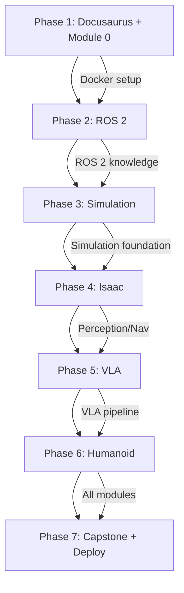

# Implementation Plan: Physical AI Book Structure

**Branch**: `002-book-structure` | **Date**: 2025-12-22 | **Spec**: [spec.md](./spec.md)
**Input**: Feature specification from `/specs/002-book-structure/spec.md`

## Summary

Create a comprehensive Docusaurus-based technical book "Physical AI & Humanoid Robotics: Embodied Intelligence in the Real World" with 7 modules (0-6) containing 24 chapters. The book follows a simulation-first approach using ROS 2, Gazebo, NVIDIA Isaac, and Unity (visualization only). Implementation proceeds in 7 phases from Docusaurus setup through deployment.

## Technical Context

**Language/Version**: Markdown/MDX for content; Python 3.10+ for code examples; TypeScript for Docusaurus config
**Primary Dependencies**: Docusaurus 3.x, Node.js 18+, npm/yarn
**Storage**: Git repository, static file hosting (GitHub Pages, Vercel)
**Testing**: Docusaurus build validation, link checking, code example execution
**Target Platform**: Web (static site), Linux/WSL2 for code examples
**Project Type**: Documentation site (Docusaurus)
**Performance Goals**: < 3s page load, mobile-responsive, offline-capable (PWA optional)
**Constraints**: Docusaurus 3.x compatibility, GitHub Pages/Vercel deployment limits
**Scale/Scope**: 24 chapters, 7 modules, ~200+ pages of content

## Constitution Check

*GATE: Must pass before Phase 0 research. Re-check after Phase 1 design.*

| Principle | Status | Implementation |
|-----------|--------|----------------|
| I. Practical-First Learning | ✅ PASS | Each chapter includes runnable simulation examples; real humanoid use cases required |
| II. Progressive Complexity | ✅ PASS | Modules ordered foundation→advanced; chapters state prerequisites |
| III. Toolchain Integration | ✅ PASS | ROS 2 Humble/Iron, Gazebo Fortress, Isaac Sim, Unity specified with versions |
| IV. Docusaurus Compatibility | ✅ PASS | Docusaurus 3.x with proper front matter, admonitions, syntax highlighting |
| V. Visual & Structural Clarity | ✅ PASS | Diagram placeholders, chapter summaries, Mermaid diagrams required |
| VI. Example-Driven Humanoid Focus | ✅ PASS | Humanoid examples mandatory per chapter (Atlas, Optimus, Digit, H1) |

**Quality Gates**:
- [ ] All code examples execute without errors (validate per phase)
- [ ] Docusaurus build succeeds with no warnings
- [ ] At least one diagram suggestion per major section
- [ ] Chapter summary exists before merge
- [ ] Prerequisites link to relevant earlier chapters

## Project Structure

### Documentation (this feature)

```text
specs/002-book-structure/
├── plan.md              # This file
├── research.md          # Phase 0 output
├── data-model.md        # Phase 1 output (content model)
├── quickstart.md        # Phase 1 output (contributor guide)
├── contracts/           # Phase 1 output (chapter templates)
└── tasks.md             # Phase 2 output (/sp.tasks command)
```

### Source Code (Docusaurus Project)

```text
ai-book/                        # Repository root
├── docusaurus.config.ts        # Main Docusaurus configuration
├── sidebars.ts                 # Sidebar navigation
├── package.json                # Node.js dependencies
├── tsconfig.json               # TypeScript configuration
│
├── docs/                       # Book content
│   ├── intro.md                # Book introduction
│   │
│   ├── module-0-foundations/   # MODULE 0: Foundations
│   │   ├── _category_.json     # Module metadata
│   │   ├── index.md            # Module introduction
│   │   ├── ch01-intro-physical-ai.md
│   │   ├── ch02-digital-to-physical.md
│   │   └── ch03-humanoid-landscape.md
│   │
│   ├── module-1-ros2/          # MODULE 1: ROS 2
│   │   ├── _category_.json
│   │   ├── index.md
│   │   ├── ch04-ros2-architecture.md
│   │   ├── ch05-nodes-topics-services.md
│   │   ├── ch06-rclpy-python.md
│   │   └── ch07-urdf-humanoids.md
│   │
│   ├── module-2-simulation/    # MODULE 2: Gazebo & Unity
│   │   ├── _category_.json
│   │   ├── index.md
│   │   ├── ch08-gazebo-setup.md
│   │   ├── ch09-physics-sensors.md
│   │   └── ch10-unity-visualization.md
│   │
│   ├── module-3-isaac/         # MODULE 3: NVIDIA Isaac
│   │   ├── _category_.json
│   │   ├── index.md
│   │   ├── ch11-isaac-overview.md
│   │   ├── ch12-isaac-sim-synthetic.md
│   │   ├── ch13-isaac-ros-nav2.md
│   │   └── ch14-rl-sim-to-real.md
│   │
│   ├── module-4-vla/           # MODULE 4: VLA
│   │   ├── _category_.json
│   │   ├── index.md
│   │   ├── ch15-vision-systems.md
│   │   ├── ch16-whisper-voice.md
│   │   ├── ch17-llm-planning.md
│   │   └── ch18-vla-pipelines.md
│   │
│   ├── module-5-humanoid/      # MODULE 5: Humanoid Intelligence
│   │   ├── _category_.json
│   │   ├── index.md
│   │   ├── ch19-kinematics-dynamics.md
│   │   ├── ch20-bipedal-locomotion.md
│   │   ├── ch21-manipulation-grasping.md
│   │   └── ch22-hri-design.md
│   │
│   └── module-6-capstone/      # MODULE 6: Capstone
│       ├── _category_.json
│       ├── index.md
│       ├── ch23-capstone-architecture.md
│       └── ch24-deployment-future.md
│
├── src/                        # Docusaurus customizations
│   ├── components/             # React components
│   ├── css/                    # Custom styles
│   └── pages/                  # Custom pages
│
├── static/                     # Static assets
│   └── img/                    # Images and diagrams
│
├── code-examples/              # Companion code repository
│   ├── module-1-ros2/
│   ├── module-2-simulation/
│   ├── module-3-isaac/
│   ├── module-4-vla/
│   ├── module-5-humanoid/
│   └── module-6-capstone/
│
└── docker/                     # Development environment
    ├── Dockerfile.ros2         # ROS 2 Humble environment
    ├── Dockerfile.isaac        # Isaac Sim environment
    └── docker-compose.yml      # Multi-container setup
```

**Structure Decision**: Docusaurus documentation site with module-based content organization. Code examples stored in companion `code-examples/` directory with Docker environments for reproducibility.

## Execution Phases

### Phase 1: Docusaurus Setup + Module 0 (Chapters 1-3)

**Goal**: Initialize Docusaurus project and write foundational chapters

| Task | Description | Output |
|------|-------------|--------|
| P1.1 | Initialize Docusaurus 3.x project | `docusaurus.config.ts`, `package.json` |
| P1.2 | Configure sidebars for module structure | `sidebars.ts` |
| P1.3 | Create chapter template with front matter | `docs/_templates/chapter-template.md` |
| P1.4 | Write Module 0 introduction | `docs/module-0-foundations/index.md` |
| P1.5 | Write Chapter 1: Intro to Physical AI | `docs/module-0-foundations/ch01-intro-physical-ai.md` |
| P1.6 | Write Chapter 2: Digital to Physical | `docs/module-0-foundations/ch02-digital-to-physical.md` |
| P1.7 | Write Chapter 3: Humanoid Landscape | `docs/module-0-foundations/ch03-humanoid-landscape.md` |
| P1.8 | Validate Docusaurus build | `npm run build` passes |

**Checkpoint**: Docusaurus runs locally with Module 0 complete

### Phase 2: ROS 2 Module (Chapters 4-7)

**Goal**: Write ROS 2 middleware chapters with Python examples

| Task | Description | Output |
|------|-------------|--------|
| P2.1 | Create ROS 2 Docker environment | `docker/Dockerfile.ros2` |
| P2.2 | Write Module 1 introduction | `docs/module-1-ros2/index.md` |
| P2.3 | Write Chapter 4: ROS 2 Architecture | With rclpy code examples |
| P2.4 | Write Chapter 5: Nodes, Topics, Services | Pub/sub, service, action examples |
| P2.5 | Write Chapter 6: Python Agents (rclpy) | Async patterns, integration |
| P2.6 | Write Chapter 7: URDF for Humanoids | Humanoid URDF example |
| P2.7 | Create code-examples/module-1-ros2/ | Runnable Python packages |
| P2.8 | Validate all code examples | Docker-based execution |

**Checkpoint**: Module 1 complete with working Python ROS 2 examples

### Phase 3: Simulation Module (Chapters 8-10)

**Goal**: Write Gazebo and Unity visualization chapters

| Task | Description | Output |
|------|-------------|--------|
| P3.1 | Write Module 2 introduction | `docs/module-2-simulation/index.md` |
| P3.2 | Write Chapter 8: Gazebo Setup | Fortress/Harmonic install, world files |
| P3.3 | Write Chapter 9: Physics & Sensors | ODE physics, sensor plugins |
| P3.4 | Write Chapter 10: Unity Visualization | ROS-TCP-Connector, NOT control |
| P3.5 | Create humanoid simulation world | Gazebo world with humanoid model |
| P3.6 | Create Unity visualization project | HRI demo scene |
| P3.7 | Validate Gazebo workflows | Docker-based simulation |

**Checkpoint**: Module 2 complete with Gazebo + Unity visualization demos

### Phase 4: NVIDIA Isaac Module (Chapters 11-14)

**Goal**: Write perception, navigation, and RL chapters

| Task | Description | Output |
|------|-------------|--------|
| P4.1 | Create Isaac Docker environment | `docker/Dockerfile.isaac` |
| P4.2 | Write Module 3 introduction | `docs/module-3-isaac/index.md` |
| P4.3 | Write Chapter 11: Isaac Overview | SDK, Sim, ROS, Gym ecosystem |
| P4.4 | Write Chapter 12: Synthetic Data | Domain randomization, dataset export |
| P4.5 | Write Chapter 13: VSLAM & Nav2 | Navigation stack integration |
| P4.6 | Write Chapter 14: RL & Sim-to-Real | Isaac Gym, PPO, transfer |
| P4.7 | Create Isaac code examples | Perception and navigation demos |

**Checkpoint**: Module 3 complete with Isaac Sim examples

### Phase 5: VLA Module (Chapters 15-18)

**Goal**: Write vision-language-action chapters (LLM for planning only)

| Task | Description | Output |
|------|-------------|--------|
| P5.1 | Write Module 4 introduction | `docs/module-4-vla/index.md` |
| P5.2 | Write Chapter 15: Vision Systems | Depth cameras, object detection |
| P5.3 | Write Chapter 16: Whisper Voice | Speech-to-action (high-level) |
| P5.4 | Write Chapter 17: LLM Planning | Task decomposition, NOT motor control |
| P5.5 | Write Chapter 18: VLA Pipelines | End-to-end integration in ROS 2 |
| P5.6 | Create VLA code examples | Perception + planning pipeline |

**Checkpoint**: Module 4 complete with VLA pipeline demo

### Phase 6: Humanoid Intelligence Module (Chapters 19-22)

**Goal**: Write humanoid-specific motion and HRI chapters

| Task | Description | Output |
|------|-------------|--------|
| P6.1 | Write Module 5 introduction | `docs/module-5-humanoid/index.md` |
| P6.2 | Write Chapter 19: Kinematics & Dynamics | IK, Jacobians, dynamics |
| P6.3 | Write Chapter 20: Bipedal Locomotion | ZMP, gait, balance |
| P6.4 | Write Chapter 21: Manipulation | Grasp planning, dexterous control |
| P6.5 | Write Chapter 22: HRI Design | Social robotics, safety |
| P6.6 | Create humanoid motion examples | Locomotion and manipulation demos |

**Checkpoint**: Module 5 complete with humanoid motion demos

### Phase 7: Capstone + Deployment (Chapters 23-24)

**Goal**: Write capstone chapters and deploy book

| Task | Description | Output |
|------|-------------|--------|
| P7.1 | Write Module 6 introduction | `docs/module-6-capstone/index.md` |
| P7.2 | Write Chapter 23: System Architecture | Full integration in simulation |
| P7.3 | Write Chapter 24: Deployment & Future | Evaluation, optional Jetson, trends |
| P7.4 | Create capstone integration example | Complete system in Gazebo/Isaac |
| P7.5 | Configure GitHub Pages deployment | `.github/workflows/deploy.yml` |
| P7.6 | Configure Vercel deployment | `vercel.json` |
| P7.7 | Final build validation | All chapters, links, examples |
| P7.8 | Deploy to GitHub Pages | Live site |
| P7.9 | Deploy to Vercel | Backup/preview site |

**Checkpoint**: Book complete and deployed to GitHub Pages + Vercel

## Dependencies & Execution Order



**Critical Path**: Phases must execute sequentially as each builds on previous modules.

**Parallel Opportunities**:
- Within each phase, chapters can be written in parallel
- Docker environments can be prepared ahead of their phase
- Code examples can be developed alongside chapter writing

## Complexity Tracking

> No constitution violations requiring justification.

| Aspect | Complexity | Mitigation |
|--------|------------|------------|
| 24 chapters | High volume | Phased delivery with checkpoints |
| Multiple toolchains | Integration complexity | Docker containers for reproducibility |
| Code examples | Must be runnable | CI/CD validation per phase |

## Risk Analysis

| Risk | Impact | Mitigation |
|------|--------|------------|
| Tool version changes (ROS 2, Isaac) | High | Pin versions, document upgrade path |
| Code example failures | Medium | Docker isolation, CI testing |
| Docusaurus breaking changes | Low | Lock Docusaurus version |
| Content scope creep | Medium | Strict adherence to spec FR-001-016 |

## Next Steps

1. Run `/sp.tasks` to generate detailed task list
2. Begin Phase 1: Docusaurus setup
3. Create chapter template following constitution principles
